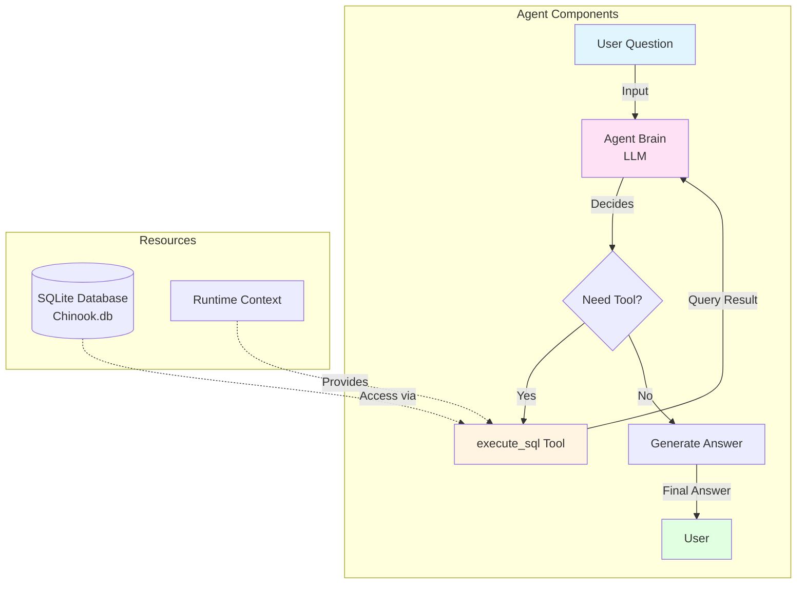
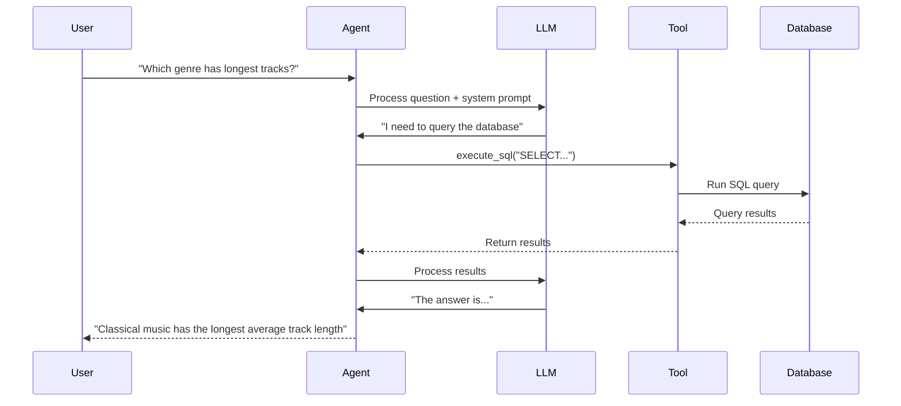

# Lab 1: Fast Agent - Build a SQL Agent Fast!

**Level:** 100 (Beginner)  
**Duration:** 30-45 minutes  
**Prerequisites:** Basic Python knowledge, understanding of SQL basics

---

## Table of Contents
1. [What is an Agent?](#what-is-an-agent)
2. [Core Concepts](#core-concepts)
3. [Architecture Overview](#architecture-overview)
4. [Step-by-Step Implementation](#step-by-step-implementation)
5. [How It Works](#how-it-works)
6. [Key Takeaways](#key-takeaways)
7. [Troubleshooting](#troubleshooting)

---

## What is an Agent?

An **AI Agent** is an autonomous system that can:
- **Think**: Reason about what to do next
- **Act**: Use tools to interact with the world
- **Observe**: See the results of its actions
- **Repeat**: Continue until the task is complete

### Real-World Analogy

Think of an agent like a **research assistant**:
- You ask: "What's the most popular music genre in our database?"
- The assistant:
  1. **Thinks**: "I need to query the database"
  2. **Acts**: Writes and executes a SQL query
  3. **Observes**: Sees the results
  4. **Responds**: Tells you the answer in plain English

---

## Core Concepts

### 1. ReAct Loop (Reason + Act)

The agent follows a continuous loop:

```
Question → Reasoning → Action → Observation → Reasoning → Answer
```

**Example:**
```
User: "Which table has the most entries?"
Agent Thinks: "I need to count rows in each table"
Agent Acts: Executes SQL to list tables
Agent Observes: Sees table names
Agent Thinks: "Now I'll count rows in each"
Agent Acts: Executes COUNT queries
Agent Observes: Gets row counts
Agent Responds: "The Track table has 3,503 entries"
```

### 2. Tools

Tools are functions the agent can call to interact with the world. In this lab:
- **execute_sql**: Runs SQL queries on the database

### 3. Runtime Context

A way to pass resources (like database connections) to tools without hardcoding them.

```python
@dataclass
class RuntimeContext:
    db: SQLDatabase  # The database connection
```

### 4. System Prompt

Instructions that define the agent's behavior and constraints.

---

## Architecture Overview



---

## Step-by-Step Implementation

### Step 1: Install Dependencies

```python
!pip install -qU langchain-groq langgraph langchain-community pysqlite3-binary
```

**What each library does:**
- `langchain-groq`: Fast LLM inference via Groq
- `langgraph`: Framework for building agent workflows
- `langchain-community`: Community tools and utilities
- `pysqlite3-binary`: SQLite database support

### Step 2: Setup Environment

```python
from google.colab import userdata
import os

os.environ["GROQ_API_KEY"] = userdata.get('GROQ_API_KEY')
```

**Why Groq?**  
Groq provides extremely fast inference speeds (up to 10x faster than traditional APIs), making agents feel more responsive.

### Step 3: Connect to Database

```python
from langchain_community.utilities import SQLDatabase

# Download the sample database
!wget -q https://github.com/jayyanar/agentic-ai-training/raw/lab-day-1/batch2/lca-langchainV1-essentials/Chinook.db

# Connect to it
db = SQLDatabase.from_uri("sqlite:///Chinook.db")

# Verify connection
print(db.get_usable_table_names())
```

**About Chinook Database:**
- Sample music store database
- Contains tables: Album, Artist, Customer, Employee, Invoice, Track, etc.
- Perfect for learning SQL agents

### Step 4: Define Runtime Context

```python
from dataclasses import dataclass
from langchain_community.utilities import SQLDatabase

@dataclass
class RuntimeContext:
    db: SQLDatabase
```

**Why use Runtime Context?**
- Dependency injection pattern
- Tools can access resources without global variables
- Makes testing and reusability easier

### Step 5: Create the SQL Tool

```python
from langchain_core.tools import tool
from langgraph.runtime import get_runtime

@tool
def execute_sql(query: str) -> str:
    """Execute a SQLite command and return results."""
    runtime = get_runtime(RuntimeContext)
    db = runtime.context.db
    
    try:
        return db.run(query)
    except Exception as e:
        return f"Error: {e}"
```

**Key Points:**
- `@tool` decorator makes this function available to the agent
- Docstring helps the agent understand when to use it
- Error handling allows the agent to self-correct

### Step 6: Define System Prompt

```python
SYSTEM_PROMPT = """You are a careful SQLite analyst.

Rules:
- Think step-by-step.
- When you need data, call the tool `execute_sql` with ONE SELECT query.
- Read-only only; no INSERT/UPDATE/DELETE/ALTER/DROP/CREATE/REPLACE/TRUNCATE.
- Limit to 5 rows of output unless the user explicitly asks otherwise.
- If the tool returns 'Error:', revise the SQL and try again.
- Prefer explicit column lists; avoid SELECT *.
"""
```

**Why This Matters:**
- Constrains the agent's behavior
- Prevents dangerous operations (DELETE, DROP)
- Encourages best practices (explicit columns, row limits)
- Enables self-correction on errors

### Step 7: Create the Agent

```python
from langchain.agents import create_agent
from langchain_groq import ChatGroq

# Initialize the LLM
llm = ChatGroq(
    model="openai/gpt-oss-120b",
    temperature=0,
    max_retries=2,
)

# Create the agent
agent = create_agent(
    model=llm,
    tools=[execute_sql],
    system_prompt=SYSTEM_PROMPT,
    context_schema=RuntimeContext,
)
```

**Parameters Explained:**
- `model`: The LLM that powers the agent's reasoning
- `tools`: Functions the agent can call
- `system_prompt`: Behavioral instructions
- `context_schema`: Type definition for runtime resources
- `temperature=0`: Deterministic outputs (no randomness)

### Step 8: Visualize the Agent

```python
from IPython.display import Image, display

display(Image(agent.get_graph(xray=True).draw_mermaid_png()))
```

**What You'll See:**
The ReAct loop visualization showing:
- Agent node (reasoning)
- Tools node (actions)
- Conditional edges (decisions)

### Step 9: Run Queries

```python
question = "Which table has the largest number of entries?"

for step in agent.stream(
    {"messages": question},
    context=RuntimeContext(db=db),
    stream_mode="values",
):
    step["messages"][-1].pretty_print()
```

**What Happens:**
1. Agent receives the question
2. Thinks: "I need to count rows in tables"
3. Acts: Calls `execute_sql` with appropriate queries
4. Observes: Sees the results
5. Responds: Provides the answer

---

## How It Works

### The ReAct Loop in Detail



### Why Agents Are Powerful

1. **Autonomous**: Don't need step-by-step instructions
2. **Self-Correcting**: Can fix SQL errors and retry
3. **Adaptive**: Can handle unexpected questions
4. **Transparent**: You can see each reasoning step

---

## Key Takeaways

### What You Learned

✅ **Agent Architecture**: How ReAct loops enable autonomous behavior  
✅ **Tool Creation**: Building functions agents can use  
✅ **Runtime Context**: Dependency injection for agents  
✅ **System Prompts**: Constraining and guiding agent behavior  
✅ **Streaming**: Observing agent reasoning in real-time

### Best Practices

1. **Clear Tool Descriptions**: Help the agent understand when to use tools
2. **Safety Constraints**: Use system prompts to prevent dangerous operations
3. **Error Handling**: Return errors as strings so agents can self-correct
4. **Row Limits**: Prevent overwhelming the agent with too much data
5. **Explicit Columns**: Avoid SELECT * for better performance

### Common Pitfalls

❌ **Vague System Prompts**: Agent won't know its constraints  
❌ **No Error Handling**: Agent can't recover from failures  
❌ **Too Many Tools**: Agent gets confused about which to use  
❌ **No Row Limits**: Agent overwhelmed with data

---

## Troubleshooting

### Issue: "Agent doesn't use the tool"

**Cause:** Tool description unclear or question doesn't require it  
**Solution:**
- Improve tool docstring
- Make question more specific
- Check system prompt for conflicting instructions

### Issue: "SQL errors keep happening"

**Cause:** Agent doesn't know the database schema  
**Solution:**
- Agent will discover schema through exploration
- Provide schema in system prompt for faster results
- Use more descriptive table/column names

### Issue: "Agent gives wrong answers"

**Cause:** Misinterpreting query results  
**Solution:**
- Check retrieved data in streaming output
- Adjust system prompt to be more specific
- Use temperature=0 for deterministic behavior

### Issue: "Slow responses"

**Cause:** Complex queries or slow LLM  
**Solution:**
- Use Groq for faster inference
- Simplify database queries
- Add indexes to database tables

---

## Next Steps

After completing this lab, you should:

1. **Experiment**: Try different questions and observe agent reasoning
2. **Add Tools**: Create new tools for other operations
3. **Improve Prompts**: Refine system prompt for better behavior
4. **Move to Lab 2**: Learn about messages and conversation structure

---

## Additional Resources

- [LangChain Agents Documentation](https://python.langchain.com/docs/modules/agents/)
- [LangGraph Documentation](https://langchain-ai.github.io/langgraph/)
- [Groq API Documentation](https://console.groq.com/docs/quickstart)
- [ReAct Paper](https://arxiv.org/abs/2210.03629)

---

**Questions?** Review the notebook cells and experiment with different queries to deepen your understanding!
