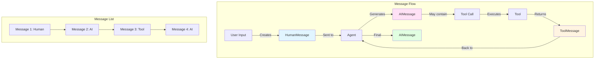
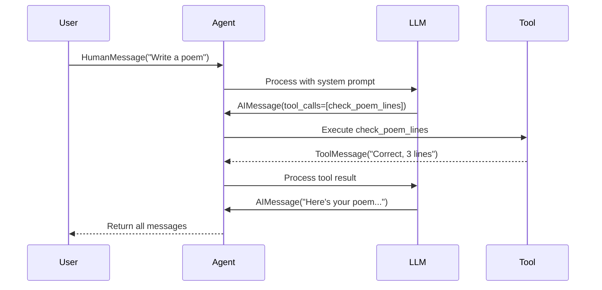

# Lab 2: Messages - Understanding Agent Communication

**Level:** 100 (Beginner)  
**Duration:** 30-40 minutes  
**Prerequisites:** Completion of Lab 1, basic Python knowledge

---

## Table of Contents
1. [What are Messages?](#what-are-messages)
2. [Core Concepts](#core-concepts)
3. [Message Types](#message-types)
4. [Architecture Overview](#architecture-overview)
5. [Step-by-Step Implementation](#step-by-step-implementation)
6. [How It Works](#how-it-works)
7. [Key Takeaways](#key-takeaways)
8. [Troubleshooting](#troubleshooting)

---

## What are Messages?

**Messages** are the fundamental units of communication in LangChain agents. They represent:
- User inputs
- AI responses
- Tool calls and results
- System instructions

### Real-World Analogy

Think of messages like a **conversation transcript**:
- **Human Message**: What you say
- **AI Message**: What the assistant responds
- **Tool Message**: Results from actions taken
- **System Message**: Background instructions

Just like a chat app saves your conversation history, agents use messages to maintain context.

---

## Core Concepts

### 1. Message as Data Structure

Every message contains:
- **Type**: human, ai, tool, or system
- **Content**: The actual text
- **Metadata**: Additional information (timestamps, model info, etc.)

```python
HumanMessage(content="Hello, how are you?")
# Type: human
# Content: "Hello, how are you?"
```

### 2. Message History

Agents maintain a list of messages representing the entire conversation:

```python
[
    HumanMessage("Hello"),
    AIMessage("Hi! How can I help?"),
    HumanMessage("Tell me a joke"),
    AIMessage("Why did the chicken cross the road?...")
]
```

### 3. Message Formats

LangChain supports multiple input formats:
- **Message Objects**: `HumanMessage("text")`
- **Strings**: `"text"` (inferred as HumanMessage)
- **Dictionaries**: `{"role": "user", "content": "text"}`

---

## Message Types

### 1. HumanMessage 👨‍💻

Represents user input.

```python
from langchain_core.messages import HumanMessage

msg = HumanMessage("What's the weather?")
```

### 2. AIMessage 🤖

Represents AI responses.

```python
from langchain_core.messages import AIMessage

msg = AIMessage("It's sunny today!")
```

### 3. ToolMessage 🔧

Represents tool execution results.

```python
from langchain_core.messages import ToolMessage

msg = ToolMessage(
    content="Temperature: 72°F",
    tool_call_id="call_123"
)
```

### 4. SystemMessage 📋

Represents system-level instructions (usually in prompts).

```python
from langchain_core.messages import SystemMessage

msg = SystemMessage("You are a helpful assistant")
```

---

## Architecture Overview



---

## Step-by-Step Implementation

### Step 1: Setup

```python
!pip install -qU langchain-groq langgraph langchain-community

from google.colab import userdata
import os

os.environ["GROQ_API_KEY"] = userdata.get('GROQ_API_KEY')
```

### Step 2: Create a Simple Agent

```python
from langchain.agents import create_agent
from langchain_core.messages import HumanMessage
from langchain_groq import ChatGroq

llm = ChatGroq(
    model="llama-3.1-8b-instant",
    temperature=0,
    max_retries=2,
)

agent = create_agent(
    model=llm,
    system_prompt="You are a full-stack comedian"
)
```

### Step 3: Using Message Objects

```python
human_msg = HumanMessage("Hello, how are you?")

result = agent.invoke({"messages": [human_msg]})
```

**What Happens:**
1. `HumanMessage` is created
2. Sent to agent in a list
3. Agent processes and returns result
4. Result contains all messages (input + output)

### Step 4: Inspecting Results

```python
# Get the last message (AI response)
print(result["messages"][-1].content)

# Check message type
print(type(result["messages"][-1]))
# Output: <class 'langchain_core.messages.ai.AIMessage'>

# Print all messages
for msg in result["messages"]:
    print(f"{msg.type}: {msg.content}\n")
```

### Step 5: Alternative Formats - Strings

```python
agent = create_agent(
    model=llm,
    system_prompt="You are a sports poet and comedian.",
)

# String is automatically converted to HumanMessage
result = agent.invoke({"messages": "Tell me about cricket"})
print(result["messages"][-1].content)
```

**Behind the Scenes:**
```python
"Tell me about cricket"
# Becomes:
HumanMessage(content="Tell me about cricket")
```

### Step 6: Alternative Formats - Dictionaries

```python
result = agent.invoke(
    {"messages": {"role": "user", "content": "Write a poem about bangalore traffic"}}
)
print(result["messages"][-1].content)
```

**Dictionary Format:**
```python
{
    "role": "user",      # or "assistant", "system"
    "content": "text"
}
```

### Step 7: Messages with Tools

```python
from langchain_core.tools import tool

@tool
def check_poem_lines(text: str):
    """Check if the given poem text has exactly 3 lines."""
    lines = [line.strip() for line in text.strip().splitlines() if line.strip()]
    print(f"checking poem, it has {len(lines)} lines:\n {text}")
    
    if len(lines) != 3:
        return f"Incorrect! This poem has {len(lines)} lines. A poem must have exactly 3 lines."
    return "Correct, this poem has 3 lines."

agent = create_agent(
    model=llm,
    tools=[check_poem_lines],
    system_prompt="You are a sports poet who only writes comedy poems. You always ensure poems are of 3 lines (new lines)",
)

result = agent.invoke({"messages": "Please write me a poem"})
```

### Step 8: Examining Tool Messages

```python
# Print all messages including tool calls
for i, msg in enumerate(result["messages"]):
    msg.pretty_print()
```

**What You'll See:**
```
================================ Human Message =================================
Please write me a poem

================================== Ai Message ==================================
Tool Calls:
  check_poem_lines (call_abc123)
  Args: {"text": "Roses are red\nViolets are blue\nI love coding"}

================================= Tool Message =================================
Name: check_poem_lines
Correct, this poem has 3 lines.

================================== Ai Message ==================================
Here's your poem:
Roses are red
Violets are blue
I love coding
```

### Step 9: Accessing Metadata

```python
last_message = result["messages"][-1]

# Usage information
print(last_message.usage_metadata)
# Output: {'input_tokens': 45, 'output_tokens': 23, 'total_tokens': 68}

# Response metadata
print(last_message.response_metadata)
# Output: {'model': 'llama-3.1-8b-instant', 'finish_reason': 'stop', ...}
```

---

## How It Works

### Message Flow with Tools



### Why Messages Matter

1. **Context Preservation**: Full conversation history
2. **Debugging**: See exactly what happened
3. **Transparency**: Understand agent reasoning
4. **Flexibility**: Multiple input formats

---

## Key Takeaways

### What You Learned

✅ **Message Types**: Human, AI, Tool, and System messages  
✅ **Message Formats**: Objects, strings, and dictionaries  
✅ **Message History**: How conversations are maintained  
✅ **Tool Messages**: How tool results are communicated  
✅ **Metadata**: Additional information in messages

### Best Practices

1. **Use Message Objects**: More explicit and type-safe
2. **Inspect Full History**: Debug by examining all messages
3. **Check Metadata**: Monitor token usage and performance
4. **Pretty Print**: Use `.pretty_print()` for readable output
5. **Understand Flow**: Know when each message type appears

### Common Pitfalls

❌ **Only checking last message**: Missing tool calls and intermediate steps  
❌ **Ignoring message types**: Not understanding the conversation flow  
❌ **Not using pretty_print**: Harder to debug  
❌ **Forgetting metadata**: Missing important performance info

---

## Troubleshooting

### Issue: "Can't find the AI response"

**Cause:** Looking at wrong message in the list  
**Solution:**
```python
# Last message is usually the final AI response
result["messages"][-1].content

# Or iterate through all
for msg in result["messages"]:
    if msg.type == "ai":
        print(msg.content)
```

### Issue: "Tool messages not appearing"

**Cause:** Tool not being called or errors in tool execution  
**Solution:**
- Check if tool description is clear
- Verify tool is in agent's tool list
- Look for error messages in output

### Issue: "Message format error"

**Cause:** Incorrect dictionary structure  
**Solution:**
```python
# Correct format
{"role": "user", "content": "text"}

# Not this
{"type": "human", "text": "text"}  # Wrong keys
```

### Issue: "Lost conversation context"

**Cause:** Not passing previous messages  
**Solution:**
```python
# Include previous messages
result = agent.invoke({
    "messages": [
        HumanMessage("First question"),
        AIMessage("First answer"),
        HumanMessage("Follow-up question")
    ]
})
```

---

## Next Steps

After completing this lab, you should:

1. **Experiment**: Try different message formats
2. **Inspect Messages**: Use pretty_print() to understand flows
3. **Create Tools**: See how tool messages work
4. **Move to Lab 3**: Learn about streaming for real-time responses

---

## Additional Resources

- [LangChain Messages Documentation](https://python.langchain.com/docs/modules/model_io/messages/)
- [Message Types Reference](https://python.langchain.com/api_reference/core/messages.html)
- [Tool Calling Guide](https://python.langchain.com/docs/modules/agents/tools/)

---

**Questions?** Experiment with different message formats and tools to see how messages flow through the system!
