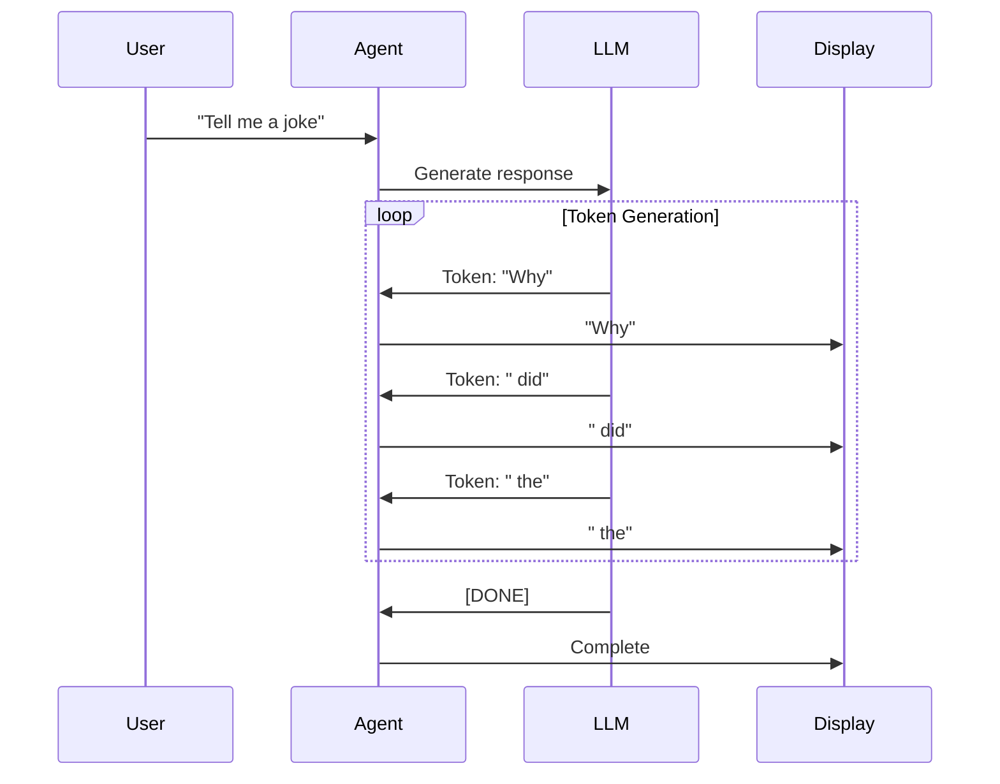

# Lab 3: Streaming - Real-Time Agent Responses

**Level:** 100-200 (Beginner to Intermediate)  
**Duration:** 30-40 minutes  
**Prerequisites:** Completion of Labs 1-2

---

## Table of Contents
1. [What is Streaming?](#what-is-streaming)
2. [Core Concepts](#core-concepts)
3. [Streaming Modes](#streaming-modes)
4. [Architecture Overview](#architecture-overview)
5. [Step-by-Step Implementation](#step-by-step-implementation)
6. [How It Works](#how-it-works)
7. [Key Takeaways](#key-takeaways)
8. [Troubleshooting](#troubleshooting)

---

## What is Streaming?

**Streaming** delivers data incrementally as it's generated, rather than waiting for the complete response.

### Real-World Analogy

**Without Streaming (invoke):**
- Like waiting for an entire movie to download before watching
- User sees nothing until the complete answer is ready

**With Streaming:**
- Like Netflix - watch while it downloads
- User sees words appear as they're generated
- Feels faster and more interactive

### Why Streaming Matters

✅ **Lower Perceived Latency**: Users see progress immediately  
✅ **Better UX**: Interactive feel, not frozen  
✅ **Early Feedback**: Can stop if going wrong direction  
✅ **Progress Indication**: Know the system is working

---

## Core Concepts

### 1. Streaming vs Invoke

```python
# Invoke - Wait for complete response
result = agent.invoke({"messages": "Tell me a joke"})
print(result["messages"][-1].content)  # All at once

# Stream - Get incremental updates
for chunk in agent.stream({"messages": "Tell me a joke"}):
    print(chunk)  # Piece by piece
```

### 2. Stream Modes

LangChain supports different streaming granularities:

| Mode | Granularity | Use Case |
|------|-------------|----------|
| **values** | Complete messages | See agent steps |
| **messages** | Token-by-token | Chatbot UX |
| **custom** | Tool-specific | Progress updates |

### 3. Streaming Tokens

The smallest unit of text the LLM generates:

```
"Hello, how are you?"
↓
["Hello", ",", " how", " are", " you", "?"]
```

---

## Architecture Overview

```mermaid
graph TB
    subgraph "Invoke (No Streaming)"
        A1[User Question] -->|Wait| B1[Complete Response]
        B1 -->|All at once| C1[Display]
    end
    
    subgraph "Stream Values"
        A2[User Question] -->|Step 1| B2[Human Message]
        B2 -->|Step 2| C2[AI Thinking]
        C2 -->|Step 3| D2[Tool Call]
        D2 -->|Step 4| E2[Final Answer]
    end
    
    subgraph "Stream Messages (Tokens)"
        A3[User Question] -->|Token 1| B3["Hello"]
        B3 -->|Token 2| C3[","]
        C3 -->|Token 3| D3[" how"]
        D3 -->|Token 4| E3[" are"]
        E3 -->|Token 5| F3[" you?"]
    end
    
    style B1 fill:#ffe1e1
    style E2 fill:#e1ffe1
    style F3 fill:#e1f5ff
```



---

## Step-by-Step Implementation

### Step 1: Setup

```python
!pip install -qU langchain-groq langgraph langchain-community

from google.colab import userdata
import os

os.environ["GROQ_API_KEY"] = userdata.get('GROQ_API_KEY')
```

### Step 2: Create Agent

```python
from langchain.agents import create_agent
from langchain_groq import ChatGroq

llm = ChatGroq(
    model="llama-3.1-8b-instant",
    temperature=0,
    max_retries=2,
)

agent = create_agent(
    model=llm,
    system_prompt="You are a full-stack comedian",
)
```

### Step 3: No Streaming (Baseline)

```python
result = agent.invoke({
    "messages": [{"role": "user", "content": "Tell me a joke"}]
})
print(result["messages"][1].content)
```

**Output:**
```
[Wait 2-3 seconds...]
Why did the programmer quit his job? Because he didn't get arrays!
```

### Step 4: Stream Values Mode

```python
for step in agent.stream(
    {"messages": [{"role": "user", "content": "Tell me a Dad joke"}]},
    stream_mode="values",
):
    step["messages"][-1].pretty_print()
```

**Output:**
```
================================ Human Message =================================
Tell me a Dad joke

================================== Ai Message ==================================
Why did the scarecrow win an award? Because he was outstanding in his field!
```

**What You See:**
- Each complete message as it's generated
- Human message first
- Then AI message

### Step 5: Stream Messages Mode (Token-by-Token)

```python
for token, metadata in agent.stream(
    {"messages": [{"role": "user", "content": "Write me a family friendly poem."}]},
    stream_mode="messages",
):
    print(f"{token.content}", end="")
```

**Output:**
```
Roses are red,
Violets are blue,
Sugar is sweet,
And so are you!
```

**What You See:**
- Words appear one by one
- Like typing effect
- Lowest latency possible

### Step 6: Custom Streaming from Tools

```python
from langchain.agents import create_agent
from langgraph.config import get_stream_writer

def get_weather(city: str) -> str:
    """Get weather for a given city."""
    writer = get_stream_writer()
    
    # Stream custom progress updates
    writer(f"Looking up data for city: {city}")
    writer(f"Acquired data for city: {city}")
    
    return f"It's always sunny in {city}!"

agent = create_agent(
    model=llm,
    tools=[get_weather],
)

for chunk in agent.stream(
    {"messages": [{"role": "user", "content": "What is the weather in SF?"}]},
    stream_mode=["values", "custom"],
):
    print(chunk)
```

**Output:**
```
('custom', 'Looking up data for city: SF')
('custom', 'Acquired data for city: SF')
('values', {'messages': [...]})
```

### Step 7: Filtering Custom Streams

```python
for chunk in agent.stream(
    {"messages": [{"role": "user", "content": "What is the weather in SF?"}]},
    stream_mode=["values", "custom"],
):
    if chunk[0] == "custom":
        print(chunk[1])
```

**Output:**
```
Looking up data for city: SF
Acquired data for city: SF
```

---

## How It Works

### Token Streaming Flow



### Values vs Messages Streaming

**Values Mode:**
```python
# Streams complete messages
Step 1: HumanMessage("Question")
Step 2: AIMessage("Complete answer")
```

**Messages Mode:**
```python
# Streams tokens
Token 1: "Why"
Token 2: " did"
Token 3: " the"
...
```

---

## Key Takeaways

### What You Learned

✅ **Streaming Modes**: values, messages, and custom  
✅ **Token Streaming**: Real-time text generation  
✅ **Custom Streams**: Progress updates from tools  
✅ **User Experience**: Why streaming improves UX  
✅ **Stream Filtering**: Processing specific stream types

### Best Practices

1. **Use Messages Mode for Chatbots**: Best UX for conversations
2. **Use Values Mode for Debugging**: See agent reasoning steps
3. **Add Custom Streams**: Show progress for long operations
4. **Filter Streams**: Process only what you need
5. **Handle Errors**: Streaming can fail mid-response

### Common Pitfalls

❌ **Not handling incomplete responses**: Stream can stop mid-sentence  
❌ **Blocking operations in tools**: Defeats streaming purpose  
❌ **Too many stream modes**: Overhead without benefit  
❌ **Not showing progress**: User doesn't know system is working

---

## Troubleshooting

### Issue: "Streaming feels slow"

**Cause:** Network latency or slow LLM  
**Solution:**
- Use Groq for faster inference
- Check network connection
- Reduce response length

### Issue: "Tokens appear in wrong order"

**Cause:** Async processing issues  
**Solution:**
- Use synchronous streaming
- Ensure proper event loop handling
- Check for race conditions

### Issue: "Custom streams not appearing"

**Cause:** Wrong stream mode or not using get_stream_writer  
**Solution:**
```python
# Include "custom" in stream_mode
stream_mode=["values", "custom"]

# Use get_stream_writer in tool
writer = get_stream_writer()
writer("Progress update")
```

### Issue: "Stream stops mid-response"

**Cause:** Error in generation or timeout  
**Solution:**
- Check for errors in output
- Increase timeout settings
- Add error handling

---

## Next Steps

After completing this lab, you should:

1. **Experiment**: Try different stream modes
2. **Build UI**: Create a chatbot with token streaming
3. **Add Progress**: Use custom streams in tools
4. **Move to Lab 4**: Learn about creating custom tools

---

## Additional Resources

- [LangChain Streaming Documentation](https://python.langchain.com/docs/expression_language/streaming)
- [LangGraph Streaming Guide](https://langchain-ai.github.io/langgraph/how-tos/streaming/)
- [Building Streaming UIs](https://python.langchain.com/docs/expression_language/streaming#streaming-with-astream)

---

**Questions?** Experiment with different streaming modes to see how they affect user experience!
