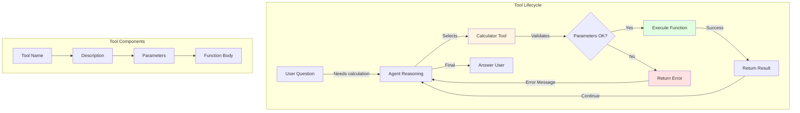
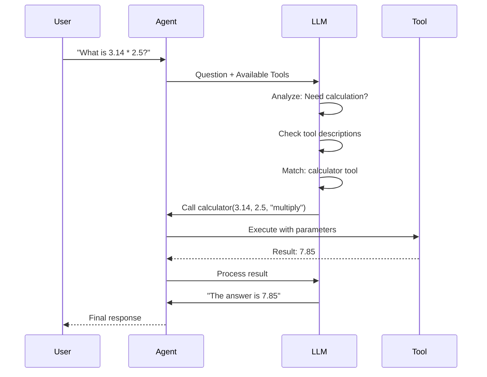

# Lab 4: Tools - Empowering Agents to Act

**Level:** 100-200 (Beginner to Intermediate)  
**Duration:** 40-50 minutes  
**Prerequisites:** Completion of Labs 1-3

---

## Table of Contents
1. [What are Tools?](#what-are-tools)
2. [Core Concepts](#core-concepts)
3. [Tool Design Principles](#tool-design-principles)
4. [Architecture Overview](#architecture-overview)
5. [Step-by-Step Implementation](#step-by-step-implementation)
6. [How It Works](#how-it-works)
7. [Key Takeaways](#key-takeaways)
8. [Troubleshooting](#troubleshooting)

---

## What are Tools?

**Tools** are functions that agents can call to interact with the external world. They enable agents to:
- Perform calculations
- Query databases
- Call APIs
- Read/write files
- Execute code
- And much more!

### Real-World Analogy

Think of an agent as a **personal assistant** and tools as their **equipment**:
- **Calculator tool** = Physical calculator
- **Search tool** = Internet access
- **Database tool** = Filing cabinet
- **Email tool** = Phone/computer

Without tools, the assistant can only talk. With tools, they can actually do things!

---

## Core Concepts

### 1. Tool Definition

A tool consists of:
- **Name**: What it's called
- **Description**: What it does (critical for agent to understand)
- **Parameters**: What inputs it needs
- **Function**: The actual code that runs

```python
@tool
def calculator(a: float, b: float, operation: str) -> float:
    """Perform basic arithmetic operations."""
    # Function body
```

### 2. Tool Discovery

The agent uses the description and parameter types to decide:
- **When** to use the tool
- **How** to use it
- **What** parameters to pass

### 3. Tool Execution Flow

```
Agent thinks → Decides to use tool → Calls tool → Gets result → Continues reasoning
```

---

## Tool Design Principles

### 1. Clear Descriptions

**Bad:**
```python
@tool
def calc(a, b, op):
    """Does math."""
```

**Good:**
```python
@tool
def real_number_calculator(a: float, b: float, operation: Literal["add", "subtract", "multiply", "divide"]) -> float:
    """Perform basic arithmetic operations on two real numbers.
    
    Use this whenever you need to calculate with any numbers, even integers.
    """
```

### 2. Type Hints

Help the agent understand what inputs are valid:

```python
from typing import Literal

operation: Literal["add", "subtract", "multiply", "divide"]
# Agent knows exactly which operations are allowed
```

### 3. Error Handling

Return errors as strings so agents can self-correct:

```python
try:
    return a / b
except ZeroDivisionError:
    return "Error: Division by zero is not allowed."
```

---

## Architecture Overview



---

## Step-by-Step Implementation

### Step 1: Setup

```python
!pip install -qU langchain-groq langgraph langchain-community

from google.colab import userdata
import os

os.environ["GROQ_API_KEY"] = userdata.get('GROQ_API_KEY')
```

### Step 2: Basic Tool Creation

```python
from typing import Literal
from langchain.tools import tool

@tool
def real_number_calculator(
    a: float, 
    b: float, 
    operation: Literal["add", "subtract", "multiply", "divide"]
) -> float:
    """Perform basic arithmetic operations on two real numbers."""
    print("🧮 Invoking calculator tool")
    
    if operation == "add":
        return a + b
    elif operation == "subtract":
        return a - b
    elif operation == "multiply":
        return a * b
    elif operation == "divide":
        if b == 0:
            raise ValueError("Division by zero is not allowed.")
        return a / b
    else:
        raise ValueError(f"Invalid operation: {operation}")
```

**Key Points:**
- `@tool` decorator registers the function
- Type hints guide the agent
- Docstring explains purpose
- Error handling for edge cases

### Step 3: Create Agent with Tool

```python
from langchain.agents import create_agent
from langchain_groq import ChatGroq

llm = ChatGroq(
    model="llama-3.1-8b-instant",
    temperature=0,
    max_retries=2,
)

agent = create_agent(
    model=llm,
    tools=[real_number_calculator],
    system_prompt="You are a helpful assistant",
)
```

### Step 4: Test the Tool

```python
result = agent.invoke(
    {"messages": [{"role": "user", "content": "what is 3.1125 * 4.1234"}]}
)
print(result["messages"][-1].content)
```

**Expected Output:**
```
🧮 Invoking calculator tool
The result of 3.1125 * 4.1234 is 12.834165.
```

### Step 5: Observe Tool Selection Behavior

```python
# May or may not use tool (integers are "easy")
result = agent.invoke(
    {"messages": [{"role": "user", "content": "what is 3 * 4"}]}
)
print(result["messages"][-1].content)
```

**Why?** The agent might calculate simple integers mentally without using the tool.

### Step 6: Enhanced Tool with Documentation

```python
@tool(
    "calculator",
    parse_docstring=True,
    description=(
        "Perform basic arithmetic operations on two real numbers. "
        "Use this whenever you have operations on any numbers, even if they are integers."
    ),
)
def real_number_calculator(
    a: float, 
    b: float, 
    operation: Literal["add", "subtract", "multiply", "divide"]
) -> float:
    """Perform basic arithmetic operations on two real numbers.
    
    Args:
        a (float): The first number.
        b (float): The second number.
        operation (Literal["add", "subtract", "multiply", "divide"]):
            The arithmetic operation to perform.
            
            - `"add"`: Returns the sum of `a` and `b`.
            - `"subtract"`: Returns the result of `a - b`.
            - `"multiply"`: Returns the product of `a` and `b`.
            - `"divide"`: Returns the result of `a / b`. Raises an error if `b` is zero.
    
    Returns:
        float: The numerical result of the specified operation.
    
    Raises:
        ValueError: If an invalid operation is provided or division by zero is attempted.
    """
    print("🧮 Invoking calculator tool")
    
    if operation == "add":
        return a + b
    elif operation == "subtract":
        return a - b
    elif operation == "multiply":
        return a * b
    elif operation == "divide":
        if b == 0:
            raise ValueError("Division by zero is not allowed.")
        return a / b
    else:
        raise ValueError(f"Invalid operation: {operation}")
```

**Benefits:**
- `parse_docstring=True`: Parses Google-style docstrings
- Detailed parameter descriptions
- Clear operation explanations
- Better agent understanding

### Step 7: Test Enhanced Tool

```python
agent = create_agent(
    model=llm,
    tools=[real_number_calculator],
    system_prompt="You are a helpful assistant",
)

result = agent.invoke(
    {"messages": [{"role": "user", "content": "what is 3 * 4"}]}
)
print(result["messages"][-1].content)
```

**Now the agent is more likely to use the tool even for simple calculations!**

---

## How It Works

### Tool Selection Process



### Why Tool Descriptions Matter

The LLM sees something like this:

```json
{
  "name": "real_number_calculator",
  "description": "Perform basic arithmetic operations on two real numbers. Use this whenever you have operations on any numbers, even if they are integers.",
  "parameters": {
    "a": {"type": "number", "description": "The first number"},
    "b": {"type": "number", "description": "The second number"},
    "operation": {
      "type": "string",
      "enum": ["add", "subtract", "multiply", "divide"],
      "description": "The arithmetic operation to perform"
    }
  }
}
```

The better the description, the better the agent understands when and how to use it!

---

## Key Takeaways

### What You Learned

✅ **Tool Creation**: Using `@tool` decorator  
✅ **Type Hints**: Guiding agent with parameter types  
✅ **Descriptions**: Writing clear tool documentation  
✅ **Error Handling**: Returning errors for self-correction  
✅ **Tool Selection**: How agents decide which tool to use

### Best Practices

1. **Clear Names**: Use descriptive function names
2. **Detailed Descriptions**: Explain when and how to use the tool
3. **Type Hints**: Always include parameter types
4. **Error Messages**: Return errors as strings, not exceptions
5. **Single Responsibility**: One tool, one purpose
6. **Test Thoroughly**: Verify tool works before giving to agent

### Common Pitfalls

❌ **Vague descriptions**: Agent doesn't know when to use tool  
❌ **Missing type hints**: Agent passes wrong parameter types  
❌ **Raising exceptions**: Agent can't recover from errors  
❌ **Too many parameters**: Agent gets confused  
❌ **Complex logic**: Keep tools simple and focused

---

## Troubleshooting

### Issue: "Agent doesn't use the tool"

**Cause:** Description doesn't match the question  
**Solution:**
- Make description more explicit
- Add examples in docstring
- Include keywords from expected questions

### Issue: "Wrong parameters passed"

**Cause:** Missing or unclear type hints  
**Solution:**
```python
# Use Literal for enums
operation: Literal["add", "subtract"]

# Use descriptive parameter names
def calculate(first_number: float, second_number: float)
```

### Issue: "Tool errors crash the agent"

**Cause:** Raising exceptions instead of returning errors  
**Solution:**
```python
# Bad
if b == 0:
    raise ValueError("Division by zero")

# Good
if b == 0:
    return "Error: Division by zero is not allowed."
```

### Issue: "Agent uses tool for everything"

**Cause:** Description too broad  
**Solution:**
- Be specific about when to use the tool
- Add constraints in description
- Adjust system prompt

---

## Next Steps

After completing this lab, you should:

1. **Create Custom Tools**: Build tools for your use case
2. **Experiment**: Try different descriptions and see effects
3. **Combine Tools**: Give agents multiple tools
4. **Move to Lab 6**: Learn about memory and conversation history

---

## Additional Resources

- [LangChain Tools Documentation](https://python.langchain.com/docs/modules/agents/tools/)
- [Tool Calling Guide](https://python.langchain.com/docs/modules/model_io/chat/function_calling/)
- [Custom Tools Tutorial](https://python.langchain.com/docs/modules/agents/tools/custom_tools)

---

**Questions?** Create your own tools and experiment with different descriptions to see how they affect agent behavior!
