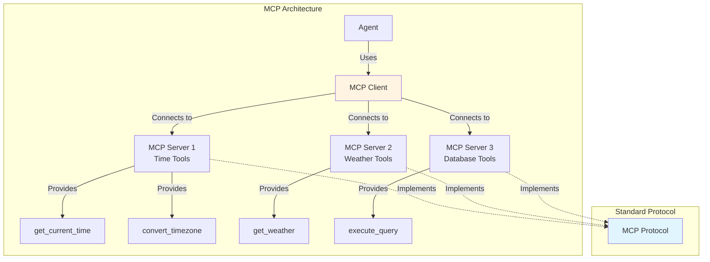
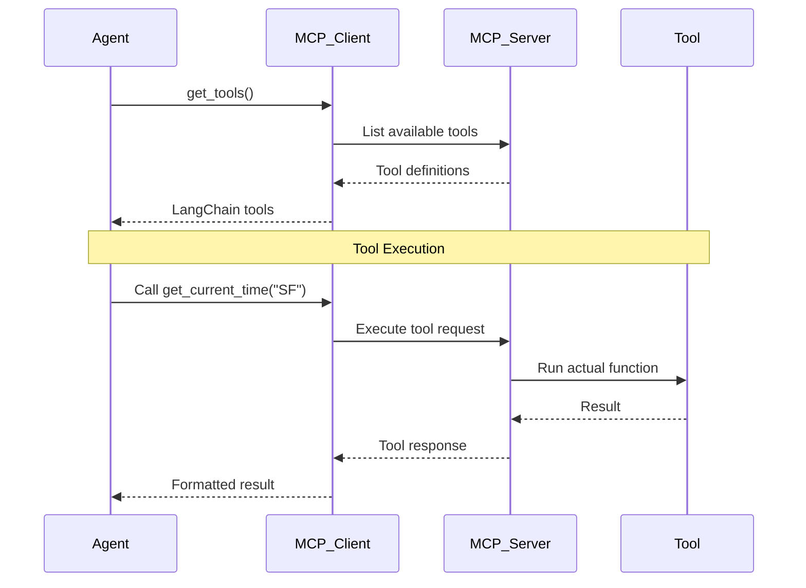

# Lab 5: Tools with MCP - Model Context Protocol (Optional)

**Level:** 200-300 (Intermediate to Advanced)  
**Duration:** 40-50 minutes  
**Prerequisites:** Completion of Labs 1-4, understanding of async Python

---

## Table of Contents
1. [What is MCP?](#what-is-mcp)
2. [Core Concepts](#core-concepts)
3. [Architecture Overview](#architecture-overview)
4. [Step-by-Step Implementation](#step-by-step-implementation)
5. [How It Works](#how-it-works)
6. [Key Takeaways](#key-takeaways)
7. [Troubleshooting](#troubleshooting)

---

## What is MCP?

**Model Context Protocol (MCP)** is a standardized way to connect AI agents to external tools and data sources. Think of it as a universal adapter for agent tools.

### Real-World Analogy

**Without MCP:**
- Each tool has its own custom integration
- Like having different chargers for every device
- Hard to share tools between agents

**With MCP:**
- Standardized protocol for all tools
- Like USB-C - one standard for everything
- Tools work with any MCP-compatible agent

### Why MCP Matters

✅ **Standardization**: One protocol for all tools  
✅ **Interoperability**: Tools work across platforms  
✅ **Ecosystem**: Share and reuse community tools  
✅ **Simplicity**: Less custom integration code

---

## Core Concepts

### 1. MCP Server

A process that provides tools via the MCP protocol:

```python
# MCP server provides time-related tools
mcp_client = MultiServerMCPClient({
    "time": {
        "transport": "stdio",
        "command": "npx",
        "args": ["-y", "@theo.foobar/mcp-time"],
    }
})
```

### 2. MCP Client

Connects to MCP servers and loads their tools:

```python
mcp_tools = await mcp_client.get_tools()
# Returns LangChain-compatible tools
```

### 3. Tool Discovery

MCP servers advertise their available tools:

```python
print([t.name for t in mcp_tools])
# ['get_current_time', 'parse_relative_time', 'convert_timezone', ...]
```

---

## Architecture Overview



---

## Step-by-Step Implementation

### Step 1: Install Dependencies

```python
!pip install -qU langchain-mcp-adapters nest-asyncio

from dotenv import load_dotenv
from env_utils import doublecheck_env

load_dotenv()
doublecheck_env(".env")
```

### Step 2: Setup Async Environment

```python
from langchain_mcp_adapters.client import MultiServerMCPClient
import nest_asyncio
import asyncio
import sys

# Windows-specific fix for asyncio subprocesses
if sys.platform == 'win32':
    asyncio.set_event_loop_policy(asyncio.WindowsProactorEventLoopPolicy())

nest_asyncio.apply()
```

**Why?** MCP uses async I/O for communication with servers.

### Step 3: Connect to MCP Server

```python
# Connect to the mcp-time server
mcp_client = MultiServerMCPClient({
    "time": {
        "transport": "stdio",  # Communication method
        "command": "npx",      # How to start the server
        "args": ["-y", "@theo.foobar/mcp-time"],  # Server package
    }
})

# Load tools from the server
mcp_tools = await mcp_client.get_tools()
print(f"Loaded {len(mcp_tools)} MCP tools: {[t.name for t in mcp_tools]}")
```

**Output:**
```
Loaded 5 MCP tools: ['get_current_time', 'parse_relative_time', 
'convert_timezone', 'add_duration', 'compare_times']
```

### Step 4: Create Agent with MCP Tools

```python
from langchain.agents import create_agent
from langchain_groq import ChatGroq

llm = ChatGroq(
    model="llama-3.1-8b-instant",
    temperature=0,
    max_retries=2
)

agent_with_mcp = create_agent(
    model=llm,
    tools=mcp_tools,  # ← MCP tools!
    system_prompt="You are a helpful assistant",
)
```

### Step 5: Use MCP Tools

```python
result = await agent_with_mcp.ainvoke(
    {"messages": [{"role": "user", "content": "What's the time in SF right now?"}]}
)

for msg in result["messages"]:
    msg.pretty_print()
```

**Output:**
```
================================ Human Message =================================
What's the time in SF right now?

================================== Ai Message ==================================
Tool Calls:
  get_current_time (call_abc123)
  Args: {"timezone": "America/Los_Angeles"}

================================= Tool Message =================================
Name: get_current_time
2025-01-20 14:30:45 PST

================================== Ai Message ==================================
The current time in San Francisco is 2:30 PM PST.
```

---

## How It Works

### MCP Communication Flow



### MCP vs Custom Tools

**Custom Tool:**
```python
@tool
def get_time(city: str) -> str:
    """Get current time."""
    # Custom implementation
    return time_api.get(city)
```

**MCP Tool:**
```python
# Just connect to server
mcp_tools = await mcp_client.get_tools()
# Tools are automatically available!
```

---

## Key Takeaways

### What You Learned

✅ **MCP Protocol**: Standardized tool integration  
✅ **MCP Servers**: External tool providers  
✅ **MCP Client**: Connecting to servers  
✅ **Tool Discovery**: Automatic tool loading  
✅ **Async Operations**: Working with async Python

### Best Practices

1. **Use Community Servers**: Don't reinvent the wheel
2. **Handle Async**: Understand async/await patterns
3. **Error Handling**: MCP servers can fail
4. **Multiple Servers**: Connect to many servers at once
5. **Version Pinning**: Specify server versions

### Common Pitfalls

❌ **Forgetting await**: MCP operations are async  
❌ **Server not installed**: npx downloads on first use  
❌ **Wrong transport**: Use "stdio" for most servers  
❌ **No error handling**: Servers can crash or timeout

---

## Available MCP Servers

### Popular Community Servers

1. **@theo.foobar/mcp-time**: Time and timezone operations
2. **@modelcontextprotocol/server-filesystem**: File operations
3. **@modelcontextprotocol/server-github**: GitHub API access
4. **@modelcontextprotocol/server-postgres**: PostgreSQL queries
5. **@modelcontextprotocol/server-brave-search**: Web search

### Finding More Servers

- [MCP Server Registry](https://github.com/modelcontextprotocol/servers)
- [Awesome MCP](https://github.com/punkpeye/awesome-mcp-servers)
- npm search: `npm search mcp-server`

---

## Troubleshooting

### Issue: "MCP server not found"

**Cause:** Server package not installed  
**Solution:**
```bash
# npx automatically downloads on first use
# Or pre-install:
npm install -g @theo.foobar/mcp-time
```

### Issue: "Async errors"

**Cause:** Not using await or async context  
**Solution:**
```python
# Use await
mcp_tools = await mcp_client.get_tools()

# Use ainvoke for async
result = await agent.ainvoke(...)
```

### Issue: "Server timeout"

**Cause:** Server taking too long to start  
**Solution:**
- Check internet connection
- Increase timeout
- Verify server package exists

### Issue: "Tools not working"

**Cause:** Server crashed or incompatible  
**Solution:**
- Check server logs
- Verify server version
- Try different server

---

## Next Steps

After completing this lab, you should:

1. **Explore Servers**: Try different MCP servers
2. **Build Server**: Create your own MCP server
3. **Combine Tools**: Use multiple MCP servers together
4. **Production**: Deploy with proper error handling

---

## Additional Resources

- [MCP Specification](https://modelcontextprotocol.io/)
- [MCP Server List](https://github.com/modelcontextprotocol/servers)
- [LangChain MCP Adapters](https://github.com/langchain-ai/langchain-mcp-adapters)
- [Building MCP Servers](https://modelcontextprotocol.io/docs/building-servers)

---

**Questions?** Experiment with different MCP servers to see the power of standardized tool integration!
