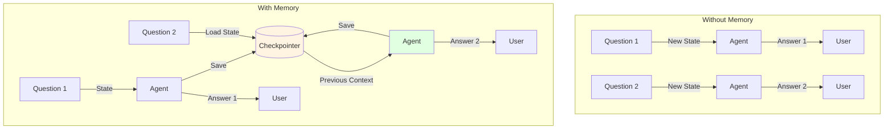
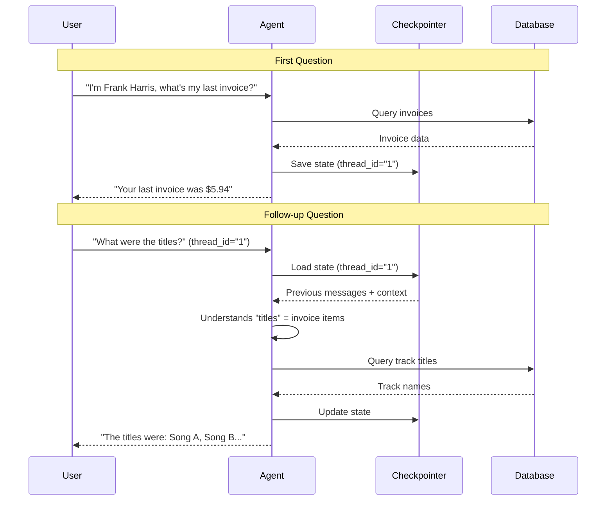

# Lab 6: Memory - Maintaining Conversation Context

**Level:** 100-200 (Beginner to Intermediate)  
**Duration:** 35-45 minutes  
**Prerequisites:** Completion of Labs 1-4

---

## Table of Contents
1. [What is Memory?](#what-is-memory)
2. [Core Concepts](#core-concepts)
3. [Memory Types](#memory-types)
4. [Architecture Overview](#architecture-overview)
5. [Step-by-Step Implementation](#step-by-step-implementation)
6. [How It Works](#how-it-works)
7. [Key Takeaways](#key-takeaways)
8. [Troubleshooting](#troubleshooting)

---

## What is Memory?

**Memory** in agents refers to the ability to remember previous interactions across multiple invocations. Without memory, each conversation starts fresh.

### Real-World Analogy

**Without Memory:**
- Like talking to someone with amnesia
- Every question is treated as the first
- No context from previous exchanges

**With Memory:**
- Like a normal conversation
- Can reference earlier topics
- Builds on previous context

### The Problem

```python
# First question
agent.invoke({"messages": "My name is Alice"})
# Response: "Nice to meet you, Alice!"

# Second question (new invocation)
agent.invoke({"messages": "What's my name?"})
# Response: "I don't know your name."  ❌
```

### The Solution

```python
# With memory and thread_id
agent.invoke({"messages": "My name is Alice"}, {"configurable": {"thread_id": "1"}})
agent.invoke({"messages": "What's my name?"}, {"configurable": {"thread_id": "1"}})
# Response: "Your name is Alice!"  ✅
```

---

## Core Concepts

### 1. Checkpointer

A **checkpointer** saves the agent's state (messages, context) between invocations.

```python
from langgraph.checkpoint.memory import InMemorySaver

checkpointer = InMemorySaver()
```

### 2. Thread ID

A unique identifier for a conversation thread. Same thread_id = same conversation.

```python
config = {"configurable": {"thread_id": "user_123"}}
```

### 3. State Persistence

The agent's state includes:
- All messages (human, AI, tool)
- Intermediate results
- Context variables

---

## Memory Types

### 1. InMemorySaver

Stores state in RAM (lost when program ends).

**Use Case:** Development, testing, short sessions

```python
from langgraph.checkpoint.memory import InMemorySaver

checkpointer = InMemorySaver()
```

### 2. SQLiteSaver (Not in this lab)

Stores state in SQLite database (persists across restarts).

**Use Case:** Production, long-term memory

### 3. RedisSaver (Not in this lab)

Stores state in Redis (distributed, scalable).

**Use Case:** Production, multiple servers

---

## Architecture Overview



---

## Step-by-Step Implementation

### Step 1: Setup (Same as Lab 1)

```python
!pip install -qU langchain-groq langgraph langchain-community pysqlite3-binary

from google.colab import userdata
import os

os.environ["GROQ_API_KEY"] = userdata.get('GROQ_API_KEY')

# Setup database and tools (same as Lab 1)
from langchain_community.utilities import SQLDatabase

!wget -q https://github.com/jayyanar/agentic-ai-training/raw/lab-day-1/batch2/lca-langchainV1-essentials/Chinook.db

db = SQLDatabase.from_uri("sqlite:///Chinook.db")
```

### Step 2: Create Agent WITHOUT Memory

```python
from dataclasses import dataclass
from langchain_core.tools import tool
from langgraph.runtime import get_runtime
from langchain.agents import create_agent
from langchain_groq import ChatGroq

@dataclass
class RuntimeContext:
    db: SQLDatabase

@tool
def execute_sql(query: str) -> str:
    """Execute a SQLite command and return results."""
    runtime = get_runtime(RuntimeContext)
    db = runtime.context.db
    try:
        return db.run(query)
    except Exception as e:
        return f"Error: {e}"

SYSTEM_PROMPT = """You are a careful SQLite analyst.

Rules:
- Think step-by-step.
- When you need data, call the tool `execute_sql` with ONE SELECT query.
- Read-only only; no INSERT/UPDATE/DELETE/ALTER/DROP/CREATE/REPLACE/TRUNCATE.
- Limit to 5 rows unless the user explicitly asks otherwise.
- If the tool returns 'Error:', revise the SQL and try again.
- Prefer explicit column lists; avoid SELECT *.
"""

llm = ChatGroq(
    model="openai/gpt-oss-120b",
    temperature=0,
    max_retries=2,
)

agent = create_agent(
    model=llm,
    tools=[execute_sql],
    system_prompt=SYSTEM_PROMPT,
    context_schema=RuntimeContext,
)
```

### Step 3: Test Without Memory

```python
# First question
question = "This is Frank Harris, What was the total on my last invoice?"

for step in agent.stream(
    {"messages": [{"role": "user", "content": question}]},
    context=RuntimeContext(db=db),
    stream_mode="values",
):
    step["messages"][-1].pretty_print()
```

**Output:** Agent finds Frank Harris's last invoice total.

```python
# Follow-up question
question = "What were the titles?"

for step in agent.stream(
    {"messages": [{"role": "user", "content": question}]},
    context=RuntimeContext(db=db),
    stream_mode="values",
):
    step["messages"][-1].pretty_print()
```

**Output:** Agent doesn't know what "titles" refers to! ❌

### Step 4: Add Memory

```python
from langgraph.checkpoint.memory import InMemorySaver

agent = create_agent(
    model=llm,
    tools=[execute_sql],
    system_prompt=SYSTEM_PROMPT,
    context_schema=RuntimeContext,
    checkpointer=InMemorySaver(),  # ← Add this!
)
```

### Step 5: Test With Memory

```python
# First question with thread_id
question = "This is Frank Harris, What was the total on my last invoice?"

for step in agent.stream(
    {"messages": [{"role": "user", "content": question}]},
    {"configurable": {"thread_id": "1"}},  # ← Add this!
    context=RuntimeContext(db=db),
    stream_mode="values",
):
    step["messages"][-1].pretty_print()
```

```python
# Follow-up question with SAME thread_id
question = "What were the titles?"

for step in agent.stream(
    {"messages": [{"role": "user", "content": question}]},
    {"configurable": {"thread_id": "1"}},  # ← Same thread!
    context=RuntimeContext(db=db),
    stream_mode="values",
):
    step["messages"][-1].pretty_print()
```

**Output:** Agent remembers the context and knows what titles to look up! ✅

---

## How It Works

### Memory Flow



### What Gets Saved

```python
{
    "thread_id": "1",
    "messages": [
        HumanMessage("I'm Frank Harris, what's my last invoice?"),
        AIMessage(tool_calls=[...]),
        ToolMessage("Invoice data..."),
        AIMessage("Your last invoice was $5.94"),
        HumanMessage("What were the titles?"),
        # ... and so on
    ],
    "context": {...}
}
```

---

## Key Takeaways

### What You Learned

✅ **Memory Concept**: Persisting state across invocations  
✅ **Checkpointers**: InMemorySaver for state storage  
✅ **Thread IDs**: Identifying conversation threads  
✅ **Context Continuity**: Building on previous exchanges  
✅ **State Management**: What gets saved and loaded

### Best Practices

1. **Use Thread IDs**: Always provide thread_id for memory
2. **Unique IDs**: Different users = different thread_ids
3. **Clean Up**: Clear old threads to save memory
4. **Production Storage**: Use SQLite/Redis for persistence
5. **Test Both**: Verify behavior with and without memory

### Common Pitfalls

❌ **Forgetting thread_id**: Memory won't work  
❌ **Reusing thread_ids**: Mixing conversations  
❌ **InMemory in production**: Lost on restart  
❌ **No cleanup**: Memory leaks over time

---

## Troubleshooting

### Issue: "Agent still doesn't remember"

**Cause:** Missing or different thread_id  
**Solution:**
```python
# Ensure same thread_id
config = {"configurable": {"thread_id": "1"}}
agent.invoke({...}, config)  # First call
agent.invoke({...}, config)  # Second call - same config!
```

### Issue: "Memory lost after restart"

**Cause:** Using InMemorySaver  
**Solution:**
- Use SQLiteSaver for persistence
- Or accept that memory is session-only

### Issue: "Wrong context retrieved"

**Cause:** Thread ID collision  
**Solution:**
```python
# Use unique IDs per user
thread_id = f"user_{user_id}_{session_id}"
```

### Issue: "Memory grows too large"

**Cause:** Long conversations accumulate messages  
**Solution:**
- Implement message pruning
- Summarize old messages
- Clear old threads periodically

---

## Next Steps

After completing this lab, you should:

1. **Experiment**: Try multiple threads with different IDs
2. **Build Chatbot**: Create a multi-user chat application
3. **Explore Persistence**: Try SQLiteSaver for permanent storage
4. **Move to Lab 7**: Learn about structured outputs

---

## Additional Resources

- [LangGraph Checkpointers](https://langchain-ai.github.io/langgraph/how-tos/persistence/)
- [Memory Management Guide](https://python.langchain.com/docs/modules/memory/)
- [Thread Management](https://langchain-ai.github.io/langgraph/concepts/#threads)

---

**Questions?** Experiment with different thread IDs and conversation flows to understand memory behavior!
