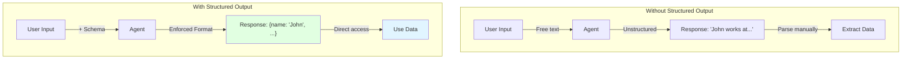
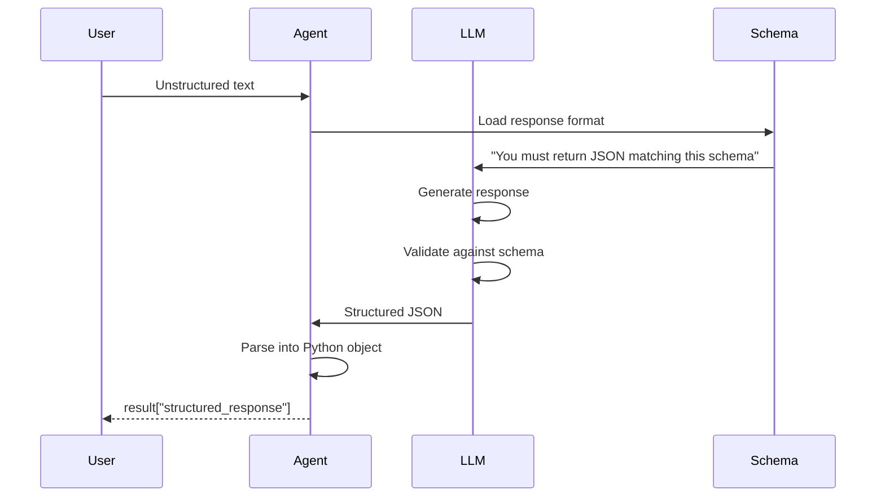

# Lab 7: Structured Output - Getting Predictable Data from Agents

**Level:** 100-200 (Beginner to Intermediate)  
**Duration:** 30-40 minutes  
**Prerequisites:** Completion of Labs 1-6

---

## Table of Contents
1. [What is Structured Output?](#what-is-structured-output)
2. [Core Concepts](#core-concepts)
3. [Output Formats](#output-formats)
4. [Architecture Overview](#architecture-overview)
5. [Step-by-Step Implementation](#step-by-step-implementation)
6. [How It Works](#how-it-works)
7. [Key Takeaways](#key-takeaways)
8. [Troubleshooting](#troubleshooting)

---

## What is Structured Output?

**Structured Output** forces the agent to return data in a specific, predictable format (like JSON) instead of free-form text.

### Real-World Analogy

**Without Structured Output:**
- Like asking someone to describe a person
- Response: "John Doe, works at Example Corp, his email is john@example.com, phone is 555-1234567"
- Hard to parse programmatically

**With Structured Output:**
- Response is guaranteed to be:
```json
{
  "name": "John Doe",
  "company": "Example Corp",
  "email": "john@example.com",
  "phone": "555-1234567"
}
```
- Easy to use in code!

### Why It Matters

✅ **Predictable**: Always get the same structure  
✅ **Type-Safe**: Know what fields exist  
✅ **Easy to Process**: Direct integration with code  
✅ **Validation**: Ensure required fields are present

---

## Core Concepts

### 1. Schema Definition

Define the structure you want:

```python
class ContactInfo(TypedDict):
    name: str
    email: str
    phone: str
```

### 2. Response Format

Tell the agent to use this schema:

```python
agent = create_agent(
    model=llm,
    response_format=ContactInfo  # ← Enforce structure
)
```

### 3. Structured Response

Access the structured data:

```python
result = agent.invoke({"messages": "..."})
structured_data = result["structured_response"]
# structured_data is a dict matching ContactInfo
```

---

## Output Formats

LangChain supports multiple schema formats:

### 1. TypedDict

```python
from typing_extensions import TypedDict

class ContactInfo(TypedDict):
    name: str
    email: str
    phone: str
```

### 2. Pydantic BaseModel

```python
from pydantic import BaseModel

class ContactInfo(BaseModel):
    name: str
    email: str
    phone: str
```

### 3. Dataclasses

```python
from dataclasses import dataclass

@dataclass
class ContactInfo:
    name: str
    email: str
    phone: str
```

### 4. JSON Schema (dict)

```python
schema = {
    "type": "object",
    "properties": {
        "name": {"type": "string"},
        "email": {"type": "string"},
        "phone": {"type": "string"}
    },
    "required": ["name", "email", "phone"]
}
```

---

## Architecture Overview



---

## Step-by-Step Implementation

### Step 1: Setup

```python
!pip install -qU langchain-groq langgraph langchain-community pysqlite3-binary

from google.colab import userdata
import os

os.environ["GROQ_API_KEY"] = userdata.get('GROQ_API_KEY')
```

### Step 2: Define Schema with TypedDict

```python
from typing_extensions import TypedDict

class ContactInfo(TypedDict):
    name: str
    email: str
    phone: str
    order: str
    company: str
```

**What This Means:**
- Agent MUST return a dict with these exact keys
- All values must be strings
- Missing fields will cause an error

### Step 3: Create Agent with Response Format

```python
from langchain.agents import create_agent
from langchain_groq import ChatGroq

llm = ChatGroq(
    model="llama-3.1-8b-instant",
    temperature=0,
    max_retries=2,
)

agent = create_agent(
    model=llm, 
    response_format=ContactInfo  # ← Enforce structure
)
```

### Step 4: Test with Unstructured Input

```python
recorded_conversation = """We talked with John Doe. He works over at Example. 
His number is, let's see, five, five, five, one two three, four, five, six seven. 
Did you get that? And, his email was john at example.com. 
He wanted to order 50 boxes of Captain Crunch."""

result = agent.invoke(
    {"messages": [{"role": "user", "content": recorded_conversation}]}
)

print(result["structured_response"])
```

**Output:**
```python
{
    'name': 'John Doe',
    'email': 'john@example.com',
    'phone': '555-123-4567',
    'order': '50 boxes of Captain Crunch',
    'company': 'Example'
}
```

**Magic!** The agent extracted and structured the information automatically.

### Step 5: Using Pydantic BaseModel

```python
from pydantic import BaseModel

class ContactInfo(BaseModel):
    name: str
    email: str
    phone: str

agent = create_agent(
    model=llm, 
    response_format=ContactInfo
)

result = agent.invoke(
    {"messages": [{"role": "user", "content": recorded_conversation}]}
)

print(result["structured_response"])
```

**Output:**
```python
ContactInfo(
    name='John Doe',
    email='john@example.com',
    phone='555-123-4567'
)
```

**Difference:** Pydantic returns a model instance with validation.

---

## How It Works

### Structured Output Flow



### Behind the Scenes

The agent adds instructions to the system prompt:

```
You must respond with valid JSON matching this schema:
{
  "name": "string",
  "email": "string",
  "phone": "string",
  "order": "string",
  "company": "string"
}
```

The LLM is trained to follow these instructions precisely.

---

## Key Takeaways

### What You Learned

✅ **Structured Output**: Enforcing response formats  
✅ **Schema Types**: TypedDict, Pydantic, dataclasses, JSON  
✅ **Data Extraction**: Converting text to structured data  
✅ **Type Safety**: Guaranteed field presence  
✅ **Integration**: Easy to use in applications

### Best Practices

1. **Use Pydantic**: Best validation and type checking
2. **Required Fields**: Mark optional fields explicitly
3. **Clear Names**: Use descriptive field names
4. **Validate**: Check structured_response exists
5. **Handle Errors**: LLM might fail to match schema

### Common Pitfalls

❌ **Too many fields**: LLM struggles with complex schemas  
❌ **Ambiguous names**: LLM doesn't know what to extract  
❌ **No validation**: Assuming data is always correct  
❌ **Wrong format**: Using unsupported schema types

---

## Use Cases

### 1. Data Extraction

Extract structured data from documents:

```python
class Invoice(BaseModel):
    invoice_number: str
    date: str
    total: float
    items: list[str]
```

### 2. Form Filling

Convert conversations to form data:

```python
class UserProfile(BaseModel):
    name: str
    age: int
    interests: list[str]
```

### 3. API Integration

Generate API request payloads:

```python
class APIRequest(BaseModel):
    endpoint: str
    method: str
    params: dict
```

### 4. Database Records

Create database entries:

```python
class Customer(BaseModel):
    customer_id: str
    name: str
    email: str
    created_at: str
```

---

## Troubleshooting

### Issue: "Schema validation failed"

**Cause:** LLM couldn't match the schema  
**Solution:**
- Simplify the schema
- Provide clearer input
- Add examples in system prompt

### Issue: "Missing fields in response"

**Cause:** LLM didn't extract all fields  
**Solution:**
```python
from typing import Optional

class ContactInfo(BaseModel):
    name: str
    email: str
    phone: Optional[str] = None  # Make optional
```

### Issue: "Wrong data types"

**Cause:** LLM returned string instead of int, etc.  
**Solution:**
- Use Pydantic for automatic conversion
- Add validation rules

### Issue: "Structured response is None"

**Cause:** Agent didn't use structured output  
**Solution:**
- Verify response_format is set
- Check if model supports structured output
- Inspect result["messages"] for errors

---

## Next Steps

After completing this lab, you should:

1. **Experiment**: Try different schema types
2. **Complex Schemas**: Add nested objects and lists
3. **Validation**: Use Pydantic validators
4. **Move to Optional Labs**: Explore advanced topics

---

## Additional Resources

- [Pydantic Documentation](https://docs.pydantic.dev/)
- [LangChain Structured Output](https://python.langchain.com/docs/modules/model_io/output_parsers/types/structured)
- [JSON Schema Guide](https://json-schema.org/learn/getting-started-step-by-step)

---

**Questions?** Experiment with different schemas and input formats to see how structured output handles various scenarios!
