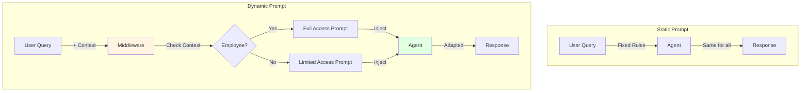
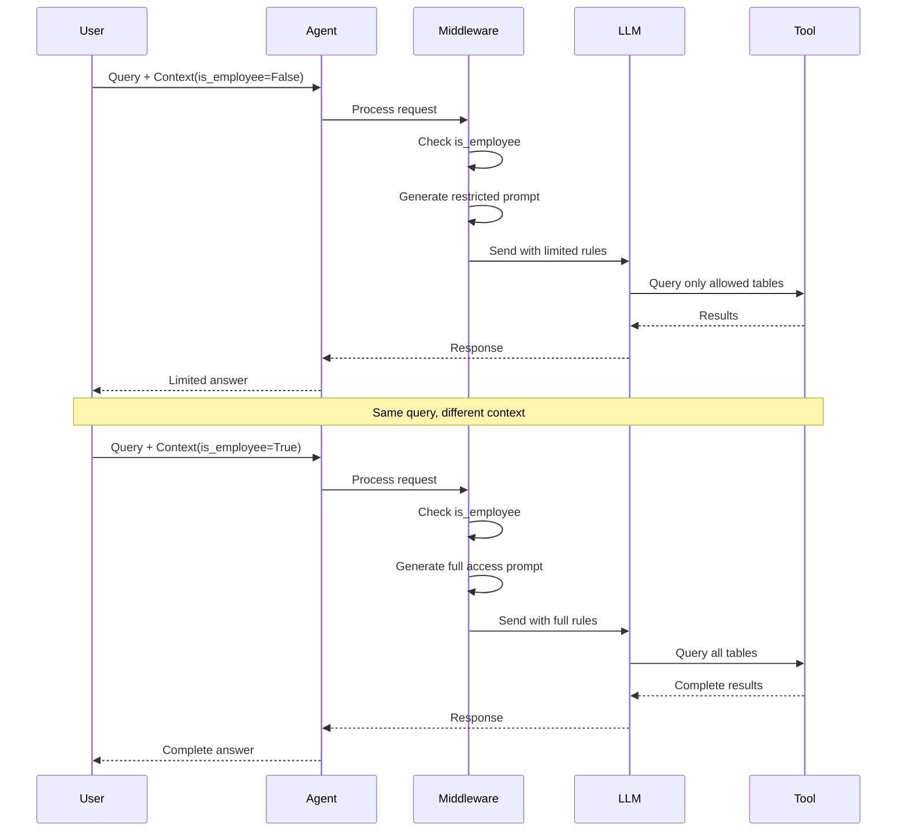

# Lab 8: Dynamic Prompts - Context-Aware Agent Behavior (Optional)

**Level:** 200-300 (Intermediate to Advanced)  
**Duration:** 35-45 minutes  
**Prerequisites:** Completion of Labs 1-6

---

## Table of Contents
1. [What are Dynamic Prompts?](#what-are-dynamic-prompts)
2. [Core Concepts](#core-concepts)
3. [Architecture Overview](#architecture-overview)
4. [Step-by-Step Implementation](#step-by-step-implementation)
5. [How It Works](#how-it-works)
6. [Key Takeaways](#key-takeaways)
7. [Troubleshooting](#troubleshooting)

---

## What are Dynamic Prompts?

**Dynamic Prompts** change based on runtime context, allowing agents to adapt their behavior to different situations without creating multiple agents.

### Real-World Analogy

**Static Prompt:**
- Like a restaurant with one menu for everyone
- Same rules for all customers

**Dynamic Prompt:**
- Like a restaurant with different menus for VIP vs regular customers
- Rules adapt based on who you are

### The Problem

```python
# Want different behavior for employees vs customers
# Bad solution: Create two separate agents
employee_agent = create_agent(system_prompt="Employee rules...")
customer_agent = create_agent(system_prompt="Customer rules...")
```

### The Solution

```python
# Good solution: One agent with dynamic prompt
@dynamic_prompt
def adaptive_prompt(request: ModelRequest) -> str:
    if request.runtime.context.is_employee:
        return "Employee rules..."
    else:
        return "Customer rules..."

agent = create_agent(middleware=[adaptive_prompt])
```

---

## Core Concepts

### 1. Middleware

Functions that intercept and modify requests before they reach the LLM:

```python
@dynamic_prompt
def my_middleware(request: ModelRequest) -> str:
    # Inspect request
    # Return modified prompt
    return prompt
```

### 2. Runtime Context

Data available during execution:

```python
@dataclass
class RuntimeContext:
    is_employee: bool
    user_role: str
    permissions: list[str]
```

### 3. Request Object

Contains information about the current request:

```python
request.runtime.context  # Access runtime context
request.messages         # Current messages
request.tools            # Available tools
```

---

## Architecture Overview



---

## Step-by-Step Implementation

### Step 1: Setup (Same as Lab 1)

```python
!pip install -qU langchain-groq langgraph langchain-community pysqlite3-binary

from google.colab import userdata
import os

os.environ["GROQ_API_KEY"] = userdata.get('GROQ_API_KEY')

# Setup database
from langchain_community.utilities import SQLDatabase

!wget -q https://github.com/jayyanar/agentic-ai-training/raw/lab-day-1/batch2/lca-langchainV1-essentials/Chinook.db

db = SQLDatabase.from_uri("sqlite:///Chinook.db")
```

### Step 2: Define Enhanced Runtime Context

```python
from dataclasses import dataclass

@dataclass
class RuntimeContext:
    is_employee: bool  # ← New field!
    db: SQLDatabase
```

### Step 3: Create Prompt Template

```python
SYSTEM_PROMPT_TEMPLATE = """You are a careful SQLite analyst.

Rules:
- Think step-by-step.
- When you need data, call the tool `execute_sql` with ONE SELECT query.
- Read-only only; no INSERT/UPDATE/DELETE/ALTER/DROP/CREATE/REPLACE/TRUNCATE.
- Limit to 5 rows unless the user explicitly asks otherwise.
{table_limits}
- If the tool returns 'Error:', revise the SQL and try again.
- Prefer explicit column lists; avoid SELECT *.
"""
```

**Note:** `{table_limits}` will be filled dynamically!

### Step 4: Create Dynamic Prompt Middleware

```python
from langchain.agents.middleware.types import ModelRequest, dynamic_prompt

@dynamic_prompt
def dynamic_system_prompt(request: ModelRequest) -> str:
    # Access runtime context
    if not request.runtime.context.is_employee:
        # Customer: Limited access
        table_limits = "- Limit access to these tables: Album, Artist, Genre, Playlist, PlaylistTrack, Track."
    else:
        # Employee: Full access
        table_limits = ""
    
    return SYSTEM_PROMPT_TEMPLATE.format(table_limits=table_limits)
```

**What This Does:**
- Checks if user is an employee
- Restricts table access for non-employees
- Allows full access for employees

### Step 5: Create Agent with Middleware

```python
from langchain.agents import create_agent
from langchain_core.tools import tool
from langgraph.runtime import get_runtime
from langchain_groq import ChatGroq

@tool
def execute_sql(query: str) -> str:
    """Execute a SQLite command and return results."""
    runtime = get_runtime(RuntimeContext)
    db = runtime.context.db
    try:
        return db.run(query)
    except Exception as e:
        return f"Error: {e}"

llm = ChatGroq(
    model="openai/gpt-oss-120b",
    temperature=0,
    max_retries=2,
)

agent = create_agent(
    model=llm,
    tools=[execute_sql],
    middleware=[dynamic_system_prompt],  # ← Add middleware!
    context_schema=RuntimeContext,
)
```

### Step 6: Test as Non-Employee

```python
question = "What is the most costly purchase by Frank Harris?"

for step in agent.stream(
    {"messages": [{"role": "user", "content": question}]},
    context=RuntimeContext(is_employee=False, db=db),  # ← Not employee
    stream_mode="values",
):
    step["messages"][-1].pretty_print()
```

**Expected Behavior:**
- Agent can only query: Album, Artist, Genre, Playlist, PlaylistTrack, Track
- Cannot access Invoice or Customer tables
- Will fail or give limited answer

### Step 7: Test as Employee

```python
question = "What is the most costly purchase by Frank Harris?"

for step in agent.stream(
    {"messages": [{"role": "user", "content": question}]},
    context=RuntimeContext(is_employee=True, db=db),  # ← Is employee
    stream_mode="values",
):
    step["messages"][-1].pretty_print()
```

**Expected Behavior:**
- Agent can access ALL tables including Invoice and Customer
- Can find Frank Harris's purchases
- Provides complete answer

---

## How It Works

### Dynamic Prompt Flow



---

## Key Takeaways

### What You Learned

✅ **Dynamic Prompts**: Context-aware behavior  
✅ **Middleware**: Intercepting and modifying requests  
✅ **Runtime Context**: Passing data to middleware  
✅ **Access Control**: Implementing permissions  
✅ **Single Agent**: Multiple behaviors without duplication

### Best Practices

1. **Use for Permissions**: Control what agents can access
2. **Keep Logic Simple**: Complex middleware is hard to debug
3. **Test All Paths**: Verify each context variation
4. **Document Behavior**: Explain what changes and why
5. **Combine Middleware**: Stack multiple middleware functions

### Common Pitfalls

❌ **Complex logic**: Hard to understand and maintain  
❌ **Not testing all contexts**: Missing edge cases  
❌ **Forgetting to pass context**: Middleware can't adapt  
❌ **Inconsistent behavior**: Different results for same input

---

## Use Cases

### 1. Role-Based Access Control

```python
@dynamic_prompt
def rbac_prompt(request: ModelRequest) -> str:
    role = request.runtime.context.user_role
    if role == "admin":
        return "Full access prompt..."
    elif role == "manager":
        return "Manager access prompt..."
    else:
        return "User access prompt..."
```

### 2. Time-Based Behavior

```python
@dynamic_prompt
def time_based_prompt(request: ModelRequest) -> str:
    hour = datetime.now().hour
    if 9 <= hour < 17:
        return "Business hours prompt..."
    else:
        return "After hours prompt..."
```

### 3. User Preferences

```python
@dynamic_prompt
def preference_prompt(request: ModelRequest) -> str:
    language = request.runtime.context.language
    return f"Respond in {language}. {base_prompt}"
```

### 4. Feature Flags

```python
@dynamic_prompt
def feature_flag_prompt(request: ModelRequest) -> str:
    if request.runtime.context.beta_features:
        return "Prompt with beta features..."
    else:
        return "Standard prompt..."
```

---

## Troubleshooting

### Issue: "Middleware not being called"

**Cause:** Not added to agent or wrong decorator  
**Solution:**
```python
# Ensure @dynamic_prompt decorator
@dynamic_prompt
def my_middleware(request: ModelRequest) -> str:
    ...

# Add to agent
agent = create_agent(middleware=[my_middleware])
```

### Issue: "Can't access context"

**Cause:** Context not passed or wrong schema  
**Solution:**
```python
# Define schema
context_schema=RuntimeContext

# Pass context
context=RuntimeContext(is_employee=True, db=db)
```

### Issue: "Prompt not changing"

**Cause:** Logic error in middleware  
**Solution:**
- Add print statements to debug
- Verify context values
- Check conditional logic

### Issue: "Inconsistent behavior"

**Cause:** Stateful middleware or race conditions  
**Solution:**
- Keep middleware stateless
- Don't modify shared state
- Use only request data

---

## Next Steps

After completing this lab, you should:

1. **Experiment**: Try different context values
2. **Add Complexity**: Multiple context fields
3. **Combine Middleware**: Stack multiple functions
4. **Move to Lab 9**: Learn about Human-in-the-Loop

---

## Additional Resources

- [LangChain Middleware Documentation](https://python.langchain.com/docs/modules/agents/middleware/)
- [Dynamic Prompts Guide](https://langchain-ai.github.io/langgraph/how-tos/dynamic-prompts/)
- [Access Control Patterns](https://python.langchain.com/docs/security/access_control)

---

**Questions?** Experiment with different runtime contexts to see how dynamic prompts adapt agent behavior!
