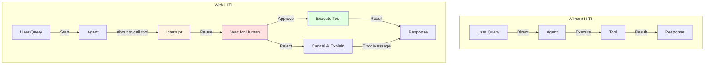
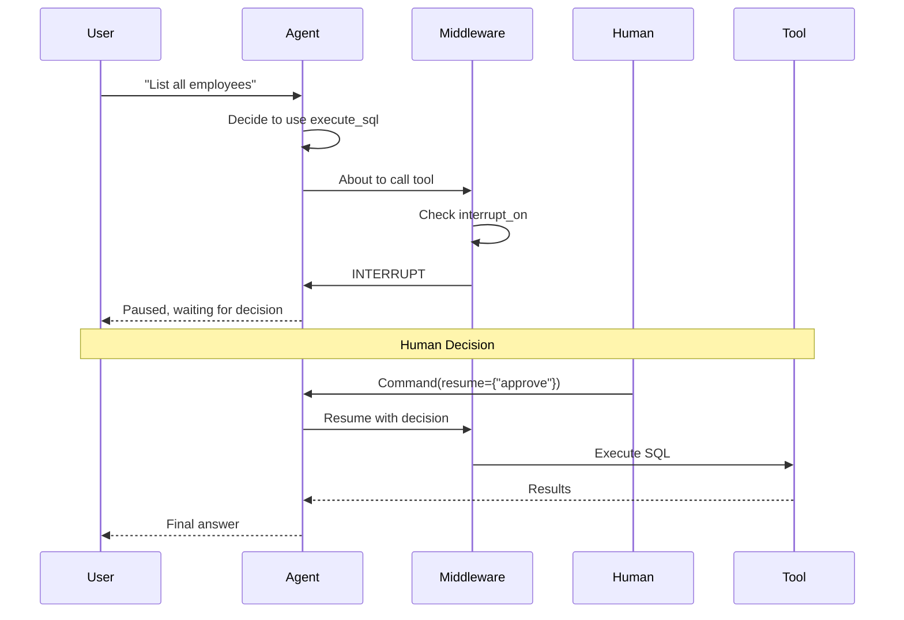

# Lab 9: Human-in-the-Loop (HITL) - Agent Supervision (Optional)

**Level:** 200-300 (Intermediate to Advanced)  
**Duration:** 40-50 minutes  
**Prerequisites:** Completion of Labs 1-6

---

## Table of Contents
1. [What is Human-in-the-Loop?](#what-is-human-in-the-loop)
2. [Core Concepts](#core-concepts)
3. [Architecture Overview](#architecture-overview)
4. [Step-by-Step Implementation](#step-by-step-implementation)
5. [How It Works](#how-it-works)
6. [Key Takeaways](#key-takeaways)
7. [Troubleshooting](#troubleshooting)

---

## What is Human-in-the-Loop?

**Human-in-the-Loop (HITL)** pauses agent execution to get human approval before performing critical actions. This adds a safety layer for high-stakes operations.

### Real-World Analogy

**Without HITL:**
- Like a self-driving car that never asks for confirmation
- Autonomous but potentially risky

**With HITL:**
- Like a co-pilot system that asks "Are you sure?" before critical actions
- Autonomous with human oversight

### Why HITL Matters

✅ **Safety**: Prevent dangerous operations  
✅ **Compliance**: Meet regulatory requirements  
✅ **Trust**: Users feel in control  
✅ **Learning**: Humans can correct agent mistakes

---

## Core Concepts

### 1. Interrupts

Pause points where the agent waits for human input:

```python
HumanInTheLoopMiddleware(
    interrupt_on={"execute_sql": {"allowed_decisions": ["approve", "reject"]}}
)
```

### 2. Decisions

Human responses to interrupts:
- **approve**: Continue with the action
- **reject**: Cancel the action (with optional message)
- **modify**: Change parameters (advanced)

### 3. Resume

Continue execution after human decision:

```python
agent.invoke(
    Command(resume={"decisions": [{"type": "approve"}]}),
    config=config  # Same thread_id
)
```

---

## Architecture Overview



---

## Step-by-Step Implementation

### Step 1: Setup (Same as Lab 1)

```python
!pip install -qU langchain-groq langgraph langchain-community pysqlite3-binary

from google.colab import userdata
import os

os.environ["GROQ_API_KEY"] = userdata.get('GROQ_API_KEY')

# Setup database
from langchain_community.utilities import SQLDatabase

!wget -q https://github.com/jayyanar/agentic-ai-training/raw/lab-day-1/batch2/lca-langchainV1-essentials/Chinook.db

db = SQLDatabase.from_uri("sqlite:///Chinook.db")
```

### Step 2: Define Components

```python
from dataclasses import dataclass
from langchain_core.tools import tool
from langgraph.runtime import get_runtime

@dataclass
class RuntimeContext:
    db: SQLDatabase

@tool
def execute_sql(query: str) -> str:
    """Execute a SQLite command and return results."""
    runtime = get_runtime(RuntimeContext)
    db = runtime.context.db
    try:
        return db.run(query)
    except Exception as e:
        return f"Error: {e}"

SYSTEM_PROMPT = """You are a careful SQLite analyst.

Rules:
- Think step-by-step.
- When you need data, call the tool `execute_sql` with ONE SELECT query.
- Read-only only; no INSERT/UPDATE/DELETE/ALTER/DROP/CREATE/REPLACE/TRUNCATE.
- Limit to 5 rows unless the user explicitly asks otherwise.
- If the tool returns 'Error:', revise the SQL and try again.
- Prefer explicit column lists; avoid SELECT *.
- If the database is offline, ask user to try again later without further comment.
"""
```

### Step 3: Create Agent with HITL Middleware

```python
from langchain.agents import create_agent
from langchain.agents.middleware import HumanInTheLoopMiddleware
from langgraph.checkpoint.memory import InMemorySaver
from langchain_groq import ChatGroq

llm = ChatGroq(
    model="openai/gpt-oss-120b",
    temperature=0,
    max_retries=2,
)

agent = create_agent(
    model=llm,
    tools=[execute_sql],
    system_prompt=SYSTEM_PROMPT,
    checkpointer=InMemorySaver(),  # Required for interrupts
    context_schema=RuntimeContext,
    middleware=[
        HumanInTheLoopMiddleware(
            interrupt_on={
                "execute_sql": {
                    "allowed_decisions": ["approve", "reject"]
                }
            },
        ),
    ],
)
```

**Key Points:**
- `checkpointer` is required for interrupts to work
- `interrupt_on` specifies which tools to pause on
- `allowed_decisions` defines what humans can do

### Step 4: Test with Rejection

```python
from langgraph.types import Command

question = "What are the names of all the employees?"

config = {"configurable": {"thread_id": "1"}}

# First invocation - will interrupt
result = agent.invoke(
    {"messages": [{"role": "user", "content": question}]},
    config=config,
    context=RuntimeContext(db=db)
)

# Check if interrupted
if "__interrupt__" in result:
    description = result['__interrupt__'][-1].value['action_requests'][-1]['description']
    print(f"{'=' * 80}")
    print(f"INTERRUPT: {description}")
    print(f"{'=' * 80}")
    
    # Reject the action
    result = agent.invoke(
        Command(
            resume={
                "decisions": [{
                    "type": "reject", 
                    "message": "the database is offline."
                }]
            }
        ),
        config=config,  # Same thread ID!
        context=RuntimeContext(db=db),
    )

print(result["messages"][-1].content)
```

**Output:**
```
================================================================================
INTERRUPT: About to execute SQL: SELECT FirstName, LastName FROM Employee
================================================================================
I apologize, but the database is currently offline. Please try again later.
```

### Step 5: Test with Approval

```python
config = {"configurable": {"thread_id": "2"}}  # New thread

result = agent.invoke(
    {"messages": [{"role": "user", "content": question}]},
    config=config,
    context=RuntimeContext(db=db)
)

# Loop to handle multiple interrupts
while "__interrupt__" in result:
    description = result['__interrupt__'][-1].value['action_requests'][-1]['description']
    print(f"{'=' * 80}")
    print(f"INTERRUPT: {description}")
    print(f"{'=' * 80}")
    
    # Approve the action
    result = agent.invoke(
        Command(
            resume={"decisions": [{"type": "approve"}]}
        ),
        config=config,
        context=RuntimeContext(db=db),
    )

# Print all messages
for msg in result["messages"]:
    msg.pretty_print()
```

**Output:**
```
================================================================================
INTERRUPT: About to execute SQL: SELECT FirstName, LastName FROM Employee
================================================================================

================================ Human Message =================================
What are the names of all the employees?

================================== Ai Message ==================================
Tool Calls:
  execute_sql (call_abc123)
  Args: {"query": "SELECT FirstName, LastName FROM Employee"}

================================= Tool Message =================================
Name: execute_sql
[('Andrew', 'Adams'), ('Nancy', 'Edwards'), ...]

================================== Ai Message ==================================
The employees are: Andrew Adams, Nancy Edwards, ...
```

---

## How It Works

### HITL Flow



### Interrupt Structure

```python
{
    "__interrupt__": [{
        "value": {
            "action_requests": [{
                "tool": "execute_sql",
                "description": "About to execute SQL: SELECT ...",
                "args": {"query": "SELECT ..."}
            }]
        }
    }]
}
```

---

## Key Takeaways

### What You Learned

✅ **HITL Concept**: Human oversight for agents  
✅ **Interrupts**: Pausing execution for approval  
✅ **Decisions**: Approve, reject, or modify actions  
✅ **Resume**: Continuing after human input  
✅ **Safety**: Preventing dangerous operations

### Best Practices

1. **Critical Actions Only**: Don't interrupt everything
2. **Clear Descriptions**: Help humans make decisions
3. **Timeout Handling**: Don't wait forever
4. **Audit Trail**: Log all decisions
5. **Graceful Rejection**: Provide helpful error messages

### Common Pitfalls

❌ **No checkpointer**: Interrupts won't work  
❌ **Wrong thread_id**: Can't resume  
❌ **Too many interrupts**: Annoying user experience  
❌ **Unclear descriptions**: Humans can't decide

---

## Use Cases

### 1. Financial Transactions

```python
HumanInTheLoopMiddleware(
    interrupt_on={
        "transfer_money": {"allowed_decisions": ["approve", "reject"]},
        "delete_account": {"allowed_decisions": ["approve", "reject"]}
    }
)
```

### 2. Data Deletion

```python
HumanInTheLoopMiddleware(
    interrupt_on={
        "delete_records": {"allowed_decisions": ["approve", "reject", "modify"]}
    }
)
```

### 3. External API Calls

```python
HumanInTheLoopMiddleware(
    interrupt_on={
        "send_email": {"allowed_decisions": ["approve", "reject"]},
        "post_to_social": {"allowed_decisions": ["approve", "reject"]}
    }
)
```

### 4. Compliance Requirements

```python
# Require approval for all database writes
HumanInTheLoopMiddleware(
    interrupt_on={
        "execute_sql": {"allowed_decisions": ["approve", "reject"]}
    }
)
```

---

## Troubleshooting

### Issue: "Interrupt not happening"

**Cause:** Missing checkpointer or wrong tool name  
**Solution:**
```python
# Must have checkpointer
checkpointer=InMemorySaver()

# Tool name must match exactly
interrupt_on={"execute_sql": ...}  # Match tool function name
```

### Issue: "Can't resume"

**Cause:** Different thread_id or missing config  
**Solution:**
```python
# Use same config for invoke and resume
config = {"configurable": {"thread_id": "1"}}
result = agent.invoke({...}, config)
result = agent.invoke(Command(resume={...}), config)  # Same config!
```

### Issue: "Multiple interrupts"

**Cause:** Agent calls multiple tools  
**Solution:**
```python
# Loop until no more interrupts
while "__interrupt__" in result:
    # Handle interrupt
    result = agent.invoke(Command(resume={...}), config)
```

### Issue: "Timeout waiting for human"

**Cause:** No timeout mechanism  
**Solution:**
- Implement timeout in your application
- Store interrupted state in database
- Allow async human responses

---

## Next Steps

After completing this lab, you should:

1. **Experiment**: Try different tools and decisions
2. **Build UI**: Create approval interface
3. **Add Logging**: Track all human decisions
4. **Production**: Implement proper timeout handling

---

## Additional Resources

- [LangGraph Human-in-the-Loop](https://langchain-ai.github.io/langgraph/how-tos/human-in-the-loop/)
- [Interrupt Patterns](https://langchain-ai.github.io/langgraph/concepts/#interrupts)
- [Command API](https://langchain-ai.github.io/langgraph/reference/types/#command)

---

**Questions?** Experiment with different interrupt scenarios to understand how HITL adds safety to agent systems!
