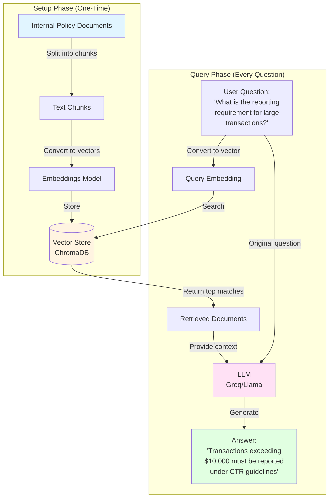
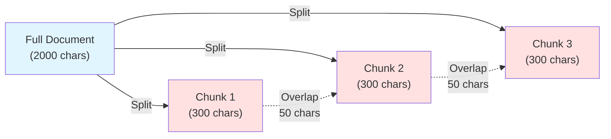
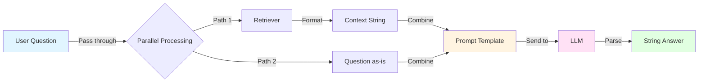
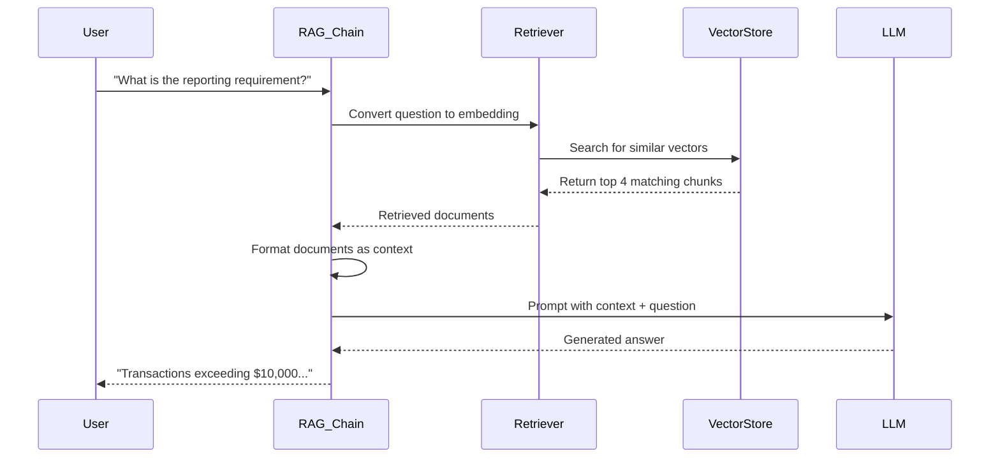

# Lab 2.1: RAG Fundamentals - Complete Guide

**Level:** 100-200 (Beginner to Intermediate)  
**Duration:** 45-60 minutes  
**Prerequisites:** Basic Python knowledge, understanding of APIs

---

## Table of Contents
1. [What is RAG?](#what-is-rag)
2. [Core Concepts](#core-concepts)
3. [Architecture Overview](#architecture-overview)
4. [Step-by-Step Implementation](#step-by-step-implementation)
5. [How It Works](#how-it-works)
6. [Key Takeaways](#key-takeaways)
7. [Troubleshooting](#troubleshooting)

---

## What is RAG?

**RAG (Retrieval-Augmented Generation)** is a technique that enhances Large Language Models (LLMs) by giving them access to external knowledge sources.

### The Problem RAG Solves

Imagine you're building a chatbot for Wells Fargo employees. The LLM knows general information, but it doesn't know:
- Your company's specific policies
- Recent policy updates
- Internal procedures

**Without RAG:** The LLM might hallucinate (make up) answers or say "I don't know."

**With RAG:** The system retrieves relevant documents first, then uses them to generate accurate, grounded answers.

### Real-World Analogy

Think of RAG like an open-book exam:
- **Without RAG:** You rely only on what you memorized (the LLM's training data)
- **With RAG:** You can reference your textbook (external documents) to find accurate answers

---

## Core Concepts

### 1. Vector Embeddings

**What are they?**  
Embeddings convert text into numerical vectors (arrays of numbers) that capture semantic meaning.

**Why do we need them?**  
Computers can't understand "similar meaning" directly. Embeddings allow us to measure similarity mathematically.

```
Example:
"What is the credit score requirement?" → [0.2, 0.8, 0.1, ...]
"Tell me about credit scores"          → [0.3, 0.7, 0.2, ...]
                                          ↑ These vectors are close in space!
```

### 2. Vector Store (ChromaDB)

A specialized database that:
- Stores document chunks with their embeddings
- Performs fast similarity searches
- Returns the most relevant documents for a query

### 3. Retriever

The component that:
1. Takes your question
2. Converts it to an embedding
3. Searches the vector store
4. Returns the top matching documents

### 4. LLM (Large Language Model)

The AI that generates the final answer using:
- Your question
- The retrieved documents (context)
- Its general knowledge

---

## Architecture Overview



---

## Step-by-Step Implementation

### Step 1: Install Dependencies

```python
%pip install -qU langchain langchain-groq langchain-community \
    langchain-huggingface chromadb sentence-transformers
```

**What each library does:**
- `langchain`: Framework for building LLM applications
- `langchain-groq`: Integration with Groq's fast LLM API
- `langchain-huggingface`: Embeddings from HuggingFace models
- `chromadb`: Vector database for storing embeddings
- `sentence-transformers`: Pre-trained models for creating embeddings

### Step 2: Setup API Keys

```python
import getpass
import os

if "GROQ_API_KEY" not in os.environ:
    os.environ["GROQ_API_KEY"] = getpass.getpass("Enter your Groq API Key: ")
```

**Why Groq?**  
Groq provides extremely fast inference (response generation), making it ideal for interactive applications.

### Step 3: Load Documents

```python
from langchain_core.documents import Document

banking_policy_text = """
Wells Fargo Internal Policy: Secure Access & Data Protection
...
"""

docs = [Document(page_content=banking_policy_text, 
                 metadata={"source": "internal_policy_doc"})]
```

**Key Points:**
- In production, you'd load from PDFs, databases, or APIs
- Metadata helps track where information came from
- Documents can be any text: policies, manuals, FAQs, etc.

### Step 4: Split Text into Chunks

```python
from langchain_text_splitters import RecursiveCharacterTextSplitter

text_splitter = RecursiveCharacterTextSplitter(
    chunk_size=300,
    chunk_overlap=50
)
splits = text_splitter.split_documents(docs)
```

**Why split?**
- LLMs have context limits
- Smaller chunks = more precise retrieval
- Overlap ensures context isn't lost at boundaries



### Step 5: Create Embeddings and Vector Store

```python
from langchain_huggingface import HuggingFaceEmbeddings
from langchain_community.vectorstores import Chroma

# Initialize embeddings model
embeddings = HuggingFaceEmbeddings(model_name="all-MiniLM-L6-v2")

# Create vector store
vectorstore = Chroma.from_documents(
    documents=splits,
    embedding=embeddings
)

retriever = vectorstore.as_retriever()
```

**What happens here:**
1. Each chunk is converted to a 384-dimensional vector
2. Vectors are stored in ChromaDB with their original text
3. The retriever interface makes it easy to search

### Step 6: Test the Retriever

```python
question = "What is the reporting requirement for large transactions?"
retrieved_docs = retriever.invoke(question)

for i, doc in enumerate(retrieved_docs):
    print(f"[Document {i+1}]")
    print(doc.page_content)
```

**What to observe:**
- The retriever returns the most relevant chunks
- You can see what context will be sent to the LLM
- This helps debug if answers are wrong

### Step 7: Create the RAG Chain

```python
from langchain_groq import ChatGroq
from langchain_core.prompts import ChatPromptTemplate
from langchain_core.output_parsers import StrOutputParser
from langchain_core.runnables import RunnablePassthrough

# Initialize LLM
llm = ChatGroq(
    model="qwen/qwen3-32b",
    temperature=0,
    reasoning_format="parsed"
)

# System prompt
system_prompt = (
    "You are a Wells Fargo internal banking assistant. "
    "Use the following pieces of retrieved banking regulations to answer "
    "the question. If you don't know the answer, say that you "
    "don't know. Use three sentences maximum and keep the "
    "answer professional and concise."
    "\n\n"
    "{context}"
)

prompt = ChatPromptTemplate.from_messages([
    ("system", system_prompt),
    ("human", "{input}"),
])

def format_docs(docs):
    return "\n\n".join(doc.page_content for doc in docs)

# Create the chain
rag_chain = (
    {"context": retriever | format_docs, "input": RunnablePassthrough()}
    | prompt
    | llm
    | StrOutputParser()
)
```

**Understanding the Chain:**



### Step 8: Query the System

```python
question = "What is the reporting requirement for large transactions?"
response = rag_chain.invoke(question)
print("Answer:", response)
```

**Expected Output:**
```
Answer: Any transaction exceeding $10,000 must be reported under the 
Currency Transaction Report (CTR) guidelines. This is a mandatory 
requirement for all Wells Fargo employees handling customer transactions.
```

---

## How It Works

### The Complete Flow



### Why This Works

1. **Semantic Search:** The retriever finds documents based on meaning, not just keywords
2. **Grounded Answers:** The LLM bases its response on actual documents, reducing hallucinations
3. **Scalability:** You can add thousands of documents without retraining the LLM
4. **Freshness:** Update documents anytime to reflect new policies

---

## Key Takeaways

### What You Learned

✅ **RAG Architecture:** How retrieval and generation work together  
✅ **Vector Embeddings:** Converting text to searchable numerical representations  
✅ **Document Processing:** Splitting and storing documents efficiently  
✅ **LangChain Chains:** Building modular, reusable AI workflows  
✅ **Prompt Engineering:** Crafting effective system prompts

### Best Practices

1. **Chunk Size Matters:** Too small = loss of context; too large = less precise retrieval
2. **Test Retrieval First:** Always check what documents are being retrieved
3. **Clear System Prompts:** Tell the LLM exactly how to behave
4. **Metadata is Useful:** Track sources for citations and debugging
5. **Temperature = 0:** For factual answers, use low temperature to reduce randomness

### Common Pitfalls

❌ **Not testing retrieval:** You might be retrieving irrelevant documents  
❌ **Vague prompts:** The LLM won't know how to use the context  
❌ **Too many chunks:** Overwhelming the LLM with too much context  
❌ **No source tracking:** Can't verify where answers came from

---

## Troubleshooting

### Issue: "No relevant documents found"

**Cause:** Query and documents use different terminology  
**Solution:** 
- Add synonyms to your documents
- Use a better embedding model
- Adjust chunk size

### Issue: "Answer doesn't match documents"

**Cause:** LLM is using its training data instead of context  
**Solution:**
- Strengthen the system prompt: "ONLY use the provided context"
- Increase temperature to 0
- Use a more instruction-following model

### Issue: "Slow responses"

**Cause:** Large documents or slow embedding model  
**Solution:**
- Use a faster embedding model (e.g., all-MiniLM-L6-v2)
- Reduce number of retrieved chunks
- Use Groq for faster LLM inference

### Issue: "Out of memory"

**Cause:** Too many documents or large embedding model  
**Solution:**
- Process documents in batches
- Use a smaller embedding model
- Increase system RAM or use cloud services

---

## Next Steps

After completing this lab, you should:

1. **Experiment:** Try different chunk sizes and see how it affects answers
2. **Add Documents:** Load your own PDFs or text files
3. **Improve Prompts:** Refine the system prompt for better answers
4. **Move to Lab 2.2:** Learn how to maintain conversation history

---

## Additional Resources

- [LangChain Documentation](https://python.langchain.com/docs/get_started/introduction)
- [ChromaDB Guide](https://docs.trychroma.com/)
- [Understanding Embeddings](https://platform.openai.com/docs/guides/embeddings)
- [Groq API Documentation](https://console.groq.com/docs/quickstart)

---

**Questions?** Review the notebook cells and experiment with different inputs to deepen your understanding!
