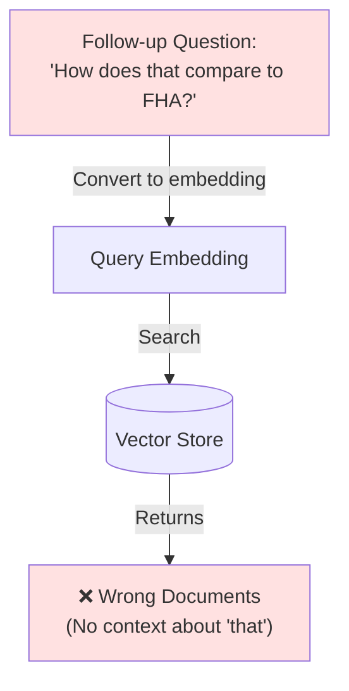
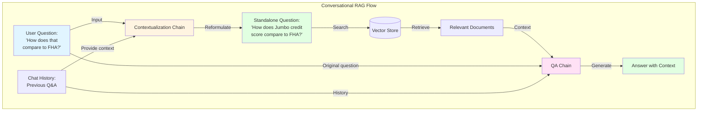
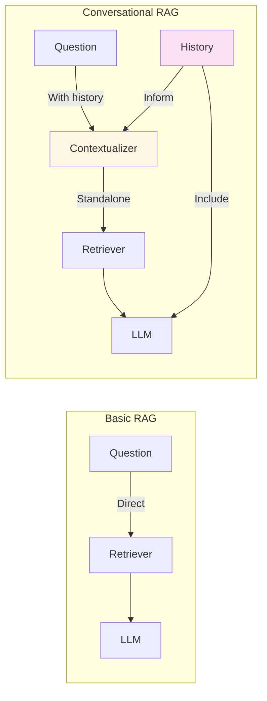
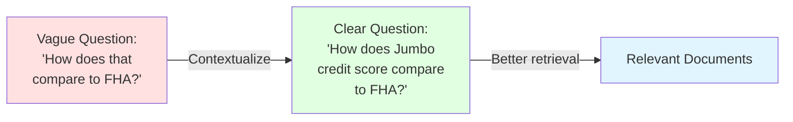
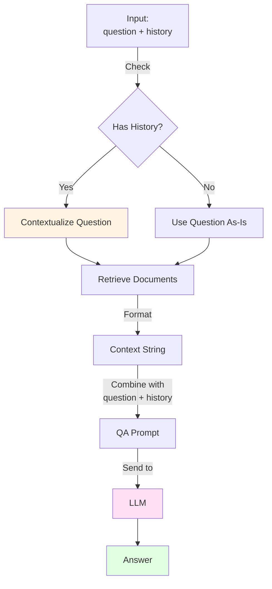
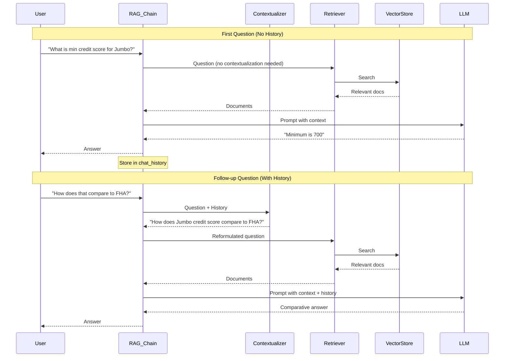
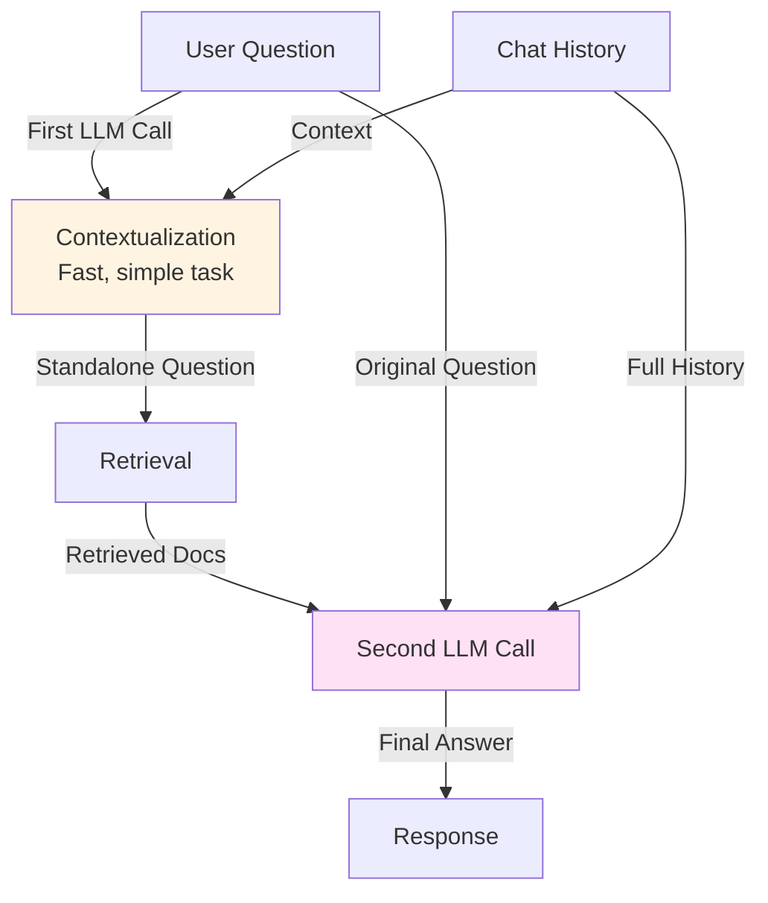

# Lab 2.2: Conversational RAG - Complete Guide

**Level:** 100-200 (Beginner to Intermediate)  
**Duration:** 45-60 minutes  
**Prerequisites:** Completion of Lab 2.1 (RAG Basics)

---

## Table of Contents
1. [What is Conversational RAG?](#what-is-conversational-rag)
2. [The Challenge](#the-challenge)
3. [Core Concepts](#core-concepts)
4. [Architecture Overview](#architecture-overview)
5. [Step-by-Step Implementation](#step-by-step-implementation)
6. [How It Works](#how-it-works)
7. [Key Takeaways](#key-takeaways)
8. [Troubleshooting](#troubleshooting)

---

## What is Conversational RAG?

**Conversational RAG** extends basic RAG by maintaining conversation history, allowing users to ask follow-up questions that reference previous exchanges.

### Real-World Use Case

Imagine a Wells Fargo loan officer using a policy assistant:

**Without Conversation Memory:**
```
Officer: "What is the min credit score for a Jumbo loan?"
AI: "700 for LTV up to 80%"

Officer: "How does that compare to FHA?"
AI: "I don't understand. Compare what to FHA?"  ❌
```

**With Conversation Memory:**
```
Officer: "What is the min credit score for a Jumbo loan?"
AI: "700 for LTV up to 80%"

Officer: "How does that compare to FHA?"
AI: "FHA loans require a minimum credit score of 580, which is 
     significantly lower than the 700 required for Jumbo loans." ✅
```

---

## The Challenge

### Problem: Context-Dependent Questions

When users ask follow-up questions, they often use pronouns or implicit references:
- "How does **that** compare to FHA?" (What is "that"?)
- "What about **their** down payment?" (Whose down payment?)
- "Is **it** required?" (What is "it"?)

### Why Basic RAG Fails



The vector store doesn't know what "that" refers to because it only sees the current question!

---

## Core Concepts

### 1. Chat History

A list of previous messages in the conversation:

```python
chat_history = [
    HumanMessage(content="What is the min credit score for Jumbo?"),
    AIMessage(content="The minimum is 700."),
    HumanMessage(content="How does that compare to FHA?"),
    AIMessage(content="FHA requires 580, which is lower.")
]
```

### 2. History-Aware Retriever

A component that:
1. Takes the chat history + current question
2. Reformulates the question to be standalone
3. Uses the reformulated question for retrieval

**Example Transformation:**
```
Input:  "How does that compare to FHA?"
Output: "How does the minimum credit score for Jumbo loans 
         compare to FHA loans?"
```

### 3. Contextualization Chain

An LLM-powered chain that rewrites questions using conversation context.

---

## Architecture Overview



### Comparison: Basic RAG vs Conversational RAG



---

## Step-by-Step Implementation

### Step 1: Setup (Same as Lab 2.1)

```python
# Install dependencies
%pip install -qU langchain langchain-groq langchain-community \
    langchain-huggingface chromadb sentence-transformers

# Setup API key
import getpass
import os

if "GROQ_API_KEY" not in os.environ:
    os.environ["GROQ_API_KEY"] = getpass.getpass("Enter your Groq API Key: ")
```

### Step 2: Load Mortgage Policy Documents

```python
from langchain_core.documents import Document
from langchain_text_splitters import RecursiveCharacterTextSplitter
from langchain_huggingface import HuggingFaceEmbeddings
from langchain_community.vectorstores import Chroma

# Load policy text (Conforming, Jumbo, FHA, VA loans)
banking_policy_text = """
Wells Fargo Mortgage Lending Guidelines...
"""

docs = [Document(page_content=banking_policy_text, 
                 metadata={"source": "internal_policy_doc"})]

# Split and embed
text_splitter = RecursiveCharacterTextSplitter(chunk_size=500, chunk_overlap=50)
splits = text_splitter.split_documents(docs)

embeddings = HuggingFaceEmbeddings(model_name="all-MiniLM-L6-v2")
vectorstore = Chroma.from_documents(documents=splits, embedding=embeddings)
retriever = vectorstore.as_retriever()
```

### Step 3: Create Contextualization Chain

This is the **key difference** from basic RAG!

```python
from langchain_groq import ChatGroq
from langchain_core.prompts import ChatPromptTemplate, MessagesPlaceholder
from langchain_core.output_parsers import StrOutputParser

# Initialize LLM
llm = ChatGroq(
    model="qwen/qwen3-32b",
    temperature=0,
    reasoning_format="parsed"
)

# Prompt for reformulating questions
contextualize_q_system_prompt = (
    "Given a chat history and the latest user question "
    "which might reference context in the chat history, "
    "formulate a standalone question which can be understood "
    "without the chat history. Do NOT answer the question, "
    "just reformulate it if needed and otherwise return it as is."
)

contextualize_q_prompt = ChatPromptTemplate.from_messages([
    ("system", contextualize_q_system_prompt),
    MessagesPlaceholder("chat_history"),
    ("human", "{input}"),
])

# Chain to rephrase questions
contextualize_q_chain = contextualize_q_prompt | llm | StrOutputParser()
```

**Understanding MessagesPlaceholder:**
- It's a special placeholder for a list of messages
- Allows dynamic insertion of chat history
- Maintains the conversation structure

### Step 4: Test Contextualization

Let's see how it works in isolation:

```python
from langchain_core.messages import HumanMessage, AIMessage

# Simulate a conversation
sample_history = [
    HumanMessage(content="What is the min credit score for a Jumbo Loan?"),
    AIMessage(content="The minimum credit score is 700.")
]

# User asks a follow-up
sample_input = "How does that compare to FHA?"

# Reformulate
rephrased_query = contextualize_q_chain.invoke({
    "chat_history": sample_history, 
    "input": sample_input
})

print(f"Original: {sample_input}")
print(f"Rephrased: {rephrased_query}")
```

**Expected Output:**
```
Original: How does that compare to FHA?
Rephrased: How does the minimum credit score for Jumbo loans 
           compare to FHA loans?
```

**Why This Matters:**



### Step 5: Create QA Chain with History

```python
from langchain_core.runnables import RunnablePassthrough

def format_docs(docs):
    return "\n\n".join(doc.page_content for doc in docs)

qa_system_prompt = (
    "You are a specialized Mortgage Policy Assistant for Wells Fargo. "
    "Use the following pieces of retrieved policy context to answer "
    "the loan officer's question. If you don't know the answer, say that you "
    "cannot find it in the policy. Keep answers professional and concise."
    "\n\n"
    "{context}"
)

qa_prompt = ChatPromptTemplate.from_messages([
    ("system", qa_system_prompt),
    MessagesPlaceholder("chat_history"),
    ("human", "{input}"),
])

def contextualized_question(input: dict):
    """Apply contextualization only if there's chat history"""
    if input.get("chat_history"):
        return contextualize_q_chain
    else:
        return input.get("input")

# Complete RAG chain
rag_chain = (
    RunnablePassthrough.assign(
        context=contextualized_question | retriever | format_docs
    )
    | qa_prompt
    | llm
    | StrOutputParser()
)
```

**Understanding the Chain:**



### Step 6: Run a Conversation

```python
from langchain_core.messages import HumanMessage, AIMessage

chat_history = []

# First question
user_input = "What is the minimum credit score for a Jumbo Loan?"
print(f"User: {user_input}")

answer = rag_chain.invoke({"input": user_input, "chat_history": chat_history})
print(f"AI: {answer}")

# Update history
chat_history.extend([
    HumanMessage(content=user_input), 
    AIMessage(content=answer)
])

# Follow-up question
print("\n--- Follow up ---")
user_input = "How does that compare to FHA loans?"
print(f"User: {user_input}")

answer = rag_chain.invoke({"input": user_input, "chat_history": chat_history})
print(f"AI: {answer}")

# Update history again
chat_history.extend([
    HumanMessage(content=user_input), 
    AIMessage(content=answer)
])
```

**Expected Output:**
```
User: What is the minimum credit score for a Jumbo Loan?
AI: The minimum credit score for a Jumbo Loan is 700 for LTV up to 80%, 
    and 720 for LTV up to 90%.

--- Follow up ---
User: How does that compare to FHA loans?
AI: FHA loans have a significantly lower minimum credit score requirement. 
    They require 580 for a 3.5% down payment, or 500-579 for a 10% down 
    payment. This is much more accessible than Jumbo loans.
```

---

## How It Works

### The Complete Conversation Flow



### Why Two LLM Calls?

You might wonder: "Why call the LLM twice?"



**Answer:**
1. **First call (Contextualizer):** Quick, focused task - just reformulate the question
2. **Second call (QA):** Complex task - synthesize information from documents and history

This separation makes the system more reliable and easier to debug.

---

## Key Takeaways

### What You Learned

✅ **Conversation Memory:** Maintaining chat history for context  
✅ **Question Reformulation:** Converting context-dependent questions to standalone queries  
✅ **History-Aware Retrieval:** Improving document retrieval with conversation context  
✅ **MessagesPlaceholder:** Dynamic insertion of conversation history in prompts  
✅ **Stateful Applications:** Building systems that remember previous interactions

### Best Practices

1. **Always Test Contextualization:** Print the reformulated question to verify it makes sense
2. **Limit History Length:** Too much history can overwhelm the LLM (keep last 5-10 exchanges)
3. **Clear Separation:** Keep contextualization and QA as separate steps
4. **Metadata Tracking:** Store timestamps and user IDs with messages
5. **Graceful Degradation:** Handle cases where history is empty

### When to Use Conversational RAG

✅ **Good Use Cases:**
- Customer support chatbots
- Internal knowledge assistants
- Educational tutors
- Policy Q&A systems

❌ **Not Ideal For:**
- One-off queries (use basic RAG)
- Batch processing
- When users don't ask follow-ups

---

## Troubleshooting

### Issue: "Contextualization doesn't work"

**Symptoms:** Follow-up questions still fail  
**Causes:**
- History not being passed correctly
- Contextualization prompt too vague

**Solutions:**
```python
# Debug: Print the reformulated question
rephrased = contextualize_q_chain.invoke({
    "chat_history": chat_history,
    "input": user_input
})
print(f"Rephrased: {rephrased}")  # Check if it makes sense
```

### Issue: "Answers ignore previous context"

**Symptoms:** AI doesn't reference earlier conversation  
**Causes:**
- History not included in QA prompt
- Missing MessagesPlaceholder

**Solutions:**
```python
# Ensure MessagesPlaceholder is in QA prompt
qa_prompt = ChatPromptTemplate.from_messages([
    ("system", qa_system_prompt),
    MessagesPlaceholder("chat_history"),  # ← Must be here!
    ("human", "{input}"),
])
```

### Issue: "Memory grows too large"

**Symptoms:** Slow responses, high costs  
**Causes:**
- Storing entire conversation history

**Solutions:**
```python
# Keep only last N exchanges
MAX_HISTORY = 10
chat_history = chat_history[-(MAX_HISTORY * 2):]  # *2 for Q&A pairs
```

### Issue: "Contextualization is slow"

**Symptoms:** Noticeable delay before answer  
**Causes:**
- Using a slow LLM for contextualization

**Solutions:**
- Use a faster model for contextualization (e.g., Groq)
- Cache common reformulations
- Skip contextualization for simple questions

---

## Advanced Patterns

### Pattern 1: Conversation Summarization

For very long conversations, summarize older messages:

```python
def summarize_old_history(history, keep_recent=4):
    """Keep recent messages, summarize older ones"""
    if len(history) <= keep_recent:
        return history
    
    old_messages = history[:-keep_recent]
    recent_messages = history[-keep_recent:]
    
    # Use LLM to summarize old messages
    summary = llm.invoke(f"Summarize this conversation: {old_messages}")
    
    return [SystemMessage(content=f"Previous context: {summary}")] + recent_messages
```

### Pattern 2: Selective Contextualization

Only contextualize when needed:

```python
def needs_contextualization(question: str) -> bool:
    """Check if question has pronouns or references"""
    pronouns = ["that", "it", "this", "they", "them", "those", "these"]
    return any(pronoun in question.lower() for pronoun in pronouns)

# In your chain
if needs_contextualization(user_input) and chat_history:
    question = contextualize_q_chain.invoke(...)
else:
    question = user_input
```

---

## Next Steps

After completing this lab, you should:

1. **Experiment:** Try multi-turn conversations with complex follow-ups
2. **Add Features:** Implement conversation summarization
3. **Optimize:** Measure and reduce latency
4. **Move to Lab 2.3:** Learn about LangGraph for more complex workflows

---

## Additional Resources

- [LangChain Chat History](https://python.langchain.com/docs/modules/memory/)
- [Conversational RAG Tutorial](https://python.langchain.com/docs/tutorials/qa_chat_history/)
- [Message Types in LangChain](https://python.langchain.com/docs/modules/model_io/chat/message_types/)

---

**Questions?** Try modifying the contextualization prompt or experiment with different conversation flows!
