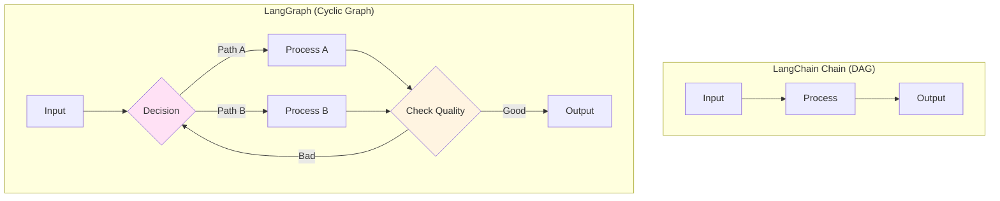
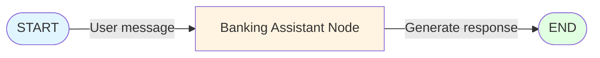
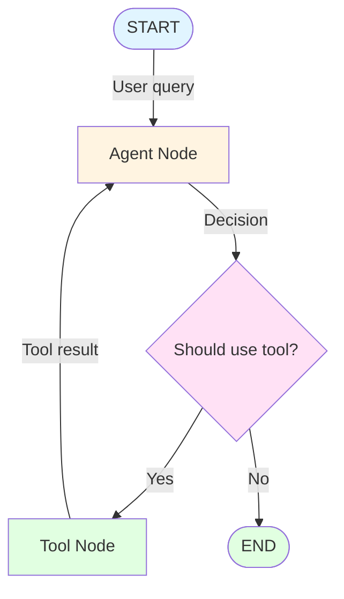
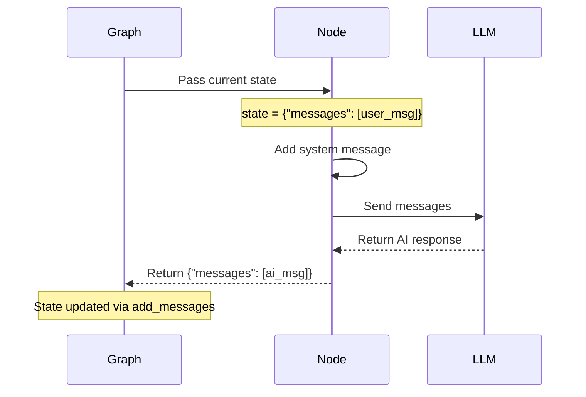
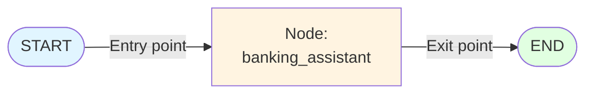
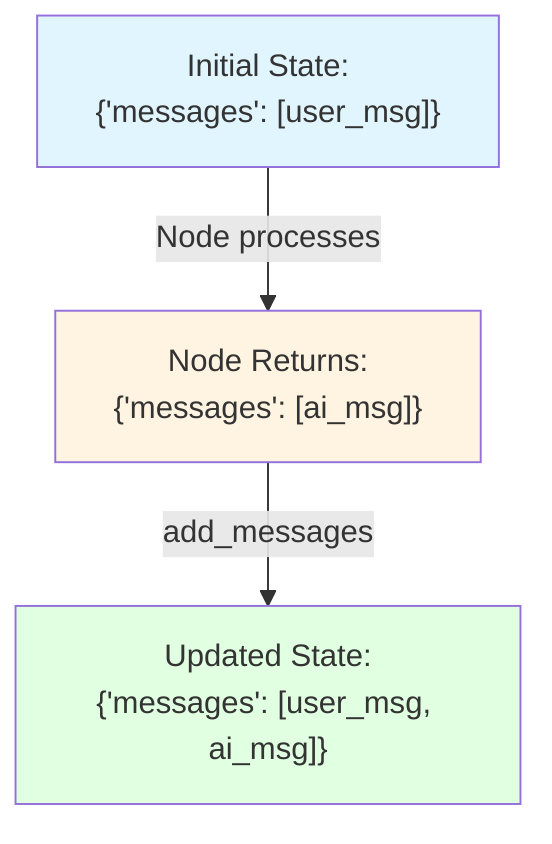
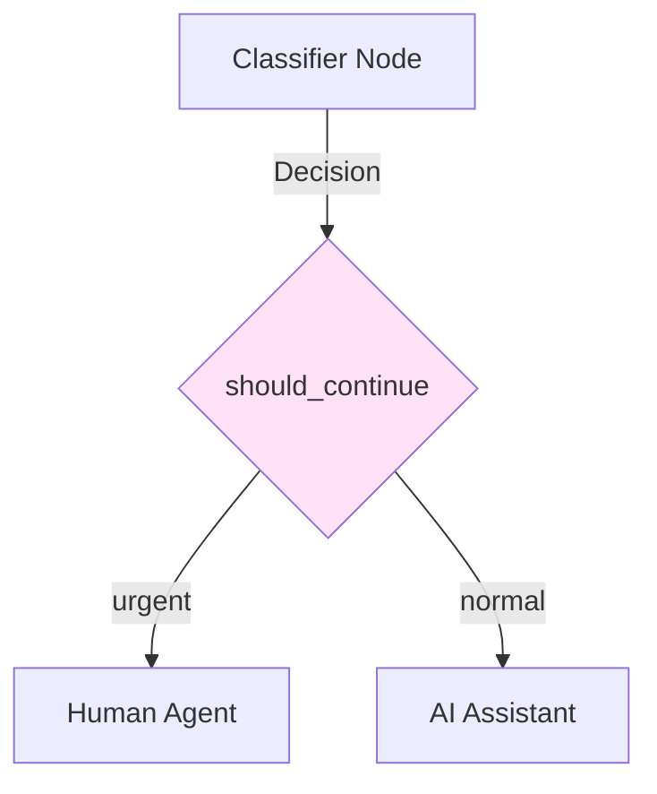
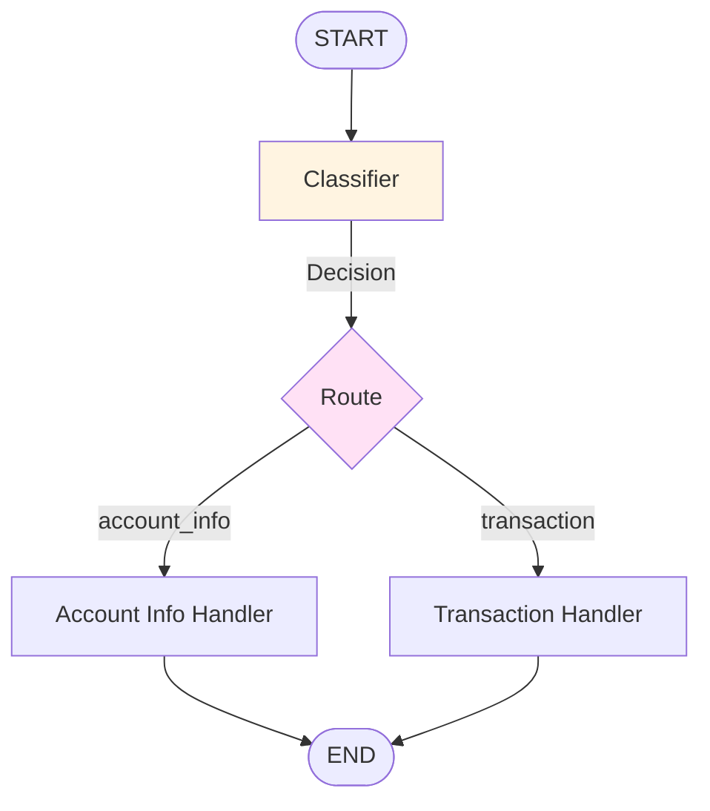

# Lab 2.3: Introduction to LangGraph - Complete Guide

**Level:** 100-200 (Beginner to Intermediate)  
**Duration:** 45-60 minutes  
**Prerequisites:** Completion of Labs 2.1 and 2.2

---

## Table of Contents
1. [What is LangGraph?](#what-is-langgraph)
2. [Why LangGraph?](#why-langgraph)
3. [Core Concepts](#core-concepts)
4. [Architecture Overview](#architecture-overview)
5. [Step-by-Step Implementation](#step-by-step-implementation)
6. [How It Works](#how-it-works)
7. [Key Takeaways](#key-takeaways)
8. [Troubleshooting](#troubleshooting)

---

## What is LangGraph?

**LangGraph** is a library for building stateful, multi-actor applications with LLMs. It extends LangChain by adding:
- **Cycles/Loops:** Ability to revisit nodes (impossible in standard chains)
- **State Management:** Shared state that persists across steps
- **Conditional Routing:** Dynamic decision-making about next steps
- **Human-in-the-Loop:** Pause for human approval or input

### Real-World Analogy

Think of LangGraph like a **workflow engine**:

**LangChain (Linear Chain):**
```
Step 1 → Step 2 → Step 3 → Done
```
Like following a recipe exactly as written.

**LangGraph (Graph):**
```
        ┌─→ Step 2 ─→ Step 4 ─┐
Start ──┤                      ├─→ End
        └─→ Step 3 ─→ Step 5 ─┘
                ↑         ↓
                └─────────┘ (Loop back if needed)
```
Like a choose-your-own-adventure book with loops.

---

## Why LangGraph?

### Limitations of LangChain Chains

LangChain chains are **Directed Acyclic Graphs (DAGs)**:
- ✅ Great for linear workflows
- ❌ Cannot loop back to previous steps
- ❌ Hard to implement complex decision logic
- ❌ Difficult to add human approval steps

### What LangGraph Enables



**Use Cases:**
- **Agents:** Systems that can use tools and make decisions
- **Multi-step reasoning:** Break down complex problems
- **Self-correction:** Retry failed steps
- **Human oversight:** Pause for approval before critical actions

---

## Core Concepts

### 1. State

A **shared data structure** that flows through the graph and gets updated by nodes.

```python
from typing import Annotated
from typing_extensions import TypedDict
from langgraph.graph.message import add_messages

class State(TypedDict):
    messages: Annotated[list, add_messages]
```

**Key Points:**
- `TypedDict`: Defines the structure of your state
- `Annotated[list, add_messages]`: Special annotation that tells LangGraph to **append** new messages instead of replacing them
- State is passed to every node and updated as the graph executes

**Analogy:** State is like a shared whiteboard that all team members can read and write to.

### 2. Nodes

**Functions** that:
- Accept the current state as input
- Perform some operation (call LLM, use tool, etc.)
- Return updates to the state

```python
def my_node(state: State) -> dict:
    # Do something with state
    result = process(state["messages"])
    # Return updates
    return {"messages": [result]}
```

**Important:** Nodes return a **dictionary** with keys matching the state structure.

### 3. Edges

**Connections** between nodes that define the flow:

**Standard Edge:** Always go from Node A to Node B
```python
graph.add_edge("node_a", "node_b")
```

**Conditional Edge:** Decide next node based on state
```python
def route(state):
    if state["score"] > 0.8:
        return "high_quality"
    else:
        return "needs_improvement"

graph.add_conditional_edges("checker", route)
```

### 4. Special Nodes

- `START`: Entry point of the graph
- `END`: Exit point of the graph

---

## Architecture Overview

### Simple Banking Assistant Graph



### More Complex Example: Agent with Tools



---

## Step-by-Step Implementation

### Step 1: Install Dependencies

```python
%pip install -qU langchain-groq langchain-community langgraph
```

**What's included:**
- `langgraph`: The graph framework
- `langchain-groq`: LLM integration
- `langchain-community`: Additional utilities

### Step 2: Setup API Keys

```python
import getpass
import os

if "GROQ_API_KEY" not in os.environ:
    os.environ["GROQ_API_KEY"] = getpass.getpass("Enter your Groq API Key: ")
```

### Step 3: Define the State

```python
from typing import Annotated
from typing_extensions import TypedDict
from langgraph.graph.message import add_messages

class State(TypedDict):
    messages: Annotated[list, add_messages]
```

**Understanding `add_messages`:**

```mermaid
graph LR
    A["State:<br/>[msg1, msg2]"] -->|Node returns<br/>[msg3]| B[add_messages<br/>function]
    B -->|Appends| C["New State:<br/>[msg1, msg2, msg3]"]
    
    style B fill:#fff4e1
```

Without `add_messages`, the new message would **replace** the old ones!

### Step 4: Initialize the LLM

```python
from langchain_groq import ChatGroq

llm = ChatGroq(
    model="qwen/qwen3-32b",
    temperature=0,
    reasoning_format="parsed"
)
```

### Step 5: Define the Node Function

```python
from langchain_core.messages import SystemMessage

def banking_assistant(state: State):
    """
    Node function that processes the current state and returns updates.
    """
    # Add system message to enforce banking persona
    system_message = SystemMessage(
        content="You are a helpful customer service representative for Wells Fargo. "
                "You assist customers with their banking inquiries. "
                "Be professional and friendly."
    )
    
    # Combine system message with conversation history
    messages = [system_message] + state["messages"]
    
    # Call the LLM
    response = llm.invoke(messages)
    
    # Return updates to state
    # The key "messages" matches our State definition
    return {"messages": [response]}
```

**What happens here:**



### Step 6: Test the Node in Isolation

Before building the graph, test the node:

```python
from langchain_core.messages import HumanMessage

# Create dummy state
dummy_state = {
    "messages": [HumanMessage(content="Hello, can you help me?")]
}

# Run the node
response = banking_assistant(dummy_state)

# Check output
print("Node Output:", response["messages"][-1].content)
```

**Expected Output:**
```
Node Output: Hello! Of course, I'd be happy to help you. 
What banking question or concern do you have today?
```

**Why test in isolation?**
- Easier to debug
- Faster iteration
- Understand what each component does

### Step 7: Build the Graph

```python
from langgraph.graph import StateGraph, START, END

# Initialize graph builder
graph_builder = StateGraph(State)

# Add nodes
graph_builder.add_node("banking_assistant", banking_assistant)

# Define edges (flow)
graph_builder.add_edge(START, "banking_assistant")
graph_builder.add_edge("banking_assistant", END)

# Compile into runnable
graph = graph_builder.compile()
```

**Understanding the Graph Structure:**



**What `compile()` does:**
- Validates the graph structure
- Creates an executable workflow
- Optimizes the execution path

### Step 8: Visualize the Graph (Optional)

```python
from IPython.display import Image, display

try:
    display(Image(graph.get_graph().draw_mermaid_png()))
except Exception:
    print("Visualization requires additional dependencies")
```

This generates a visual representation of your graph structure.

### Step 9: Run the Graph

```python
user_input = "What are the daily withdrawal limits for a standard checking account?"

print(f"User: {user_input}")
print("Processing...")

# Stream the execution
for event in graph.stream({"messages": [("user", user_input)]}):
    for value in event.values():
        print("Assistant:", value["messages"][-1].content)
```

**Expected Output:**
```
User: What are the daily withdrawal limits for a standard checking account?
Processing...
Assistant: For a standard Wells Fargo checking account, the daily ATM 
withdrawal limit is typically $300-$500, depending on your account type. 
The daily debit card purchase limit is usually $1,500-$3,000. You can 
request to increase these limits by contacting customer service.
```

---

## How It Works

### Execution Flow

```mermaid
sequenceDiagram
    participant User
    participant Graph
    participant START
    participant Node
    participant END
    
    User->>Graph: stream({"messages": [user_msg]})
    Graph->>START: Initialize with input
    START->>Node: Pass state
    Note over Node: state = {"messages": [user_msg]}
    Node->>Node: Process (call LLM)
    Node-->>Graph: Return {"messages": [ai_msg]}
    Graph->>Graph: Update state via add_messages
    Note over Graph: state = {"messages": [user_msg, ai_msg]}
    Graph->>END: Final state
    END-->>User: Stream events
```

### State Updates



### Why Use `.stream()`?

```python
# Option 1: Get final result only
result = graph.invoke({"messages": [("user", "Hello")]})

# Option 2: Stream intermediate steps
for event in graph.stream({"messages": [("user", "Hello")]}):
    print(event)  # See each node's output
```

**Benefits of streaming:**
- See progress in real-time
- Debug intermediate steps
- Provide user feedback during long operations

---

## Key Takeaways

### What You Learned

✅ **Graph-Based Workflows:** Building applications as graphs instead of linear chains  
✅ **State Management:** Maintaining shared state across nodes  
✅ **Node Functions:** Creating reusable processing units  
✅ **Graph Compilation:** Converting graph definitions into executable workflows  
✅ **Streaming Execution:** Observing graph execution in real-time

### LangGraph vs LangChain

| Feature | LangChain | LangGraph |
|---------|-----------|-----------|
| **Structure** | Linear chains (DAG) | Cyclic graphs |
| **Loops** | ❌ Not possible | ✅ Supported |
| **Conditional Logic** | Limited | ✅ Flexible |
| **State Management** | Implicit | ✅ Explicit |
| **Human-in-Loop** | Difficult | ✅ Built-in |
| **Best For** | Simple workflows | Complex agents |

### When to Use LangGraph

✅ **Use LangGraph when you need:**
- Loops or cycles in your workflow
- Complex decision-making
- Multi-step reasoning with retries
- Human approval steps
- Agent-like behavior (tools + reasoning)

❌ **Stick with LangChain when:**
- Simple linear workflows
- One-shot queries
- No need for state persistence
- Rapid prototyping

---

## Advanced Patterns

### Pattern 1: Conditional Routing

```python
def should_continue(state: State) -> str:
    """Decide next node based on state"""
    last_message = state["messages"][-1]
    
    if "urgent" in last_message.content.lower():
        return "escalate"
    else:
        return "respond"

# Add conditional edge
graph_builder.add_conditional_edges(
    "classifier",
    should_continue,
    {
        "escalate": "human_agent",
        "respond": "ai_assistant"
    }
)
```

**Visualization:**



### Pattern 2: Loops with Max Iterations

```python
def should_retry(state: State) -> str:
    """Retry if quality is low, but limit attempts"""
    attempts = state.get("attempts", 0)
    quality = state.get("quality_score", 0)
    
    if quality < 0.8 and attempts < 3:
        return "retry"
    else:
        return "finish"

graph_builder.add_conditional_edges(
    "quality_check",
    should_retry,
    {
        "retry": "generator",  # Loop back
        "finish": END
    }
)
```

### Pattern 3: Multiple Nodes

```python
# Define multiple nodes
graph_builder.add_node("classifier", classify_intent)
graph_builder.add_node("account_info", handle_account_query)
graph_builder.add_node("transaction", handle_transaction)

# Route based on classification
def route_query(state: State) -> str:
    intent = state["intent"]
    return intent  # Returns "account_info" or "transaction"

graph_builder.add_conditional_edges(
    "classifier",
    route_query,
    {
        "account_info": "account_info",
        "transaction": "transaction"
    }
)

# Both end at END
graph_builder.add_edge("account_info", END)
graph_builder.add_edge("transaction", END)
```

**Visualization:**



---

## Troubleshooting

### Issue: "State not updating"

**Symptoms:** Node returns data but state doesn't change  
**Cause:** Return dictionary keys don't match State definition

**Solution:**
```python
# ❌ Wrong - key doesn't match
def my_node(state: State):
    return {"msgs": [new_message]}  # Should be "messages"

# ✅ Correct
def my_node(state: State):
    return {"messages": [new_message]}
```

### Issue: "Messages being replaced instead of appended"

**Symptoms:** Only seeing the latest message  
**Cause:** Missing `Annotated[list, add_messages]`

**Solution:**
```python
# ❌ Wrong
class State(TypedDict):
    messages: list  # Will replace!

# ✅ Correct
class State(TypedDict):
    messages: Annotated[list, add_messages]  # Will append!
```

### Issue: "Graph execution hangs"

**Symptoms:** Graph never reaches END  
**Cause:** Missing edge to END or infinite loop

**Solution:**
```python
# Check all paths lead to END
graph_builder.add_edge("last_node", END)  # Don't forget this!

# For loops, add max iteration check
def should_continue(state):
    if state.get("iterations", 0) > 10:
        return "end"  # Safety exit
    # ... rest of logic
```

### Issue: "Cannot visualize graph"

**Symptoms:** `draw_mermaid_png()` fails  
**Cause:** Missing graphviz or pygraphviz

**Solution:**
```bash
# macOS
brew install graphviz
pip install pygraphviz

# Linux
sudo apt-get install graphviz graphviz-dev
pip install pygraphviz
```

---

## Comparison: Chain vs Graph

### Example: Customer Support

**LangChain Approach (Linear):**
```python
chain = (
    classify_intent
    | route_to_handler
    | generate_response
)
```

**LangGraph Approach (Flexible):**
```python
graph_builder.add_node("classify", classify_intent)
graph_builder.add_node("simple", simple_handler)
graph_builder.add_node("complex", complex_handler)
graph_builder.add_node("escalate", escalate_to_human)

graph_builder.add_conditional_edges(
    "classify",
    route_based_on_intent,
    {
        "simple": "simple",
        "complex": "complex",
        "urgent": "escalate"
    }
)
```

**Benefits of Graph:**
- Can loop back if answer quality is low
- Can escalate to human mid-conversation
- Can use tools and retry on failure

---

## Next Steps

After completing this lab, you should:

1. **Experiment:** Add conditional edges to create branching logic
2. **Build an Agent:** Combine LangGraph with tools (search, calculator, etc.)
3. **Add Persistence:** Store state in a database for multi-session conversations
4. **Explore Checkpoints:** Implement human-in-the-loop approval

---

## Additional Resources

- [LangGraph Documentation](https://langchain-ai.github.io/langgraph/)
- [LangGraph Tutorials](https://langchain-ai.github.io/langgraph/tutorials/)
- [Building Agents with LangGraph](https://langchain-ai.github.io/langgraph/tutorials/introduction/)
- [LangGraph Examples](https://github.com/langchain-ai/langgraph/tree/main/examples)

---

**Questions?** Try building a more complex graph with multiple nodes and conditional routing!
