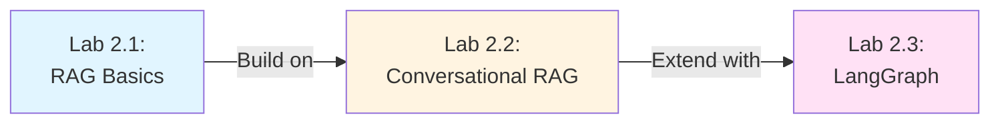
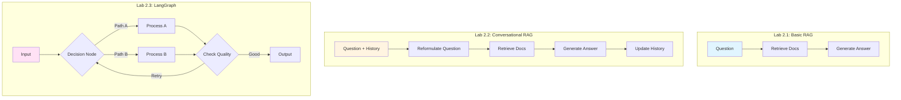
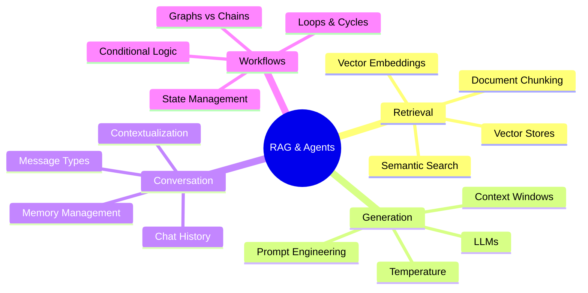

# Labs Day 2 - Workshop Overview

**Level:** 100-200 (Beginner to Intermediate)  
**Total Duration:** 2.5-3 hours  
**Target Audience:** Developers new to RAG and agentic AI systems

---

## Workshop Goals

By the end of this workshop, participants will:

1. ✅ Understand the fundamentals of Retrieval-Augmented Generation (RAG)
2. ✅ Build conversational AI systems that maintain context
3. ✅ Create stateful applications using graph-based workflows
4. ✅ Apply these concepts to real-world banking scenarios

---

## Workshop Structure



---

## Lab Summaries

### Lab 2.1: RAG Fundamentals
**Duration:** 45-60 minutes  
**Complexity:** ⭐⭐☆☆☆

**What You'll Build:**  
A Wells Fargo Internal Knowledge Assistant that answers employee questions about banking policies.

**Key Concepts:**
- Vector embeddings and semantic search
- Document chunking and storage
- Retrieval-augmented generation
- LangChain chains

**Technologies:**
- LLM: Groq (Llama 3)
- Embeddings: HuggingFace (sentence-transformers)
- Vector Store: ChromaDB
- Framework: LangChain

**Learning Outcomes:**
- How RAG solves the "knowledge gap" problem
- Converting text to searchable vectors
- Building retrieval pipelines
- Grounding LLM responses in documents

**Guide:** [Lab2_1_RAG_Basics_Guide.md](./Lab2_1_RAG_Basics_Guide.md)

---

### Lab 2.2: Conversational RAG
**Duration:** 45-60 minutes  
**Complexity:** ⭐⭐⭐☆☆

**What You'll Build:**  
A Mortgage Policy Assistant that maintains conversation context, allowing loan officers to ask follow-up questions.

**Key Concepts:**
- Chat history management
- Question reformulation
- History-aware retrieval
- Context-dependent queries

**Technologies:**
- Same stack as Lab 2.1
- Additional: MessagesPlaceholder for history

**Learning Outcomes:**
- Why basic RAG fails with follow-up questions
- Contextualizing queries using conversation history
- Building stateful conversational systems
- Managing chat memory efficiently

**Guide:** [Lab2_2_RAG_Conversational_Guide.md](./Lab2_2_RAG_Conversational_Guide.md)

---

### Lab 2.3: Introduction to LangGraph
**Duration:** 45-60 minutes  
**Complexity:** ⭐⭐⭐⭐☆

**What You'll Build:**  
A stateful banking assistant using graph-based workflows that can handle complex, multi-step interactions.

**Key Concepts:**
- State management in graphs
- Nodes and edges
- Conditional routing
- Cyclic workflows

**Technologies:**
- LangGraph for graph orchestration
- Groq for LLM inference
- State-based architecture

**Learning Outcomes:**
- Limitations of linear chains
- Building cyclic workflows
- Implementing conditional logic
- Creating agent-like systems

**Guide:** [Lab2_3_LangGraph_Intro_Guide.md](./Lab2_3_LangGraph_Intro_Guide.md)

---

## Conceptual Progression

### From Simple to Complex



---

## Prerequisites

### Required Knowledge
- Basic Python programming
- Understanding of APIs and HTTP requests
- Familiarity with JSON data structures
- Basic command-line usage

### Optional (Helpful)
- Experience with Jupyter notebooks
- Understanding of machine learning concepts
- Familiarity with LLMs (ChatGPT, Claude, etc.)

### Technical Requirements
- Python 3.8+
- Internet connection (for API calls)
- Groq API key (free tier available)
- 4GB+ RAM recommended

---

## Setup Instructions

### 1. Get API Keys

**Groq API Key (Required):**
1. Visit [https://console.groq.com](https://console.groq.com)
2. Sign up for a free account
3. Navigate to API Keys section
4. Create a new API key
5. Copy and save securely

### 2. Install Dependencies

```bash
# Create virtual environment (recommended)
python -m venv venv
source venv/bin/activate  # On Windows: venv\Scripts\activate

# Install all required packages
pip install langchain langchain-groq langchain-community \
    langchain-huggingface chromadb sentence-transformers \
    langgraph jupyter
```

### 3. Launch Jupyter

```bash
jupyter notebook
```

Navigate to the `labs-day-2` directory and open the first notebook.

---

## Workshop Flow

### Recommended Approach

1. **Read the Guide First** (10-15 min per lab)
   - Understand concepts before coding
   - Review diagrams and architecture
   - Note key takeaways

2. **Work Through Notebook** (30-40 min per lab)
   - Run cells sequentially
   - Experiment with parameters
   - Test with your own questions

3. **Complete Exercises** (5-10 min per lab)
   - Try suggested modifications
   - Debug any issues
   - Compare results

4. **Review and Reflect** (5 min per lab)
   - What worked well?
   - What was challenging?
   - How could you apply this?

---

## Key Concepts Map



---

## Common Challenges & Solutions

### Challenge 1: API Rate Limits
**Symptom:** Errors when making too many requests  
**Solution:** 
- Use Groq's free tier wisely
- Add delays between requests
- Cache responses when possible

### Challenge 2: Slow Embeddings
**Symptom:** Long wait times when creating vector store  
**Solution:**
- Use smaller embedding models (all-MiniLM-L6-v2)
- Process documents in batches
- Cache embeddings for reuse

### Challenge 3: Irrelevant Retrievals
**Symptom:** Retrieved documents don't match query  
**Solution:**
- Adjust chunk size (try 300-500 characters)
- Increase chunk overlap (50-100 characters)
- Use better embedding models
- Add metadata filters

### Challenge 4: Memory Issues
**Symptom:** System runs out of RAM  
**Solution:**
- Limit conversation history (keep last 10 exchanges)
- Use smaller models
- Process fewer documents at once
- Clear ChromaDB periodically

---

## Best Practices

### For RAG Systems

1. **Always Test Retrieval First**
   ```python
   # Before building full chain, test retrieval
   docs = retriever.invoke("test question")
   print(docs)  # Verify relevance
   ```

2. **Use Clear System Prompts**
   ```python
   system_prompt = (
       "You are a [specific role]. "
       "Use ONLY the provided context. "
       "If unsure, say 'I don't know'."
   )
   ```

3. **Track Sources**
   ```python
   # Add metadata to documents
   Document(
       page_content=text,
       metadata={"source": "policy.pdf", "page": 5}
   )
   ```

4. **Optimize Chunk Size**
   - Too small: Loss of context
   - Too large: Less precise retrieval
   - Sweet spot: 300-500 characters for most use cases

### For Conversational Systems

1. **Limit History Length**
   ```python
   MAX_HISTORY = 10
   chat_history = chat_history[-(MAX_HISTORY * 2):]
   ```

2. **Test Contextualization**
   ```python
   # Always verify reformulated questions
   print(f"Original: {user_input}")
   print(f"Reformulated: {standalone_question}")
   ```

3. **Handle Edge Cases**
   - Empty history
   - Very long conversations
   - Ambiguous pronouns

### For LangGraph Applications

1. **Test Nodes Independently**
   ```python
   # Test before adding to graph
   result = my_node(dummy_state)
   assert "expected_key" in result
   ```

2. **Add Safety Limits**
   ```python
   # Prevent infinite loops
   if state.get("iterations", 0) > MAX_ITERATIONS:
       return "end"
   ```

3. **Use Descriptive Node Names**
   ```python
   # ❌ Bad
   graph.add_node("n1", func1)
   
   # ✅ Good
   graph.add_node("classify_intent", classify_intent)
   ```

---

## Real-World Applications

### Banking & Finance
- ✅ Internal policy Q&A systems
- ✅ Loan officer assistants
- ✅ Compliance document search
- ✅ Customer support automation

### Healthcare
- ✅ Medical literature search
- ✅ Patient history analysis
- ✅ Treatment protocol assistants
- ✅ Insurance claim processing

### Legal
- ✅ Case law research
- ✅ Contract analysis
- ✅ Regulatory compliance
- ✅ Legal document drafting

### Education
- ✅ Personalized tutoring
- ✅ Course material Q&A
- ✅ Research assistants
- ✅ Curriculum planning

---

## Extending the Labs

### Ideas for Further Exploration

1. **Add More Data Sources**
   - Load PDFs, Word docs, web pages
   - Integrate with databases
   - Connect to APIs

2. **Implement Tool Use**
   - Calculator for financial computations
   - Web search for current information
   - Database queries for real-time data

3. **Add Authentication**
   - User-specific document access
   - Role-based permissions
   - Audit logging

4. **Improve UI**
   - Build a web interface (Streamlit, Gradio)
   - Add voice input/output
   - Create mobile app

5. **Production Deployment**
   - Containerize with Docker
   - Deploy to AWS/Azure/GCP
   - Add monitoring and logging
   - Implement caching

---

## Troubleshooting Guide

### Installation Issues

**Problem:** `pip install` fails  
**Solution:**
```bash
# Upgrade pip first
pip install --upgrade pip

# Install with verbose output
pip install -v langchain
```

**Problem:** ChromaDB errors  
**Solution:**
```bash
# Install specific version
pip install chromadb==0.4.22
```

### Runtime Issues

**Problem:** "API key not found"  
**Solution:**
```python
# Verify environment variable
import os
print(os.environ.get("GROQ_API_KEY"))  # Should not be None
```

**Problem:** "Out of memory"  
**Solution:**
```python
# Reduce batch size
text_splitter = RecursiveCharacterTextSplitter(
    chunk_size=200,  # Smaller chunks
    chunk_overlap=20
)
```

---

## Additional Resources

### Documentation
- [LangChain Docs](https://python.langchain.com/docs/get_started/introduction)
- [LangGraph Docs](https://langchain-ai.github.io/langgraph/)
- [Groq API Docs](https://console.groq.com/docs/quickstart)
- [ChromaDB Docs](https://docs.trychroma.com/)

### Tutorials
- [LangChain RAG Tutorial](https://python.langchain.com/docs/tutorials/rag/)
- [Building Agents](https://python.langchain.com/docs/tutorials/agents/)
- [LangGraph Quickstart](https://langchain-ai.github.io/langgraph/tutorials/introduction/)

### Community
- [LangChain Discord](https://discord.gg/langchain)
- [LangChain GitHub](https://github.com/langchain-ai/langchain)
- [LangGraph GitHub](https://github.com/langchain-ai/langgraph)

---

## Feedback & Support

### During the Workshop
- Ask questions anytime
- Share your screen if stuck
- Help your neighbors
- Take breaks as needed

### After the Workshop
- Review the guides at your own pace
- Experiment with modifications
- Share your projects
- Contribute improvements

---

## Next Steps After Workshop

1. **Practice:** Build a RAG system for your own use case
2. **Explore:** Try different LLMs and embedding models
3. **Scale:** Deploy a production system
4. **Learn More:** Advanced topics like agents, multi-modal RAG, fine-tuning

---

## Workshop Completion Checklist

- [ ] Completed Lab 2.1: RAG Basics
- [ ] Completed Lab 2.2: Conversational RAG
- [ ] Completed Lab 2.3: LangGraph Intro
- [ ] Understood vector embeddings
- [ ] Built a working RAG system
- [ ] Implemented conversation memory
- [ ] Created a graph-based workflow
- [ ] Experimented with modifications
- [ ] Reviewed all guides
- [ ] Ready to build your own application!

---

**Congratulations on completing the workshop!** 🎉

You now have the foundational knowledge to build sophisticated RAG and agentic AI systems. Keep experimenting and building!
