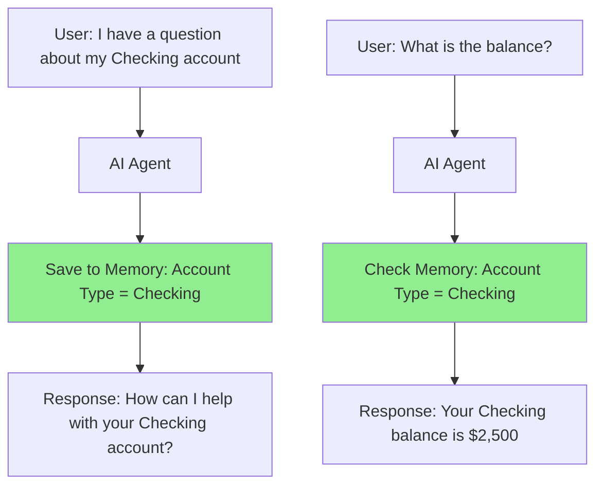
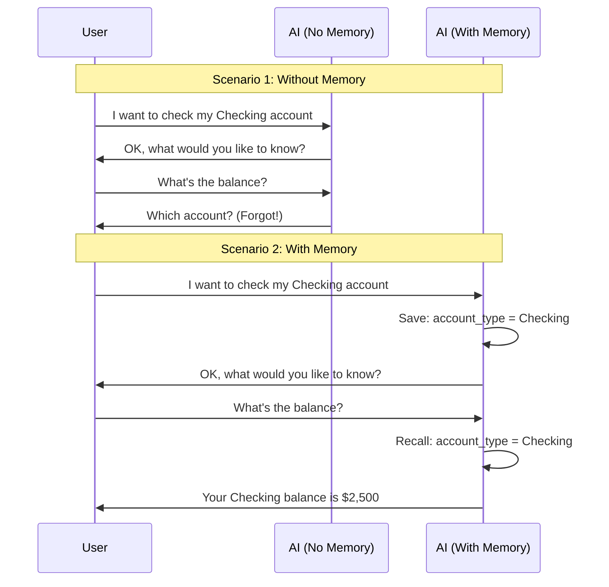
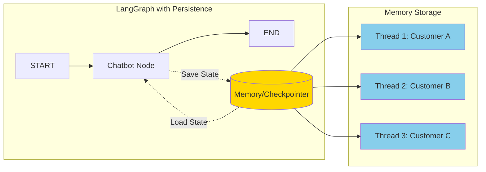
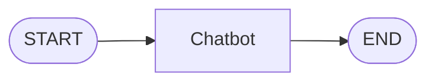
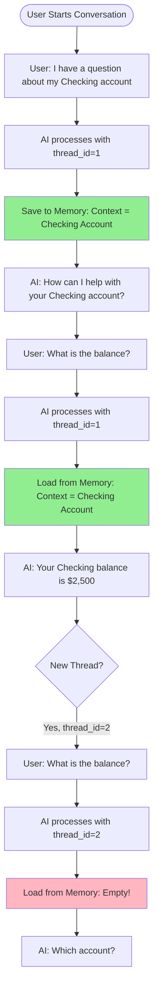
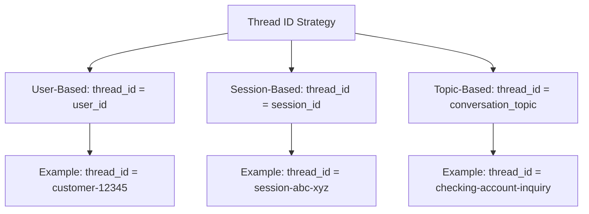
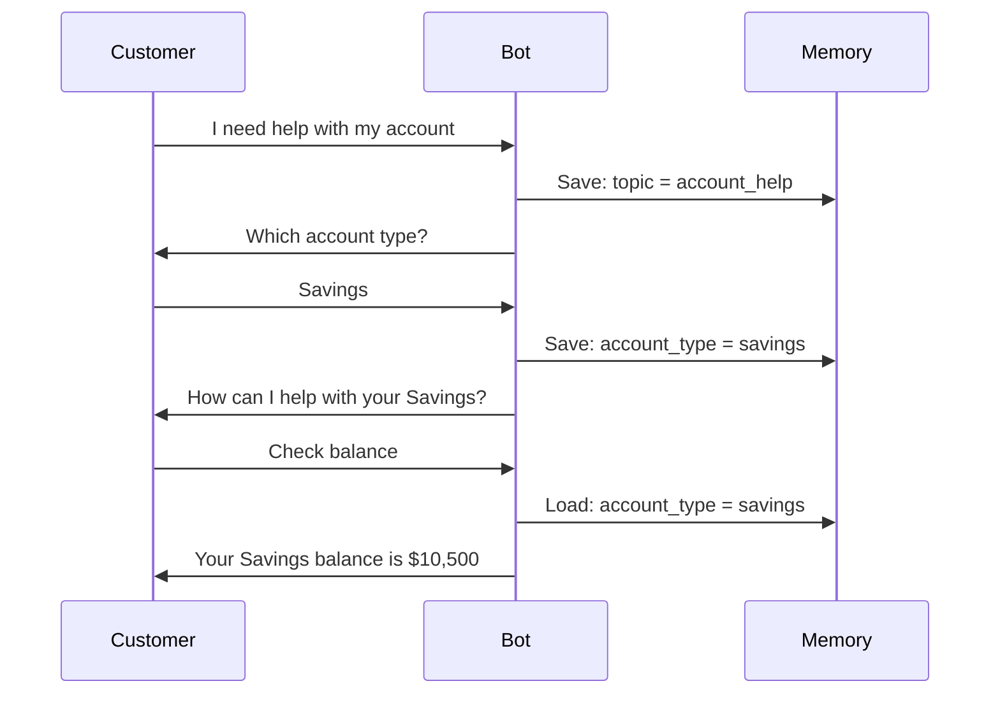
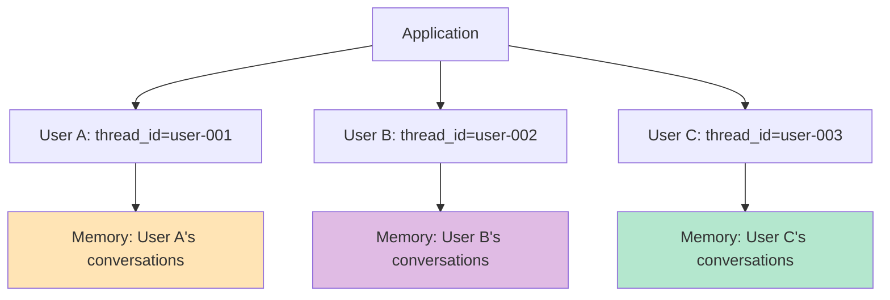
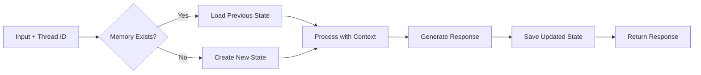

# Lab 3.1: LangGraph Persistence - Complete Beginner's Guide

## What You'll Learn

This guide will help you understand how to add **memory** to AI agents so they can remember previous conversations. Think of it like giving your AI assistant a notebook to remember what you talked about!

---

## Core Concepts Explained

### 1. What is Persistence?

**Simple Definition**: Persistence means your AI agent can remember past conversations, just like how you remember what you talked about with a friend yesterday.

**Real-World Analogy**: 
Imagine calling your bank's customer service:
- **Without Persistence**: Every time you call, you have to re-explain everything from scratch
- **With Persistence**: The agent remembers you said "checking account" earlier, so when you ask "what's my balance?", they know which account you mean

### 2. Key Components

#### Checkpointer
**What it is**: A "save button" for your AI's memory

**Analogy**: Like a video game checkpoint - it saves your progress so you can continue later

**Types**:
- `MemorySaver`: Stores memory temporarily (like RAM in your computer - lost when you restart)
- `SqliteSaver`: Stores memory permanently (like saving to a hard drive)

#### Thread ID
**What it is**: A unique identifier for each conversation

**Analogy**: Like different chat windows in WhatsApp - each conversation has its own history

**Example**:
```python
thread_id = "customer-123"  # Conversation with customer 123
thread_id = "customer-456"  # Different conversation with customer 456
```

#### State
**What it is**: All the information the AI remembers at any moment

**Analogy**: Like your brain's short-term memory - what you're currently thinking about

---

## How It Works: Visual Flow



### Without Persistence vs With Persistence



---

## Architecture Diagram



---

## Step-by-Step Breakdown

### Step 1: Define Your State

```python
class State(TypedDict):
    messages: Annotated[list, add_messages]
```

**What this means**: 
- We're creating a container to hold all the messages in the conversation
- `add_messages` is a special function that knows how to combine old and new messages

**Analogy**: Like a chat history in your messaging app

### Step 2: Create the Chatbot Function

```python
def chatbot(state: State):
    return {"messages": [llm.invoke([sys_msg] + state["messages"])]}
```

**What this means**:
- Takes the current conversation history
- Sends it to the AI model
- Returns the AI's response

**Analogy**: Like forwarding an entire email thread to someone so they have full context

### Step 3: Build the Graph

```python
graph_builder = StateGraph(State)
graph_builder.add_node("chatbot", chatbot)
graph_builder.add_edge(START, "chatbot")
graph_builder.add_edge("chatbot", END)
```

**What this means**:
- We're creating a simple flow: START → Chatbot → END
- It's like drawing a flowchart



### Step 4: Add Persistence

```python
memory = MemorySaver()
graph = graph_builder.compile(checkpointer=memory)
```

**What this means**:
- We're adding the "memory notebook" to our agent
- Now every conversation will be saved

**Analogy**: Installing a recording device in a meeting room

### Step 5: Use Thread IDs

```python
config = {"configurable": {"thread_id": "1"}}
graph.stream({"messages": [("user", "I have a question about my Checking account.")]}, config=config)
```

**What this means**:
- `thread_id: "1"` creates a separate conversation space
- All messages with the same thread_id share the same memory

**Analogy**: Like labeling different notebooks - "Notebook 1" for Customer A, "Notebook 2" for Customer B

---

## Complete Flow Diagram



---

## Key Takeaways

### Why Persistence Matters

1. **Better User Experience**: Users don't have to repeat themselves
2. **Context Awareness**: AI understands the full conversation
3. **Multi-Turn Conversations**: Enables natural back-and-forth dialogue
4. **Session Management**: Different users get different memory spaces

### Thread ID Best Practices



### Memory Types Comparison

| Feature | MemorySaver | SqliteSaver |
|---------|-------------|-------------|
| **Storage** | RAM (temporary) | Disk (permanent) |
| **Survives Restart** | ❌ No | ✅ Yes |
| **Speed** | ⚡ Very Fast | 🐢 Slower |
| **Use Case** | Development/Testing | Production |
| **Analogy** | Sticky notes | Filing cabinet |

---

## Common Patterns

### Pattern 1: Customer Support Bot



### Pattern 2: Multi-User System



---

## Troubleshooting Guide

### Problem: AI Doesn't Remember

**Symptom**: AI asks the same questions repeatedly

**Solution Checklist**:
1. ✅ Did you add a checkpointer? `compile(checkpointer=memory)`
2. ✅ Are you using the same thread_id? Check your config
3. ✅ Is the state being updated correctly?

### Problem: Wrong Memory Retrieved

**Symptom**: AI remembers things from a different conversation

**Solution**: Verify you're using unique thread_ids for different conversations

```python
# ❌ Wrong - Same thread_id for different users
config = {"configurable": {"thread_id": "1"}}  # Used for everyone

# ✅ Correct - Unique thread_id per user
config = {"configurable": {"thread_id": f"user-{user_id}"}}
```

---

## Practice Exercises

### Exercise 1: Basic Persistence
Create a simple chatbot that remembers the user's name throughout the conversation.

### Exercise 2: Multi-Account Banking
Extend the banking assistant to handle multiple account types (Checking, Savings, Credit Card).

### Exercise 3: Session Timeout
Implement logic to clear memory after 30 minutes of inactivity.

---

## Next Steps

After mastering persistence, you're ready for:
- **Lab 3.2**: Human-in-the-Loop (adding human approval steps)
- **Lab 3.3**: Tool Call Review (reviewing AI actions before execution)
- **Lab 3.4**: Advanced patterns (time travel, forking conversations)

---

## Quick Reference

### Essential Code Snippets

```python
# 1. Setup Memory
from langgraph.checkpoint.memory import MemorySaver
memory = MemorySaver()

# 2. Compile with Checkpointer
graph = graph_builder.compile(checkpointer=memory)

# 3. Use Thread ID
config = {"configurable": {"thread_id": "unique-id"}}

# 4. Invoke with Config
graph.stream(input_data, config=config)
```

### Memory Flow Cheat Sheet



---

## Glossary

- **Checkpointer**: The system that saves and loads conversation state
- **Thread ID**: Unique identifier for a conversation session
- **State**: The current data/context of a conversation
- **Persistence**: The ability to remember information across interactions
- **MemorySaver**: In-memory (temporary) storage for development
- **SqliteSaver**: Disk-based (permanent) storage for production

---

**Remember**: Persistence is like giving your AI a memory - it transforms a forgetful assistant into a context-aware partner! 🧠✨
