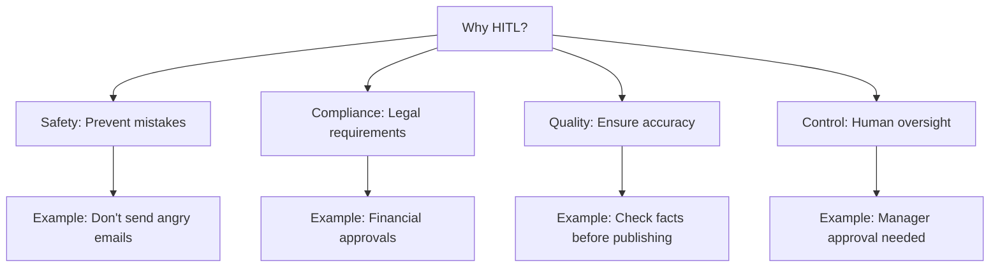
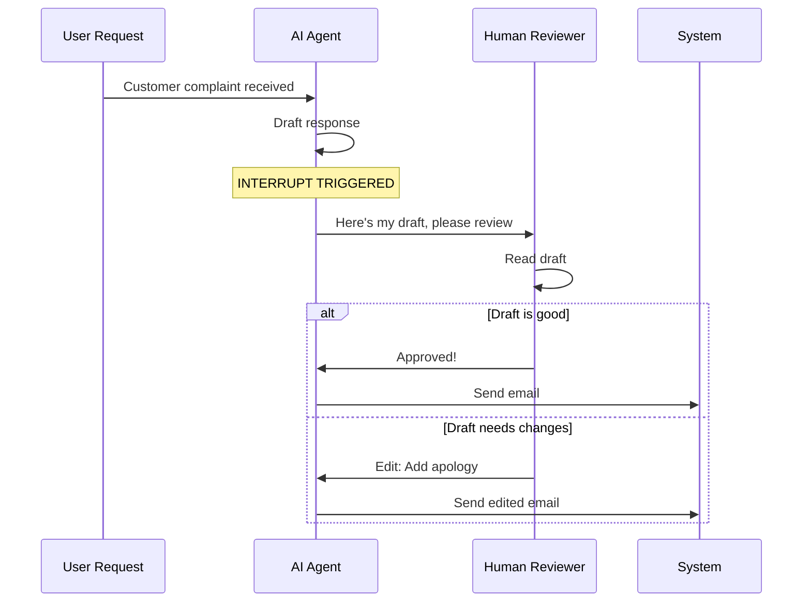
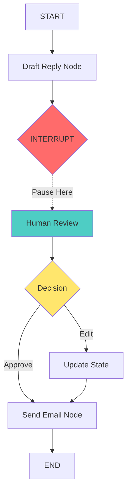
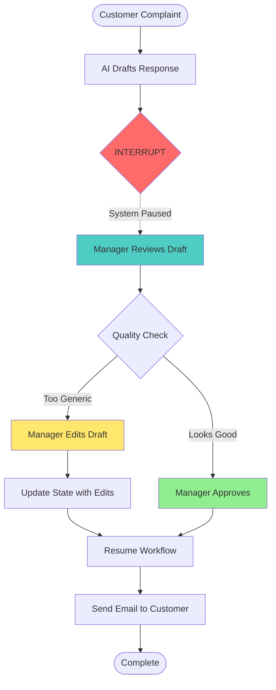
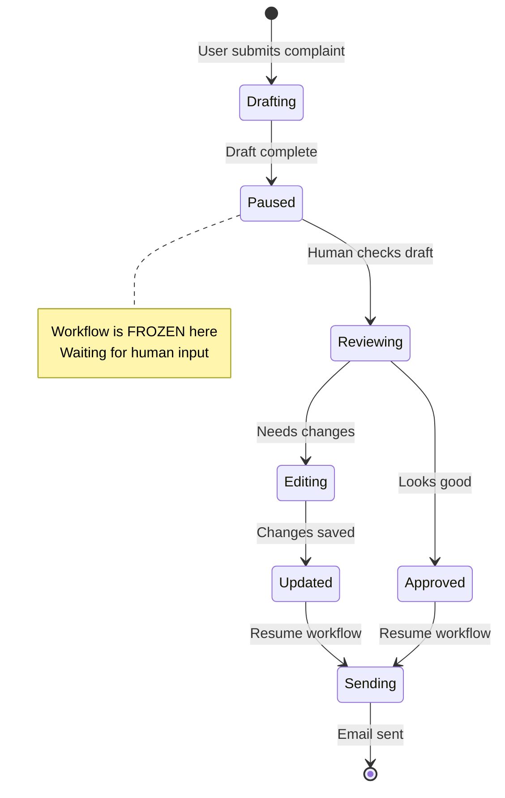
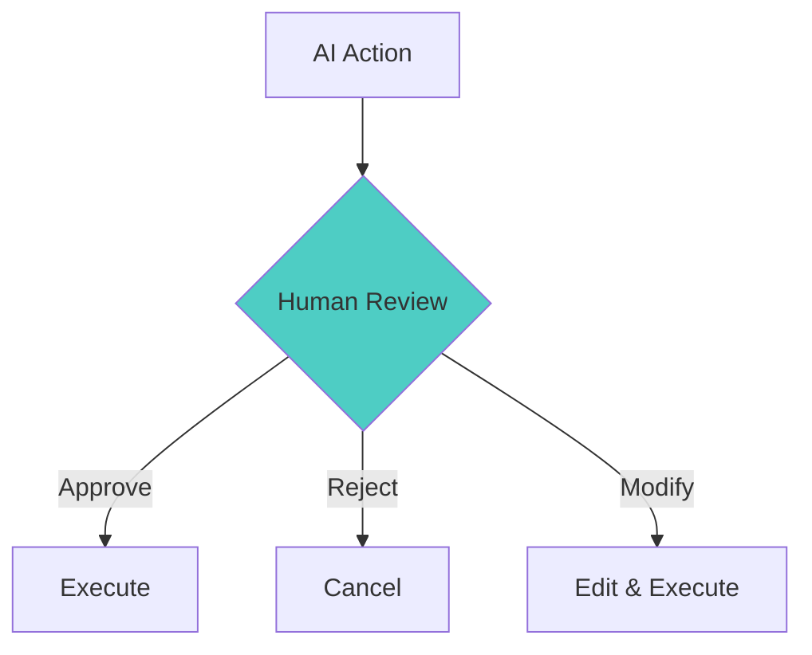
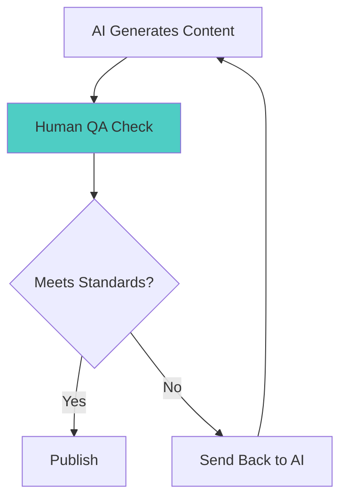
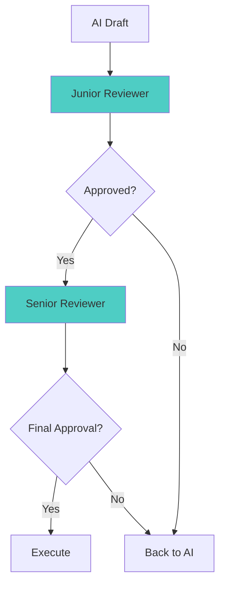
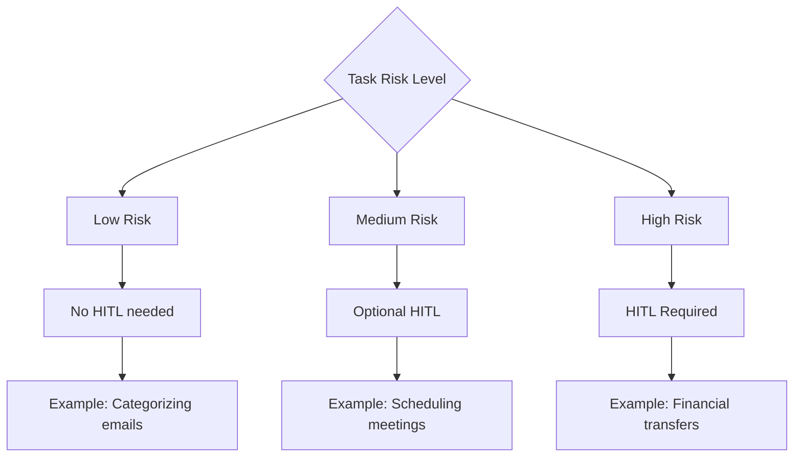

# Lab 3.2: Human-in-the-Loop (HITL) Basics - Complete Beginner's Guide

## What You'll Learn

This guide teaches you how to add **human approval** to AI workflows. Think of it as adding a "review before send" button to your AI assistant!

---

## Core Concepts Explained

### 1. What is Human-in-the-Loop (HITL)?

**Simple Definition**: HITL means pausing an AI workflow so a human can review, approve, or modify what the AI is about to do.

**Real-World Analogy**: 
Imagine an AI drafting an important email to a customer:
- **Without HITL**: AI writes and sends immediately (risky!)
- **With HITL**: AI writes a draft → You review → You approve/edit → Then it sends

### 2. Why Do We Need HITL?



---

## Key Components

### 1. Interrupts

**What it is**: A "pause button" in your AI workflow

**Analogy**: Like a speed bump that forces you to slow down and check before proceeding

```python
graph = builder.compile(
    checkpointer=memory,
    interrupt_before=["send_email"]  # Pause before this node
)
```


### 2. State Inspection

**What it is**: Looking at what the AI has prepared before it executes

**Analogy**: Like previewing an email before clicking "Send"

```python
current_state = graph.get_state(thread_config)
ai_draft = current_state.values['draft_response']
print(ai_draft)  # Review what AI wrote
```

### 3. State Update

**What it is**: Modifying the AI's work before continuing

**Analogy**: Like editing a document before finalizing it

```python
graph.update_state(
    thread_config,
    {"draft_response": "Your edited version here"}
)
```

### 4. Resume Execution

**What it is**: Continuing the workflow after human review

**Analogy**: Like clicking "Send" after you've reviewed and edited the email

```python
graph.stream(None, config=thread_config)  # Continue from where we paused
```

---

## How It Works: Visual Flow



---

## Architecture Diagram



---

## Step-by-Step Breakdown

### Step 1: Define Your State

```python
class SupportState(TypedDict):
    customer_query: str          # What the customer asked
    draft_response: Optional[str]  # AI's draft
    final_status: Optional[str]    # What happened
```

**What this means**: We're tracking three things:
1. The original question
2. The AI's draft answer
3. Whether it was sent


### Step 2: Create the Draft Node

```python
def draft_reply(state: SupportState):
    query = state['customer_query']
    response = llm.invoke(f"Write a polite support email for: {query}")
    return {"draft_response": response.content}
```

**What this means**: The AI writes a draft but doesn't send it yet

**Analogy**: Like writing an email and saving it to drafts

### Step 3: Create the Send Node

```python
def send_email(state: SupportState):
    draft = state['draft_response']
    # In real life, this would call an email API
    return {"final_status": f"SENT: {draft}"}
```

**What this means**: This actually sends the email (or simulates it)

### Step 4: Add the Interrupt

```python
graph = builder.compile(
    checkpointer=memory,
    interrupt_before=["send_email"]  # STOP before sending!
)
```

**What this means**: 
- The workflow will run the draft_reply node
- Then PAUSE before send_email
- Wait for human input

```mermaid
graph LR
    A[draft_reply] -->|Runs| B[PAUSE ⏸️]
    B -.Waiting.-> C[send_email]
    C -.Won't run yet!.-> D[END]
    
    style B fill:#FF6B6B
```



---

## Complete Workflow Example

### Scenario: Customer Complaint Handler



---

## Detailed Code Walkthrough

### Phase 1: Initial Run (Drafting)

```python
# Start the workflow
config = {"configurable": {"thread_id": "ticket-123"}}
input_data = {
    "customer_query": "My widget arrived broken! Fix this now!"
}

# This will run draft_reply, then STOP
graph.stream(input_data, config=config)
```

**What happens**:
1. ✅ draft_reply node executes
2. ✅ Draft is saved to state
3. ⏸️ Workflow PAUSES before send_email
4. ⏳ Waiting for human...

### Phase 2: Human Review

```python
# Check what the AI wrote
current_state = graph.get_state(config)
ai_draft = current_state.values['draft_response']

print("AI Draft:", ai_draft)
# Output: "Dear Customer, We apologize for the inconvenience..."
```

**What happens**: You can now read and evaluate the draft


### Phase 3: Human Decision

#### Option A: Approve (No Changes)

```python
# Just resume - use the AI's draft as-is
graph.stream(None, config=config)
```

#### Option B: Edit First

```python
# Modify the draft
new_draft = ai_draft + "\n\nP.S. Replacement shipped overnight!"

# Update the state
graph.update_state(config, {"draft_response": new_draft})

# Now resume
graph.stream(None, config=config)
```

**What happens**: The send_email node will use YOUR edited version

---

## State Lifecycle Diagram



---

## Common Patterns

### Pattern 1: Approval Workflow



**Use Cases**:
- Sending emails to customers
- Publishing content
- Making purchases
- Deleting data

### Pattern 2: Quality Control



**Use Cases**:
- Content moderation
- Fact-checking
- Legal review
- Brand compliance

### Pattern 3: Multi-Stage Approval



**Use Cases**:
- Financial transactions
- Legal documents
- Medical decisions
- High-value contracts

---

## Key Differences: With vs Without HITL

| Aspect | Without HITL | With HITL |
|--------|--------------|-----------|
| **Speed** | ⚡ Instant | 🐢 Requires human time |
| **Safety** | ⚠️ Risky | ✅ Safer |
| **Cost** | 💰 Cheaper | 💰💰 More expensive |
| **Accuracy** | 🎯 AI-dependent | 🎯🎯 Human-verified |
| **Scalability** | 📈 Unlimited | 📊 Limited by humans |
| **Use Case** | Low-risk tasks | High-risk tasks |


---

## Troubleshooting Guide

### Problem: Workflow Doesn't Pause

**Symptom**: The workflow runs completely without stopping

**Solutions**:
1. ✅ Check you added `interrupt_before=["node_name"]`
2. ✅ Verify the node name matches exactly
3. ✅ Ensure you're using a checkpointer

```python
# ❌ Wrong - No interrupt
graph = builder.compile(checkpointer=memory)

# ✅ Correct - With interrupt
graph = builder.compile(
    checkpointer=memory,
    interrupt_before=["send_email"]
)
```

### Problem: Can't Resume After Review

**Symptom**: `graph.stream(None, config)` doesn't work

**Solutions**:
1. ✅ Use the SAME config (thread_id) as the initial run
2. ✅ Pass `None` as the first argument (not new data)
3. ✅ Ensure the state was properly updated

```python
# ❌ Wrong - Different thread_id
config1 = {"configurable": {"thread_id": "1"}}
config2 = {"configurable": {"thread_id": "2"}}  # Different!

# ✅ Correct - Same thread_id
config = {"configurable": {"thread_id": "1"}}
# Use 'config' for both initial run and resume
```

### Problem: State Update Not Working

**Symptom**: Your edits don't appear in the final output

**Solutions**:
1. ✅ Update the correct state key
2. ✅ Use the right thread_id
3. ✅ Call update_state BEFORE resuming

```python
# ✅ Correct order
graph.update_state(config, {"draft_response": new_draft})
graph.stream(None, config=config)  # Resume after update
```

---

## Best Practices

### 1. When to Use HITL



### 2. Interrupt Placement Strategy

```python
# ❌ Bad - Too many interrupts (slow)
interrupt_before=["step1", "step2", "step3", "step4"]

# ✅ Good - Only critical steps
interrupt_before=["send_email", "delete_data"]
```

### 3. Clear State Design

```python
# ✅ Good - Clear, descriptive state
class State(TypedDict):
    customer_query: str
    ai_draft: str
    human_edits: Optional[str]
    approval_status: str
    final_message: str
```

---

## Practice Exercises

### Exercise 1: Simple Approval
Create a workflow where AI generates a social media post, and you approve before posting.

### Exercise 2: Edit and Approve
Build a system where AI drafts product descriptions, you can edit them, then they're published.

### Exercise 3: Multi-Step Review
Create a workflow with two interrupts: one for content review, one for legal review.

---

## Quick Reference

### Essential Code Pattern

```python
# 1. Build graph with interrupt
graph = builder.compile(
    checkpointer=memory,
    interrupt_before=["critical_node"]
)

# 2. Start workflow
config = {"configurable": {"thread_id": "unique-id"}}
graph.stream(input_data, config=config)

# 3. Review state
state = graph.get_state(config)
draft = state.values['draft_field']

# 4. (Optional) Edit
graph.update_state(config, {"draft_field": edited_version})

# 5. Resume
graph.stream(None, config=config)
```

---

## Next Steps

After mastering HITL basics, you're ready for:
- **Lab 3.3**: Reviewing Tool Calls (approving AI actions like wire transfers)
- **Lab 3.4**: Advanced patterns (time travel, dynamic routing)
- **Lab 3.5**: Observability (monitoring your HITL workflows)

---

## Glossary

- **HITL**: Human-in-the-Loop - requiring human involvement in AI workflows
- **Interrupt**: A pause point in the workflow
- **State Inspection**: Viewing the current state of the workflow
- **State Update**: Modifying the workflow state before resuming
- **Resume**: Continuing the workflow after human review
- **Thread ID**: Unique identifier for tracking a specific workflow instance

---

**Remember**: HITL is like having a co-pilot - the AI does the heavy lifting, but you're always in control! 🤝✨
