# Lab 3.3: Human-in-the-Loop - Tool Call Review - Complete Beginner's Guide

## What You'll Learn

This guide teaches you how to review and approve **AI actions** before they execute. Think of it as adding a "confirm before transfer" button when AI wants to move money!

---

## Core Concepts Explained

### 1. What are Tool Calls?

**Simple Definition**: Tool calls are actions the AI wants to take in the real world (like sending money, deleting files, or calling APIs).

**Real-World Analogy**: 
Imagine an AI banking assistant:
- **Without Tool Review**: AI sees "transfer $50,000" and does it immediately (scary!)
- **With Tool Review**: AI prepares the transfer → You review details → You approve → Then it executes

### 2. Why Review Tool Calls?

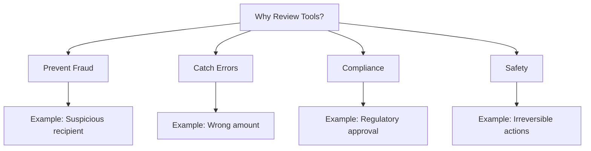

---

## Key Components

### 1. Tools

**What it is**: Functions the AI can call to take actions

```python
@tool
def execute_wire_transfer(amount: float, recipient: str, account: str):
    """Transfers money to a recipient"""
    # This actually moves money!
    return f"Transferred ${amount} to {recipient}"
```

**Analogy**: Like giving your assistant the ability to write checks


### 2. Tool Calls vs Tool Execution

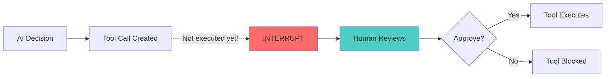

**Key Difference**:
- **Tool Call**: AI's *intention* to do something (just a plan)
- **Tool Execution**: Actually doing it (the real action)

### 3. Interrupt Before Tools

```python
graph = create_react_agent(
    llm,
    tools=[execute_wire_transfer],
    interrupt_before=["tools"]  # Pause before ANY tool runs
)
```

**What this means**: The AI can *plan* to use tools, but can't *execute* them without approval

---

## How It Works: Visual Flow

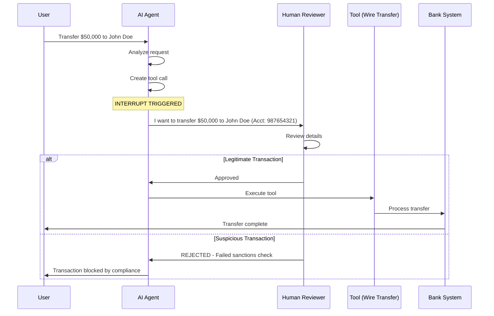

---

## Architecture Diagram

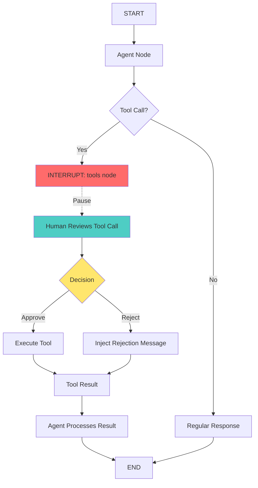

---

## Step-by-Step Breakdown

### Step 1: Define Sensitive Tools

```python
@tool
def execute_wire_transfer(amount: float, recipient_name: str, account_number: str):
    """Executes a wire transfer. Use only after verification."""
    print(f"PROCESSING: ${amount} to {recipient_name}")
    return f"Successfully transferred ${amount}"
```

**What this means**: This tool has real consequences - it moves actual money!

**Analogy**: Like a button that launches missiles - you want approval before pressing it

### Step 2: Create Agent with Interrupt

```python
graph = create_react_agent(
    llm,
    tools=[execute_wire_transfer],
    interrupt_before=["tools"]  # CRITICAL: Pause before tool execution
)
```

**What this means**: 
- AI can see the tool
- AI can decide to use it
- AI CANNOT execute it without approval

```mermaid
graph LR
    A[AI sees tool] --> B[AI plans to use tool]
    B --> C[STOP ⏸️]
    C -.Waiting.-> D[Tool execution]
    
    style C fill:#FF6B6B
```


### Step 3: Trigger a Tool Call

```python
config = {"configurable": {"thread_id": "transaction-001"}}

result = graph.invoke(
    {"messages": [("user", "Wire $50,000 to John Doe (Account: 987654321)")]},
    config=config
)
```

**What happens**:
1. ✅ AI receives the request
2. ✅ AI decides to use execute_wire_transfer tool
3. ⏸️ Workflow PAUSES (interrupt triggered)
4. ⏳ Waiting for human review...

### Step 4: Inspect the Tool Call

```python
state = graph.get_state(config)
last_message = state.values["messages"][-1]

if last_message.tool_calls:
    for tool_call in last_message.tool_calls:
        print(f"Tool: {tool_call['name']}")
        print(f"Arguments: {tool_call['args']}")
```

**Output Example**:
```
Tool: execute_wire_transfer
Arguments: {
    'amount': 50000.0,
    'recipient_name': 'John Doe',
    'account_number': '987654321'
}
```

**What this means**: You can see EXACTLY what the AI wants to do before it happens

---

## Approval vs Rejection Flows

### Scenario 1: Approving a Legitimate Transaction

```mermaid
flowchart TD
    A[User Request: Transfer $50k to John Doe] --> B[AI Creates Tool Call]
    B --> C[INTERRUPT]
    C --> D[Compliance Officer Reviews]
    D --> E{Checks}
    
    E -->|✅ Known recipient| F[Approve]
    E -->|✅ Reasonable amount| F
    E -->|✅ Proper documentation| F
    
    F --> G[Resume Workflow]
    G --> H[Tool Executes]
    H --> I[Transfer Complete]
    
    style C fill:#FF6B6B
    style D fill:#4ECDC4
    style F fill:#90EE90
```

**Code**:
```python
# Simply resume - this approves the tool call
graph.invoke(None, config=config)
```

### Scenario 2: Rejecting a Suspicious Transaction

```mermaid
flowchart TD
    A[User Request: Transfer $1M to Anonymous Offshore] --> B[AI Creates Tool Call]
    B --> C[INTERRUPT]
    C --> D[Compliance Officer Reviews]
    D --> E{Red Flags}
    
    E -->|❌ Unknown recipient| F[REJECT]
    E -->|❌ Suspicious amount| F
    E -->|❌ Offshore account| F
    
    F --> G[Inject Rejection Message]
    G --> H[Resume Workflow]
    H --> I[AI Informs User: Transaction Blocked]
    
    style C fill:#FF6B6B
    style D fill:#4ECDC4
    style F fill:#FF6B6B
```

**Code**:
```python
from langchain_core.messages import ToolMessage

# Get the tool call ID
tool_call_id = last_message.tool_calls[0]['id']

# Create a rejection message
rejection = ToolMessage(
    tool_call_id=tool_call_id,
    content="REJECTED: Recipient failed sanctions check"
)

# Inject it as if the tool ran and returned this error
graph.update_state(config, {"messages": [rejection]}, as_node="tools")

# Resume - AI will see the rejection and inform the user
graph.invoke(None, config=config)
```

---

## Complete Example Walkthrough

### Banking Wire Transfer Scenario

#### Phase 1: Request Received

```python
config = {"configurable": {"thread_id": "txn-001"}}

graph.invoke({
    "messages": [("user", "Wire $50,000 to John Doe (Acct: 987654321) for warehouse purchase")]
}, config=config)
```

**System State**: Paused at tools node

#### Phase 2: Compliance Review

```python
state = graph.get_state(config)
tool_call = state.values["messages"][-1].tool_calls[0]

print("=== PENDING TRANSACTION ===")
print(f"Amount: ${tool_call['args']['amount']:,.2f}")
print(f"Recipient: {tool_call['args']['recipient_name']}")
print(f"Account: {tool_call['args']['account_number']}")
```

**Output**:
```
=== PENDING TRANSACTION ===
Amount: $50,000.00
Recipient: John Doe
Account: 987654321
```

#### Phase 3: Decision Making

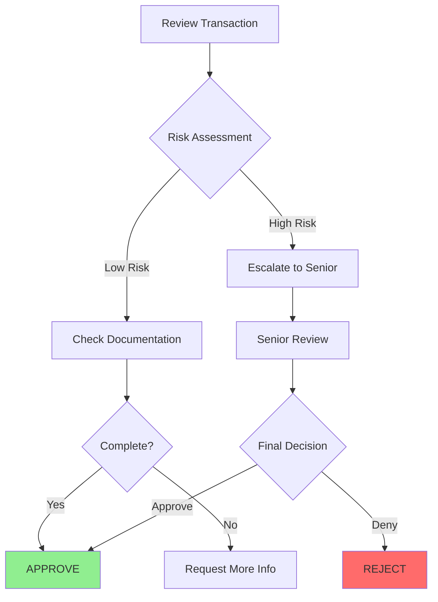


#### Phase 4A: Approval Path

```python
print("✅ Transaction approved by compliance")
# Just resume - tool will execute
graph.invoke(None, config=config)
```

**Result**: Money is transferred

#### Phase 4B: Rejection Path

```python
print("❌ Transaction rejected - suspicious activity")

# Create rejection
tool_call_id = tool_call['id']
rejection = ToolMessage(
    tool_call_id=tool_call_id,
    content="REJECTED: Recipient failed sanctions screening"
)

# Inject rejection
graph.update_state(config, {"messages": [rejection]}, as_node="tools")

# Resume - AI will handle the rejection
graph.invoke(None, config=config)
```

**Result**: Transaction blocked, user notified

---

## Common Patterns

### Pattern 1: Financial Transactions

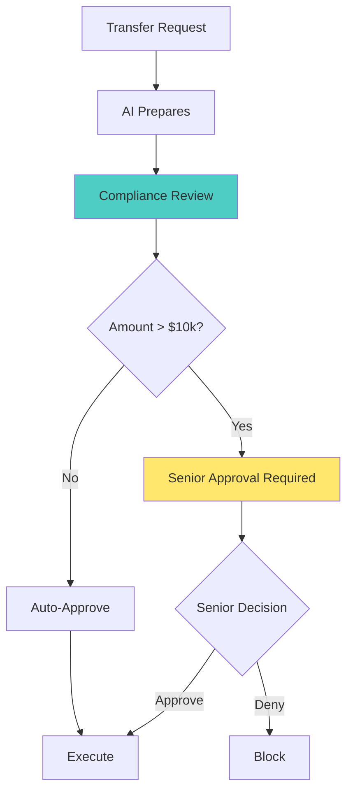

**Use Cases**:
- Wire transfers
- Large purchases
- Account closures
- Credit limit changes

### Pattern 2: Data Operations

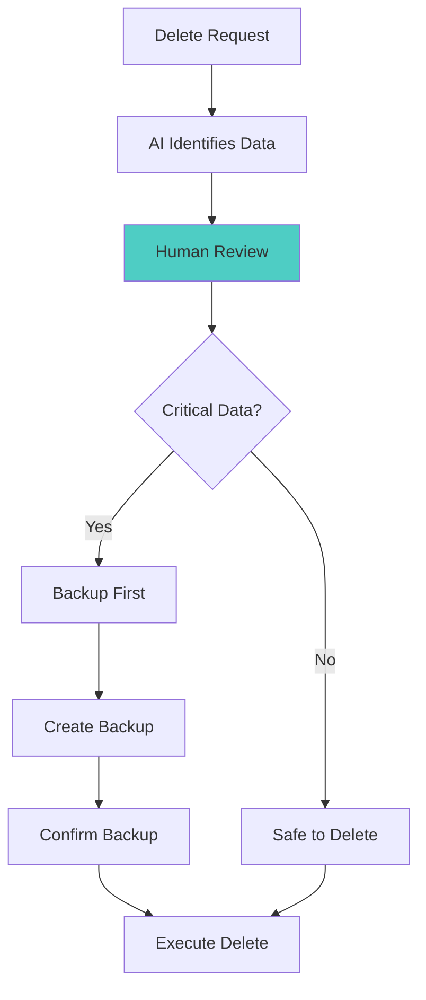

**Use Cases**:
- Deleting records
- Modifying databases
- Archiving data
- System changes

### Pattern 3: External Communications

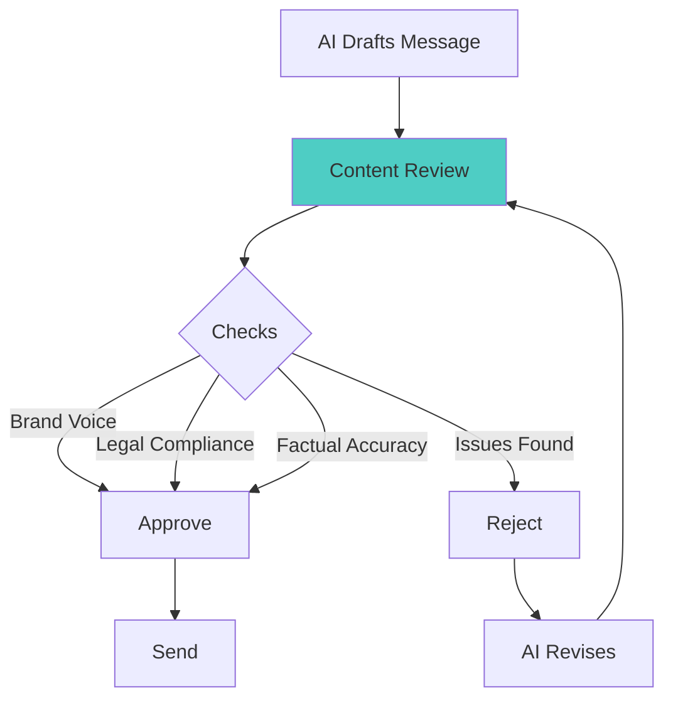

**Use Cases**:
- Customer emails
- Social media posts
- Press releases
- Legal notices

---

## Advanced Techniques

### 1. Conditional Approval

```python
# Auto-approve small amounts, review large ones
tool_call = state.values["messages"][-1].tool_calls[0]
amount = tool_call['args']['amount']

if amount < 1000:
    print("Auto-approved: Small amount")
    graph.invoke(None, config=config)
else:
    print("Manual review required: Large amount")
    # Wait for human decision
```

### 2. Multi-Level Approval

```python
# Different approval levels based on amount
if amount < 10000:
    required_approver = "manager"
elif amount < 100000:
    required_approver = "director"
else:
    required_approver = "cfo"

print(f"Approval required from: {required_approver}")
```

### 3. Audit Trail

```python
# Log all tool call reviews
audit_log = {
    "timestamp": datetime.now(),
    "tool": tool_call['name'],
    "args": tool_call['args'],
    "reviewer": current_user,
    "decision": "approved",
    "reason": "Verified with customer"
}
save_to_audit_log(audit_log)
```

---

## Safety Checklist

Before approving a tool call, verify:

```mermaid
graph TD
    A[Tool Call Review] --> B{Verification Checklist}
    
    B --> C[✓ Correct recipient?]
    B --> D[✓ Accurate amount?]
    B --> E[✓ Proper authorization?]
    B --> F[✓ Compliant with policy?]
    B --> G[✓ Reversible if needed?]
    
    C --> H{All Checks Pass?}
    D --> H
    E --> H
    F --> H
    G --> H
    
    H -->|Yes| I[APPROVE]
    H -->|No| J[REJECT]
    
    style I fill:#90EE90
    style J fill:#FF6B6B
```

---

## Troubleshooting Guide

### Problem: Tool Executes Without Review

**Symptom**: Money transfers immediately without pause

**Solutions**:
1. ✅ Verify `interrupt_before=["tools"]` is set
2. ✅ Check you're using a checkpointer
3. ✅ Ensure the agent is created with `create_react_agent`

```python
# ❌ Wrong - No interrupt
graph = create_react_agent(llm, tools=[transfer_tool])

# ✅ Correct - With interrupt
graph = create_react_agent(
    llm,
    tools=[transfer_tool],
    interrupt_before=["tools"]
)
```

### Problem: Can't Access Tool Call Details

**Symptom**: `tool_calls` is empty or None

**Solutions**:
1. ✅ Check the last message type: `isinstance(msg, AIMessage)`
2. ✅ Verify the workflow actually paused
3. ✅ Ensure the AI decided to use a tool

```python
# Check if tool calls exist
last_msg = state.values["messages"][-1]
if hasattr(last_msg, 'tool_calls') and last_msg.tool_calls:
    # Safe to access
    tool_call = last_msg.tool_calls[0]
else:
    print("No tool calls found")
```


### Problem: Rejection Not Working

**Symptom**: Tool still executes after rejection

**Solutions**:
1. ✅ Use correct tool_call_id
2. ✅ Set `as_node="tools"` in update_state
3. ✅ Create ToolMessage (not regular message)

```python
# ❌ Wrong - Regular message
graph.update_state(config, {
    "messages": [("system", "Rejected")]
})

# ✅ Correct - ToolMessage with ID
rejection = ToolMessage(
    tool_call_id=tool_call['id'],
    content="REJECTED: Reason here"
)
graph.update_state(config, 
    {"messages": [rejection]},
    as_node="tools"
)
```

---

## Best Practices

### 1. Clear Tool Descriptions

```python
# ❌ Bad - Vague description
@tool
def transfer(amt, to):
    """Transfers money"""
    pass

# ✅ Good - Clear, detailed description
@tool
def execute_wire_transfer(amount: float, recipient_name: str, account_number: str):
    """
    Executes a wire transfer to a specific recipient.
    
    Args:
        amount: Dollar amount to transfer (must be positive)
        recipient_name: Full legal name of recipient
        account_number: Recipient's bank account number
        
    Use only after verifying:
    - Recipient identity
    - Account ownership
    - Sufficient funds
    - Compliance approval
    """
    pass
```

### 2. Structured Tool Arguments

```python
# ✅ Use type hints for validation
@tool
def transfer(
    amount: float,  # Will validate it's a number
    recipient: str,  # Will validate it's text
    account: str
):
    pass
```

### 3. Comprehensive Logging

```python
# Log everything for audit trail
def log_tool_review(tool_call, decision, reviewer):
    log_entry = {
        "timestamp": datetime.now().isoformat(),
        "tool": tool_call['name'],
        "arguments": tool_call['args'],
        "reviewer": reviewer,
        "decision": decision,
        "thread_id": config['configurable']['thread_id']
    }
    audit_logger.info(log_entry)
```

---

## Real-World Use Cases

### Banking & Finance
- Wire transfers
- Account modifications
- Credit approvals
- Investment trades

### Healthcare
- Prescription changes
- Medical record updates
- Treatment authorizations
- Insurance claims

### E-Commerce
- Large refunds
- Inventory adjustments
- Price changes
- Account deletions

### IT Operations
- Database deletions
- Server shutdowns
- Access grants
- Configuration changes

---

## Quick Reference

### Essential Code Pattern

```python
# 1. Define sensitive tool
@tool
def critical_action(param1: str, param2: float):
    """Description of what this does"""
    # Actual implementation
    pass

# 2. Create agent with interrupt
graph = create_react_agent(
    llm,
    tools=[critical_action],
    interrupt_before=["tools"]
)

# 3. Trigger tool call
config = {"configurable": {"thread_id": "unique-id"}}
graph.invoke({"messages": [("user", "Do the thing")]}, config=config)

# 4. Review tool call
state = graph.get_state(config)
tool_call = state.values["messages"][-1].tool_calls[0]

# 5A. Approve
graph.invoke(None, config=config)

# 5B. Reject
rejection = ToolMessage(
    tool_call_id=tool_call['id'],
    content="REJECTED: Reason"
)
graph.update_state(config, {"messages": [rejection]}, as_node="tools")
graph.invoke(None, config=config)
```

---

## Comparison: Different HITL Patterns

| Pattern | Lab 3.2 | Lab 3.3 |
|---------|---------|---------|
| **What's Reviewed** | AI's draft text | AI's planned action |
| **Interrupt Point** | Before send_email node | Before tools node |
| **Review Object** | state.values['draft'] | message.tool_calls |
| **Approval** | Resume as-is | Resume as-is |
| **Rejection** | Update draft text | Inject ToolMessage |
| **Use Case** | Content review | Action approval |

---

## Next Steps

After mastering tool call review, you're ready for:
- **Lab 3.4**: Advanced patterns (time travel, dynamic routing, complex workflows)
- **Lab 3.5**: Observability (monitoring and debugging your HITL systems)

---

## Glossary

- **Tool**: A function the AI can call to take actions
- **Tool Call**: AI's intention to use a tool (not yet executed)
- **Tool Execution**: Actually running the tool function
- **ToolMessage**: A message representing the result of a tool execution
- **Interrupt Before Tools**: Pausing before any tool executes
- **Compliance Review**: Human verification of AI actions
- **Audit Trail**: Log of all tool calls and decisions

---

**Remember**: Tool call review is like having a "confirm" dialog before any important action - it's your safety net! 🛡️✨
