# Lab 3.4: Advanced LangGraph Concepts - Complete Beginner's Guide

## What You'll Learn

This guide covers advanced patterns for production-grade AI agents:
1. **Production Persistence** (SQLite instead of memory)
2. **Time Travel** (rewinding and forking conversations)
3. **Dynamic Routing** (edgeless graphs with Command class)
4. **Complex Workflows** (iterative human feedback loops)

---

## Core Concepts Explained

### 1. Production Persistence

**Simple Definition**: Saving conversation history to a database so it survives restarts

**Real-World Analogy**: 
- **MemorySaver**: Like writing notes on a whiteboard (erased when you leave)
- **SqliteSaver**: Like writing in a permanent notebook (stays forever)

```mermaid
graph LR
    A[MemorySaver] -->|Restart App| B[Memory Lost ❌]
    C[SqliteSaver] -->|Restart App| D[Memory Preserved ✅]
    
    style B fill:#FF6B6B
    style D fill:#90EE90
```

### 2. Time Travel

**Simple Definition**: Going back to a previous point in a conversation and trying a different path

**Real-World Analogy**: Like "undo" in a video game - you can go back to a checkpoint and make different choices

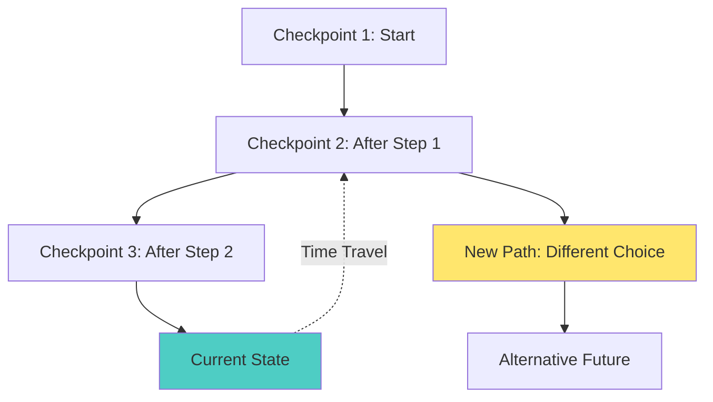


### 3. Dynamic Routing (Command Class)

**Simple Definition**: Nodes can decide where to go next without pre-defined edges

**Real-World Analogy**: Like a GPS that recalculates your route based on traffic, instead of following a fixed map

**Traditional Graph** (Fixed Edges):
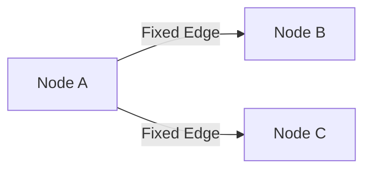

**Dynamic Graph** (Command-Based):
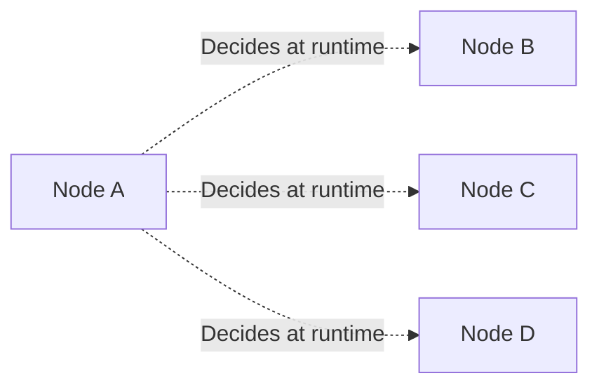

---

## Part 1: Production Persistence with SQLite

### Why SQLite?

| Feature | MemorySaver | SqliteSaver |
|---------|-------------|-------------|
| **Persistence** | ❌ Lost on restart | ✅ Survives restarts |
| **Scalability** | ❌ Single process | ✅ Multi-process |
| **Debugging** | ❌ Hard to inspect | ✅ Can query database |
| **Production Ready** | ❌ No | ✅ Yes |

### Setup SQLite Persistence

```python
import sqlite3
from langgraph.checkpoint.sqlite import SqliteSaver

# Connect to database file
conn = sqlite3.connect("checkpoints.sqlite", check_same_thread=False)
memory_sqlite = SqliteSaver(conn)

# Use it like MemorySaver
graph = builder.compile(checkpointer=memory_sqlite)
```

**What this means**: All conversation history is now saved to `checkpoints.sqlite` file

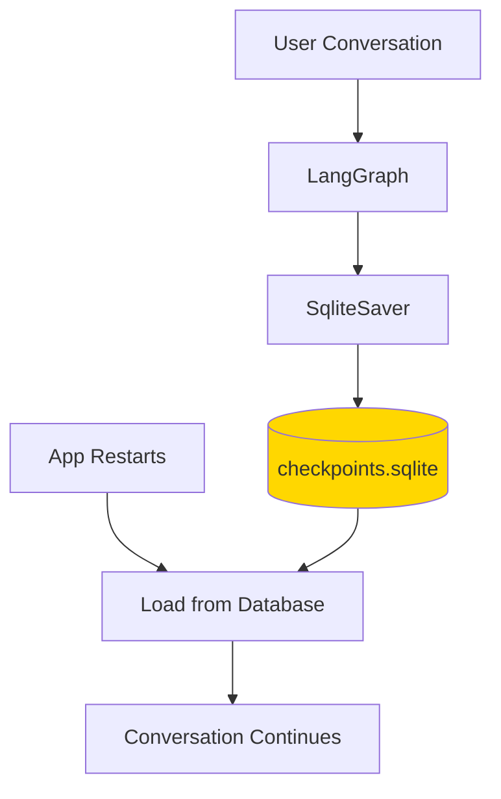

---

## Part 2: Time Travel

### Understanding Checkpoints

**What is a Checkpoint?**: A snapshot of the conversation at a specific moment

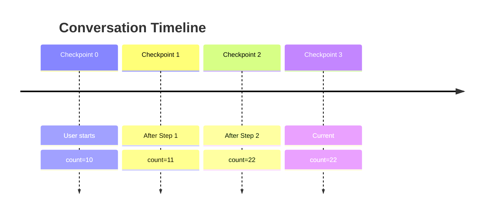

### Viewing History

```python
# Get all checkpoints for a thread
history = list(graph.get_state_history(config))

print(f"Found {len(history)} checkpoints")
for i, snapshot in enumerate(history):
    print(f"[{i}] Count: {snapshot.values.get('count')}")
```

**Output**:
```
Found 3 checkpoints
[0] Count: 22  (Current)
[1] Count: 11  (After Step 1)
[2] Count: 10  (Initial)
```

### Time Travel: Rewinding

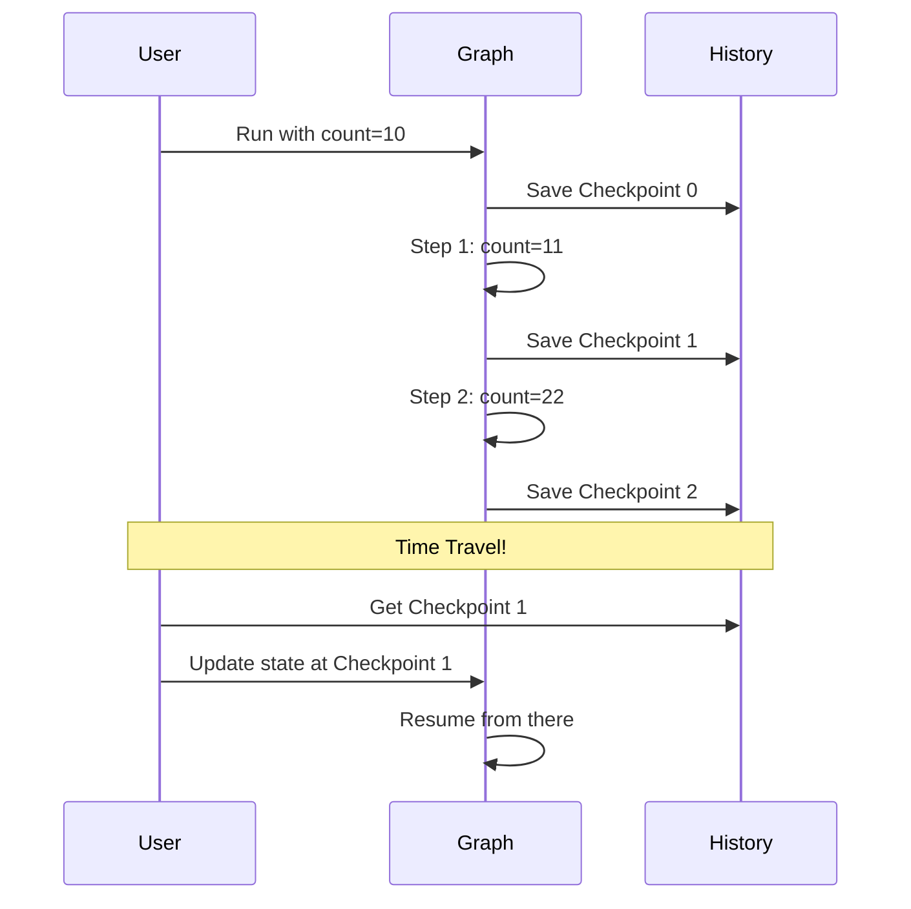

**Code Example**:
```python
# Get the checkpoint from step 1
history = list(graph.get_state_history(config))
checkpoint_1 = history[1].config  # Second item (after step 1)

# Update state at that point
graph.update_state(
    checkpoint_1,
    {"count": 50}  # Change the value
)

# Resume - will run from that point with new value
graph.stream(None, config=config)
```

### Forking: Creating Alternative Timelines

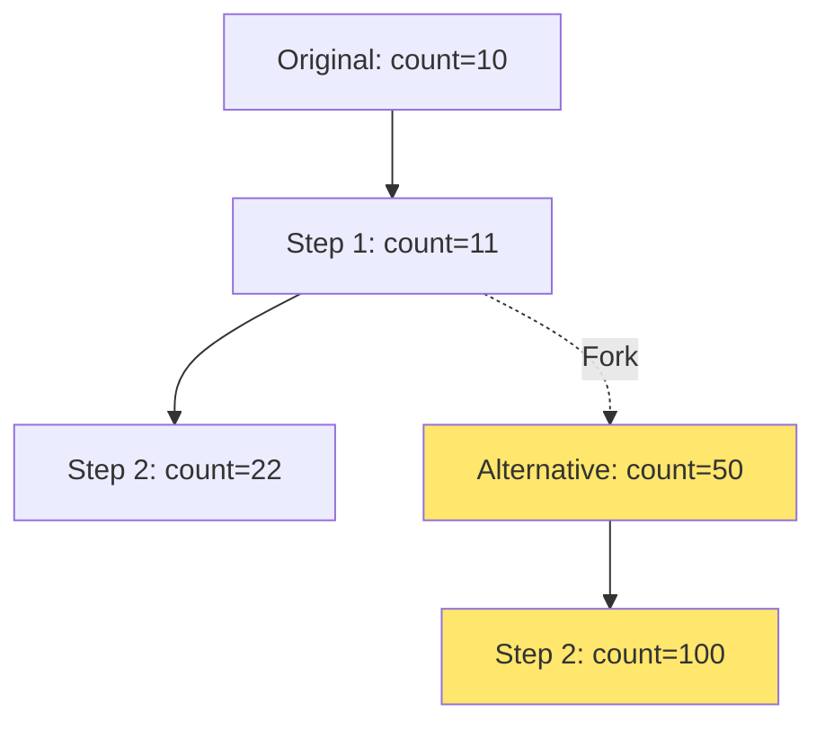

**Use Cases**:
- Testing different scenarios
- "What if" analysis
- Debugging specific paths
- A/B testing conversations

---

## Part 3: Dynamic Routing with Command

### The Problem with Fixed Edges

```python
# Traditional approach - rigid
builder.add_edge("oracle", "happy_path")  # Always goes here
builder.add_edge("oracle", "sad_path")    # Can't have both!
```

**Limitation**: You must decide the flow at build time

### The Solution: Command Class

```python
from langgraph.types import Command

def oracle(state) -> Command[Literal["happy_path", "sad_path"]]:
    if state["sentiment"] == "happy":
        return Command(
            goto="happy_path",
            update={"decision": "Stay positive!"}
        )
    else:
        return Command(
            goto="sad_path",
            update={"decision": "Cheer up!"}
        )
```

**What this means**: The node decides where to go AND updates state simultaneously


### Command vs Traditional Routing

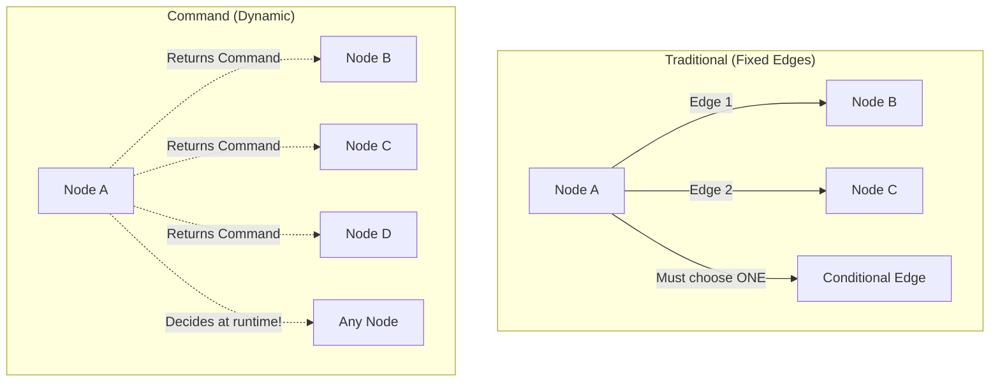

### Command Benefits

1. **Flexibility**: Decide routing based on runtime data
2. **Simplicity**: No need to define all edges upfront
3. **State Updates**: Update state and route in one step
4. **Multi-Agent**: Perfect for agent-to-agent handoffs

---

## Part 4: Complex Workflow - LinkedIn Post Generator

### The Workflow

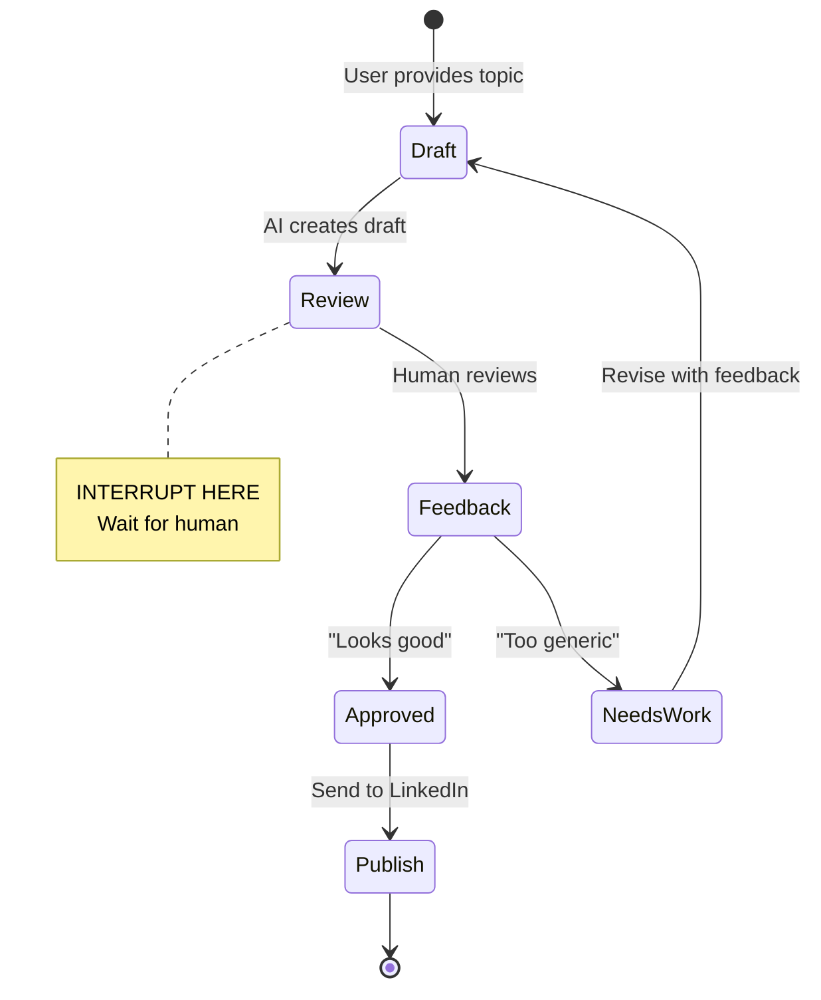

### Implementation Steps

#### Step 1: Define State

```python
class LinkedInState(TypedDict):
    messages: Annotated[list, add_messages]
    next_action: str  # "review" or "publish"
```

#### Step 2: Create Drafter Node

```python
def drafter(state):
    messages = state["messages"]
    response = llm.invoke(messages)
    return {
        "messages": [response],
        "next_action": "review"
    }
```

#### Step 3: Create Reviewer Node (with Command)

```python
def reviewer(state) -> Command[Literal["drafter", END]]:
    last_msg = state["messages"][-1]
    
    if isinstance(last_msg, HumanMessage):
        if "looks good" in last_msg.content.lower():
            return Command(goto=END)  # Approved!
        else:
            return Command(goto="drafter")  # Needs revision
```

#### Step 4: Build Graph with Interrupt

```python
builder = StateGraph(LinkedInState)
builder.add_node("drafter", drafter)
builder.add_node("reviewer", reviewer)

builder.add_edge(START, "drafter")
builder.add_edge("drafter", "reviewer")

# Interrupt before reviewer runs
graph = builder.compile(
    checkpointer=memory_sqlite,
    interrupt_before=["reviewer"]
)
```

### The Iterative Loop

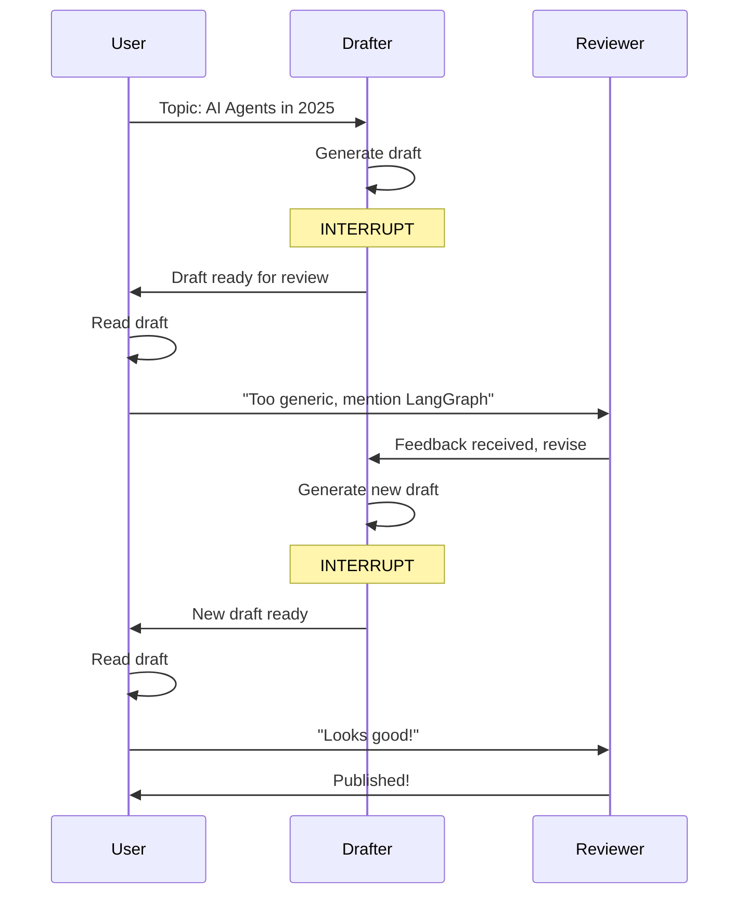

### Providing Feedback

```python
# After first draft
config = {"configurable": {"thread_id": "post-1"}}

# Inject feedback
feedback = HumanMessage(content="Too generic. Mention LangGraph specifically.")
graph.update_state(config, {"messages": [feedback]}, as_node="reviewer")

# Resume - will loop back to drafter
graph.stream(None, config=config)
```

---

## Key Patterns Summary

### Pattern 1: Checkpoint Strategy

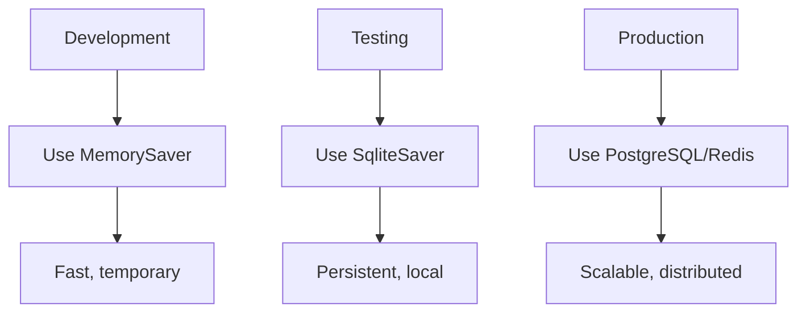

### Pattern 2: Time Travel Use Cases

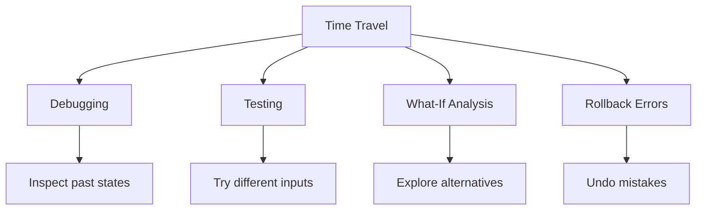

### Pattern 3: Command Routing

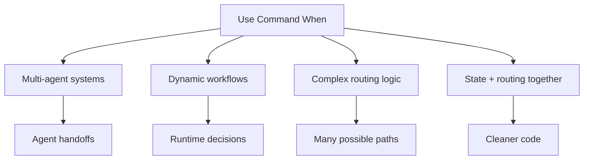

---

## Best Practices

### 1. Checkpoint Management

```python
# ✅ Good - Clean up old checkpoints periodically
def cleanup_old_checkpoints(days=30):
    cutoff = datetime.now() - timedelta(days=days)
    # Delete checkpoints older than cutoff
```

### 2. Time Travel Safety

```python
# ✅ Good - Verify checkpoint exists before time travel
history = list(graph.get_state_history(config))
if len(history) > target_index:
    checkpoint = history[target_index].config
    graph.update_state(checkpoint, new_values)
else:
    print("Checkpoint not found")
```

### 3. Command Type Hints

```python
# ✅ Good - Use Literal for type safety
def router(state) -> Command[Literal["path_a", "path_b", END]]:
    # Type checker knows valid destinations
    return Command(goto="path_a")
```

---

## Troubleshooting

### Problem: SQLite Database Locked

**Solution**: Use `check_same_thread=False`
```python
conn = sqlite3.connect("db.sqlite", check_same_thread=False)
```

### Problem: Time Travel Not Working

**Solution**: Ensure you're using the checkpoint config, not the thread config
```python
# ❌ Wrong
graph.update_state(config, new_values)

# ✅ Correct
checkpoint_config = history[1].config
graph.update_state(checkpoint_config, new_values)
```

### Problem: Command Not Routing

**Solution**: Verify return type and node names match
```python
# ✅ Correct - Node name matches Command goto
builder.add_node("happy_path", happy_path_func)
return Command(goto="happy_path")  # Exact match!
```

---

## Quick Reference

### SQLite Setup
```python
import sqlite3
from langgraph.checkpoint.sqlite import SqliteSaver

conn = sqlite3.connect("checkpoints.sqlite", check_same_thread=False)
memory = SqliteSaver(conn)
graph = builder.compile(checkpointer=memory)
```

### Time Travel
```python
# Get history
history = list(graph.get_state_history(config))

# Go back to checkpoint
old_checkpoint = history[2].config
graph.update_state(old_checkpoint, {"field": "new_value"})

# Resume from there
graph.stream(None, config=config)
```

### Command Routing
```python
from langgraph.types import Command

def node(state) -> Command[Literal["next_node", END]]:
    return Command(
        goto="next_node",
        update={"field": "value"}
    )
```

---

## Next Steps

- **Lab 3.5**: Observability with Arize Phoenix (monitoring and debugging)
- **Production Deployment**: Scale to PostgreSQL, add monitoring, implement error handling

---

## Glossary

- **SqliteSaver**: Persistent checkpointer using SQLite database
- **Checkpoint**: Snapshot of conversation state at a point in time
- **Time Travel**: Rewinding to a previous checkpoint
- **Forking**: Creating alternative timeline from a checkpoint
- **Command**: Object that specifies next node and state updates
- **Dynamic Routing**: Runtime decision of workflow path

---

**Remember**: These advanced patterns give you production-grade control over your AI workflows! 🚀✨
