# Lab 3.5: LLM Observability with Arize Phoenix - Complete Beginner's Guide

## What You'll Learn

This guide teaches you how to monitor and debug your AI applications using **Arize Phoenix** - think of it as "developer tools" for AI!

---

## Core Concepts Explained

### 1. What is Observability?

**Simple Definition**: The ability to see what's happening inside your AI application

**Real-World Analogy**: 
- **Without Observability**: Like driving a car with no dashboard - you don't know speed, fuel, or if something's wrong
- **With Observability**: Like a modern car dashboard - you see everything: speed, fuel, warnings, diagnostics

```mermaid
graph TD
    A[Your AI App] --> B{With Observability?}
    B -->|No| C[Black Box 📦]
    B -->|Yes| D[Glass Box 🔍]
    
    C --> E[Can't see what's happening]
    C --> F[Hard to debug]
    C --> G[Unknown costs]
    
    D --> H[See every step]
    D --> I[Easy debugging]
    D --> J[Track costs & performance]
    
    style C fill:#FF6B6B
    style D fill:#90EE90
```

### 2. Why Do We Need Observability?

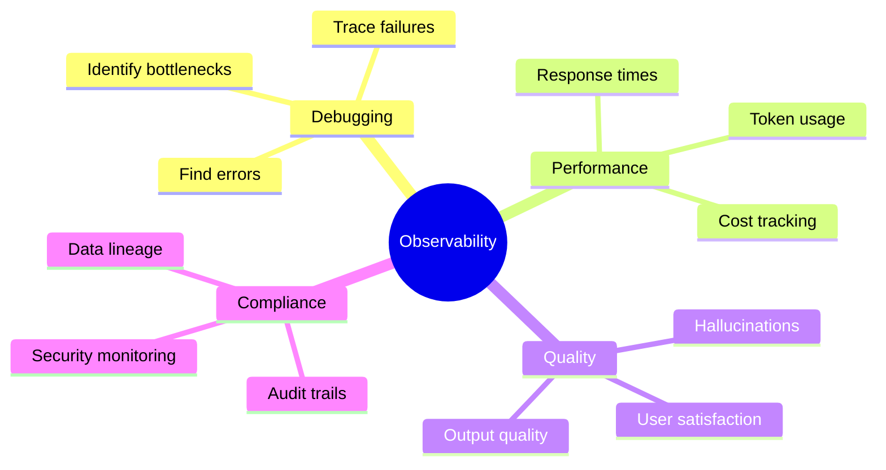


---

## Key Components

### 1. Traces

**What it is**: A record of everything that happened during one AI interaction

**Analogy**: Like a receipt that shows every item you bought and how much each cost

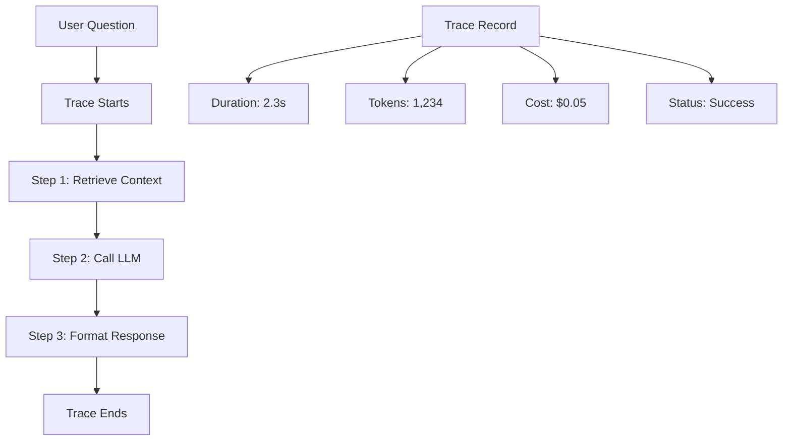

### 2. Spans

**What it is**: Individual steps within a trace

**Analogy**: Like line items on a receipt - each span is one operation

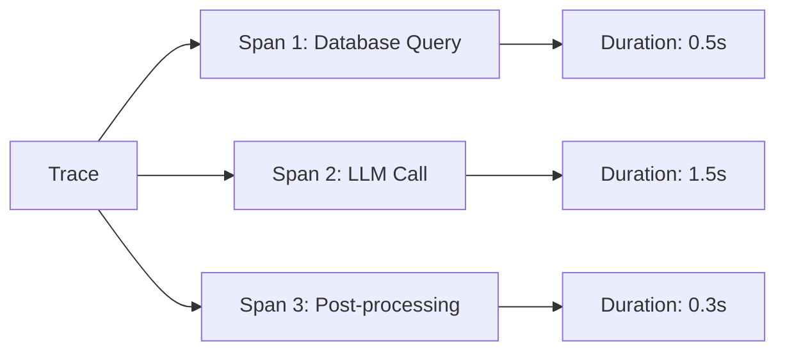

### 3. Instrumentation

**What it is**: Adding monitoring code to your application

**Analogy**: Like installing security cameras in a building - you add sensors to see what's happening

```python
# Before instrumentation - blind
result = llm.invoke("Hello")

# After instrumentation - monitored
from openinference.instrumentation.langchain import LangChainInstrumentor
LangChainInstrumentor().instrument()
result = llm.invoke("Hello")  # Now tracked!
```

---

## How It Works: Visual Flow

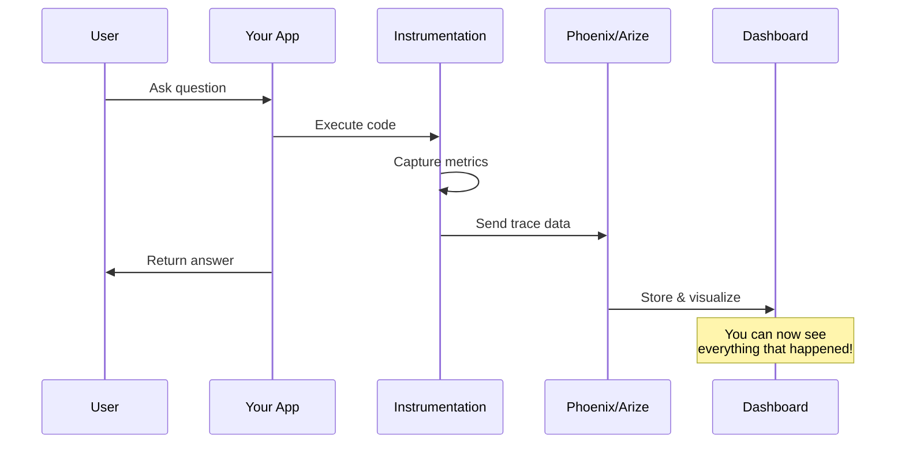

---

## Architecture Diagram

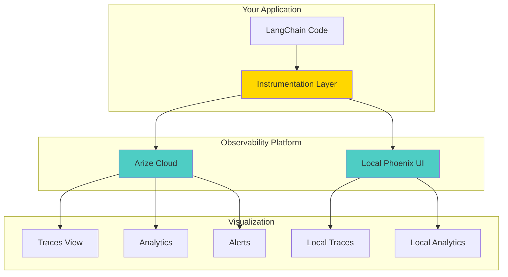

---

## Step-by-Step Setup

### Step 1: Install Phoenix

```python
%pip install arize-phoenix arize-otel openinference-instrumentation-langchain
```

**What this does**: Installs the monitoring tools

### Step 2: Configure Arize

```python
from arize.otel import register

tracer_provider = register(
    space_id=os.environ["ARIZE_SPACE_ID"],
    api_key=os.environ["ARIZE_API_KEY"],
    project_name="my-ai-project"
)
```

**What this means**: 
- Connects to Arize cloud
- All traces will be sent to your project
- You can view them in the Arize dashboard

### Step 3: Instrument Your Code

```python
from openinference.instrumentation.langchain import LangChainInstrumentor

LangChainInstrumentor().instrument(tracer_provider=tracer_provider)
```

**What this means**: Every LangChain operation is now automatically monitored

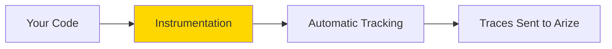

### Step 4: Run Your Application

```python
# Your normal code - no changes needed!
llm = ChatGroq(model="llama-3.3-70b-versatile")
response = llm.invoke("What is LangGraph?")
```

**What happens**: 
1. ✅ Your code runs normally
2. ✅ Instrumentation captures everything
3. ✅ Data sent to Arize
4. ✅ Visible in dashboard

---

## What You Can See

### 1. Trace Timeline

```mermaid
gantt
    title AI Request Timeline
    dateFormat X
    axisFormat %L ms
    
    section Request
    User Input           :0, 50
    
    section Processing
    Retrieve Context     :50, 500
    LLM Call            :550, 2000
    Format Response     :2550, 300
    
    section Response
    Return to User      :2850, 50
```

### 2. Token Usage

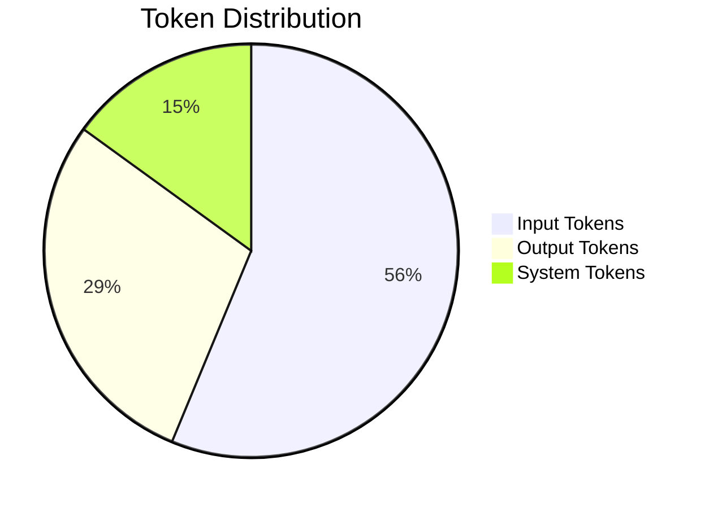

### 3. Cost Tracking

```mermaid
graph TD
    A[Total Cost: $0.05] --> B[Input: $0.02]
    A --> C[Output: $0.03]
    
    B --> D[450 tokens × $0.00004]
    C --> E[230 tokens × $0.00013]
```

---

## Example: Banking Policy Assistant

### The Code

```python
from langchain_groq import ChatGroq
from langchain_core.prompts import ChatPromptTemplate

llm = ChatGroq(model="qwen/qwen3-32b", temperature=0)

policy_prompt = ChatPromptTemplate.from_template(
    "You are a Banking Policy Assistant. Answer: {question}"
)

chain = policy_prompt | llm | StrOutputParser()

# This call is automatically traced!
response = chain.invoke({
    "question": "What is the maximum LTV ratio for a jumbo mortgage?"
})
```

### What Phoenix Shows You

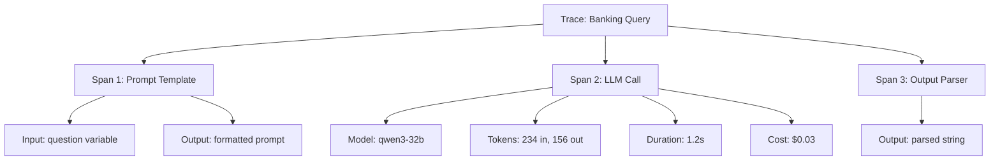


---

## Advanced Example: Loan Underwriting Pipeline

### The Workflow

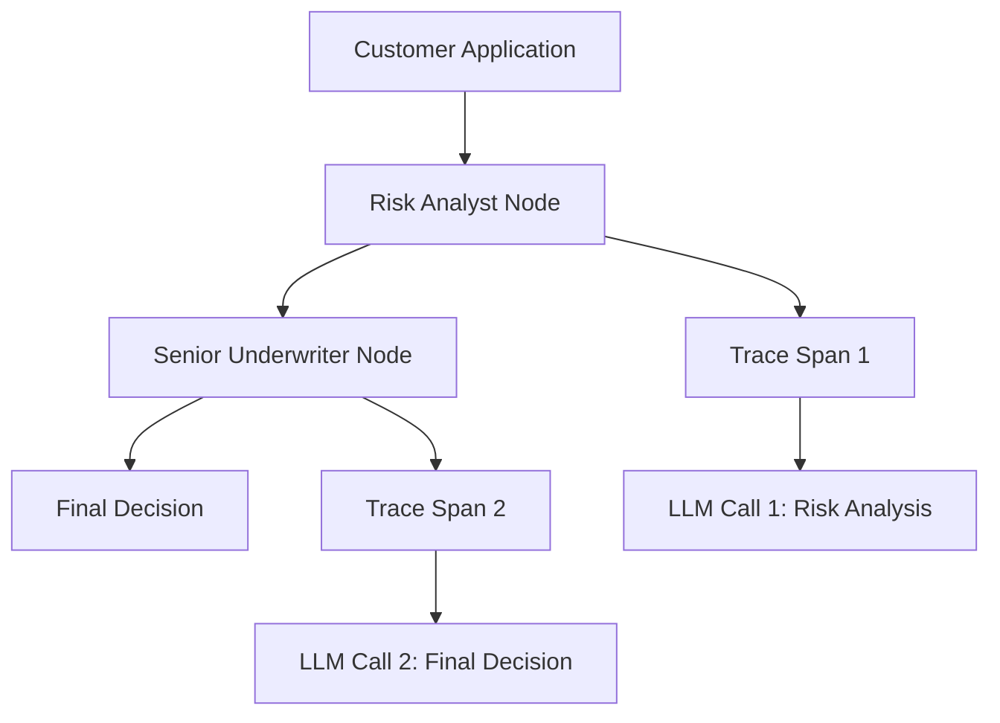

### What Phoenix Captures

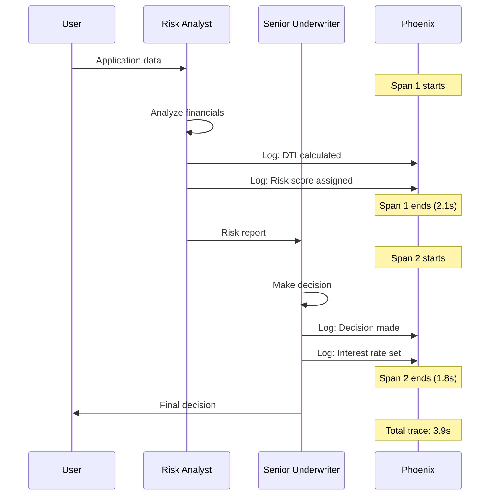

### Trace Details You See

```mermaid
graph TD
    A[Trace: Loan Application] --> B[Metadata]
    A --> C[Performance]
    A --> D[Costs]
    A --> E[Quality]
    
    B --> F[Applicant ID: APP-12345]
    B --> G[Timestamp: 2025-01-21 10:30:00]
    
    C --> H[Total Duration: 3.9s]
    C --> I[Risk Analysis: 2.1s]
    C --> J[Final Decision: 1.8s]
    
    D --> K[Total Tokens: 1,234]
    D --> L[Total Cost: $0.08]
    
    E --> M[Input Quality: ✅]
    E --> N[Output Quality: ✅]
```

---

## Common Use Cases

### 1. Debugging Failures

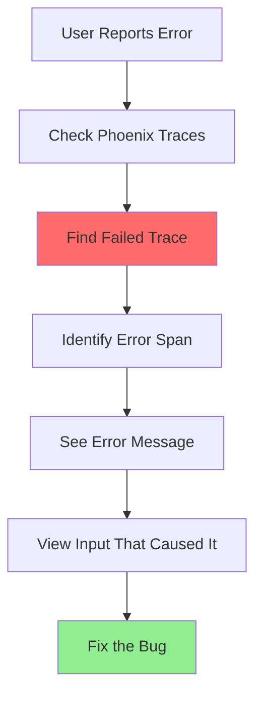

**Example**: User says "AI gave wrong answer"
1. Search traces by user ID
2. Find the problematic trace
3. See exactly what prompt was sent
4. See the LLM's response
5. Identify the issue

### 2. Performance Optimization

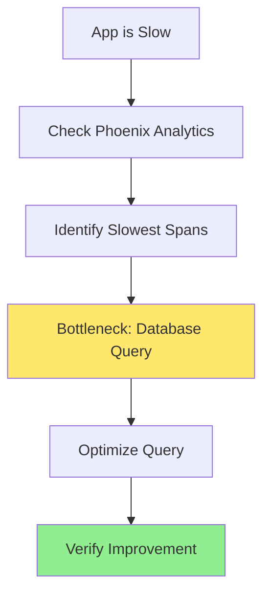

**Example**: Response time is 5 seconds
1. View trace timeline
2. See database query takes 4 seconds
3. Add caching
4. New response time: 1 second

### 3. Cost Monitoring

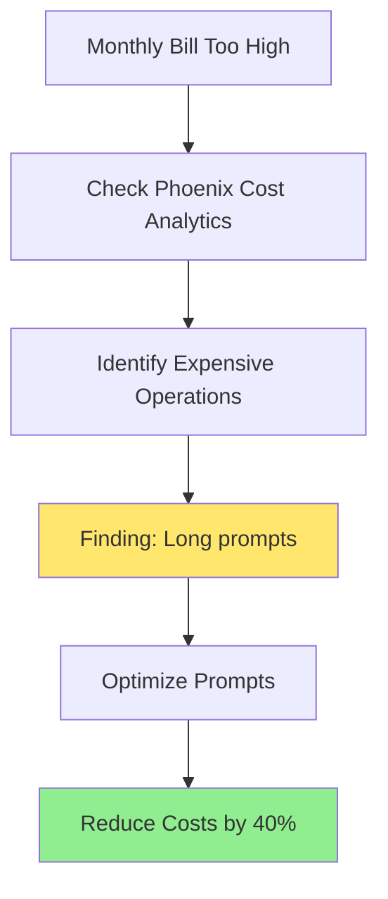

**Example**: $1000/month LLM costs
1. View cost breakdown by operation
2. Find that context retrieval uses 60% of tokens
3. Implement better chunking
4. New cost: $600/month

---

## Phoenix Dashboard Features

### 1. Traces View

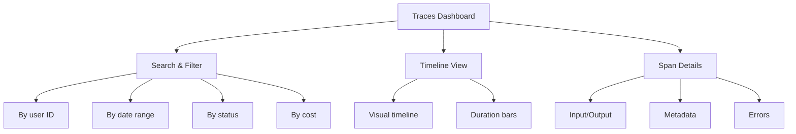

### 2. Analytics View

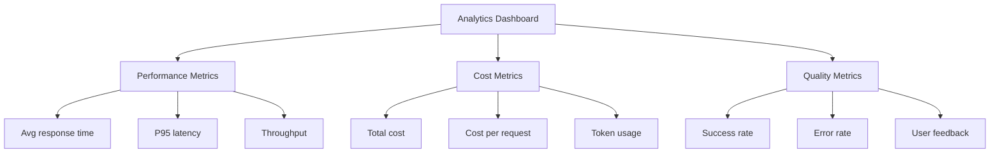

### 3. Alerts

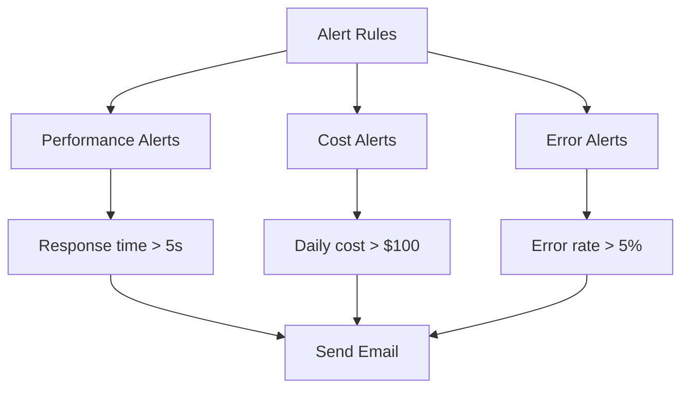

---

## Best Practices

### 1. Meaningful Project Names

```python
# ❌ Bad - Generic name
register(project_name="test")

# ✅ Good - Descriptive name
register(project_name="banking-loan-underwriting-prod")
```

### 2. Add Custom Metadata

```python
# Add context to traces
from opentelemetry import trace

tracer = trace.get_tracer(__name__)
with tracer.start_as_current_span("custom_operation") as span:
    span.set_attribute("user_id", "user-123")
    span.set_attribute("feature", "loan_application")
    # Your code here
```

### 3. Monitor Critical Paths

```python
# Instrument specific operations
with tracer.start_as_current_span("wire_transfer") as span:
    span.set_attribute("amount", 50000)
    span.set_attribute("recipient", "John Doe")
    execute_transfer()  # This is now traced separately
```

---

## Troubleshooting

### Problem: No Traces Appearing

**Solutions**:
1. ✅ Verify API keys are correct
2. ✅ Check instrumentation is called before your code
3. ✅ Ensure network connectivity to Arize

```python
# ✅ Correct order
LangChainInstrumentor().instrument()  # First
llm.invoke("test")  # Then use
```

### Problem: Missing Spans

**Solutions**:
1. ✅ Instrument all libraries you use
2. ✅ Check library versions are compatible

```python
# Instrument multiple libraries
from openinference.instrumentation.langchain import LangChainInstrumentor
from openinference.instrumentation.openai import OpenAIInstrumentor

LangChainInstrumentor().instrument()
OpenAIInstrumentor().instrument()
```

### Problem: High Overhead

**Solutions**:
1. ✅ Use sampling for high-volume apps
2. ✅ Disable in development if needed

```python
# Sample 10% of traces
register(
    space_id=space_id,
    api_key=api_key,
    sample_rate=0.1  # Only 10% of traces
)
```

---

## Quick Reference

### Basic Setup

```python
# 1. Install
%pip install arize-phoenix arize-otel openinference-instrumentation-langchain

# 2. Configure
from arize.otel import register
tracer_provider = register(
    space_id=os.environ["ARIZE_SPACE_ID"],
    api_key=os.environ["ARIZE_API_KEY"],
    project_name="my-project"
)

# 3. Instrument
from openinference.instrumentation.langchain import LangChainInstrumentor
LangChainInstrumentor().instrument(tracer_provider=tracer_provider)

# 4. Use normally - automatic tracking!
llm.invoke("Hello")
```

### Custom Spans

```python
from opentelemetry import trace

tracer = trace.get_tracer(__name__)

with tracer.start_as_current_span("my_operation") as span:
    span.set_attribute("custom_field", "value")
    # Your code here
```

---

## Key Metrics to Monitor

```mermaid
graph TD
    A[Key Metrics] --> B[Latency]
    A --> C[Cost]
    A --> D[Quality]
    A --> E[Errors]
    
    B --> F[P50: 1.2s]
    B --> G[P95: 3.5s]
    B --> H[P99: 5.2s]
    
    C --> I[Cost per request]
    C --> J[Daily spend]
    C --> K[Token efficiency]
    
    D --> L[Output quality score]
    D --> M[User satisfaction]
    D --> N[Hallucination rate]
    
    E --> O[Error rate]
    E --> P[Timeout rate]
    E --> Q[Retry rate]
```

---

## Next Steps

After mastering observability:
- Set up alerts for critical metrics
- Create dashboards for stakeholders
- Implement A/B testing with trace comparison
- Build automated quality checks

---

## Glossary

- **Observability**: Ability to understand system internals from external outputs
- **Trace**: Complete record of one request through your system
- **Span**: Individual operation within a trace
- **Instrumentation**: Adding monitoring code to your application
- **Latency**: Time taken to complete an operation
- **Token**: Unit of text processed by LLM (roughly 4 characters)

---

**Remember**: Observability is like X-ray vision for your AI - you can see everything that's happening! 🔍✨
