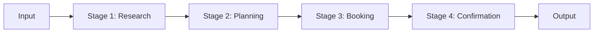

# Lab 10: Sequential Agent - Pipeline Workflows

## 🎯 Learning Objectives

- Understand sequential processing patterns
- Build multi-stage agent pipelines
- Implement workflow orchestration
- Handle stage dependencies and data flow
- Create resumable workflows

## 📖 Core Concepts

### What is Sequential Processing?

**Analogy**: Like an **assembly line** in manufacturing:
- Each station does one specific task
- Output from one station feeds the next
- Quality checks at each stage
- Can pause and resume

### Pipeline Pattern



## 🏨 Travel Agent Use Case: TravelMate Pipeline

Building **TravelMate Pipeline** with stages:

1. **Research Stage**: Gather destination info
2. **Planning Stage**: Create itinerary
3. **Booking Stage**: Reserve flights/hotels
4. **Confirmation Stage**: Send confirmations

## 💻 Code Walkthrough

### Step 1: Pipeline Stage

```python
from typing import Any, Dict
from pydantic import BaseModel

class StageResult(BaseModel):
    """Result from a pipeline stage."""
    stage_name: str
    success: bool
    data: Dict[str, Any]
    next_stage: str = None
    error: str = None

class PipelineStage:
    """Base class for pipeline stages."""
    
    def __init__(self, name: str):
        self.name = name
    
    def execute(self, input_data: Dict[str, Any]) -> StageResult:
        """Execute this stage."""
        raise NotImplementedError
    
    def can_execute(self, input_data: Dict[str, Any]) -> bool:
        """Check if stage can execute with given input."""
        return True
```

### Step 2: Travel Planning Stages

```python
from google import genai

class ResearchStage(PipelineStage):
    """Research destination information."""
    
    def __init__(self, api_key: str):
        super().__init__("Research")
        self.client = genai.Client(api_key=api_key)
        self.agent = self.client.agentic.create_agent(
            model="gemini-2.0-flash-exp",
            system_instruction="Research travel destinations and provide key information."
        )
    
    def execute(self, input_data: Dict[str, Any]) -> StageResult:
        """Research the destination."""
        destination = input_data.get("destination")
        
        query = f"Provide key information about traveling to {destination}"
        session = self.client.agentic.create_session(agent=self.agent)
        response = session.send_message(query)
        
        return StageResult(
            stage_name=self.name,
            success=True,
            data={
                "destination": destination,
                "research": response.text
            },
            next_stage="Planning"
        )

class PlanningStage(PipelineStage):
    """Create travel itinerary."""
    
    def __init__(self, api_key: str):
        super().__init__("Planning")
        self.client = genai.Client(api_key=api_key)
        self.agent = self.client.agentic.create_agent(
            model="gemini-2.0-flash-exp",
            system_instruction="Create detailed travel itineraries."
        )
    
    def execute(self, input_data: Dict[str, Any]) -> StageResult:
        """Create itinerary."""
        destination = input_data.get("destination")
        days = input_data.get("days", 7)
        research = input_data.get("research", "")
        
        query = f"""
        Based on this research: {research[:500]}
        Create a {days}-day itinerary for {destination}
        """
        
        session = self.client.agentic.create_session(agent=self.agent)
        response = session.send_message(query)
        
        return StageResult(
            stage_name=self.name,
            success=True,
            data={
                **input_data,
                "itinerary": response.text
            },
            next_stage="Booking"
        )

class BookingStage(PipelineStage):
    """Handle bookings."""
    
    def __init__(self, api_key: str):
        super().__init__("Booking")
        self.client = genai.Client(api_key=api_key)
    
    def execute(self, input_data: Dict[str, Any]) -> StageResult:
        """Process bookings."""
        # Simplified booking logic
        bookings = {
            "flight": "Booked",
            "hotel": "Booked",
            "confirmation_code": "ABC123"
        }
        
        return StageResult(
            stage_name=self.name,
            success=True,
            data={
                **input_data,
                "bookings": bookings
            },
            next_stage="Confirmation"
        )
```

### Step 3: Pipeline Orchestrator

```python
class TravelPipeline:
    """Orchestrates the travel planning pipeline."""
    
    def __init__(self, api_key: str):
        self.stages = {
            "Research": ResearchStage(api_key),
            "Planning": PlanningStage(api_key),
            "Booking": BookingStage(api_key)
        }
        self.current_stage = "Research"
        self.pipeline_data = {}
    
    def execute(self, initial_data: Dict[str, Any]) -> Dict[str, Any]:
        """Execute the complete pipeline."""
        self.pipeline_data = initial_data
        current_stage_name = "Research"
        
        while current_stage_name:
            print(f"\n=== Executing: {current_stage_name} ===")
            
            stage = self.stages.get(current_stage_name)
            if not stage:
                break
            
            result = stage.execute(self.pipeline_data)
            
            if not result.success:
                print(f"Stage failed: {result.error}")
                break
            
            # Update pipeline data
            self.pipeline_data.update(result.data)
            
            # Move to next stage
            current_stage_name = result.next_stage
        
        return self.pipeline_data

# Usage
pipeline = TravelPipeline(api_key='your_api_key_here')

result = pipeline.execute({
    "destination": "Tokyo",
    "days": 7,
    "budget": 3000
})

print("\n=== FINAL RESULT ===")
print(json.dumps(result, indent=2, default=str))
```

## 🎓 Key Takeaways

✅ **Sequential pipelines** break complex tasks into stages
✅ **Each stage** has clear inputs and outputs
✅ **Orchestrators** manage workflow execution
✅ **Resumable workflows** handle interruptions
✅ **Progress tracking** shows pipeline status

## 🔗 Connection to Next Lab

Lab 11 covers **Parallel Agents** - running multiple agents simultaneously for faster processing.

---

← [Lab 9: Callbacks](./Lab9_Guide_Callbacks.md) | **Next**: [Lab 11: Parallel Agent](./Lab11_Guide_Parallel_Agent.md) →
