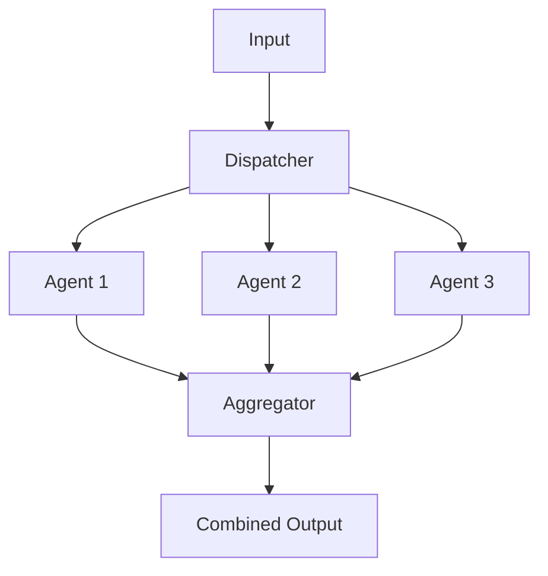

# Lab 11: Parallel Agent - Concurrent Operations

## 🎯 Learning Objectives

- Understand parallel processing patterns
- Implement concurrent agent execution
- Handle async operations efficiently
- Aggregate results from multiple agents
- Optimize performance with parallelism

## 📖 Core Concepts

### What is Parallel Processing?

**Analogy**: Like **multiple checkout lanes** at a store:
- Multiple customers served simultaneously
- Faster overall throughput
- Independent operations
- Results combined at the end

### Parallel Pattern



## 🏨 Travel Agent Use Case: TravelMate Parallel

Building **TravelMate Parallel** for fast searches:

1. **Parallel Flight Search**: Multiple airlines simultaneously
2. **Parallel Hotel Search**: Multiple booking sites
3. **Parallel Activity Search**: Multiple sources
4. **Result Aggregation**: Combine and rank all results

## 💻 Code Walkthrough

### Step 1: Async Agent Wrapper

```python
import asyncio
from typing import List, Dict, Any

class AsyncAgent:
    """Async wrapper for agents."""
    
    def __init__(self, api_key: str, name: str):
        self.client = genai.Client(api_key=api_key)
        self.name = name
        self.agent = self.client.agentic.create_agent(
            model="gemini-2.0-flash-exp",
            system_instruction=f"You are {name}."
        )
    
    async def search(self, query: str) -> Dict[str, Any]:
        """Async search method."""
        # Simulate async operation
        await asyncio.sleep(0.1)
        
        session = self.client.agentic.create_session(agent=self.agent)
        response = session.send_message(query)
        
        return {
            "agent": self.name,
            "result": response.text
        }
```

### Step 2: Parallel Executor

```python
class ParallelTravelSearch:
    """Execute multiple searches in parallel."""
    
    def __init__(self, api_key: str):
        self.agents = [
            AsyncAgent(api_key, "Flight Agent 1"),
            AsyncAgent(api_key, "Flight Agent 2"),
            AsyncAgent(api_key, "Hotel Agent")
        ]
    
    async def search_all(self, query: str) -> List[Dict[str, Any]]:
        """Search with all agents in parallel."""
        tasks = [agent.search(query) for agent in self.agents]
        results = await asyncio.gather(*tasks)
        return results
    
    def search(self, query: str) -> List[Dict[str, Any]]:
        """Synchronous wrapper."""
        return asyncio.run(self.search_all(query))

# Usage
searcher = ParallelTravelSearch(api_key='your_api_key_here')
results = searcher.search("Find flights to Paris")

for result in results:
    print(f"{result['agent']}: {result['result']}")
```

## 🎓 Key Takeaways

✅ **Parallel execution** dramatically improves performance
✅ **Async/await** enables concurrent operations
✅ **Result aggregation** combines multiple outputs
✅ **Error handling** is crucial in parallel systems
✅ **Resource management** prevents overload

## 🔗 Connection to Next Lab

Lab 12 covers **Loop Agents** - iterative refinement through feedback loops.

---

← [Lab 10: Sequential Agent](./Lab10_Guide_Sequential_Agent.md) | **Next**: [Lab 12: Loop Agent](./Lab12_Guide_Loop_Agent.md) →
