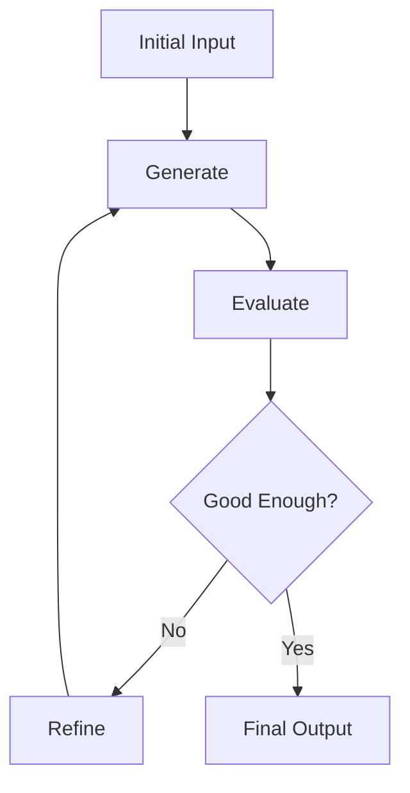

# Lab 12: Loop Agent - Iterative Refinement

## 🎯 Learning Objectives

- Understand iterative refinement patterns
- Implement feedback loops
- Build self-improving agents
- Handle convergence criteria
- Create quality-driven workflows

## 📖 Core Concepts

### What is a Loop Agent?

**Analogy**: Like **editing a document**:
- Write first draft
- Review and identify issues
- Revise and improve
- Repeat until satisfied
- Final polished version

### Loop Pattern



## 🏨 Travel Agent Use Case: TravelMate Refined

Building **TravelMate Refined** with iterative improvement:

1. **Generate Itinerary**: Create initial plan
2. **Evaluate Quality**: Check completeness, budget, feasibility
3. **Refine**: Improve based on evaluation
4. **Repeat**: Until quality threshold met
5. **Deliver**: Final polished itinerary

## 💻 Code Walkthrough

### Step 1: Loop Agent

```python
from google import genai
from typing import Dict, Any

class LoopAgent:
    """Agent with iterative refinement."""
    
    def __init__(self, api_key: str, max_iterations: int = 3):
        self.client = genai.Client(api_key=api_key)
        self.max_iterations = max_iterations
        
        self.generator = self.client.agentic.create_agent(
            model="gemini-2.0-flash-exp",
            system_instruction="Generate travel itineraries."
        )
        
        self.evaluator = self.client.agentic.create_agent(
            model="gemini-2.0-flash-exp",
            system_instruction="Evaluate itineraries and suggest improvements."
        )
    
    def generate_with_refinement(self, query: str) -> Dict[str, Any]:
        """Generate with iterative refinement."""
        current_output = None
        iteration = 0
        
        while iteration < self.max_iterations:
            print(f"\n=== Iteration {iteration + 1} ===")
            
            # Generate
            if current_output is None:
                prompt = query
            else:
                prompt = f"Improve this itinerary:\n{current_output}\n\nBased on: {feedback}"
            
            gen_session = self.client.agentic.create_session(agent=self.generator)
            current_output = gen_session.send_message(prompt).text
            
            # Evaluate
            eval_session = self.client.agentic.create_session(agent=self.evaluator)
            eval_prompt = f"Evaluate this itinerary:\n{current_output}"
            feedback = eval_session.send_message(eval_prompt).text
            
            # Check if good enough
            if "excellent" in feedback.lower() or "perfect" in feedback.lower():
                print("Quality threshold met!")
                break
            
            iteration += 1
        
        return {
            "final_output": current_output,
            "iterations": iteration + 1,
            "final_feedback": feedback
        }

# Usage
agent = LoopAgent(api_key='your_api_key_here')
result = agent.generate_with_refinement("Create a 5-day Paris itinerary")

print("\n=== FINAL RESULT ===")
print(result["final_output"])
print(f"\nRefined through {result['iterations']} iterations")
```

## 🎓 Key Takeaways

✅ **Loop agents** iteratively improve outputs
✅ **Evaluation** guides refinement
✅ **Convergence criteria** prevent infinite loops
✅ **Quality thresholds** ensure good results
✅ **Feedback loops** enable self-improvement

## 🎉 Course Complete!

Congratulations! You've mastered all 12 labs of Google ADK. You can now:
- Build basic to advanced AI agents
- Implement tools and multi-model systems
- Manage state and persistence
- Coordinate multi-agent systems
- Monitor and optimize performance
- Create production-ready agent applications

## 📚 Next Steps

1. Build your own agent project
2. Explore Google ADK documentation
3. Join the AI developer community
4. Share your creations!

---

← [Lab 11: Parallel Agent](./Lab11_Guide_Parallel_Agent.md) | **[Back to Guide Home](./README.md)** 🏠
