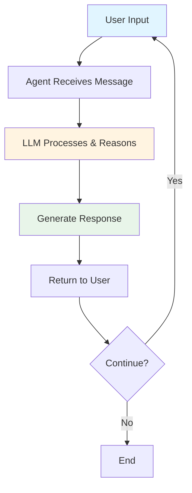
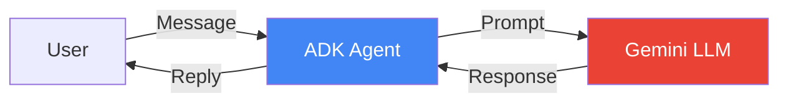
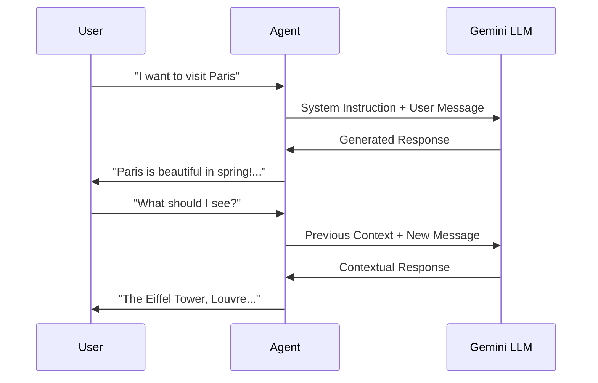

# Lab 1: Basic Agent - Your First Travel Assistant

## 🎯 Learning Objectives

By the end of this lab, you will:
- Understand what an AI agent is and how it differs from a simple chatbot
- Learn the core components of Google ADK
- Build your first conversational travel assistant
- Understand the agent execution loop

## 📖 Core Concepts

### What is an AI Agent?

Think of an AI agent like a **smart travel concierge** at a hotel:

- **Chatbot**: Answers questions from a script ("The pool is on the 3rd floor")
- **AI Agent**: Understands context, reasons, and takes actions ("I see you're traveling with kids. The pool on the 3rd floor has a shallow section perfect for children, and it's open until 9 PM. Would you like me to reserve pool towels for you?")

### Key Differences

| Chatbot | AI Agent |
|---------|----------|
| Follows predefined rules | Reasons and plans |
| Static responses | Dynamic, context-aware |
| No memory | Maintains conversation context |
| Can't take actions | Can use tools and APIs |

### The Agent Loop



## 🏨 Travel Agent Use Case: Meet TravelMate

In this lab, we're creating **TravelMate Basic** - a conversational assistant that:
- Greets travelers warmly
- Understands travel-related questions
- Provides helpful information about destinations
- Maintains context within a conversation

### Real-World Scenario

```
User: "Hi, I'm planning a trip to Japan"
TravelMate: "Hello! How exciting! Japan is a wonderful destination. 
             Are you interested in exploring the bustling cities like 
             Tokyo, or would you prefer the cultural heritage of Kyoto?"

User: "I love both modern and traditional experiences"
TravelMate: "Perfect! I'd recommend splitting your time between Tokyo 
             and Kyoto. Tokyo offers incredible technology, shopping, 
             and nightlife, while Kyoto has beautiful temples, gardens, 
             and traditional tea houses. How many days are you planning 
             to spend in Japan?"
```

## 🏗️ Architecture Overview



### Components Explained

1. **User Interface**: Where travelers interact (CLI, web, mobile)
2. **ADK Agent**: The orchestrator that manages the conversation
3. **Gemini LLM**: Google's AI model that generates intelligent responses
4. **System Prompt**: Instructions that define the agent's personality and role

## 💻 Code Walkthrough

### Step 1: Import Required Libraries

```python
from google import genai
from google.genai import types
```

**What's happening?**
- `genai`: Google's Generative AI library
- `types`: Type definitions for structured data

### Step 2: Initialize the Client

```python
client = genai.Client(api_key='your_api_key_here')
```

**Analogy**: This is like checking into a hotel - you present your credentials (API key) to access the services.

### Step 3: Define the Agent's Personality

```python
MODEL_ID = "gemini-2.0-flash-exp"

SYSTEM_INSTRUCTION = """
You are TravelMate, a friendly and knowledgeable travel assistant.
Your role is to help users plan their trips by:
- Providing destination information
- Suggesting activities and attractions
- Offering travel tips and advice
- Being warm, enthusiastic, and helpful

Keep responses concise but informative. Ask clarifying questions 
when needed to provide better recommendations.
"""
```

**Key Points**:
- `MODEL_ID`: Which AI model to use (Gemini 2.0 Flash is fast and efficient)
- `SYSTEM_INSTRUCTION`: The agent's "job description" - defines behavior and personality

### Step 4: Create the Agent

```python
agent = client.agentic.create_agent(
    model=MODEL_ID,
    system_instruction=SYSTEM_INSTRUCTION
)
```

**Analogy**: This is like hiring and training your travel concierge - you've given them their role and guidelines.

### Step 5: Start a Conversation Session

```python
session = client.agentic.create_session(agent=agent)
```

**What's a session?**
- A session is like a single conversation with a customer
- It maintains context across multiple messages
- Each new visitor would get a new session

### Step 6: Send Messages and Get Responses

```python
user_message = "I want to visit Paris in spring"

response = session.send_message(user_message)

print(f"TravelMate: {response.text}")
```

**The Magic Happens Here**:
1. User sends a message
2. Agent processes it with context from the session
3. LLM generates an intelligent response
4. Response is returned to the user

## 🔄 Complete Example: Interactive Travel Assistant

```python
from google import genai
from google.genai import types

# Initialize
client = genai.Client(api_key='your_api_key_here')

MODEL_ID = "gemini-2.0-flash-exp"

SYSTEM_INSTRUCTION = """
You are TravelMate, a friendly and knowledgeable travel assistant.
Help users plan amazing trips by providing destination information,
activity suggestions, and travel tips. Be warm and enthusiastic!
"""

# Create agent
agent = client.agentic.create_agent(
    model=MODEL_ID,
    system_instruction=SYSTEM_INSTRUCTION
)

# Create session
session = client.agentic.create_session(agent=agent)

# Interactive loop
print("TravelMate: Hello! I'm your travel assistant. Where would you like to go?")
print("(Type 'quit' to exit)\n")

while True:
    user_input = input("You: ").strip()
    
    if user_input.lower() in ['quit', 'exit', 'bye']:
        print("TravelMate: Safe travels! Come back anytime you need travel advice!")
        break
    
    if not user_input:
        continue
    
    # Send message and get response
    response = session.send_message(user_input)
    print(f"TravelMate: {response.text}\n")
```

## 🎨 Conversation Flow Diagram



## 🧪 Hands-On Exercise

### Exercise 1: Customize Your Agent

Modify the system instruction to create a specialized travel agent:

```python
# Option 1: Adventure Travel Specialist
SYSTEM_INSTRUCTION = """
You are AdventureMax, an extreme sports and adventure travel expert.
You specialize in thrilling experiences like skydiving, mountain climbing,
scuba diving, and off-the-beaten-path destinations.
"""

# Option 2: Luxury Travel Concierge
SYSTEM_INSTRUCTION = """
You are LuxeTravel, a high-end luxury travel consultant.
You specialize in 5-star hotels, private jets, exclusive experiences,
and VIP services. You're sophisticated and detail-oriented.
"""

# Option 3: Budget Travel Guide
SYSTEM_INSTRUCTION = """
You are BudgetBuddy, a savvy budget travel expert.
You help travelers find the best deals, free activities,
and affordable accommodations without sacrificing experience.
"""
```

### Exercise 2: Test Different Scenarios

Try these conversation starters:

1. **Family Trip**: "I'm traveling with two kids under 10 to Orlando"
2. **Solo Adventure**: "I'm a solo female traveler interested in Southeast Asia"
3. **Romantic Getaway**: "Planning an anniversary trip, somewhere romantic"
4. **Business Travel**: "Need to visit Tokyo for a conference, want to explore too"

### Exercise 3: Observe Context Retention

Have a multi-turn conversation:

```
You: "I want to visit Italy"
[Agent responds]

You: "What's the best time to go?"
[Agent should remember you're asking about Italy]

You: "How about food recommendations?"
[Agent should still be in Italy context]
```

## 🔍 Understanding the Output

When you run the agent, observe:

1. **Response Quality**: Is it relevant and helpful?
2. **Context Awareness**: Does it remember previous messages?
3. **Personality**: Does it match your system instruction?
4. **Helpfulness**: Does it ask clarifying questions?

## 🐛 Common Issues and Solutions

### Issue 1: Agent Forgets Context

**Problem**: Agent doesn't remember previous messages

**Solution**: Make sure you're using the same `session` object for all messages

```python
# ❌ Wrong - creates new session each time
response = client.agentic.create_session(agent=agent).send_message(msg)

# ✅ Correct - reuse the same session
session = client.agentic.create_session(agent=agent)
response = session.send_message(msg)
```

### Issue 2: Generic Responses

**Problem**: Agent gives generic, unhelpful answers

**Solution**: Improve your system instruction with specific guidelines

```python
SYSTEM_INSTRUCTION = """
You are TravelMate, a travel assistant.

Guidelines:
- Always ask about budget, travel dates, and preferences
- Provide specific recommendations with reasons
- Include practical tips (weather, local customs, safety)
- Suggest 3-5 options when recommending activities
- Be enthusiastic but not overwhelming
"""
```

### Issue 3: API Key Errors

**Problem**: Authentication failures

**Solution**: 
1. Check your `.env` file has the correct key
2. Verify the key is active in Google AI Studio
3. Ensure billing is enabled on your project

## 🎓 Key Takeaways

✅ **AI Agents** are more than chatbots - they reason, maintain context, and can take actions

✅ **Google ADK** provides a simple interface to build powerful agents

✅ **System Instructions** define your agent's personality and capabilities

✅ **Sessions** maintain conversation context across multiple messages

✅ **The Agent Loop**: Receive → Process → Respond → Repeat

## 🔗 Connection to Next Lab

In Lab 2, we'll give TravelMate **superpowers** by adding tools! Instead of just talking about flights and hotels, our agent will be able to:
- Search for real flight prices
- Check hotel availability
- Look up weather forecasts
- Calculate currency conversions

This transforms our agent from an advisor to an action-taker! 🚀

## 📚 Additional Resources

- [Google ADK Documentation](https://google.github.io/adk-docs/)
- [Gemini Model Guide](../GEMINI_MODELS.md)
- [Prompt Engineering Best Practices](https://ai.google.dev/docs/prompt_best_practices)

## ✅ Self-Check Quiz

Before moving to Lab 2, ensure you can answer:

1. What's the difference between a chatbot and an AI agent?
2. What are the three main components in a basic ADK agent?
3. What is the purpose of a system instruction?
4. Why do we use sessions?
5. How does the agent maintain context across messages?

---

**Next**: [Lab 2: Tool Agent - Give Your Agent Superpowers](./Lab2_Guide_Tool_Agent.md) →
