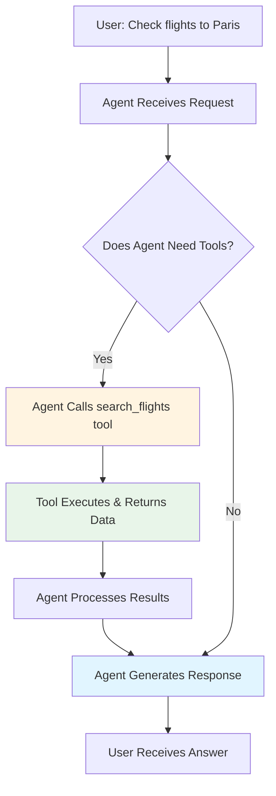
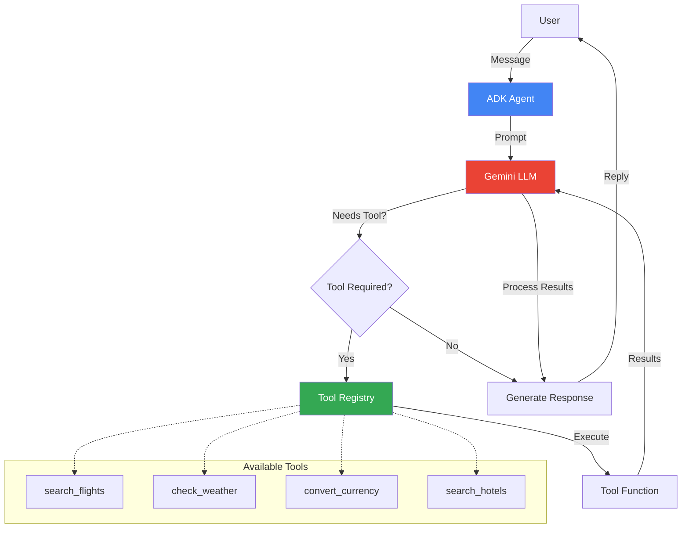
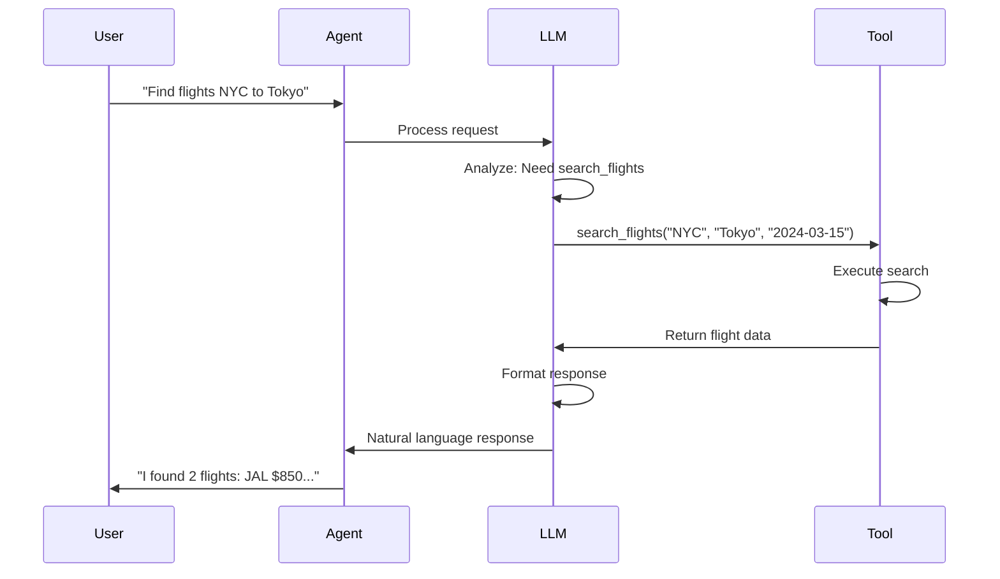

# Lab 2: Tool Agent - Give Your Agent Superpowers

## 🎯 Learning Objectives

By the end of this lab, you will:
- Understand what tools are and why agents need them
- Learn how to create and register tools with ADK
- Build a travel agent that can search flights and check weather
- Understand the tool calling loop and function execution

## 📖 Core Concepts

### What Are Tools?

**Analogy**: Think of tools as giving your travel agent a **phone and computer**:

- **Without Tools**: Agent can only talk (like a person with no phone)
  - "I think flights to Paris cost around $500-800"
  
- **With Tools**: Agent can take actions (like a person with phone + computer)
  - "Let me search for you... I found 3 flights: $645, $720, and $890"

### Why Do Agents Need Tools?

AI models are trained on historical data, but they can't:
- ❌ Access real-time information (current flight prices, weather)
- ❌ Perform calculations (currency conversion, date math)
- ❌ Interact with external systems (databases, APIs)
- ❌ Take actions (book tickets, send emails)

**Tools solve this!** They let agents:
- ✅ Call external APIs
- ✅ Query databases
- ✅ Perform computations
- ✅ Execute actions

### The Tool Calling Loop



## 🏨 Travel Agent Use Case: TravelMate with Tools

Now we're upgrading TravelMate to **TravelMate Pro** with these capabilities:

1. **Flight Search Tool**: Search for flights between cities
2. **Weather Tool**: Check weather forecasts for destinations
3. **Currency Converter**: Convert prices between currencies
4. **Hotel Search Tool**: Find available hotels

### Real-World Scenario

```
User: "I want to fly from New York to Tokyo next month"

TravelMate: [Calls search_flights tool]
            "I found several options for you:
            - JAL Flight 006: $850, direct, 14h
            - United 79: $720, 1 stop, 18h
            - ANA 1010: $920, direct, 13.5h
            
            Would you like me to check the weather in Tokyo?"

User: "Yes, and what's that in euros?"

TravelMate: [Calls weather_tool and currency_converter]
            "Tokyo will be 18°C (64°F) with light rain next month.
            The prices in euros are:
            - JAL: €780
            - United: €660
            - ANA: €845"
```

## 🏗️ Architecture with Tools



## 💻 Code Walkthrough

### Step 1: Define Your First Tool

```python
def search_flights(origin: str, destination: str, date: str) -> dict:
    """
    Search for flights between two cities.
    
    Args:
        origin: Departure city (e.g., "New York")
        destination: Arrival city (e.g., "Tokyo")
        date: Travel date in YYYY-MM-DD format
    
    Returns:
        Dictionary with flight options
    """
    # In real world, this would call an API like Amadeus or Skyscanner
    # For demo, we return mock data
    
    flights = [
        {
            "airline": "JAL",
            "flight_number": "JL006",
            "price": 850,
            "duration": "14h",
            "stops": 0
        },
        {
            "airline": "United",
            "flight_number": "UA79",
            "price": 720,
            "duration": "18h",
            "stops": 1
        },
        {
            "airline": "ANA",
            "flight_number": "NH1010",
            "price": 920,
            "duration": "13.5h",
            "stops": 0
        }
    ]
    
    return {
        "origin": origin,
        "destination": destination,
        "date": date,
        "flights": flights
    }
```

**Key Points**:
- **Type hints** (`str`, `dict`) help the LLM understand parameters
- **Docstring** is crucial - the LLM reads this to know when to use the tool
- **Return structured data** that the LLM can interpret

### Step 2: Create More Tools

```python
def check_weather(city: str, date: str) -> dict:
    """
    Check weather forecast for a city on a specific date.
    
    Args:
        city: City name (e.g., "Tokyo")
        date: Date in YYYY-MM-DD format
    
    Returns:
        Weather information including temperature and conditions
    """
    # Mock weather data
    weather_data = {
        "Tokyo": {"temp": 18, "condition": "Light rain", "humidity": 75},
        "Paris": {"temp": 15, "condition": "Partly cloudy", "humidity": 60},
        "New York": {"temp": 22, "condition": "Sunny", "humidity": 50},
    }
    
    weather = weather_data.get(city, {"temp": 20, "condition": "Clear", "humidity": 55})
    
    return {
        "city": city,
        "date": date,
        "temperature_celsius": weather["temp"],
        "temperature_fahrenheit": weather["temp"] * 9/5 + 32,
        "condition": weather["condition"],
        "humidity": weather["humidity"]
    }


def convert_currency(amount: float, from_currency: str, to_currency: str) -> dict:
    """
    Convert amount from one currency to another.
    
    Args:
        amount: Amount to convert
        from_currency: Source currency code (e.g., "USD")
        to_currency: Target currency code (e.g., "EUR")
    
    Returns:
        Converted amount and exchange rate
    """
    # Mock exchange rates (in real app, use API like exchangerate-api.com)
    rates = {
        ("USD", "EUR"): 0.92,
        ("USD", "GBP"): 0.79,
        ("USD", "JPY"): 149.50,
        ("EUR", "USD"): 1.09,
        ("GBP", "USD"): 1.27,
        ("JPY", "USD"): 0.0067,
    }
    
    rate = rates.get((from_currency, to_currency), 1.0)
    converted = amount * rate
    
    return {
        "original_amount": amount,
        "from_currency": from_currency,
        "to_currency": to_currency,
        "converted_amount": round(converted, 2),
        "exchange_rate": rate
    }
```

### Step 3: Register Tools with Agent

```python
from google import genai
from google.genai import types

# Initialize client
client = genai.Client(api_key='your_api_key_here')

MODEL_ID = "gemini-2.0-flash-exp"

SYSTEM_INSTRUCTION = """
You are TravelMate Pro, an advanced travel assistant with access to real-time tools.

You can:
- Search for flights between cities
- Check weather forecasts
- Convert currencies
- Search for hotels

Always use your tools to provide accurate, up-to-date information.
When a user asks about flights, weather, or prices, use the appropriate tool.
Present information clearly and offer to help with related queries.
"""

# Create agent with tools
agent = client.agentic.create_agent(
    model=MODEL_ID,
    system_instruction=SYSTEM_INSTRUCTION,
    tools=[search_flights, check_weather, convert_currency]  # Register tools here!
)

# Create session
session = client.agentic.create_session(agent=agent)
```

**Critical**: The `tools` parameter registers your functions with the agent!

### Step 4: Agent Automatically Calls Tools

```python
# User asks about flights
user_message = "Find me flights from New York to Tokyo on 2024-03-15"

response = session.send_message(user_message)
print(response.text)

# Behind the scenes:
# 1. LLM sees the message
# 2. LLM decides it needs search_flights tool
# 3. LLM calls: search_flights("New York", "Tokyo", "2024-03-15")
# 4. Tool returns flight data
# 5. LLM formats the data into a natural response
```

## 🔄 Complete Example: Travel Agent with Tools

```python
from google import genai
from google.genai import types

# Tool definitions
def search_flights(origin: str, destination: str, date: str) -> dict:
    """Search for flights between two cities."""
    flights = [
        {"airline": "JAL", "price": 850, "duration": "14h", "stops": 0},
        {"airline": "United", "price": 720, "duration": "18h", "stops": 1},
    ]
    return {"origin": origin, "destination": destination, "flights": flights}

def check_weather(city: str, date: str) -> dict:
    """Check weather forecast for a city."""
    return {
        "city": city,
        "temperature_celsius": 18,
        "condition": "Partly cloudy"
    }

def convert_currency(amount: float, from_currency: str, to_currency: str) -> dict:
    """Convert currency."""
    rate = 0.92 if from_currency == "USD" and to_currency == "EUR" else 1.0
    return {
        "original_amount": amount,
        "converted_amount": round(amount * rate, 2),
        "from_currency": from_currency,
        "to_currency": to_currency
    }

# Initialize
client = genai.Client(api_key='your_api_key_here')

SYSTEM_INSTRUCTION = """
You are TravelMate Pro with access to flight search, weather, and currency tools.
Use these tools to provide accurate information. Be helpful and proactive.
"""

# Create agent with tools
agent = client.agentic.create_agent(
    model="gemini-2.0-flash-exp",
    system_instruction=SYSTEM_INSTRUCTION,
    tools=[search_flights, check_weather, convert_currency]
)

session = client.agentic.create_session(agent=agent)

# Interactive loop
print("TravelMate Pro: Hello! I can search flights, check weather, and convert currencies!")
print("(Type 'quit' to exit)\n")

while True:
    user_input = input("You: ").strip()
    
    if user_input.lower() in ['quit', 'exit']:
        break
    
    response = session.send_message(user_input)
    print(f"TravelMate Pro: {response.text}\n")
```

## 🎨 Tool Calling Sequence



## 🧪 Hands-On Exercises

### Exercise 1: Add a Hotel Search Tool

```python
def search_hotels(city: str, checkin: str, checkout: str, guests: int = 2) -> dict:
    """
    Search for hotels in a city.
    
    Args:
        city: City name
        checkin: Check-in date (YYYY-MM-DD)
        checkout: Check-out date (YYYY-MM-DD)
        guests: Number of guests
    
    Returns:
        List of available hotels
    """
    hotels = [
        {
            "name": "Grand Hotel",
            "price_per_night": 150,
            "rating": 4.5,
            "amenities": ["WiFi", "Pool", "Gym"]
        },
        {
            "name": "Budget Inn",
            "price_per_night": 80,
            "rating": 3.8,
            "amenities": ["WiFi", "Breakfast"]
        },
        {
            "name": "Luxury Resort",
            "price_per_night": 300,
            "rating": 5.0,
            "amenities": ["WiFi", "Pool", "Spa", "Restaurant"]
        }
    ]
    
    return {
        "city": city,
        "checkin": checkin,
        "checkout": checkout,
        "guests": guests,
        "hotels": hotels
    }

# Add to your agent's tools list
agent = client.agentic.create_agent(
    model=MODEL_ID,
    system_instruction=SYSTEM_INSTRUCTION,
    tools=[search_flights, check_weather, convert_currency, search_hotels]
)
```

### Exercise 2: Create a Distance Calculator Tool

```python
def calculate_distance(city1: str, city2: str) -> dict:
    """
    Calculate distance between two cities.
    
    Args:
        city1: First city
        city2: Second city
    
    Returns:
        Distance in kilometers and miles
    """
    # Mock distances (in real app, use geopy or Google Maps API)
    distances = {
        ("New York", "Tokyo"): 10850,
        ("Paris", "London"): 344,
        ("Los Angeles", "New York"): 3944,
    }
    
    key = (city1, city2)
    reverse_key = (city2, city1)
    
    km = distances.get(key) or distances.get(reverse_key, 1000)
    miles = km * 0.621371
    
    return {
        "city1": city1,
        "city2": city2,
        "distance_km": km,
        "distance_miles": round(miles, 2)
    }
```

### Exercise 3: Test Multi-Tool Scenarios

Try these complex queries that require multiple tools:

```
1. "Find flights from NYC to Paris, check the weather there, 
    and convert the flight price to euros"

2. "I want to visit Tokyo. Show me flights, hotels, and weather.
    What's the total cost in British pounds?"

3. "Compare flight prices between London and Rome vs London and Barcelona.
    Which is cheaper and what's the weather like?"
```

## 🔍 Understanding Tool Selection

### How Does the LLM Choose Tools?

The LLM analyzes:
1. **Function name**: `search_flights` suggests flight-related
2. **Docstring**: Detailed description of what it does
3. **Parameters**: What inputs it needs
4. **Context**: What the user is asking for

### Example Decision Process

```
User: "What's the weather in Paris?"

LLM thinks:
- User wants weather information
- I have a check_weather tool
- It needs: city (Paris), date (today)
- Decision: Call check_weather("Paris", "2024-03-15")
```

## 🐛 Common Issues and Solutions

### Issue 1: Tool Not Being Called

**Problem**: Agent doesn't use your tool

**Solutions**:
```python
# ❌ Bad: Vague docstring
def get_flights(a, b):
    """Gets flights"""
    pass

# ✅ Good: Clear, detailed docstring
def search_flights(origin: str, destination: str, date: str) -> dict:
    """
    Search for available flights between two cities on a specific date.
    Use this when users ask about flights, airfare, or flying.
    
    Args:
        origin: Departure city name (e.g., "New York", "London")
        destination: Arrival city name (e.g., "Tokyo", "Paris")
        date: Travel date in YYYY-MM-DD format
    
    Returns:
        Dictionary containing list of flights with prices and details
    """
    pass
```

### Issue 2: Tool Errors

**Problem**: Tool crashes or returns errors

**Solution**: Add error handling

```python
def search_flights(origin: str, destination: str, date: str) -> dict:
    """Search for flights between two cities."""
    try:
        # Validate inputs
        if not origin or not destination:
            return {"error": "Origin and destination are required"}
        
        # Your logic here
        flights = get_flights_from_api(origin, destination, date)
        
        return {"flights": flights}
    
    except Exception as e:
        return {"error": f"Failed to search flights: {str(e)}"}
```

### Issue 3: Slow Tool Execution

**Problem**: Tools take too long, user waits

**Solution**: Add timeouts and caching

```python
import time
from functools import lru_cache

@lru_cache(maxsize=100)  # Cache results
def search_flights(origin: str, destination: str, date: str) -> dict:
    """Search for flights (cached for 5 minutes)."""
    # Add timeout to API calls
    response = requests.get(api_url, timeout=5)
    return response.json()
```

## 🎓 Key Takeaways

✅ **Tools extend agent capabilities** beyond conversation to actions

✅ **Clear docstrings** are essential - the LLM reads them to understand tools

✅ **Type hints** help the LLM call tools correctly

✅ **The agent automatically decides** when and which tools to use

✅ **Tools can be chained** - agent can call multiple tools for complex queries

✅ **Error handling** in tools prevents agent failures

## 🔗 Connection to Next Lab

In Lab 3, we'll learn about **LiteLLM** - a way to make our agent work with multiple AI models (OpenAI, Anthropic, Cohere) without changing our code. This gives us:
- Model flexibility
- Cost optimization
- Fallback options
- Performance comparison

## 📚 Additional Resources

- [Function Calling Guide](https://ai.google.dev/docs/function_calling)
- [Tool Best Practices](https://google.github.io/adk-docs/tools/)
- [API Integration Patterns](https://google.github.io/adk-docs/patterns/)

## ✅ Self-Check Quiz

Before moving to Lab 3:

1. What's the difference between an agent with and without tools?
2. Why are docstrings important for tools?
3. How does the LLM decide which tool to call?
4. Can an agent call multiple tools for one user query?
5. What should you return if a tool encounters an error?

---

← [Lab 1: Basic Agent](./Lab1_Guide_Basic_Agent.md) | **Next**: [Lab 3: LiteLLM Agent](./Lab3_Guide_LiteLLM_Agent.md) →
