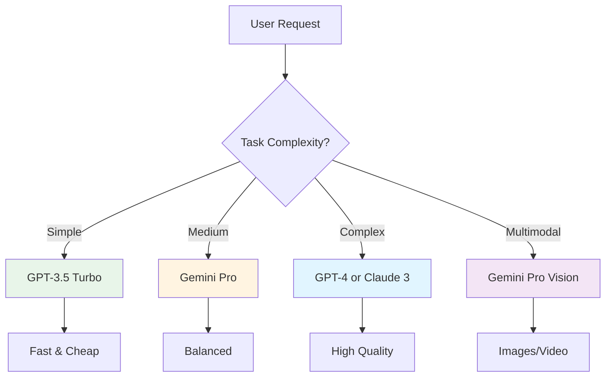
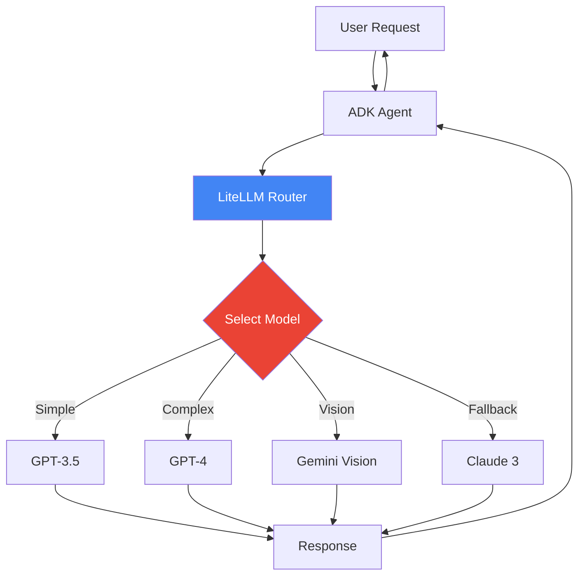
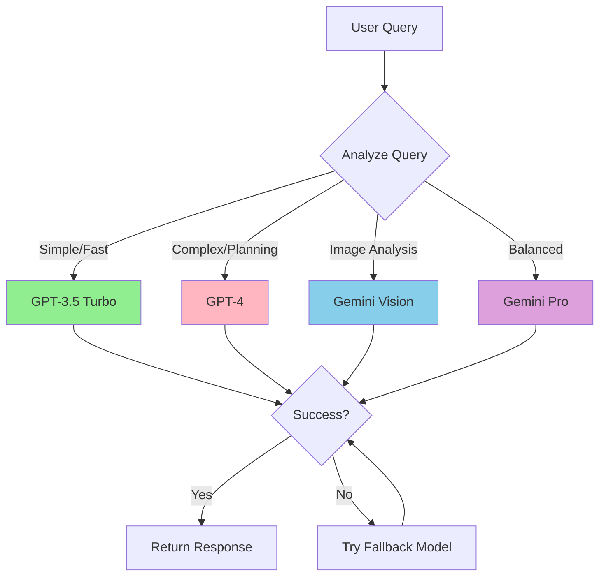

# Lab 3: LiteLLM Agent - Multi-Model Flexibility

## 🎯 Learning Objectives

By the end of this lab, you will:
- Understand why model flexibility matters
- Learn how LiteLLM provides a unified interface for multiple AI models
- Build a travel agent that can switch between different LLMs
- Compare performance and costs across models
- Implement fallback strategies

## 📖 Core Concepts

### What is LiteLLM?

**Analogy**: Think of LiteLLM as a **universal translator** for AI models:

- **Without LiteLLM**: Each AI provider has different code
  ```python
  # OpenAI
  openai.ChatCompletion.create(...)
  
  # Anthropic
  anthropic.messages.create(...)
  
  # Google
  genai.generate_content(...)
  ```

- **With LiteLLM**: One interface for all models
  ```python
  # Works with any model!
  litellm.completion(model="gpt-4", ...)
  litellm.completion(model="claude-3", ...)
  litellm.completion(model="gemini-pro", ...)
  ```

### Why Use Multiple Models?

Different models excel at different tasks:

| Model | Best For | Cost | Speed |
|-------|----------|------|-------|
| GPT-4 | Complex reasoning, coding | $$$ | Slow |
| Claude 3 | Long documents, analysis | $$ | Medium |
| Gemini Pro | Multimodal, real-time | $ | Fast |
| GPT-3.5 | Simple tasks, high volume | $ | Very Fast |

### Model Selection Strategy



## 🏨 Travel Agent Use Case: TravelMate Flex

We're creating **TravelMate Flex** that intelligently chooses models:

- **Simple queries** (weather, currency): Fast, cheap model (GPT-3.5)
- **Complex planning** (multi-city itinerary): Smart model (GPT-4)
- **Image analysis** (hotel photos, destination pics): Vision model (Gemini Pro Vision)
- **Cost-sensitive** operations: Budget model with fallback

### Real-World Scenario

```
User: "What's the weather in Paris?"
TravelMate: [Uses GPT-3.5 - fast and cheap for simple query]
            "Paris is currently 15°C with partly cloudy skies"

User: "Plan a 2-week itinerary across Europe visiting 5 countries"
TravelMate: [Switches to GPT-4 - complex planning needs reasoning]
            "I'll create a comprehensive itinerary...
            Week 1: France (3 days) → Italy (4 days)
            Week 2: Switzerland (3 days) → Germany (4 days)..."

User: "Is this hotel room nice?" [uploads image]
TravelMate: [Uses Gemini Pro Vision - image analysis]
            "The room looks spacious with modern amenities..."
```

## 🏗️ Architecture with LiteLLM



## 💻 Code Walkthrough

### Step 1: Install and Import LiteLLM

```bash
pip install litellm
```

```python
from litellm import completion
import os

# Set API keys for different providers
os.environ["OPENAI_API_KEY"] = "your_openai_key"
os.environ["ANTHROPIC_API_KEY"] = "your_anthropic_key"
os.environ["GOOGLE_API_KEY"] = "your_google_key"
```

### Step 2: Basic LiteLLM Usage

```python
def ask_model(prompt: str, model: str = "gpt-3.5-turbo"):
    """
    Ask any LLM model a question using LiteLLM.
    
    Args:
        prompt: The question or instruction
        model: Model identifier (e.g., "gpt-4", "claude-3-opus", "gemini-pro")
    
    Returns:
        Model's response
    """
    response = completion(
        model=model,
        messages=[{"role": "user", "content": prompt}]
    )
    
    return response.choices[0].message.content


# Try different models with same code!
response1 = ask_model("What's the capital of France?", model="gpt-3.5-turbo")
response2 = ask_model("What's the capital of France?", model="claude-3-sonnet-20240229")
response3 = ask_model("What's the capital of France?", model="gemini-pro")
```

**Key Point**: Same function works with any model!

### Step 3: Integrate with ADK Agent

```python
from google import genai
from google.genai import types
import litellm

class FlexibleTravelAgent:
    def __init__(self, default_model="gpt-3.5-turbo"):
        self.default_model = default_model
        self.client = genai.Client(api_key=os.getenv("GOOGLE_API_KEY"))
    
    def route_to_best_model(self, query: str) -> str:
        """
        Intelligently route query to the best model.
        
        Args:
            query: User's question
        
        Returns:
            Best model for this query
        """
        query_lower = query.lower()
        
        # Simple queries -> fast, cheap model
        simple_keywords = ["weather", "currency", "time", "date"]
        if any(keyword in query_lower for keyword in simple_keywords):
            return "gpt-3.5-turbo"
        
        # Complex planning -> smart model
        complex_keywords = ["itinerary", "plan", "recommend", "compare"]
        if any(keyword in query_lower for keyword in complex_keywords):
            return "gpt-4"
        
        # Image-related -> vision model
        if "image" in query_lower or "photo" in query_lower or "picture" in query_lower:
            return "gemini-pro-vision"
        
        # Default
        return self.default_model
    
    def ask(self, query: str, model: str = None):
        """
        Ask the agent a question.
        
        Args:
            query: User's question
            model: Optional specific model to use
        
        Returns:
            Agent's response
        """
        # Auto-select model if not specified
        if model is None:
            model = self.route_to_best_model(query)
        
        print(f"[Using model: {model}]")
        
        # Use LiteLLM to call the model
        response = completion(
            model=model,
            messages=[
                {
                    "role": "system",
                    "content": "You are TravelMate Flex, a helpful travel assistant."
                },
                {
                    "role": "user",
                    "content": query
                }
            ]
        )
        
        return response.choices[0].message.content


# Usage
agent = FlexibleTravelAgent()

# Simple query -> uses GPT-3.5
response1 = agent.ask("What's the weather in Tokyo?")

# Complex query -> uses GPT-4
response2 = agent.ask("Plan a 10-day itinerary for Japan")

# Force specific model
response3 = agent.ask("Tell me about Paris", model="claude-3-sonnet-20240229")
```

### Step 4: Implement Fallback Strategy

```python
def ask_with_fallback(query: str, models: list = None):
    """
    Try multiple models with fallback if one fails.
    
    Args:
        query: User's question
        models: List of models to try in order
    
    Returns:
        Response from first successful model
    """
    if models is None:
        models = ["gpt-4", "claude-3-sonnet-20240229", "gemini-pro", "gpt-3.5-turbo"]
    
    for model in models:
        try:
            print(f"Trying {model}...")
            response = completion(
                model=model,
                messages=[{"role": "user", "content": query}],
                timeout=10  # 10 second timeout
            )
            print(f"✓ Success with {model}")
            return response.choices[0].message.content
        
        except Exception as e:
            print(f"✗ {model} failed: {str(e)}")
            continue
    
    return "Sorry, all models failed. Please try again later."


# Usage
response = ask_with_fallback("Plan a trip to Iceland")
```

### Step 5: Cost Tracking

```python
import litellm

# Enable cost tracking
litellm.success_callback = ["langfuse"]  # Optional: log to Langfuse

def ask_with_cost_tracking(query: str, model: str):
    """
    Ask a question and track the cost.
    
    Args:
        query: User's question
        model: Model to use
    
    Returns:
        Tuple of (response, cost)
    """
    response = completion(
        model=model,
        messages=[{"role": "user", "content": query}]
    )
    
    # LiteLLM automatically calculates cost
    cost = litellm.completion_cost(completion_response=response)
    
    return response.choices[0].message.content, cost


# Compare costs
query = "Recommend hotels in Paris"

response1, cost1 = ask_with_cost_tracking(query, "gpt-4")
print(f"GPT-4: ${cost1:.4f}")

response2, cost2 = ask_with_cost_tracking(query, "gpt-3.5-turbo")
print(f"GPT-3.5: ${cost2:.4f}")

response3, cost3 = ask_with_cost_tracking(query, "gemini-pro")
print(f"Gemini Pro: ${cost3:.4f}")
```

## 🔄 Complete Example: Multi-Model Travel Agent

```python
import litellm
from litellm import completion
import os

class TravelMateFlex:
    def __init__(self):
        self.conversation_history = []
        self.total_cost = 0.0
    
    def route_query(self, query: str) -> str:
        """Intelligently select the best model."""
        query_lower = query.lower()
        
        if any(word in query_lower for word in ["weather", "currency", "quick"]):
            return "gpt-3.5-turbo"  # Fast & cheap
        elif any(word in query_lower for word in ["itinerary", "plan", "complex"]):
            return "gpt-4"  # Smart & thorough
        elif "image" in query_lower or "photo" in query_lower:
            return "gemini-pro-vision"  # Vision capable
        else:
            return "gemini-pro"  # Balanced default
    
    def chat(self, user_message: str, model: str = None):
        """
        Chat with the agent.
        
        Args:
            user_message: User's message
            model: Optional specific model
        
        Returns:
            Agent's response
        """
        # Add user message to history
        self.conversation_history.append({
            "role": "user",
            "content": user_message
        })
        
        # Select model
        if model is None:
            model = self.route_query(user_message)
        
        print(f"[Using: {model}]")
        
        # Get response
        try:
            response = completion(
                model=model,
                messages=[
                    {
                        "role": "system",
                        "content": "You are TravelMate Flex, a helpful travel assistant."
                    }
                ] + self.conversation_history
            )
            
            # Track cost
            cost = litellm.completion_cost(completion_response=response)
            self.total_cost += cost
            
            # Get response text
            assistant_message = response.choices[0].message.content
            
            # Add to history
            self.conversation_history.append({
                "role": "assistant",
                "content": assistant_message
            })
            
            return assistant_message
        
        except Exception as e:
            return f"Error: {str(e)}"
    
    def get_stats(self):
        """Get conversation statistics."""
        return {
            "messages": len(self.conversation_history),
            "total_cost": f"${self.total_cost:.4f}"
        }


# Usage
agent = TravelMateFlex()

print("TravelMate Flex: Hello! I can help plan your trip using the best AI models!")
print("(Type 'stats' for usage statistics, 'quit' to exit)\n")

while True:
    user_input = input("You: ").strip()
    
    if user_input.lower() == 'quit':
        break
    
    if user_input.lower() == 'stats':
        stats = agent.get_stats()
        print(f"Stats: {stats}\n")
        continue
    
    response = agent.chat(user_input)
    print(f"TravelMate: {response}\n")

# Final stats
print(f"\nFinal Statistics: {agent.get_stats()}")
```

## 🎨 Model Selection Flow



## 🧪 Hands-On Exercises

### Exercise 1: Add Model Performance Comparison

```python
import time

def compare_models(query: str, models: list):
    """
    Compare response time and cost across models.
    
    Args:
        query: Test query
        models: List of models to compare
    
    Returns:
        Comparison results
    """
    results = []
    
    for model in models:
        start_time = time.time()
        
        try:
            response = completion(
                model=model,
                messages=[{"role": "user", "content": query}]
            )
            
            elapsed = time.time() - start_time
            cost = litellm.completion_cost(completion_response=response)
            
            results.append({
                "model": model,
                "time": f"{elapsed:.2f}s",
                "cost": f"${cost:.4f}",
                "response_length": len(response.choices[0].message.content)
            })
        
        except Exception as e:
            results.append({
                "model": model,
                "error": str(e)
            })
    
    return results


# Test
query = "Recommend a 3-day itinerary for Rome"
models = ["gpt-3.5-turbo", "gpt-4", "gemini-pro", "claude-3-sonnet-20240229"]

results = compare_models(query, models)
for result in results:
    print(result)
```

### Exercise 2: Implement Smart Caching

```python
from functools import lru_cache
import hashlib

class CachedTravelAgent:
    def __init__(self):
        self.cache = {}
    
    def _get_cache_key(self, query: str, model: str) -> str:
        """Generate cache key from query and model."""
        return hashlib.md5(f"{query}:{model}".encode()).hexdigest()
    
    def ask(self, query: str, model: str = "gpt-3.5-turbo"):
        """Ask with caching to save costs."""
        cache_key = self._get_cache_key(query, model)
        
        # Check cache
        if cache_key in self.cache:
            print("[Cache hit!]")
            return self.cache[cache_key]
        
        # Call model
        print("[Cache miss - calling model]")
        response = completion(
            model=model,
            messages=[{"role": "user", "content": query}]
        )
        
        result = response.choices[0].message.content
        
        # Store in cache
        self.cache[cache_key] = result
        
        return result


# Test caching
agent = CachedTravelAgent()

# First call - cache miss
response1 = agent.ask("What's the capital of France?")

# Second call - cache hit (no API call!)
response2 = agent.ask("What's the capital of France?")
```

### Exercise 3: Build a Model Router with Rules

```python
class SmartModelRouter:
    def __init__(self):
        self.rules = [
            {
                "keywords": ["weather", "temperature", "forecast"],
                "model": "gpt-3.5-turbo",
                "reason": "Simple factual query"
            },
            {
                "keywords": ["itinerary", "plan", "schedule", "organize"],
                "model": "gpt-4",
                "reason": "Complex planning task"
            },
            {
                "keywords": ["image", "photo", "picture", "look"],
                "model": "gemini-pro-vision",
                "reason": "Visual analysis needed"
            },
            {
                "keywords": ["translate", "language"],
                "model": "claude-3-sonnet-20240229",
                "reason": "Strong multilingual capabilities"
            }
        ]
        self.default_model = "gemini-pro"
    
    def select_model(self, query: str) -> dict:
        """
        Select best model based on rules.
        
        Returns:
            Dict with model and reason
        """
        query_lower = query.lower()
        
        for rule in self.rules:
            if any(keyword in query_lower for keyword in rule["keywords"]):
                return {
                    "model": rule["model"],
                    "reason": rule["reason"]
                }
        
        return {
            "model": self.default_model,
            "reason": "Default balanced model"
        }
    
    def ask(self, query: str):
        """Ask with automatic model selection."""
        selection = self.select_model(query)
        print(f"[Selected {selection['model']}: {selection['reason']}]")
        
        response = completion(
            model=selection["model"],
            messages=[{"role": "user", "content": query}]
        )
        
        return response.choices[0].message.content


# Test
router = SmartModelRouter()

print(router.ask("What's the weather in Tokyo?"))
print(router.ask("Plan a 2-week Europe trip"))
print(router.ask("Translate this to Spanish"))
```

## 🐛 Common Issues and Solutions

### Issue 1: API Key Not Found

**Problem**: `AuthenticationError: No API key found`

**Solution**:
```python
import os

# Set keys explicitly
os.environ["OPENAI_API_KEY"] = "sk-..."
os.environ["ANTHROPIC_API_KEY"] = "sk-ant-..."
os.environ["GOOGLE_API_KEY"] = "..."

# Or load from .env file
from dotenv import load_dotenv
load_dotenv()
```

### Issue 2: Model Not Supported

**Problem**: `BadRequestError: Model not found`

**Solution**: Check supported models
```python
# List all supported models
from litellm import model_list
print(model_list)

# Use correct model names
# ✓ Correct
completion(model="gpt-4")
completion(model="claude-3-sonnet-20240229")
completion(model="gemini-pro")

# ✗ Wrong
completion(model="gpt4")  # Missing hyphen
completion(model="claude-3")  # Incomplete name
```

### Issue 3: Rate Limits

**Problem**: Too many requests

**Solution**: Implement retry logic
```python
import time
from litellm import completion

def ask_with_retry(query: str, model: str, max_retries: int = 3):
    """Ask with exponential backoff retry."""
    for attempt in range(max_retries):
        try:
            return completion(
                model=model,
                messages=[{"role": "user", "content": query}]
            )
        except Exception as e:
            if "rate_limit" in str(e).lower() and attempt < max_retries - 1:
                wait_time = 2 ** attempt  # Exponential backoff
                print(f"Rate limited. Waiting {wait_time}s...")
                time.sleep(wait_time)
            else:
                raise
```

## 🎓 Key Takeaways

✅ **LiteLLM provides a unified interface** for multiple AI models

✅ **Different models excel at different tasks** - choose wisely

✅ **Intelligent routing** can optimize cost and performance

✅ **Fallback strategies** ensure reliability

✅ **Cost tracking** helps manage expenses

✅ **Caching** reduces API calls and costs

## 🔗 Connection to Next Lab

In Lab 4, we'll learn about **Structured Outputs** using Pydantic models. This ensures our agent returns data in consistent, predictable formats - crucial for:
- Integrating with databases
- Building UIs
- Processing responses programmatically
- Validating data quality

## 📚 Additional Resources

- [LiteLLM Documentation](https://docs.litellm.ai/)
- [Model Comparison Guide](https://docs.litellm.ai/docs/providers)
- [Cost Tracking](https://docs.litellm.ai/docs/completion/cost_tracking)

## ✅ Self-Check Quiz

1. What problem does LiteLLM solve?
2. When would you choose GPT-4 over GPT-3.5?
3. How do you implement a fallback strategy?
4. What's the benefit of cost tracking?
5. How can caching reduce API costs?

---

← [Lab 2: Tool Agent](./Lab2_Guide_Tool_Agent.md) | **Next**: [Lab 4: Structured Outputs](./Lab4_Guide_Structured_Outputs.md) →
