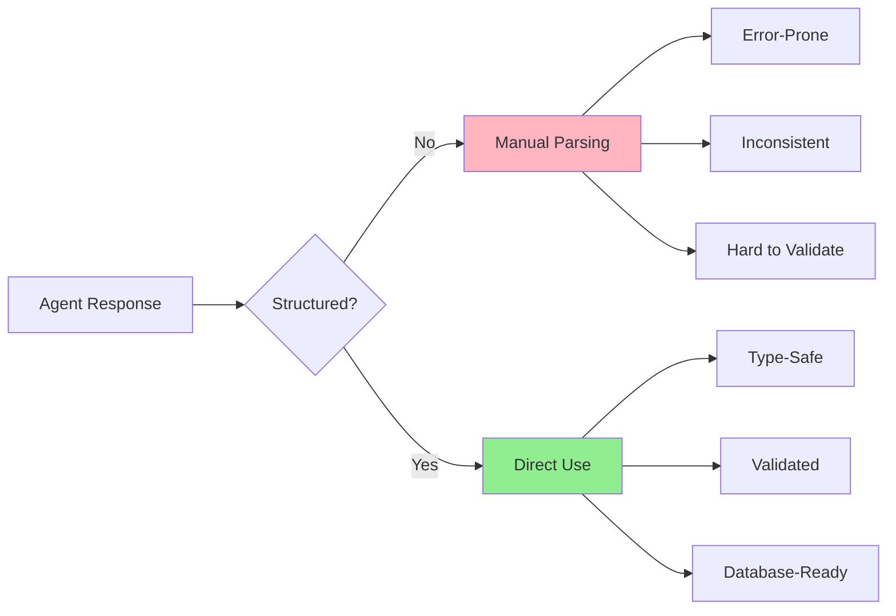
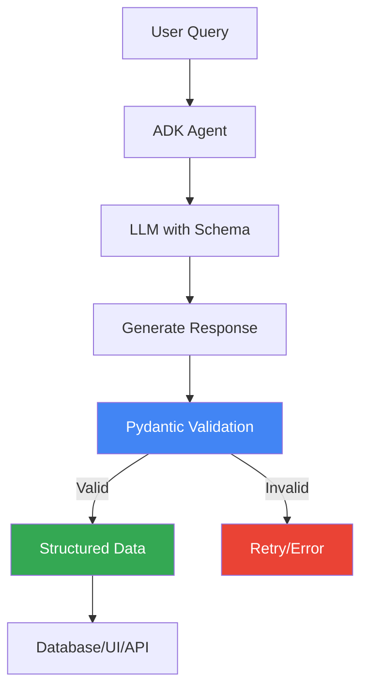
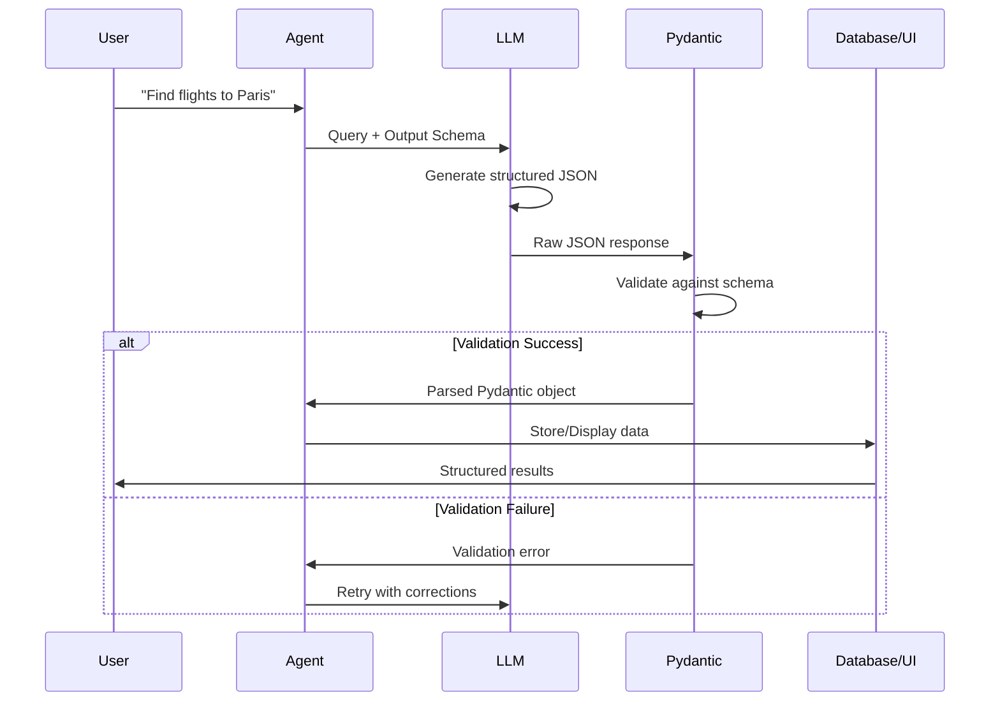

# Lab 4: Structured Outputs - Consistent, Reliable Data

## 🎯 Learning Objectives

By the end of this lab, you will:
- Understand why structured outputs matter for production systems
- Learn how to use Pydantic models to define output schemas
- Build a travel agent that returns consistent, validated data
- Handle complex nested data structures
- Validate and parse agent responses programmatically

## 📖 Core Concepts

### What Are Structured Outputs?

**Analogy**: Think of structured outputs like **order forms** vs **free-form notes**:

- **Unstructured** (Free-form text):
  ```
  "I found a flight for $850 on JAL leaving at 2pm, 
   it's direct and takes 14 hours"
  ```
  - Hard to parse programmatically
  - Inconsistent format
  - Difficult to validate
  - Can't easily store in database

- **Structured** (Defined schema):
  ```json
  {
    "airline": "JAL",
    "price": 850,
    "currency": "USD",
    "departure_time": "14:00",
    "duration_hours": 14,
    "is_direct": true
  }
  ```
  - Easy to parse and process
  - Consistent format
  - Type-safe
  - Database-ready

### Why Structured Outputs Matter



### Pydantic Models

Pydantic is a Python library for data validation using type hints:

```python
from pydantic import BaseModel, Field

class Flight(BaseModel):
    airline: str
    price: float
    currency: str = "USD"
    departure_time: str
    duration_hours: float
    is_direct: bool
```

**Benefits**:
- ✅ Automatic validation
- ✅ Type checking
- ✅ Default values
- ✅ Documentation
- ✅ JSON serialization

## 🏨 Travel Agent Use Case: TravelMate Structured

We're building **TravelMate Structured** that returns data in consistent formats for:

1. **Flight Search Results**: Structured flight information
2. **Hotel Recommendations**: Validated hotel data
3. **Itinerary Planning**: Complete trip plans with nested data
4. **Booking Confirmations**: Structured booking records

### Real-World Scenario

```python
# User asks for flights
user: "Find flights from NYC to Tokyo"

# Agent returns structured data
{
  "search_query": {
    "origin": "New York",
    "destination": "Tokyo",
    "date": "2024-03-15"
  },
  "flights": [
    {
      "airline": "JAL",
      "flight_number": "JL006",
      "price": 850.00,
      "currency": "USD",
      "departure": {
        "airport": "JFK",
        "time": "14:00",
        "terminal": "1"
      },
      "arrival": {
        "airport": "NRT",
        "time": "17:30+1",
        "terminal": "2"
      },
      "duration_hours": 14.0,
      "stops": 0,
      "aircraft": "Boeing 787"
    }
  ],
  "total_results": 3,
  "search_timestamp": "2024-03-01T10:30:00Z"
}
```

This structured data can be:
- Stored directly in a database
- Displayed in a UI table
- Processed by other systems
- Validated automatically

## 🏗️ Architecture with Structured Outputs



## 💻 Code Walkthrough

### Step 1: Define Pydantic Models

```python
from pydantic import BaseModel, Field
from typing import List, Optional
from datetime import datetime

class Airport(BaseModel):
    """Airport information."""
    code: str = Field(..., description="3-letter airport code (e.g., 'JFK')")
    name: str = Field(..., description="Full airport name")
    city: str = Field(..., description="City name")
    terminal: Optional[str] = Field(None, description="Terminal number")


class FlightSegment(BaseModel):
    """Individual flight segment."""
    airline: str = Field(..., description="Airline name")
    flight_number: str = Field(..., description="Flight number (e.g., 'JL006')")
    departure: Airport
    arrival: Airport
    departure_time: str = Field(..., description="Departure time in HH:MM format")
    arrival_time: str = Field(..., description="Arrival time in HH:MM format")
    duration_hours: float = Field(..., gt=0, description="Flight duration in hours")
    aircraft: str = Field(..., description="Aircraft type")


class FlightOption(BaseModel):
    """Complete flight option with pricing."""
    segments: List[FlightSegment] = Field(..., description="List of flight segments")
    total_price: float = Field(..., gt=0, description="Total price")
    currency: str = Field(default="USD", description="Currency code")
    is_direct: bool = Field(..., description="Whether flight is direct")
    total_duration_hours: float = Field(..., gt=0, description="Total travel time")
    booking_class: str = Field(..., description="Booking class (Economy, Business, First)")


class FlightSearchResult(BaseModel):
    """Complete flight search results."""
    origin: str = Field(..., description="Origin city")
    destination: str = Field(..., description="Destination city")
    search_date: str = Field(..., description="Date of search")
    travel_date: str = Field(..., description="Desired travel date")
    flights: List[FlightOption] = Field(..., description="List of available flights")
    total_results: int = Field(..., ge=0, description="Total number of results")
    cheapest_price: float = Field(..., gt=0, description="Lowest price found")
    search_timestamp: datetime = Field(default_factory=datetime.now)
```

**Key Features**:
- `Field(...)`: Required field
- `Field(default=...)`: Optional with default
- `gt=0`: Greater than 0 validation
- `ge=0`: Greater than or equal to 0
- Type hints: `str`, `float`, `List`, `Optional`

### Step 2: Create Agent with Output Schema

```python
from google import genai
from google.genai import types

client = genai.Client(api_key='your_api_key_here')

SYSTEM_INSTRUCTION = """
You are TravelMate Structured, a travel assistant that returns data in structured formats.

When searching for flights, always return complete, accurate information following the schema.
Include all required fields and ensure data types are correct.
"""

# Create agent with output schema
agent = client.agentic.create_agent(
    model="gemini-2.0-flash-exp",
    system_instruction=SYSTEM_INSTRUCTION,
    output_schema=FlightSearchResult  # Pydantic model as schema!
)

session = client.agentic.create_session(agent=agent)
```

**Critical**: The `output_schema` parameter tells the LLM to format responses according to your Pydantic model!

### Step 3: Get Structured Responses

```python
# Send query
response = session.send_message(
    "Find flights from New York to Tokyo on March 15, 2024"
)

# Response is automatically parsed into Pydantic model!
flight_results: FlightSearchResult = response.parsed

# Access structured data
print(f"Found {flight_results.total_results} flights")
print(f"Cheapest: ${flight_results.cheapest_price}")

for i, flight in enumerate(flight_results.flights, 1):
    print(f"\nFlight {i}:")
    print(f"  Price: ${flight.total_price} {flight.currency}")
    print(f"  Duration: {flight.total_duration_hours}h")
    print(f"  Direct: {flight.is_direct}")
    
    for segment in flight.segments:
        print(f"  {segment.airline} {segment.flight_number}")
        print(f"    {segment.departure.code} → {segment.arrival.code}")
        print(f"    {segment.departure_time} - {segment.arrival_time}")
```

### Step 4: More Complex Models

```python
class HotelAmenity(BaseModel):
    """Hotel amenity."""
    name: str
    is_free: bool
    description: Optional[str] = None


class HotelRoom(BaseModel):
    """Hotel room type."""
    room_type: str = Field(..., description="Room type (e.g., 'Deluxe King')")
    price_per_night: float = Field(..., gt=0)
    max_occupancy: int = Field(..., gt=0, le=10)
    bed_type: str
    size_sqm: Optional[float] = Field(None, gt=0)
    amenities: List[str]


class Hotel(BaseModel):
    """Hotel information."""
    name: str
    address: str
    city: str
    country: str
    star_rating: float = Field(..., ge=1, le=5)
    guest_rating: Optional[float] = Field(None, ge=0, le=10)
    amenities: List[HotelAmenity]
    rooms: List[HotelRoom]
    distance_to_center_km: float = Field(..., ge=0)
    check_in_time: str
    check_out_time: str


class HotelSearchResult(BaseModel):
    """Hotel search results."""
    city: str
    check_in_date: str
    check_out_date: str
    guests: int = Field(..., gt=0)
    hotels: List[Hotel]
    total_results: int
    filters_applied: Optional[List[str]] = None


# Use with agent
agent = client.agentic.create_agent(
    model="gemini-2.0-flash-exp",
    system_instruction="You are a hotel search assistant.",
    output_schema=HotelSearchResult
)
```

### Step 5: Itinerary Planning with Nested Structures

```python
class Activity(BaseModel):
    """Travel activity."""
    name: str
    description: str
    duration_hours: float = Field(..., gt=0)
    cost: float = Field(..., ge=0)
    category: str  # e.g., "sightseeing", "dining", "adventure"
    booking_required: bool
    address: Optional[str] = None


class DayPlan(BaseModel):
    """Single day in itinerary."""
    day_number: int = Field(..., gt=0)
    date: str
    city: str
    activities: List[Activity]
    accommodation: str
    meals_included: List[str]  # ["breakfast", "lunch", "dinner"]
    estimated_daily_cost: float = Field(..., ge=0)
    notes: Optional[str] = None


class TravelItinerary(BaseModel):
    """Complete travel itinerary."""
    trip_name: str
    destination_countries: List[str]
    start_date: str
    end_date: str
    total_days: int = Field(..., gt=0)
    travelers: int = Field(..., gt=0)
    daily_plans: List[DayPlan]
    total_estimated_cost: float = Field(..., ge=0)
    currency: str = "USD"
    trip_style: str  # e.g., "luxury", "budget", "adventure"
    important_notes: List[str]


# Create itinerary planner
agent = client.agentic.create_agent(
    model="gemini-2.0-flash-exp",
    system_instruction="""
    You are an expert travel itinerary planner.
    Create detailed, day-by-day itineraries with activities, costs, and logistics.
    Ensure all data is accurate and complete.
    """,
    output_schema=TravelItinerary
)

session = client.agentic.create_session(agent=agent)

# Get structured itinerary
response = session.send_message(
    "Create a 7-day itinerary for 2 people visiting Japan, budget-friendly"
)

itinerary: TravelItinerary = response.parsed

# Process structured data
print(f"Trip: {itinerary.trip_name}")
print(f"Duration: {itinerary.total_days} days")
print(f"Total Cost: ${itinerary.total_estimated_cost} {itinerary.currency}")
print(f"Daily Average: ${itinerary.total_estimated_cost / itinerary.total_days:.2f}")

for day in itinerary.daily_plans:
    print(f"\nDay {day.day_number} - {day.city} ({day.date})")
    print(f"  Accommodation: {day.accommodation}")
    print(f"  Activities:")
    for activity in day.activities:
        print(f"    - {activity.name} ({activity.duration_hours}h, ${activity.cost})")
    print(f"  Daily Cost: ${day.estimated_daily_cost}")
```

## 🔄 Complete Example: Structured Travel Agent

```python
from google import genai
from pydantic import BaseModel, Field
from typing import List, Optional
from datetime import datetime

# Define models
class FlightInfo(BaseModel):
    airline: str
    flight_number: str
    price: float
    departure_time: str
    arrival_time: str
    duration_hours: float
    is_direct: bool

class FlightSearchResponse(BaseModel):
    origin: str
    destination: str
    date: str
    flights: List[FlightInfo]
    cheapest_price: float
    timestamp: datetime = Field(default_factory=datetime.now)

# Create agent
client = genai.Client(api_key='your_api_key_here')

agent = client.agentic.create_agent(
    model="gemini-2.0-flash-exp",
    system_instruction="""
    You are a flight search assistant. Return structured flight data.
    Always include complete information for all fields.
    """,
    output_schema=FlightSearchResponse
)

session = client.agentic.create_session(agent=agent)

# Interactive loop
print("Structured Flight Search Agent")
print("Ask about flights and get structured data!\n")

while True:
    query = input("You: ").strip()
    
    if query.lower() in ['quit', 'exit']:
        break
    
    # Get structured response
    response = session.send_message(query)
    result: FlightSearchResponse = response.parsed
    
    # Display structured data
    print(f"\n✈️  Flights from {result.origin} to {result.destination}")
    print(f"📅 Date: {result.date}")
    print(f"💰 Cheapest: ${result.cheapest_price}\n")
    
    for i, flight in enumerate(result.flights, 1):
        direct = "Direct" if flight.is_direct else "With stops"
        print(f"{i}. {flight.airline} {flight.flight_number}")
        print(f"   ${flight.price} | {flight.duration_hours}h | {direct}")
        print(f"   {flight.departure_time} → {flight.arrival_time}\n")
```

## 🎨 Data Flow with Validation



## 🧪 Hands-On Exercises

### Exercise 1: Create a Restaurant Recommendation Model

```python
class RestaurantReview(BaseModel):
    """Customer review."""
    rating: float = Field(..., ge=1, le=5)
    comment: str
    reviewer_name: str
    date: str

class Restaurant(BaseModel):
    """Restaurant information."""
    name: str
    cuisine_type: str
    price_range: str = Field(..., pattern="^[$]{1,4}$")  # $, $$, $$$, $$$$
    address: str
    phone: str
    average_rating: float = Field(..., ge=0, le=5)
    popular_dishes: List[str]
    dietary_options: List[str]  # ["vegetarian", "vegan", "gluten-free"]
    accepts_reservations: bool
    reviews: List[RestaurantReview]

class RestaurantSearchResult(BaseModel):
    """Restaurant search results."""
    city: str
    cuisine_filter: Optional[str] = None
    price_filter: Optional[str] = None
    restaurants: List[Restaurant]
    total_results: int

# Test it
agent = client.agentic.create_agent(
    model="gemini-2.0-flash-exp",
    system_instruction="You are a restaurant recommendation assistant.",
    output_schema=RestaurantSearchResult
)
```

### Exercise 2: Add Validation and Error Handling

```python
from pydantic import validator, ValidationError

class ValidatedFlight(BaseModel):
    airline: str
    price: float
    departure_time: str
    arrival_time: str
    
    @validator('price')
    def price_must_be_positive(cls, v):
        if v <= 0:
            raise ValueError('Price must be positive')
        return v
    
    @validator('departure_time', 'arrival_time')
    def time_format(cls, v):
        # Validate HH:MM format
        try:
            hours, minutes = v.split(':')
            if not (0 <= int(hours) < 24 and 0 <= int(minutes) < 60):
                raise ValueError
        except:
            raise ValueError('Time must be in HH:MM format')
        return v

# Use with error handling
try:
    response = session.send_message("Find flights")
    result = response.parsed
except ValidationError as e:
    print(f"Validation error: {e}")
```

### Exercise 3: Export to Different Formats

```python
# Get structured data
response = session.send_message("Find hotels in Paris")
hotels: HotelSearchResult = response.parsed

# Export to JSON
json_data = hotels.model_dump_json(indent=2)
with open('hotels.json', 'w') as f:
    f.write(json_data)

# Export to dict
dict_data = hotels.model_dump()

# Export to CSV (for flat data)
import csv
with open('hotels.csv', 'w', newline='') as f:
    writer = csv.DictWriter(f, fieldnames=['name', 'city', 'star_rating', 'price'])
    writer.writeheader()
    for hotel in hotels.hotels:
        writer.writerow({
            'name': hotel.name,
            'city': hotel.city,
            'star_rating': hotel.star_rating,
            'price': hotel.rooms[0].price_per_night if hotel.rooms else 0
        })
```

## 🐛 Common Issues and Solutions

### Issue 1: Validation Errors

**Problem**: Pydantic validation fails

**Solution**: Check field types and constraints
```python
# ❌ Wrong types
{
    "price": "850",  # Should be float, not string
    "is_direct": "true"  # Should be bool, not string
}

# ✅ Correct types
{
    "price": 850.0,
    "is_direct": true
}
```

### Issue 2: Missing Required Fields

**Problem**: LLM doesn't include all fields

**Solution**: Improve system instruction
```python
SYSTEM_INSTRUCTION = """
You must include ALL required fields in your response:
- airline (string)
- price (number)
- departure_time (string in HH:MM format)
- arrival_time (string in HH:MM format)
- is_direct (boolean)

Never omit any field. If information is unknown, use reasonable defaults.
"""
```

### Issue 3: Complex Nested Structures

**Problem**: LLM struggles with deep nesting

**Solution**: Simplify or provide examples
```python
SYSTEM_INSTRUCTION = """
Return data in this exact format:
{
  "flights": [
    {
      "airline": "JAL",
      "segments": [
        {
          "departure": {"code": "JFK", "city": "New York"},
          "arrival": {"code": "NRT", "city": "Tokyo"}
        }
      ]
    }
  ]
}
"""
```

## 🎓 Key Takeaways

✅ **Structured outputs** make agent responses predictable and processable

✅ **Pydantic models** provide validation, type safety, and documentation

✅ **Output schemas** guide the LLM to generate correct formats

✅ **Nested models** handle complex, hierarchical data

✅ **Validation** catches errors before they reach your application

✅ **Structured data** integrates easily with databases and UIs

## 🔗 Connection to Next Lab

In Lab 5, we'll add **Sessions and State** to remember user preferences and conversation history. Combined with structured outputs, this enables:
- Personalized recommendations based on past searches
- Multi-turn conversations with context
- User profiles with structured preferences
- Conversation history tracking

## 📚 Additional Resources

- [Pydantic Documentation](https://docs.pydantic.dev/)
- [Google ADK Output Schemas](https://google.github.io/adk-docs/structured-outputs/)
- [JSON Schema](https://json-schema.org/)

## ✅ Self-Check Quiz

1. What's the difference between structured and unstructured outputs?
2. How do you define a required field in Pydantic?
3. What happens if the LLM returns invalid data?
4. How do you add custom validation to a field?
5. Why are structured outputs important for production systems?

---

← [Lab 3: LiteLLM Agent](./Lab3_Guide_LiteLLM_Agent.md) | **Next**: [Lab 5: Sessions and State](./Lab5_Guide_Sessions_State.md) →
