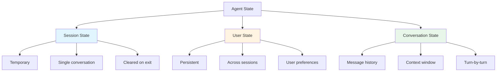
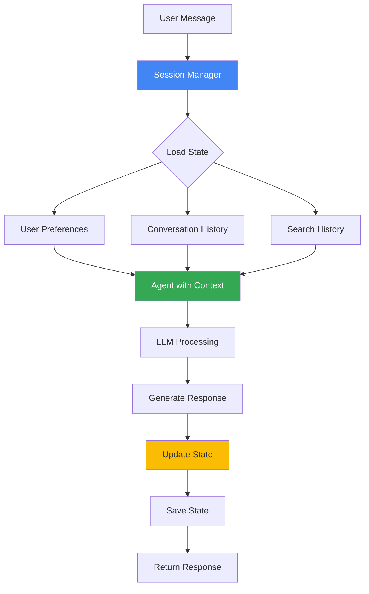
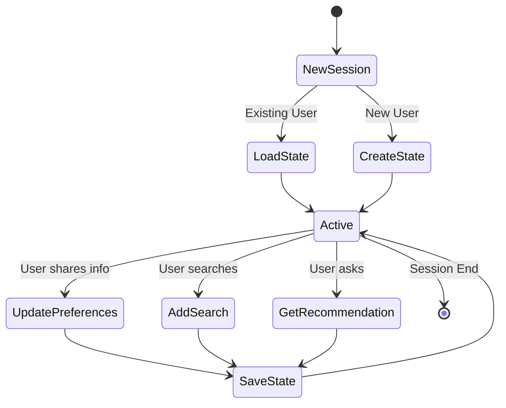

# Lab 5: Sessions and State - Memory Across Conversations

## 🎯 Learning Objectives

By the end of this lab, you will:
- Understand the difference between stateless and stateful agents
- Learn how sessions maintain conversation context
- Build agents that remember user preferences
- Implement state management for personalized experiences
- Handle multi-turn conversations effectively

## 📖 Core Concepts

### What is State?

**Analogy**: Think of state like a **hotel concierge's notepad**:

- **Stateless** (No memory):
  ```
  Guest: "I need a restaurant recommendation"
  Concierge: "What type of cuisine do you like?"
  
  Guest: "Italian"
  Concierge: "What type of cuisine do you like?"  ← Forgot!
  ```

- **Stateful** (With memory):
  ```
  Guest: "I need a restaurant recommendation"
  Concierge: "What type of cuisine do you like?"
  
  Guest: "Italian"
  Concierge: "Great! I remember you also mentioned you're vegetarian.
              Here are Italian vegetarian restaurants nearby..."
  ```

### Types of State



### Why State Matters

Without state:
- ❌ Agent forgets previous messages
- ❌ User must repeat information
- ❌ No personalization
- ❌ Poor user experience

With state:
- ✅ Contextual responses
- ✅ Personalized recommendations
- ✅ Natural conversations
- ✅ Better user experience

## 🏨 Travel Agent Use Case: TravelMate Memory

We're building **TravelMate Memory** that remembers:

1. **User Preferences**: Budget, travel style, dietary restrictions
2. **Conversation Context**: Previous questions and answers
3. **Search History**: Past searches and bookings
4. **User Profile**: Name, home city, frequent destinations

### Real-World Scenario

```
Session 1:
User: "Hi, I'm Sarah from Boston"
TravelMate: "Nice to meet you, Sarah! How can I help with your travel plans?"

User: "I prefer budget-friendly trips and I'm vegetarian"
TravelMate: "Got it! I'll remember you prefer budget options and vegetarian food."

User: "Show me flights to Paris"
TravelMate: [Searches and shows budget flights]

---

Session 2 (Later):
User: "Hi again"
TravelMate: "Welcome back, Sarah! Ready to plan another trip from Boston?"

User: "Yes, show me hotels in Paris"
TravelMate: "I'll find budget-friendly hotels with vegetarian dining options
             in Paris, based on your preferences!"
```

## 🏗️ Architecture with State



## 💻 Code Walkthrough

### Step 1: Define State Models

```python
from pydantic import BaseModel, Field
from typing import List, Optional, Dict
from datetime import datetime

class UserPreferences(BaseModel):
    """User travel preferences."""
    budget_level: str = Field(default="medium", description="low, medium, high")
    travel_style: str = Field(default="balanced", description="luxury, balanced, budget, adventure")
    dietary_restrictions: List[str] = Field(default_factory=list)
    preferred_airlines: List[str] = Field(default_factory=list)
    seat_preference: Optional[str] = None  # "window", "aisle", "middle"
    accommodation_type: str = Field(default="hotel")  # hotel, hostel, airbnb


class UserProfile(BaseModel):
    """User profile information."""
    name: Optional[str] = None
    home_city: Optional[str] = None
    email: Optional[str] = None
    phone: Optional[str] = None
    frequent_destinations: List[str] = Field(default_factory=list)
    loyalty_programs: Dict[str, str] = Field(default_factory=dict)


class SearchHistory(BaseModel):
    """Record of past searches."""
    timestamp: datetime
    search_type: str  # "flight", "hotel", "activity"
    origin: Optional[str] = None
    destination: Optional[str] = None
    dates: Optional[str] = None
    results_count: int = 0


class ConversationState(BaseModel):
    """Complete conversation state."""
    session_id: str
    user_profile: UserProfile = Field(default_factory=UserProfile)
    preferences: UserPreferences = Field(default_factory=UserPreferences)
    search_history: List[SearchHistory] = Field(default_factory=list)
    conversation_started: datetime = Field(default_factory=datetime.now)
    message_count: int = 0
    last_activity: datetime = Field(default_factory=datetime.now)
```

### Step 2: Create Stateful Agent

```python
from google import genai
from google.genai import types
import json

class StatefulTravelAgent:
    def __init__(self, api_key: str):
        self.client = genai.Client(api_key=api_key)
        self.sessions: Dict[str, ConversationState] = {}
    
    def get_or_create_session(self, session_id: str) -> ConversationState:
        """Get existing session or create new one."""
        if session_id not in self.sessions:
            self.sessions[session_id] = ConversationState(session_id=session_id)
        return self.sessions[session_id]
    
    def build_context_prompt(self, state: ConversationState) -> str:
        """Build context from state for the agent."""
        context_parts = ["You are TravelMate Memory, a personalized travel assistant."]
        
        # Add user profile if available
        if state.user_profile.name:
            context_parts.append(f"User's name: {state.user_profile.name}")
        if state.user_profile.home_city:
            context_parts.append(f"User's home city: {state.user_profile.home_city}")
        
        # Add preferences
        prefs = state.preferences
        context_parts.append(f"\nUser Preferences:")
        context_parts.append(f"- Budget level: {prefs.budget_level}")
        context_parts.append(f"- Travel style: {prefs.travel_style}")
        if prefs.dietary_restrictions:
            context_parts.append(f"- Dietary restrictions: {', '.join(prefs.dietary_restrictions)}")
        if prefs.seat_preference:
            context_parts.append(f"- Seat preference: {prefs.seat_preference}")
        
        # Add recent search history
        if state.search_history:
            context_parts.append(f"\nRecent searches:")
            for search in state.search_history[-3:]:  # Last 3 searches
                context_parts.append(
                    f"- {search.search_type}: {search.origin} → {search.destination}"
                )
        
        context_parts.append("\nUse this information to provide personalized recommendations.")
        
        return "\n".join(context_parts)
    
    def update_state_from_message(self, state: ConversationState, message: str):
        """Extract and update state from user message."""
        message_lower = message.lower()
        
        # Extract name
        if "my name is" in message_lower or "i'm" in message_lower or "i am" in message_lower:
            # Simple name extraction (in production, use NER)
            words = message.split()
            for i, word in enumerate(words):
                if word.lower() in ["is", "i'm", "am"] and i + 1 < len(words):
                    potential_name = words[i + 1].strip(".,!?")
                    if potential_name[0].isupper():
                        state.user_profile.name = potential_name
        
        # Extract home city
        if "from" in message_lower and any(word in message_lower for word in ["live", "based", "home"]):
            # Extract city (simplified)
            if "from" in message_lower:
                parts = message_lower.split("from")
                if len(parts) > 1:
                    city = parts[1].split()[0].strip(".,!?").title()
                    state.user_profile.home_city = city
        
        # Extract preferences
        if "budget" in message_lower:
            if any(word in message_lower for word in ["cheap", "budget", "affordable", "low"]):
                state.preferences.budget_level = "low"
            elif any(word in message_lower for word in ["luxury", "expensive", "high-end"]):
                state.preferences.budget_level = "high"
        
        if "vegetarian" in message_lower:
            if "vegetarian" not in state.preferences.dietary_restrictions:
                state.preferences.dietary_restrictions.append("vegetarian")
        if "vegan" in message_lower:
            if "vegan" not in state.preferences.dietary_restrictions:
                state.preferences.dietary_restrictions.append("vegan")
        
        # Update activity timestamp
        state.last_activity = datetime.now()
        state.message_count += 1
    
    def chat(self, session_id: str, message: str) -> str:
        """
        Chat with the agent maintaining state.
        
        Args:
            session_id: Unique session identifier
            message: User's message
        
        Returns:
            Agent's response
        """
        # Get or create session state
        state = self.get_or_create_session(session_id)
        
        # Update state from message
        self.update_state_from_message(state, message)
        
        # Build context-aware system instruction
        system_instruction = self.build_context_prompt(state)
        
        # Create agent with context
        agent = self.client.agentic.create_agent(
            model="gemini-2.0-flash-exp",
            system_instruction=system_instruction
        )
        
        # Create or get session
        if not hasattr(self, '_adk_sessions'):
            self._adk_sessions = {}
        
        if session_id not in self._adk_sessions:
            self._adk_sessions[session_id] = self.client.agentic.create_session(agent=agent)
        
        adk_session = self._adk_sessions[session_id]
        
        # Send message
        response = adk_session.send_message(message)
        
        return response.text


# Usage
agent = StatefulTravelAgent(api_key='your_api_key_here')

# Session 1
session_id = "user_123"

print(agent.chat(session_id, "Hi, I'm Sarah from Boston"))
print(agent.chat(session_id, "I prefer budget travel and I'm vegetarian"))
print(agent.chat(session_id, "Show me flights to Paris"))

# Later...
print(agent.chat(session_id, "What about hotels?"))
# Agent remembers: Sarah, Boston, budget, vegetarian
```

### Step 3: Persistent State Storage

```python
import json
from pathlib import Path

class PersistentStatefulAgent(StatefulTravelAgent):
    def __init__(self, api_key: str, state_dir: str = "./agent_state"):
        super().__init__(api_key)
        self.state_dir = Path(state_dir)
        self.state_dir.mkdir(exist_ok=True)
        self.load_all_sessions()
    
    def get_state_file(self, session_id: str) -> Path:
        """Get file path for session state."""
        return self.state_dir / f"{session_id}.json"
    
    def save_session(self, session_id: str):
        """Save session state to disk."""
        if session_id in self.sessions:
            state = self.sessions[session_id]
            state_file = self.get_state_file(session_id)
            
            with open(state_file, 'w') as f:
                json.dump(state.model_dump(), f, indent=2, default=str)
    
    def load_session(self, session_id: str) -> Optional[ConversationState]:
        """Load session state from disk."""
        state_file = self.get_state_file(session_id)
        
        if state_file.exists():
            with open(state_file, 'r') as f:
                data = json.load(f)
                return ConversationState(**data)
        
        return None
    
    def load_all_sessions(self):
        """Load all saved sessions."""
        for state_file in self.state_dir.glob("*.json"):
            session_id = state_file.stem
            state = self.load_session(session_id)
            if state:
                self.sessions[session_id] = state
    
    def chat(self, session_id: str, message: str) -> str:
        """Chat with automatic state persistence."""
        response = super().chat(session_id, message)
        self.save_session(session_id)  # Auto-save after each message
        return response


# Usage with persistence
agent = PersistentStatefulAgent(api_key='your_api_key_here')

# First conversation
agent.chat("user_123", "Hi, I'm Sarah")
agent.chat("user_123", "I prefer budget travel")

# Restart application...
agent = PersistentStatefulAgent(api_key='your_api_key_here')

# State is automatically loaded!
response = agent.chat("user_123", "Hi again")
# Agent remembers Sarah and her preferences
```

### Step 4: Advanced State Management

```python
class AdvancedStatefulAgent(PersistentStatefulAgent):
    def add_search_to_history(self, session_id: str, search_type: str, 
                              origin: str = None, destination: str = None):
        """Add search to history."""
        state = self.get_or_create_session(session_id)
        
        search = SearchHistory(
            timestamp=datetime.now(),
            search_type=search_type,
            origin=origin,
            destination=destination,
            results_count=0
        )
        
        state.search_history.append(search)
        self.save_session(session_id)
    
    def get_user_stats(self, session_id: str) -> dict:
        """Get statistics about user's activity."""
        state = self.get_or_create_session(session_id)
        
        return {
            "total_messages": state.message_count,
            "total_searches": len(state.search_history),
            "session_duration": (datetime.now() - state.conversation_started).total_seconds() / 60,
            "favorite_destinations": self._get_top_destinations(state),
            "preferences_set": bool(state.preferences.budget_level != "medium")
        }
    
    def _get_top_destinations(self, state: ConversationState) -> List[str]:
        """Get most searched destinations."""
        destinations = {}
        for search in state.search_history:
            if search.destination:
                destinations[search.destination] = destinations.get(search.destination, 0) + 1
        
        return sorted(destinations.keys(), key=lambda x: destinations[x], reverse=True)[:3]
    
    def reset_session(self, session_id: str):
        """Reset session state."""
        if session_id in self.sessions:
            del self.sessions[session_id]
        
        state_file = self.get_state_file(session_id)
        if state_file.exists():
            state_file.unlink()
    
    def export_user_data(self, session_id: str) -> dict:
        """Export all user data (GDPR compliance)."""
        state = self.get_or_create_session(session_id)
        return state.model_dump()


# Usage
agent = AdvancedStatefulAgent(api_key='your_api_key_here')

# Chat
agent.chat("user_123", "Find flights to Tokyo")
agent.add_search_to_history("user_123", "flight", "Boston", "Tokyo")

# Get stats
stats = agent.get_user_stats("user_123")
print(f"User Stats: {stats}")

# Export data
data = agent.export_user_data("user_123")
print(f"User Data: {json.dumps(data, indent=2, default=str)}")

# Reset if needed
agent.reset_session("user_123")
```

## 🔄 Complete Example: Stateful Travel Assistant

```python
from google import genai
from pydantic import BaseModel
from typing import Dict, List, Optional
from datetime import datetime
import json
from pathlib import Path

# [Include all model definitions from above]

class TravelMateMemory:
    """Complete stateful travel agent."""
    
    def __init__(self, api_key: str, state_dir: str = "./travel_state"):
        self.client = genai.Client(api_key=api_key)
        self.state_dir = Path(state_dir)
        self.state_dir.mkdir(exist_ok=True)
        self.sessions: Dict[str, ConversationState] = {}
        self.load_all_sessions()
    
    # [Include all methods from above]
    
    def interactive_session(self, session_id: str):
        """Run interactive session with state."""
        print("TravelMate Memory: Hello! I remember our conversations.")
        print("Commands: 'stats', 'preferences', 'history', 'reset', 'quit'\n")
        
        while True:
            user_input = input("You: ").strip()
            
            if user_input.lower() == 'quit':
                break
            
            if user_input.lower() == 'stats':
                stats = self.get_user_stats(session_id)
                print(f"Stats: {json.dumps(stats, indent=2)}\n")
                continue
            
            if user_input.lower() == 'preferences':
                state = self.get_or_create_session(session_id)
                print(f"Preferences: {state.preferences.model_dump()}\n")
                continue
            
            if user_input.lower() == 'history':
                state = self.get_or_create_session(session_id)
                print(f"Search History ({len(state.search_history)} searches):")
                for search in state.search_history[-5:]:
                    print(f"  - {search.search_type}: {search.origin} → {search.destination}")
                print()
                continue
            
            if user_input.lower() == 'reset':
                self.reset_session(session_id)
                print("Session reset!\n")
                continue
            
            # Regular chat
            response = self.chat(session_id, user_input)
            print(f"TravelMate: {response}\n")


# Run
if __name__ == "__main__":
    agent = TravelMateMemory(api_key='your_api_key_here')
    agent.interactive_session("user_123")
```

## 🎨 State Flow Diagram



## 🧪 Hands-On Exercises

### Exercise 1: Add More Preference Types

```python
class ExtendedPreferences(UserPreferences):
    """Extended preferences."""
    preferred_departure_time: Optional[str] = None  # "morning", "afternoon", "evening"
    max_layovers: int = Field(default=1, ge=0, le=3)
    preferred_hotel_chain: Optional[str] = None
    room_type_preference: Optional[str] = None  # "single", "double", "suite"
    activities_of_interest: List[str] = Field(default_factory=list)
    languages_spoken: List[str] = Field(default_factory=list)
```

### Exercise 2: Implement Conversation Summaries

```python
def generate_conversation_summary(self, session_id: str) -> str:
    """Generate summary of conversation."""
    state = self.get_or_create_session(session_id)
    
    summary_parts = []
    
    if state.user_profile.name:
        summary_parts.append(f"User: {state.user_profile.name}")
    
    summary_parts.append(f"Messages: {state.message_count}")
    summary_parts.append(f"Searches: {len(state.search_history)}")
    
    if state.search_history:
        destinations = set(s.destination for s in state.search_history if s.destination)
        summary_parts.append(f"Interested in: {', '.join(destinations)}")
    
    return " | ".join(summary_parts)
```

### Exercise 3: Add State Expiration

```python
from datetime import timedelta

def cleanup_old_sessions(self, max_age_days: int = 30):
    """Remove sessions older than max_age_days."""
    cutoff = datetime.now() - timedelta(days=max_age_days)
    
    for session_id, state in list(self.sessions.items()):
        if state.last_activity < cutoff:
            print(f"Removing old session: {session_id}")
            self.reset_session(session_id)
```

## 🐛 Common Issues and Solutions

### Issue 1: State Not Persisting

**Problem**: State lost between sessions

**Solution**: Ensure save is called
```python
def chat(self, session_id: str, message: str) -> str:
    response = super().chat(session_id, message)
    self.save_session(session_id)  # Don't forget!
    return response
```

### Issue 2: State Growing Too Large

**Problem**: State file becomes huge

**Solution**: Limit history size
```python
def add_search_to_history(self, session_id: str, search: SearchHistory):
    state = self.get_or_create_session(session_id)
    state.search_history.append(search)
    
    # Keep only last 50 searches
    if len(state.search_history) > 50:
        state.search_history = state.search_history[-50:]
    
    self.save_session(session_id)
```

### Issue 3: Concurrent Access

**Problem**: Multiple requests modify state simultaneously

**Solution**: Use locking
```python
import threading

class ThreadSafeAgent(PersistentStatefulAgent):
    def __init__(self, *args, **kwargs):
        super().__init__(*args, **kwargs)
        self.locks = {}
    
    def get_lock(self, session_id: str):
        if session_id not in self.locks:
            self.locks[session_id] = threading.Lock()
        return self.locks[session_id]
    
    def chat(self, session_id: str, message: str) -> str:
        with self.get_lock(session_id):
            return super().chat(session_id, message)
```

## 🎓 Key Takeaways

✅ **State enables personalization** and context-aware responses

✅ **Sessions maintain conversation context** within a single interaction

✅ **Persistent storage** preserves state across application restarts

✅ **State models** (Pydantic) ensure data consistency

✅ **State management** requires careful design for scalability

✅ **Privacy considerations** are important when storing user data

## 🔗 Connection to Next Lab

In Lab 6, we'll explore **Persistent Storage** with databases and cloud storage. This enables:
- Scalable state management for thousands of users
- Shared state across multiple agent instances
- Advanced querying and analytics
- Backup and recovery
- Multi-device synchronization

## 📚 Additional Resources

- [Session Management Best Practices](https://google.github.io/adk-docs/sessions/)
- [Pydantic Documentation](https://docs.pydantic.dev/)
- [State Design Patterns](https://refactoring.guru/design-patterns/state)

## ✅ Self-Check Quiz

1. What's the difference between session state and persistent state?
2. How do you extract user preferences from messages?
3. Why is state serialization important?
4. How do you handle state for multiple concurrent users?
5. What are privacy considerations for storing user state?

---

← [Lab 4: Structured Outputs](./Lab4_Guide_Structured_Outputs.md) | **Next**: [Lab 6: Persistent Storage](./Lab6_Guide_Persistent_Storage.md) →
