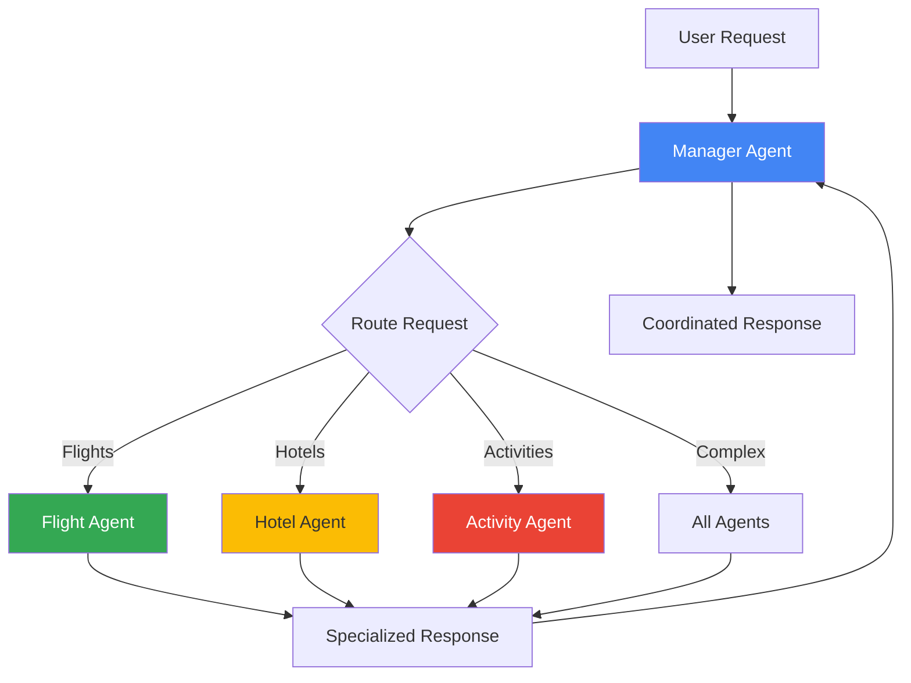
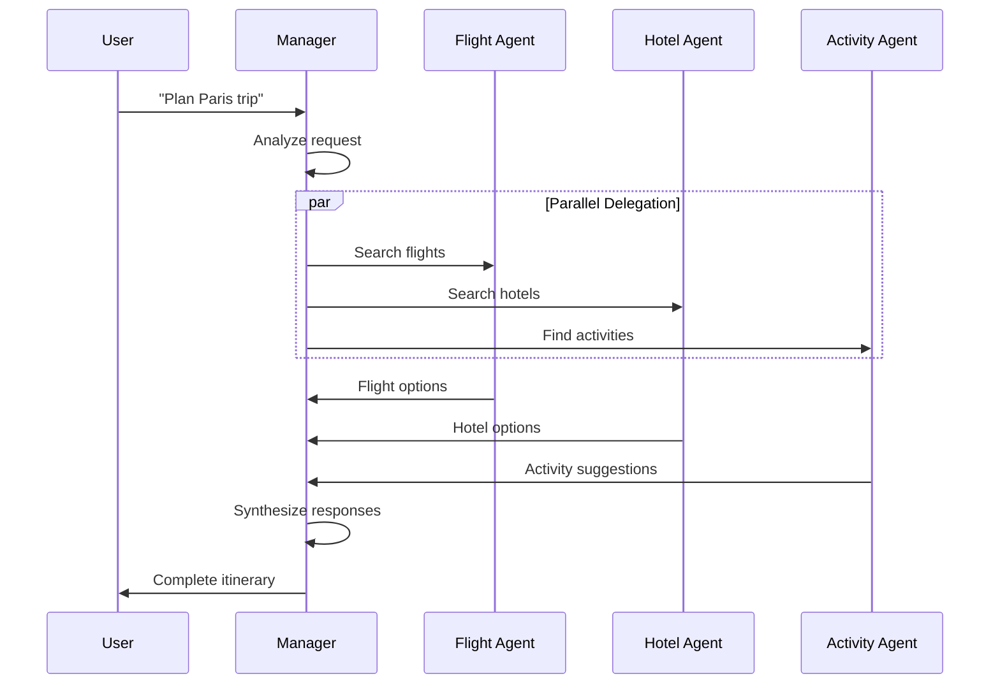

# Lab 7: Multi-Agent Systems - Specialized Agent Coordination

## 🎯 Learning Objectives

By the end of this lab, you will:
- Understand multi-agent architecture patterns
- Learn how to coordinate specialized agents
- Build agent communication protocols
- Implement agent handoffs and delegation
- Design hierarchical agent systems

## 📖 Core Concepts

### What is a Multi-Agent System?

**Analogy**: Think of a multi-agent system like a **travel agency office**:

- **Single Agent**: One person handles everything (slow, limited expertise)
- **Multi-Agent**: Specialized team working together
  - Flight Expert: Knows airlines, routes, prices
  - Hotel Specialist: Knows accommodations, amenities
  - Activity Planner: Knows attractions, tours
  - Manager: Coordinates the team

### Multi-Agent Patterns




### Why Multi-Agent Systems?

**Benefits**:
- ✅ Specialization: Each agent excels at specific tasks
- ✅ Scalability: Add new agents without changing existing ones
- ✅ Maintainability: Easier to update individual agents
- ✅ Parallel Processing: Multiple agents work simultaneously
- ✅ Modularity: Reuse agents across different systems

**Challenges**:
- ⚠️ Coordination complexity
- ⚠️ Communication overhead
- ⚠️ State management across agents
- ⚠️ Error handling and recovery

## 🏨 Travel Agent Use Case: TravelMate Team

We're building **TravelMate Team** with specialized agents:

1. **Manager Agent**: Routes requests, coordinates responses
2. **Flight Agent**: Expert in flights, airlines, routes
3. **Hotel Agent**: Specialist in accommodations
4. **Activity Agent**: Knows attractions, tours, restaurants
5. **Budget Agent**: Optimizes costs across all bookings

### Real-World Scenario

```
User: "Plan a 5-day trip to Paris for 2 people, budget $3000"

Manager: [Analyzes request - needs flights, hotel, activities]
         [Delegates to specialized agents]

Flight Agent: "Found flights: $650/person roundtrip"
Hotel Agent: "Recommended hotel: $150/night"
Activity Agent: "Top activities: Eiffel Tower, Louvre, Seine cruise"
Budget Agent: "Total: $2,800 - under budget!"

Manager: [Combines responses]
         "Here's your complete Paris itinerary:
          - Flights: $1,300 (2 people)
          - Hotel: $750 (5 nights)
          - Activities: $500
          - Meals: $250
          Total: $2,800 (under budget!)"
```

## 💻 Code Walkthrough

### Step 1: Define Specialized Agents

```python
from google import genai
from typing import Dict, List
from pydantic import BaseModel

class AgentResponse(BaseModel):
    """Standard response from any agent."""
    agent_name: str
    success: bool
    data: dict
    message: str

class FlightAgent:
    """Specialized agent for flight searches."""
    
    def __init__(self, api_key: str):
        self.client = genai.Client(api_key=api_key)
        self.name = "Flight Agent"
        
        self.agent = self.client.agentic.create_agent(
            model="gemini-2.0-flash-exp",
            system_instruction="""
            You are a flight search specialist.
            You know about airlines, routes, prices, and travel times.
            Provide detailed flight recommendations with prices and schedules.
            Always consider direct vs connecting flights.
            """
        )
        self.session = self.client.agentic.create_session(agent=self.agent)
    
    def search_flights(self, origin: str, destination: str, 
                      date: str, passengers: int = 1) -> AgentResponse:
        """Search for flights."""
        query = f"""
        Find flights from {origin} to {destination} on {date} 
        for {passengers} passenger(s).
        Include prices, airlines, and flight times.
        """
        
        response = self.session.send_message(query)
        
        return AgentResponse(
            agent_name=self.name,
            success=True,
            data={
                "origin": origin,
                "destination": destination,
                "date": date,
                "passengers": passengers
            },
            message=response.text
        )


class HotelAgent:
    """Specialized agent for hotel searches."""
    
    def __init__(self, api_key: str):
        self.client = genai.Client(api_key=api_key)
        self.name = "Hotel Agent"
        
        self.agent = self.client.agentic.create_agent(
            model="gemini-2.0-flash-exp",
            system_instruction="""
            You are a hotel accommodation specialist.
            You know about hotels, hostels, vacation rentals, and their amenities.
            Provide recommendations based on budget, location, and preferences.
            Always mention key amenities and guest ratings.
            """
        )
        self.session = self.client.agentic.create_session(agent=self.agent)
    
    def search_hotels(self, city: str, checkin: str, checkout: str,
                     guests: int = 2, budget: str = "medium") -> AgentResponse:
        """Search for hotels."""
        query = f"""
        Find hotels in {city} for {guests} guest(s)
        Check-in: {checkin}, Check-out: {checkout}
        Budget level: {budget}
        Include prices, ratings, and key amenities.
        """
        
        response = self.session.send_message(query)
        
        return AgentResponse(
            agent_name=self.name,
            success=True,
            data={
                "city": city,
                "checkin": checkin,
                "checkout": checkout,
                "guests": guests
            },
            message=response.text
        )


class ActivityAgent:
    """Specialized agent for activities and attractions."""
    
    def __init__(self, api_key: str):
        self.client = genai.Client(api_key=api_key)
        self.name = "Activity Agent"
        
        self.agent = self.client.agentic.create_agent(
            model="gemini-2.0-flash-exp",
            system_instruction="""
            You are a local activities and attractions specialist.
            You know about museums, tours, restaurants, and entertainment.
            Provide recommendations based on interests and time available.
            Include estimated costs and time needed for each activity.
            """
        )
        self.session = self.client.agentic.create_session(agent=self.agent)
    
    def recommend_activities(self, city: str, days: int,
                           interests: List[str] = None) -> AgentResponse:
        """Recommend activities."""
        interests_str = ", ".join(interests) if interests else "general sightseeing"
        
        query = f"""
        Recommend activities in {city} for {days} day(s).
        Interests: {interests_str}
        Include top attractions, restaurants, and unique experiences.
        Provide estimated costs and time needed.
        """
        
        response = self.session.send_message(query)
        
        return AgentResponse(
            agent_name=self.name,
            success=True,
            data={
                "city": city,
                "days": days,
                "interests": interests
            },
            message=response.text
        )
```

### Step 2: Create Manager Agent

```python
class ManagerAgent:
    """Manager agent that coordinates specialized agents."""
    
    def __init__(self, api_key: str):
        self.client = genai.Client(api_key=api_key)
        self.name = "Manager Agent"
        
        # Initialize specialized agents
        self.flight_agent = FlightAgent(api_key)
        self.hotel_agent = HotelAgent(api_key)
        self.activity_agent = ActivityAgent(api_key)
        
        # Manager's own agent for coordination
        self.agent = self.client.agentic.create_agent(
            model="gemini-2.0-flash-exp",
            system_instruction="""
            You are a travel planning manager.
            You coordinate specialized agents (Flight, Hotel, Activity).
            Analyze user requests and determine which agents to involve.
            Combine responses from multiple agents into coherent plans.
            """
        )
        self.session = self.client.agentic.create_session(agent=self.agent)
    
    def analyze_request(self, user_request: str) -> Dict[str, bool]:
        """Determine which agents are needed."""
        request_lower = user_request.lower()
        
        return {
            "needs_flights": any(word in request_lower for word in 
                               ["flight", "fly", "airline", "trip", "travel"]),
            "needs_hotels": any(word in request_lower for word in 
                              ["hotel", "accommodation", "stay", "lodging"]),
            "needs_activities": any(word in request_lower for word in 
                                  ["activity", "things to do", "attractions", "visit"])
        }
    
    def extract_trip_details(self, user_request: str) -> dict:
        """Extract trip details from request."""
        # In production, use NER or LLM to extract
        # For demo, return mock data
        return {
            "origin": "New York",
            "destination": "Paris",
            "city": "Paris",
            "start_date": "2024-04-01",
            "end_date": "2024-04-05",
            "days": 5,
            "passengers": 2,
            "budget": "medium"
        }
    
    def coordinate_agents(self, user_request: str) -> str:
        """Coordinate multiple agents to fulfill request."""
        # Analyze what's needed
        needs = self.analyze_request(user_request)
        details = self.extract_trip_details(user_request)
        
        # Collect responses from needed agents
        agent_responses = []
        
        if needs["needs_flights"]:
            print(f"[{self.name}] Delegating to Flight Agent...")
            flight_response = self.flight_agent.search_flights(
                origin=details["origin"],
                destination=details["destination"],
                date=details["start_date"],
                passengers=details["passengers"]
            )
            agent_responses.append(flight_response)
        
        if needs["needs_hotels"]:
            print(f"[{self.name}] Delegating to Hotel Agent...")
            hotel_response = self.hotel_agent.search_hotels(
                city=details["city"],
                checkin=details["start_date"],
                checkout=details["end_date"],
                guests=details["passengers"],
                budget=details["budget"]
            )
            agent_responses.append(hotel_response)
        
        if needs["needs_activities"]:
            print(f"[{self.name}] Delegating to Activity Agent...")
            activity_response = self.activity_agent.recommend_activities(
                city=details["city"],
                days=details["days"]
            )
            agent_responses.append(activity_response)
        
        # Combine responses
        combined_info = self._combine_responses(agent_responses)
        
        # Use manager agent to create final response
        synthesis_prompt = f"""
        User request: {user_request}
        
        Responses from specialized agents:
        {combined_info}
        
        Create a comprehensive travel plan combining all this information.
        """
        
        final_response = self.session.send_message(synthesis_prompt)
        
        return final_response.text
    
    def _combine_responses(self, responses: List[AgentResponse]) -> str:
        """Combine responses from multiple agents."""
        combined = []
        
        for response in responses:
            combined.append(f"\n=== {response.agent_name} ===")
            combined.append(response.message)
        
        return "\n".join(combined)


# Usage
manager = ManagerAgent(api_key='your_api_key_here')

# User makes complex request
user_request = "Plan a 5-day trip to Paris for 2 people in April"

# Manager coordinates all agents
response = manager.coordinate_agents(user_request)
print(response)
```

### Step 3: Agent Communication Protocol

```python
from enum import Enum
from datetime import datetime

class MessageType(Enum):
    """Types of inter-agent messages."""
    REQUEST = "request"
    RESPONSE = "response"
    QUERY = "query"
    NOTIFICATION = "notification"

class AgentMessage(BaseModel):
    """Standard message format for agent communication."""
    message_id: str
    from_agent: str
    to_agent: str
    message_type: MessageType
    content: dict
    timestamp: datetime = Field(default_factory=datetime.now)
    parent_message_id: str = None

class AgentCommunicationHub:
    """Central hub for agent-to-agent communication."""
    
    def __init__(self):
        self.message_history: List[AgentMessage] = []
        self.agents: Dict[str, any] = {}
    
    def register_agent(self, agent_name: str, agent_instance):
        """Register an agent with the hub."""
        self.agents[agent_name] = agent_instance
        print(f"[Hub] Registered agent: {agent_name}")
    
    def send_message(self, message: AgentMessage) -> AgentMessage:
        """Send message from one agent to another."""
        self.message_history.append(message)
        
        print(f"[Hub] {message.from_agent} → {message.to_agent}: {message.message_type.value}")
        
        # Route to target agent
        if message.to_agent in self.agents:
            target_agent = self.agents[message.to_agent]
            response = target_agent.handle_message(message)
            return response
        else:
            raise ValueError(f"Agent not found: {message.to_agent}")
    
    def broadcast_message(self, message: AgentMessage, exclude: List[str] = None):
        """Broadcast message to all agents."""
        exclude = exclude or []
        
        for agent_name in self.agents:
            if agent_name not in exclude and agent_name != message.from_agent:
                message.to_agent = agent_name
                self.send_message(message)
    
    def get_conversation_history(self, agent_name: str) -> List[AgentMessage]:
        """Get all messages involving an agent."""
        return [
            msg for msg in self.message_history
            if msg.from_agent == agent_name or msg.to_agent == agent_name
        ]


# Enhanced agents with communication
class CommunicatingFlightAgent(FlightAgent):
    """Flight agent with communication capabilities."""
    
    def __init__(self, api_key: str, hub: AgentCommunicationHub):
        super().__init__(api_key)
        self.hub = hub
        self.hub.register_agent(self.name, self)
    
    def handle_message(self, message: AgentMessage) -> AgentMessage:
        """Handle incoming messages."""
        if message.message_type == MessageType.REQUEST:
            # Process flight search request
            result = self.search_flights(
                origin=message.content.get("origin"),
                destination=message.content.get("destination"),
                date=message.content.get("date"),
                passengers=message.content.get("passengers", 1)
            )
            
            # Send response
            response = AgentMessage(
                message_id=f"msg_{datetime.now().timestamp()}",
                from_agent=self.name,
                to_agent=message.from_agent,
                message_type=MessageType.RESPONSE,
                content=result.model_dump(),
                parent_message_id=message.message_id
            )
            
            return response
```

### Step 4: Hierarchical Multi-Agent System

```python
class HierarchicalTravelSystem:
    """Hierarchical multi-agent system with manager and workers."""
    
    def __init__(self, api_key: str):
        self.hub = AgentCommunicationHub()
        
        # Create agents
        self.manager = ManagerAgent(api_key)
        self.flight_agent = CommunicatingFlightAgent(api_key, self.hub)
        self.hotel_agent = CommunicatingHotelAgent(api_key, self.hub)
        self.activity_agent = CommunicatingActivityAgent(api_key, self.hub)
        
        # Register manager
        self.hub.register_agent(self.manager.name, self.manager)
    
    def process_request(self, user_request: str) -> str:
        """Process user request through the hierarchy."""
        print(f"\n{'='*60}")
        print(f"USER REQUEST: {user_request}")
        print(f"{'='*60}\n")
        
        # Manager analyzes and delegates
        response = self.manager.coordinate_agents(user_request)
        
        # Show communication history
        print(f"\n{'='*60}")
        print("AGENT COMMUNICATION HISTORY:")
        print(f"{'='*60}")
        for msg in self.hub.message_history:
            print(f"{msg.timestamp.strftime('%H:%M:%S')} | "
                  f"{msg.from_agent} → {msg.to_agent} | "
                  f"{msg.message_type.value}")
        
        return response


# Usage
system = HierarchicalTravelSystem(api_key='your_api_key_here')

response = system.process_request(
    "I need flights and hotels for a Paris trip in April"
)

print(f"\n{'='*60}")
print("FINAL RESPONSE:")
print(f"{'='*60}")
print(response)
```

## 🎨 Multi-Agent Communication Flow



## 🧪 Hands-On Exercises

### Exercise 1: Add Budget Coordinator Agent

```python
class BudgetAgent:
    """Agent that optimizes budget across all bookings."""
    
    def __init__(self, api_key: str):
        self.client = genai.Client(api_key=api_key)
        self.name = "Budget Agent"
        
        self.agent = self.client.agentic.create_agent(
            model="gemini-2.0-flash-exp",
            system_instruction="""
            You are a budget optimization specialist.
            Analyze costs from flights, hotels, and activities.
            Suggest ways to stay within budget.
            Recommend cost-saving alternatives when needed.
            """
        )
    
    def optimize_budget(self, total_budget: float, 
                       flight_cost: float, hotel_cost: float,
                       activity_cost: float) -> dict:
        """Optimize budget allocation."""
        total_cost = flight_cost + hotel_cost + activity_cost
        remaining = total_budget - total_cost
        
        query = f"""
        Total budget: ${total_budget}
        Flights: ${flight_cost}
        Hotels: ${hotel_cost}
        Activities: ${activity_cost}
        Total cost: ${total_cost}
        Remaining: ${remaining}
        
        Provide budget analysis and recommendations.
        """
        
        session = self.client.agentic.create_session(agent=self.agent)
        response = session.send_message(query)
        
        return {
            "within_budget": remaining >= 0,
            "remaining": remaining,
            "recommendations": response.text
        }
```

### Exercise 2: Implement Agent Voting System

```python
class VotingSystem:
    """System where agents vote on recommendations."""
    
    def __init__(self, agents: List):
        self.agents = agents
    
    def get_recommendations(self, query: str) -> dict:
        """Get recommendations from all agents."""
        votes = {}
        
        for agent in self.agents:
            response = agent.recommend(query)
            for option in response.options:
                votes[option] = votes.get(option, 0) + 1
        
        # Return options sorted by votes
        sorted_options = sorted(votes.items(), 
                              key=lambda x: x[1], 
                              reverse=True)
        
        return {
            "top_recommendation": sorted_options[0][0],
            "all_votes": dict(sorted_options)
        }
```

### Exercise 3: Add Conflict Resolution

```python
class ConflictResolver:
    """Resolve conflicts between agent recommendations."""
    
    def resolve(self, agent_responses: List[AgentResponse]) -> AgentResponse:
        """Resolve conflicting recommendations."""
        # Check for conflicts
        if self._has_conflicts(agent_responses):
            # Use manager agent to mediate
            return self._mediate_conflict(agent_responses)
        
        # No conflicts, combine responses
        return self._combine_responses(agent_responses)
    
    def _has_conflicts(self, responses: List[AgentResponse]) -> bool:
        """Check if responses conflict."""
        # Implementation depends on your domain
        pass
    
    def _mediate_conflict(self, responses: List[AgentResponse]) -> AgentResponse:
        """Use manager to resolve conflicts."""
        pass
```

## 🎓 Key Takeaways

✅ **Multi-agent systems** enable specialization and scalability

✅ **Manager agents** coordinate specialized workers

✅ **Communication protocols** standardize agent interactions

✅ **Hierarchical structures** organize complex systems

✅ **Parallel processing** improves performance

✅ **Modular design** makes systems maintainable

## 🔗 Connection to Next Lab

In Lab 8, we'll add **Stateful Multi-Agent** capabilities where agents maintain shared state and context across complex conversations. This enables:
- Agents remembering previous interactions
- Shared knowledge bases
- Complex multi-turn planning
- Context-aware handoffs

## 📚 Additional Resources

- [Multi-Agent Systems](https://google.github.io/adk-docs/multi-agent/)
- [Agent Communication Patterns](https://google.github.io/adk-docs/patterns/)
- [Distributed Systems Design](https://www.oreilly.com/library/view/designing-distributed-systems/9781491983638/)

## ✅ Self-Check Quiz

1. What are the benefits of multi-agent systems?
2. How does a manager agent coordinate workers?
3. What is an agent communication protocol?
4. When should you use hierarchical vs flat agent structures?
5. How do you handle conflicts between agents?

---

← [Lab 6: Persistent Storage](./Lab6_Guide_Persistent_Storage.md) | **Next**: [Lab 8: Stateful Multi-Agent](./Lab8_Guide_Stateful_Multi_Agent.md) →
