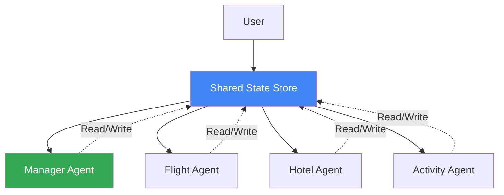
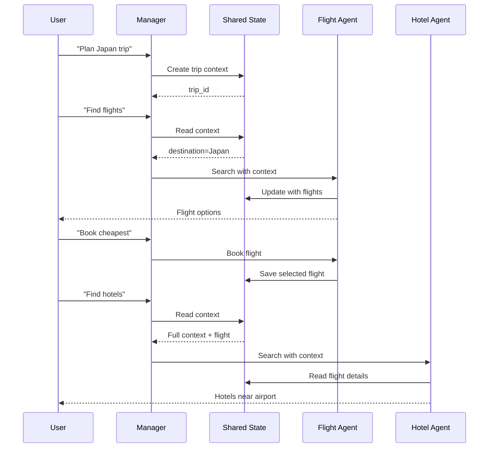

# Lab 8: Stateful Multi-Agent - Complex Conversation Management

## 🎯 Learning Objectives

By the end of this lab, you will:
- Understand stateful multi-agent architectures
- Learn how to share state across multiple agents
- Build agents that maintain conversation context
- Implement agent handoffs with context preservation
- Design complex multi-turn workflows

## 📖 Core Concepts

### What is Stateful Multi-Agent?

**Analogy**: Think of stateful multi-agent like a **hospital with patient records**:

- **Stateless Multi-Agent**: Each doctor starts fresh, no shared records
- **Stateful Multi-Agent**: All doctors access the same patient file
  - Cardiologist sees what neurologist noted
  - Surgeon knows patient's medication history
  - Everyone works with complete context

### State Sharing Patterns



## 🏨 Travel Agent Use Case: TravelMate Stateful Team

Building **TravelMate Stateful Team** where agents share context:

1. **Shared Trip Context**: All agents see the same trip details
2. **Agent Handoffs**: Seamless transitions with full context
3. **Collaborative Planning**: Agents build on each other's work
4. **Memory Across Sessions**: Resume complex planning later

### Real-World Scenario

```
User: "I want to visit Japan"
Manager: [Creates trip context in shared state]

User: "Find flights from Boston"
Flight Agent: [Reads context: destination=Japan, origin=Boston]
              [Saves flight options to shared state]
              "Found 3 flights to Tokyo"

User: "Book the cheapest one"
Flight Agent: [Updates state with selected flight]
              "Booked JAL flight for $850"

User: "Now find hotels near the airport"
Hotel Agent: [Reads context: destination=Tokyo, flight arrival time]
             [Knows to search near Narita airport]
             "Found hotels near Narita with airport shuttle"

User: "What activities can I do?"
Activity Agent: [Reads context: Tokyo, dates from flight booking]
                [Suggests activities matching trip duration]
```

## 💻 Code Walkthrough

### Step 1: Shared State Manager

```python
from typing import Dict, Any, Optional
from datetime import datetime
from pydantic import BaseModel
import json

class TripContext(BaseModel):
    """Shared trip context across all agents."""
    trip_id: str
    user_id: str
    destination: Optional[str] = None
    origin: Optional[str] = None
    start_date: Optional[str] = None
    end_date: Optional[str] = None
    travelers: int = 1
    budget: Optional[float] = None
    
    # Booking details
    selected_flight: Optional[dict] = None
    selected_hotel: Optional[dict] = None
    selected_activities: list = []
    
    # Agent interactions
    last_agent: Optional[str] = None
    conversation_history: list = []
    
    created_at: datetime = Field(default_factory=datetime.now)
    updated_at: datetime = Field(default_factory=datetime.now)


class SharedStateManager:
    """Manages shared state across multiple agents."""
    
    def __init__(self):
        self.contexts: Dict[str, TripContext] = {}
    
    def create_context(self, trip_id: str, user_id: str) -> TripContext:
        """Create new trip context."""
        context = TripContext(trip_id=trip_id, user_id=user_id)
        self.contexts[trip_id] = context
        return context
    
    def get_context(self, trip_id: str) -> Optional[TripContext]:
        """Get trip context."""
        return self.contexts.get(trip_id)
    
    def update_context(self, trip_id: str, updates: dict):
        """Update trip context."""
        if trip_id in self.contexts:
            context = self.contexts[trip_id]
            for key, value in updates.items():
                if hasattr(context, key):
                    setattr(context, key, value)
            context.updated_at = datetime.now()
    
    def add_to_history(self, trip_id: str, agent_name: str, message: str):
        """Add interaction to conversation history."""
        if trip_id in self.contexts:
            self.contexts[trip_id].conversation_history.append({
                "agent": agent_name,
                "message": message,
                "timestamp": datetime.now().isoformat()
            })
            self.contexts[trip_id].last_agent = agent_name
```

### Step 2: Stateful Agents

```python
from google import genai

class StatefulFlightAgent:
    """Flight agent with shared state access."""
    
    def __init__(self, api_key: str, state_manager: SharedStateManager):
        self.client = genai.Client(api_key=api_key)
        self.name = "Flight Agent"
        self.state_manager = state_manager
        
        self.agent = self.client.agentic.create_agent(
            model="gemini-2.0-flash-exp",
            system_instruction="""
            You are a flight search specialist with access to trip context.
            Use the trip context to provide relevant recommendations.
            Update the shared state with flight selections.
            """
        )
    
    def search_flights(self, trip_id: str, user_query: str) -> str:
        """Search flights with context awareness."""
        # Get shared context
        context = self.state_manager.get_context(trip_id)
        
        # Build context-aware prompt
        context_info = f"""
        Trip Context:
        - Destination: {context.destination or 'Not specified'}
        - Origin: {context.origin or 'Not specified'}
        - Dates: {context.start_date} to {context.end_date}
        - Travelers: {context.travelers}
        - Budget: ${context.budget or 'Not specified'}
        
        Previous interactions:
        {self._format_history(context.conversation_history[-3:])}
        
        User query: {user_query}
        """
        
        # Get response
        session = self.client.agentic.create_session(agent=self.agent)
        response = session.send_message(context_info)
        
        # Update shared state
        self.state_manager.add_to_history(trip_id, self.name, response.text)
        
        return response.text
    
    def book_flight(self, trip_id: str, flight_details: dict):
        """Book flight and update shared state."""
        self.state_manager.update_context(trip_id, {
            "selected_flight": flight_details
        })
        
        message = f"Booked flight: {flight_details.get('airline')} for ${flight_details.get('price')}"
        self.state_manager.add_to_history(trip_id, self.name, message)
    
    def _format_history(self, history: list) -> str:
        """Format conversation history."""
        if not history:
            return "No previous interactions"
        
        return "\n".join([
            f"- {item['agent']}: {item['message'][:100]}..."
            for item in history
        ])


class StatefulHotelAgent:
    """Hotel agent with shared state access."""
    
    def __init__(self, api_key: str, state_manager: SharedStateManager):
        self.client = genai.Client(api_key=api_key)
        self.name = "Hotel Agent"
        self.state_manager = state_manager
        
        self.agent = self.client.agentic.create_agent(
            model="gemini-2.0-flash-exp",
            system_instruction="""
            You are a hotel specialist with access to trip context.
            Consider flight arrival/departure times when recommending hotels.
            Use budget information to filter options.
            Reference previous agent interactions for continuity.
            """
        )
    
    def search_hotels(self, trip_id: str, user_query: str) -> str:
        """Search hotels with full trip context."""
        context = self.state_manager.get_context(trip_id)
        
        # Build context including flight info
        flight_info = ""
        if context.selected_flight:
            flight_info = f"""
            Selected Flight:
            - Airline: {context.selected_flight.get('airline')}
            - Arrival: {context.selected_flight.get('arrival_time')}
            - Airport: {context.selected_flight.get('arrival_airport')}
            """
        
        context_info = f"""
        Trip Context:
        - Destination: {context.destination}
        - Check-in: {context.start_date}
        - Check-out: {context.end_date}
        - Guests: {context.travelers}
        - Remaining budget: ${self._calculate_remaining_budget(context)}
        
        {flight_info}
        
        User query: {user_query}
        """
        
        session = self.client.agentic.create_session(agent=self.agent)
        response = session.send_message(context_info)
        
        self.state_manager.add_to_history(trip_id, self.name, response.text)
        
        return response.text
    
    def _calculate_remaining_budget(self, context: TripContext) -> float:
        """Calculate remaining budget after flight."""
        if not context.budget:
            return 0
        
        spent = 0
        if context.selected_flight:
            spent += context.selected_flight.get('price', 0) * context.travelers
        
        return context.budget - spent
```

### Step 3: Stateful Manager with Handoffs

```python
class StatefulManagerAgent:
    """Manager that coordinates stateful agents."""
    
    def __init__(self, api_key: str):
        self.client = genai.Client(api_key=api_key)
        self.name = "Manager Agent"
        self.state_manager = SharedStateManager()
        
        # Initialize specialized agents
        self.flight_agent = StatefulFlightAgent(api_key, self.state_manager)
        self.hotel_agent = StatefulHotelAgent(api_key, self.state_manager)
        
        self.agent = self.client.agentic.create_agent(
            model="gemini-2.0-flash-exp",
            system_instruction="""
            You are a travel planning manager coordinating specialized agents.
            You have access to shared trip context.
            Route requests to appropriate agents.
            Ensure smooth handoffs with full context.
            """
        )
    
    def start_trip_planning(self, user_id: str, initial_request: str) -> tuple:
        """Start new trip planning session."""
        # Create trip context
        trip_id = f"trip_{datetime.now().timestamp()}"
        context = self.state_manager.create_context(trip_id, user_id)
        
        # Extract initial details
        details = self._extract_trip_details(initial_request)
        self.state_manager.update_context(trip_id, details)
        
        # Initial response
        response = f"""
        Great! I've started planning your trip.
        Trip ID: {trip_id}
        
        Here's what I understand:
        - Destination: {details.get('destination', 'To be determined')}
        - Travelers: {details.get('travelers', 1)}
        
        What would you like to do first? Search flights, hotels, or activities?
        """
        
        self.state_manager.add_to_history(trip_id, self.name, response)
        
        return trip_id, response
    
    def handle_request(self, trip_id: str, user_request: str) -> str:
        """Handle user request with context."""
        context = self.state_manager.get_context(trip_id)
        
        if not context:
            return "Trip not found. Please start a new trip planning session."
        
        # Determine which agent to use
        request_lower = user_request.lower()
        
        if any(word in request_lower for word in ["flight", "fly", "airline"]):
            return self.flight_agent.search_flights(trip_id, user_request)
        
        elif any(word in request_lower for word in ["hotel", "accommodation", "stay"]):
            return self.hotel_agent.search_hotels(trip_id, user_request)
        
        else:
            # Manager handles general queries
            return self._handle_general_query(trip_id, user_request)
    
    def _extract_trip_details(self, request: str) -> dict:
        """Extract trip details from request."""
        # Simplified extraction (use NER in production)
        details = {}
        
        if "japan" in request.lower() or "tokyo" in request.lower():
            details["destination"] = "Tokyo, Japan"
        elif "paris" in request.lower():
            details["destination"] = "Paris, France"
        
        # Extract number of travelers
        import re
        numbers = re.findall(r'\d+', request)
        if numbers and "people" in request.lower():
            details["travelers"] = int(numbers[0])
        
        return details
    
    def _handle_general_query(self, trip_id: str, query: str) -> str:
        """Handle general queries using manager agent."""
        context = self.state_manager.get_context(trip_id)
        
        context_info = f"""
        Trip Context:
        {json.dumps(context.model_dump(), indent=2, default=str)}
        
        User query: {query}
        """
        
        session = self.client.agentic.create_session(agent=self.agent)
        response = session.send_message(context_info)
        
        self.state_manager.add_to_history(trip_id, self.name, response.text)
        
        return response.text
    
    def get_trip_summary(self, trip_id: str) -> str:
        """Get complete trip summary."""
        context = self.state_manager.get_context(trip_id)
        
        if not context:
            return "Trip not found."
        
        summary = f"""
        === TRIP SUMMARY ===
        Trip ID: {context.trip_id}
        Destination: {context.destination or 'Not set'}
        Dates: {context.start_date} to {context.end_date}
        Travelers: {context.travelers}
        Budget: ${context.budget or 'Not set'}
        
        === BOOKINGS ===
        Flight: {context.selected_flight or 'Not booked'}
        Hotel: {context.selected_hotel or 'Not booked'}
        Activities: {len(context.selected_activities)} selected
        
        === CONVERSATION HISTORY ===
        Total interactions: {len(context.conversation_history)}
        Last agent: {context.last_agent}
        """
        
        return summary
```

### Step 4: Complete Stateful System

```python
class StatefulTravelSystem:
    """Complete stateful multi-agent travel system."""
    
    def __init__(self, api_key: str):
        self.manager = StatefulManagerAgent(api_key)
        self.active_trips: Dict[str, str] = {}  # user_id -> trip_id
    
    def chat(self, user_id: str, message: str) -> str:
        """Chat with stateful system."""
        # Check if user has active trip
        if user_id not in self.active_trips:
            # Start new trip
            trip_id, response = self.manager.start_trip_planning(user_id, message)
            self.active_trips[user_id] = trip_id
            return response
        
        # Continue with existing trip
        trip_id = self.active_trips[user_id]
        return self.manager.handle_request(trip_id, message)
    
    def get_summary(self, user_id: str) -> str:
        """Get trip summary for user."""
        if user_id not in self.active_trips:
            return "No active trip found."
        
        trip_id = self.active_trips[user_id]
        return self.manager.get_trip_summary(trip_id)
    
    def end_trip(self, user_id: str):
        """End trip planning session."""
        if user_id in self.active_trips:
            del self.active_trips[user_id]
    
    def interactive_session(self, user_id: str):
        """Run interactive session."""
        print("=== TravelMate Stateful Team ===")
        print("Commands: 'summary', 'end', 'quit'\n")
        
        while True:
            user_input = input("You: ").strip()
            
            if user_input.lower() == 'quit':
                break
            
            if user_input.lower() == 'summary':
                print(self.get_summary(user_id))
                continue
            
            if user_input.lower() == 'end':
                self.end_trip(user_id)
                print("Trip ended. Start a new one anytime!")
                continue
            
            response = self.chat(user_id, user_input)
            print(f"\nTravelMate: {response}\n")


# Usage
system = StatefulTravelSystem(api_key='your_api_key_here')

# User 1's conversation
system.chat("user_123", "I want to visit Japan for 2 weeks")
system.chat("user_123", "Find flights from Boston")
system.chat("user_123", "Book the cheapest one")
system.chat("user_123", "Now find hotels")

# Get summary
summary = system.get_summary("user_123")
print(summary)

# Interactive mode
system.interactive_session("user_456")
```


## 🎨 Stateful Multi-Agent Flow



## 🧪 Hands-On Exercises

### Exercise 1: Add Activity Agent with Context

```python
class StatefulActivityAgent:
    """Activity agent that uses full trip context."""
    
    def __init__(self, api_key: str, state_manager: SharedStateManager):
        self.client = genai.Client(api_key=api_key)
        self.name = "Activity Agent"
        self.state_manager = state_manager
        
        self.agent = self.client.agentic.create_agent(
            model="gemini-2.0-flash-exp",
            system_instruction="""
            You are an activity planning specialist.
            Use trip dates, hotel location, and budget to recommend activities.
            Consider travel time between hotel and attractions.
            """
        )
    
    def recommend_activities(self, trip_id: str, user_query: str) -> str:
        """Recommend activities with full context."""
        context = self.state_manager.get_context(trip_id)
        
        # Calculate available days
        if context.start_date and context.end_date:
            # Parse dates and calculate duration
            days = 5  # Simplified
        else:
            days = "unknown"
        
        context_info = f"""
        Trip Context:
        - Destination: {context.destination}
        - Duration: {days} days
        - Hotel: {context.selected_hotel.get('name') if context.selected_hotel else 'Not booked'}
        - Hotel location: {context.selected_hotel.get('address') if context.selected_hotel else 'Unknown'}
        - Budget remaining: ${self._calculate_remaining_budget(context)}
        
        Recommend activities considering:
        1. Distance from hotel
        2. Available time
        3. Budget constraints
        
        User query: {user_query}
        """
        
        session = self.client.agentic.create_session(agent=self.agent)
        response = session.send_message(context_info)
        
        self.state_manager.add_to_history(trip_id, self.name, response.text)
        
        return response.text
```

### Exercise 2: Implement Context Snapshots

```python
class ContextSnapshot:
    """Save and restore context snapshots."""
    
    def __init__(self, state_manager: SharedStateManager):
        self.state_manager = state_manager
        self.snapshots: Dict[str, list] = {}
    
    def save_snapshot(self, trip_id: str, label: str):
        """Save current context state."""
        context = self.state_manager.get_context(trip_id)
        
        if trip_id not in self.snapshots:
            self.snapshots[trip_id] = []
        
        self.snapshots[trip_id].append({
            "label": label,
            "timestamp": datetime.now(),
            "context": context.model_dump()
        })
    
    def restore_snapshot(self, trip_id: str, label: str):
        """Restore context from snapshot."""
        if trip_id not in self.snapshots:
            return False
        
        for snapshot in self.snapshots[trip_id]:
            if snapshot["label"] == label:
                # Restore context
                context = TripContext(**snapshot["context"])
                self.state_manager.contexts[trip_id] = context
                return True
        
        return False
    
    def list_snapshots(self, trip_id: str) -> list:
        """List all snapshots for a trip."""
        return self.snapshots.get(trip_id, [])
```

### Exercise 3: Add Conflict Detection

```python
class ConflictDetector:
    """Detect conflicts in shared state updates."""
    
    def __init__(self, state_manager: SharedStateManager):
        self.state_manager = state_manager
    
    def check_conflicts(self, trip_id: str, updates: dict) -> list:
        """Check for conflicts before updating."""
        context = self.state_manager.get_context(trip_id)
        conflicts = []
        
        # Check date conflicts
        if "start_date" in updates and context.selected_flight:
            flight_date = context.selected_flight.get("departure_date")
            if updates["start_date"] != flight_date:
                conflicts.append({
                    "type": "date_mismatch",
                    "message": "Start date doesn't match flight departure"
                })
        
        # Check budget conflicts
        if "budget" in updates:
            total_spent = self._calculate_total_spent(context)
            if updates["budget"] < total_spent:
                conflicts.append({
                    "type": "budget_exceeded",
                    "message": f"New budget ${updates['budget']} is less than spent ${total_spent}"
                })
        
        return conflicts
    
    def _calculate_total_spent(self, context: TripContext) -> float:
        """Calculate total amount spent."""
        total = 0
        
        if context.selected_flight:
            total += context.selected_flight.get("price", 0) * context.travelers
        
        if context.selected_hotel:
            nights = 5  # Simplified
            total += context.selected_hotel.get("price_per_night", 0) * nights
        
        return total
```

## 🐛 Common Issues and Solutions

### Issue 1: State Synchronization

**Problem**: Agents see stale state

**Solution**: Implement state versioning
```python
class VersionedState:
    def __init__(self):
        self.version = 0
        self.contexts = {}
    
    def update_context(self, trip_id: str, updates: dict):
        """Update with version increment."""
        if trip_id in self.contexts:
            self.contexts[trip_id].update(updates)
            self.version += 1
    
    def get_context(self, trip_id: str, min_version: int = 0):
        """Get context if version is current."""
        if self.version < min_version:
            raise StaleStateError("State is outdated")
        return self.contexts.get(trip_id)
```

### Issue 2: Concurrent Updates

**Problem**: Multiple agents update state simultaneously

**Solution**: Use locking
```python
import threading

class ThreadSafeStateManager(SharedStateManager):
    def __init__(self):
        super().__init__()
        self.locks = {}
    
    def update_context(self, trip_id: str, updates: dict):
        """Thread-safe update."""
        if trip_id not in self.locks:
            self.locks[trip_id] = threading.Lock()
        
        with self.locks[trip_id]:
            super().update_context(trip_id, updates)
```

### Issue 3: Memory Leaks

**Problem**: Old contexts never cleaned up

**Solution**: Implement TTL
```python
from datetime import timedelta

class TTLStateManager(SharedStateManager):
    def __init__(self, ttl_hours: int = 24):
        super().__init__()
        self.ttl = timedelta(hours=ttl_hours)
    
    def cleanup_old_contexts(self):
        """Remove expired contexts."""
        now = datetime.now()
        expired = []
        
        for trip_id, context in self.contexts.items():
            if now - context.updated_at > self.ttl:
                expired.append(trip_id)
        
        for trip_id in expired:
            del self.contexts[trip_id]
        
        return len(expired)
```

## 🎓 Key Takeaways

✅ **Shared state** enables context-aware multi-agent systems

✅ **State managers** centralize context access and updates

✅ **Agent handoffs** preserve full conversation context

✅ **Context snapshots** enable rollback and experimentation

✅ **Conflict detection** prevents inconsistent state

✅ **Thread safety** is crucial for concurrent access

## 🔗 Connection to Next Lab

In Lab 9, we'll add **Callbacks** for monitoring and logging. This enables:
- Real-time visibility into agent decisions
- Performance tracking across agents
- Debugging complex multi-agent interactions
- Audit trails for compliance

## 📚 Additional Resources

- [State Management Patterns](https://google.github.io/adk-docs/state-management/)
- [Multi-Agent Coordination](https://google.github.io/adk-docs/multi-agent/)
- [Distributed State Systems](https://martinfowler.com/articles/patterns-of-distributed-systems/)

## ✅ Self-Check Quiz

1. What's the difference between stateless and stateful multi-agent?
2. How do agents share context in a stateful system?
3. What is a context snapshot and when is it useful?
4. How do you handle concurrent state updates?
5. Why is conflict detection important?

---

← [Lab 7: Multi-Agent](./Lab7_Guide_Multi_Agent.md) | **Next**: [Lab 9: Callbacks](./Lab9_Guide_Callbacks.md) →
