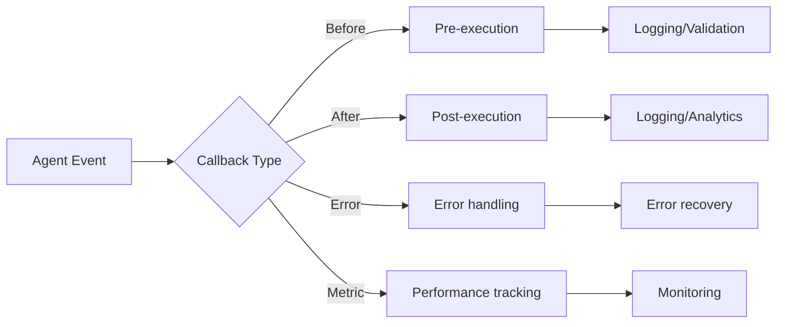

# Lab 9: Callbacks - Real-Time Monitoring and Event Handling

## 🎯 Learning Objectives

- Understand callback patterns in agent systems
- Learn how to monitor agent behavior in real-time
- Implement logging and debugging callbacks
- Build performance tracking systems
- Create audit trails for compliance

## 📖 Core Concepts

### What are Callbacks?

**Analogy**: Callbacks are like **security cameras in a store**:
- Monitor what's happening in real-time
- Record events for later review
- Alert when something important occurs
- Track performance metrics

### Callback Types



## 🏨 Travel Agent Use Case: TravelMate Monitored

Building **TravelMate Monitored** with observability:

1. **Request Logging**: Track all user requests
2. **Performance Metrics**: Measure response times
3. **Cost Tracking**: Monitor API usage and costs
4. **Error Alerts**: Notify on failures
5. **Audit Trail**: Compliance and debugging

## 💻 Code Walkthrough

### Step 1: Basic Callback System

```python
from typing import Callable, Dict, List
from datetime import datetime
import time

class CallbackEvent:
    """Event data passed to callbacks."""
    def __init__(self, event_type: str, agent_name: str, data: dict):
        self.event_type = event_type
        self.agent_name = agent_name
        self.data = data
        self.timestamp = datetime.now()

class CallbackManager:
    """Manages callbacks for agent events."""
    
    def __init__(self):
        self.callbacks: Dict[str, List[Callable]] = {
            "before_request": [],
            "after_request": [],
            "on_error": [],
            "on_tool_call": []
        }
    
    def register(self, event_type: str, callback: Callable):
        """Register a callback for an event type."""
        if event_type in self.callbacks:
            self.callbacks[event_type].append(callback)
    
    def trigger(self, event: CallbackEvent):
        """Trigger all callbacks for an event."""
        if event.event_type in self.callbacks:
            for callback in self.callbacks[event.event_type]:
                try:
                    callback(event)
                except Exception as e:
                    print(f"Callback error: {e}")

# Example callbacks
def log_request(event: CallbackEvent):
    """Log all requests."""
    print(f"[{event.timestamp}] {event.agent_name}: {event.data.get('message', '')}")

def track_performance(event: CallbackEvent):
    """Track performance metrics."""
    if "duration" in event.data:
        print(f"Performance: {event.data['duration']:.2f}s")

def alert_on_error(event: CallbackEvent):
    """Alert on errors."""
    print(f"⚠️  ERROR in {event.agent_name}: {event.data.get('error', '')}")

# Usage
callback_manager = CallbackManager()
callback_manager.register("before_request", log_request)
callback_manager.register("after_request", track_performance)
callback_manager.register("on_error", alert_on_error)
```

### Step 2: Agent with Callbacks

```python
from google import genai

class MonitoredAgent:
    """Agent with callback support."""
    
    def __init__(self, api_key: str, name: str, callback_manager: CallbackManager):
        self.client = genai.Client(api_key=api_key)
        self.name = name
        self.callback_manager = callback_manager
        
        self.agent = self.client.agentic.create_agent(
            model="gemini-2.0-flash-exp",
            system_instruction=f"You are {name}, a helpful assistant."
        )
        self.session = self.client.agentic.create_session(agent=self.agent)
    
    def chat(self, message: str) -> str:
        """Chat with callback hooks."""
        # Before request callback
        self.callback_manager.trigger(CallbackEvent(
            "before_request",
            self.name,
            {"message": message}
        ))
        
        start_time = time.time()
        
        try:
            # Execute request
            response = self.session.send_message(message)
            duration = time.time() - start_time
            
            # After request callback
            self.callback_manager.trigger(CallbackEvent(
                "after_request",
                self.name,
                {
                    "message": message,
                    "response": response.text,
                    "duration": duration
                }
            ))
            
            return response.text
            
        except Exception as e:
            # Error callback
            self.callback_manager.trigger(CallbackEvent(
                "on_error",
                self.name,
                {"message": message, "error": str(e)}
            ))
            raise
```

### Step 3: Advanced Monitoring

```python
import json
from pathlib import Path

class AdvancedMonitor:
    """Advanced monitoring with multiple outputs."""
    
    def __init__(self, log_dir: str = "./logs"):
        self.log_dir = Path(log_dir)
        self.log_dir.mkdir(exist_ok=True)
        self.metrics = {
            "total_requests": 0,
            "total_errors": 0,
            "total_duration": 0.0,
            "requests_by_agent": {}
        }
    
    def log_to_file(self, event: CallbackEvent):
        """Log events to file."""
        log_file = self.log_dir / f"{datetime.now().strftime('%Y-%m-%d')}.log"
        
        with open(log_file, 'a') as f:
            log_entry = {
                "timestamp": event.timestamp.isoformat(),
                "event_type": event.event_type,
                "agent": event.agent_name,
                "data": event.data
            }
            f.write(json.dumps(log_entry) + "\n")
    
    def update_metrics(self, event: CallbackEvent):
        """Update performance metrics."""
        if event.event_type == "after_request":
            self.metrics["total_requests"] += 1
            self.metrics["total_duration"] += event.data.get("duration", 0)
            
            agent = event.agent_name
            if agent not in self.metrics["requests_by_agent"]:
                self.metrics["requests_by_agent"][agent] = 0
            self.metrics["requests_by_agent"][agent] += 1
        
        elif event.event_type == "on_error":
            self.metrics["total_errors"] += 1
    
    def get_metrics(self) -> dict:
        """Get current metrics."""
        avg_duration = (self.metrics["total_duration"] / self.metrics["total_requests"] 
                       if self.metrics["total_requests"] > 0 else 0)
        
        return {
            **self.metrics,
            "average_duration": avg_duration,
            "error_rate": (self.metrics["total_errors"] / self.metrics["total_requests"]
                          if self.metrics["total_requests"] > 0 else 0)
        }
    
    def export_metrics(self, filename: str):
        """Export metrics to JSON."""
        with open(filename, 'w') as f:
            json.dumps(self.get_metrics(), f, indent=2)
```

### Step 4: Cost Tracking Callback

```python
class CostTracker:
    """Track API costs."""
    
    def __init__(self):
        self.costs = {
            "total_cost": 0.0,
            "costs_by_agent": {},
            "costs_by_model": {}
        }
        
        # Pricing (example rates)
        self.pricing = {
            "gemini-2.0-flash-exp": {
                "input": 0.0001,  # per 1K tokens
                "output": 0.0002
            }
        }
    
    def track_cost(self, event: CallbackEvent):
        """Calculate and track costs."""
        if event.event_type == "after_request":
            # Estimate tokens (simplified)
            message = event.data.get("message", "")
            response = event.data.get("response", "")
            
            input_tokens = len(message.split()) * 1.3  # Rough estimate
            output_tokens = len(response.split()) * 1.3
            
            model = "gemini-2.0-flash-exp"
            cost = (
                (input_tokens / 1000) * self.pricing[model]["input"] +
                (output_tokens / 1000) * self.pricing[model]["output"]
            )
            
            # Update totals
            self.costs["total_cost"] += cost
            
            agent = event.agent_name
            if agent not in self.costs["costs_by_agent"]:
                self.costs["costs_by_agent"][agent] = 0.0
            self.costs["costs_by_agent"][agent] += cost
    
    def get_report(self) -> str:
        """Generate cost report."""
        report = f"""
        === COST REPORT ===
        Total Cost: ${self.costs['total_cost']:.4f}
        
        By Agent:
        """
        
        for agent, cost in self.costs["costs_by_agent"].items():
            report += f"  - {agent}: ${cost:.4f}\n"
        
        return report
```

## 🔄 Complete Example

```python
class MonitoredTravelSystem:
    """Complete travel system with monitoring."""
    
    def __init__(self, api_key: str):
        # Setup callbacks
        self.callback_manager = CallbackManager()
        self.monitor = AdvancedMonitor()
        self.cost_tracker = CostTracker()
        
        # Register callbacks
        self.callback_manager.register("before_request", self.monitor.log_to_file)
        self.callback_manager.register("after_request", self.monitor.log_to_file)
        self.callback_manager.register("after_request", self.monitor.update_metrics)
        self.callback_manager.register("after_request", self.cost_tracker.track_cost)
        self.callback_manager.register("on_error", self.monitor.log_to_file)
        
        # Create agents
        self.flight_agent = MonitoredAgent(api_key, "Flight Agent", self.callback_manager)
        self.hotel_agent = MonitoredAgent(api_key, "Hotel Agent", self.callback_manager)
    
    def chat(self, agent_type: str, message: str) -> str:
        """Chat with monitoring."""
        if agent_type == "flight":
            return self.flight_agent.chat(message)
        elif agent_type == "hotel":
            return self.hotel_agent.chat(message)
        else:
            raise ValueError(f"Unknown agent type: {agent_type}")
    
    def get_dashboard(self) -> str:
        """Get monitoring dashboard."""
        metrics = self.monitor.get_metrics()
        cost_report = self.cost_tracker.get_report()
        
        return f"""
        === MONITORING DASHBOARD ===
        
        Performance Metrics:
        - Total Requests: {metrics['total_requests']}
        - Total Errors: {metrics['total_errors']}
        - Error Rate: {metrics['error_rate']:.2%}
        - Avg Duration: {metrics['average_duration']:.2f}s
        
        {cost_report}
        
        Requests by Agent:
        {json.dumps(metrics['requests_by_agent'], indent=2)}
        """

# Usage
system = MonitoredTravelSystem(api_key='your_api_key_here')

# Make requests
system.chat("flight", "Find flights to Paris")
system.chat("hotel", "Find hotels in Paris")

# View dashboard
print(system.get_dashboard())
```

## 🎓 Key Takeaways

✅ **Callbacks** provide real-time visibility into agent behavior
✅ **Monitoring** helps debug and optimize systems
✅ **Cost tracking** prevents budget overruns
✅ **Audit trails** ensure compliance
✅ **Performance metrics** identify bottlenecks

## 🔗 Connection to Next Lab

Lab 10 covers **Sequential Agents** - pipeline workflows where callbacks help track progress through each stage.

## ✅ Self-Check Quiz

1. What are the main types of callbacks?
2. How do callbacks help with debugging?
3. Why is cost tracking important?
4. What metrics should you monitor?
5. How do you implement error recovery with callbacks?

---

← [Lab 8: Stateful Multi-Agent](./Lab8_Guide_Stateful_Multi_Agent.md) | **Next**: [Lab 10: Sequential Agent](./Lab10_Guide_Sequential_Agent.md) →
