# Google ADK Complete Concepts Guide - TravelMate Journey

## 🎯 Overview

This comprehensive guide covers all 12 Google Agent Development Kit (ADK) concepts through the lens of building **TravelMate** - an intelligent travel planning assistant that evolves from a simple chatbot to a sophisticated multi-agent system.

---

## 📚 Table of Contents

1. [Basic Agent - Foundation](#1-basic-agent---foundation)
2. [Tool Agent - External Capabilities](#2-tool-agent---external-capabilities)
3. [LiteLLM Agent - Multi-Model Flexibility](#3-litellm-agent---multi-model-flexibility)
4. [Structured Outputs - Data Consistency](#4-structured-outputs---data-consistency)
5. [Sessions and State - Memory Management](#5-sessions-and-state---memory-management)
6. [Persistent Storage - Long-Term Memory](#6-persistent-storage---long-term-memory)
7. [Multi-Agent - Specialized Coordination](#7-multi-agent---specialized-coordination)
8. [Stateful Multi-Agent - Shared Context](#8-stateful-multi-agent---shared-context)
9. [Callbacks - Real-Time Monitoring](#9-callbacks---real-time-monitoring)
10. [Sequential Agent - Pipeline Workflows](#10-sequential-agent---pipeline-workflows)
11. [Parallel Agent - Concurrent Operations](#11-parallel-agent---concurrent-operations)
12. [Loop Agent - Iterative Refinement](#12-loop-agent---iterative-refinement)

---

## 1. Basic Agent - Foundation

### 🎯 Core Concept

An AI agent is an intelligent system that can understand natural language, reason about requests, maintain context, and generate helpful responses. Unlike simple chatbots that follow scripts, agents can adapt and think.

### 🏨 Travel Agent Analogy

**Chatbot vs AI Agent:**

- **Chatbot**: Like a hotel receptionist reading from a script
  - "The pool is on the 3rd floor"
  - No memory, no reasoning, just predefined answers

- **AI Agent**: Like an experienced travel concierge
  - Understands context: "You mentioned traveling with kids earlier"
  - Reasons: "Since you prefer budget travel, I recommend..."
  - Adapts: Adjusts recommendations based on your responses

### 📊 Architecture Diagram

```mermaid
graph TD
    A[User: "I want to visit Japan"] --> B[TravelMate Agent]
    B --> C[Gemini LLM]
    C --> D[Understands Intent]
    D --> E[Generates Response]
    E --> B
    B --> F[User: "Helpful info about Japan..."]
    
    style B fill:#4285f4,color:#fff
    style C fill:#ea4335,color:#fff
```

### 🔄 The Agent Loop

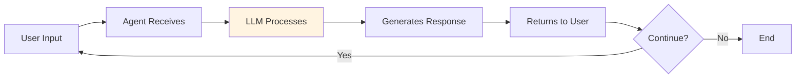

### 🎓 Key Concepts

**System Instruction**: The agent's "job description" - defines personality, role, and behavior
**Session**: A single conversation maintaining context across multiple messages
**Context Window**: How much conversation history the agent remembers

### 🗺️ TravelMate Evolution: Stage 1

**TravelMate Basic** - A friendly conversational assistant that:
- Greets travelers warmly
- Understands travel-related questions
- Provides destination information
- Maintains conversation context

---

## 2. Tool Agent - External Capabilities

### 🎯 Core Concept

Tools extend agents beyond conversation to take real actions. They're functions the agent can call to interact with external systems, APIs, databases, or perform calculations.

### 🏨 Travel Agent Analogy

**Without Tools**: Agent with no phone or computer
- "I think flights to Paris cost around $500-800" (guessing)

**With Tools**: Agent with phone, computer, and booking systems
- "Let me search for you... I found 3 flights: $645, $720, and $890" (real data)

### 📊 Tool Calling Architecture

```mermaid
graph TB
    A[User: "Find flights to Paris"] --> B[Agent]
    B --> C{Needs Tool?}
    C -->|Yes| D[Tool Registry]
    D --> E[search_flights Tool]
    E --> F[External API]
    F --> E
    E --> G[Flight Data]
    G --> B
    C -->|No| B
    B --> H[Response with Real Data]
    
    style D fill:#34a853,color:#fff
    style E fill:#fbbc04
```

### 🔄 Tool Execution Flow

```mermaid
sequenceDiagram
    participant U as User
    participant A as Agent
    participant L as LLM
    participant T as Tool
    
    U->>A: "Check weather in Tokyo"
    A->>L: Process request
    L->>L: Decides: Need weather tool
    L->>T: check_weather("Tokyo")
    T->>T: Call weather API
    T->>L: Return: 18°C, Sunny
    L->>A: Format response
    A->>U: "Tokyo is 18°C and sunny today"
```

### 🎓 Key Concepts

**Tool Definition**: Function with clear description, parameters, and return type
**Tool Registry**: Collection of available tools the agent can use
**Tool Selection**: LLM decides which tool to call based on user request
**Tool Chaining**: Agent can call multiple tools for complex queries

### 🗺️ TravelMate Evolution: Stage 2

**TravelMate Pro** - Enhanced with tools:
- **search_flights**: Real-time flight prices and availability
- **check_weather**: Weather forecasts for destinations
- **convert_currency**: Currency conversion for budgeting
- **search_hotels**: Hotel availability and pricing

---

## 3. LiteLLM Agent - Multi-Model Flexibility

### 🎯 Core Concept

LiteLLM provides a unified interface to use multiple AI models (GPT-4, Claude, Gemini) with the same code. This enables model selection based on task complexity, cost, and performance needs.

### 🏨 Travel Agent Analogy

**Without LiteLLM**: Different phone for each airline
- Need to learn different systems for each provider
- Can't easily switch or compare

**With LiteLLM**: Universal translator device
- One interface works with all providers
- Easy to switch based on needs
- Compare costs and performance

### 📊 Model Selection Strategy

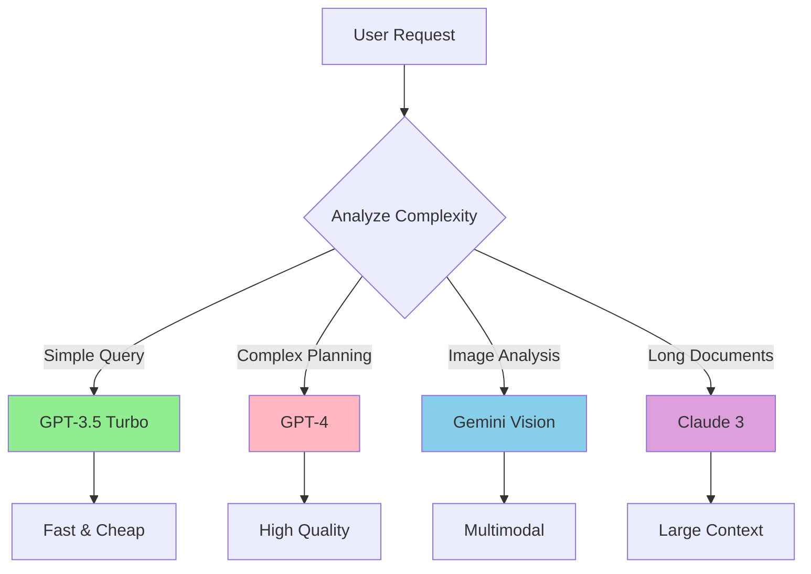

### 🔄 Intelligent Routing

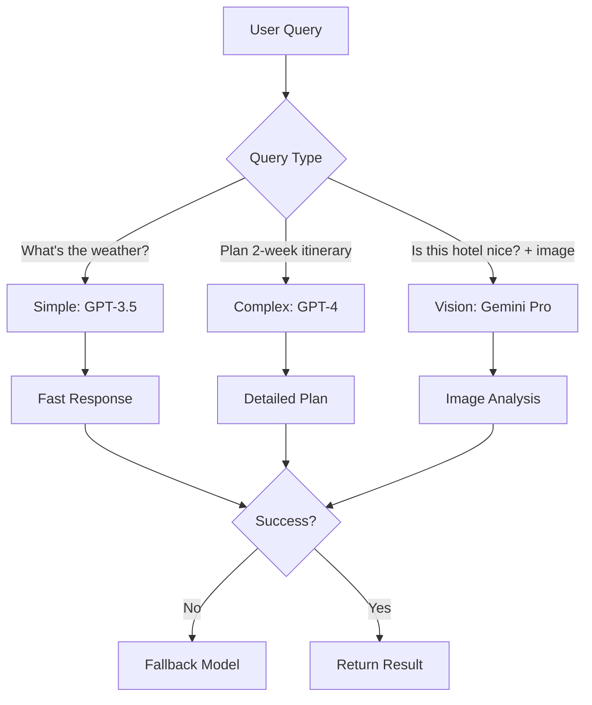

### 🎓 Key Concepts

**Model Router**: Logic that selects the best model for each task
**Fallback Strategy**: Backup models if primary fails
**Cost Optimization**: Use cheaper models for simple tasks
**Performance Tracking**: Monitor speed and quality across models

### 🗺️ TravelMate Evolution: Stage 3

**TravelMate Flex** - Intelligent model selection:
- Simple queries (weather) → Fast, cheap model
- Complex planning (itineraries) → Smart, capable model
- Image analysis (hotel photos) → Vision model
- Cost-sensitive operations → Budget model with fallback

---


## 4. Structured Outputs - Data Consistency

### 🎯 Core Concept

Structured outputs ensure agents return data in consistent, predictable formats using schemas (like Pydantic models). This makes responses easy to parse, validate, and integrate with other systems.

### 🏨 Travel Agent Analogy

**Unstructured Output**: Handwritten notes
- "Flight is $850 on JAL, leaves at 2pm, takes 14 hours"
- Hard to process, inconsistent format

**Structured Output**: Standardized form
- Airline: JAL | Price: $850 | Departure: 14:00 | Duration: 14h
- Easy to process, validate, and store in database

### 📊 Data Structure Hierarchy

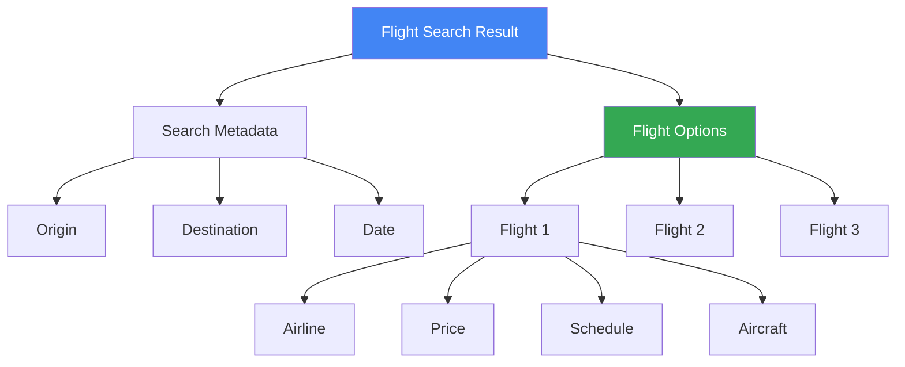

### 🔄 Validation Flow

```mermaid
sequenceDiagram
    participant U as User
    participant A as Agent
    participant L as LLM
    participant V as Validator
    participant D as Database
    
    U->>A: "Find flights"
    A->>L: Generate with schema
    L->>V: Raw JSON response
    
    alt Valid Data
        V->>V: ✓ Validate types
        V->>V: ✓ Check constraints
        V->>D: Store structured data
        D->>U: Display in UI
    else Invalid Data
        V->>L: ✗ Validation error
        L->>V: Retry with corrections
    end
```

### 🎓 Key Concepts

**Schema Definition**: Blueprint for data structure (fields, types, constraints)
**Type Safety**: Ensures data matches expected types (string, number, boolean)
**Validation**: Automatic checking of data quality and constraints
**Serialization**: Converting between formats (JSON, database, objects)

### 🗺️ TravelMate Evolution: Stage 4

**TravelMate Structured** - Returns validated data:
- Flight searches → Structured flight objects
- Hotel recommendations → Validated hotel data
- Itineraries → Complete trip plans with nested data
- Booking confirmations → Structured booking records

---

## 5. Sessions and State - Memory Management

### 🎯 Core Concept

State enables agents to remember information across multiple interactions. Sessions maintain conversation context, while state stores user preferences, history, and ongoing tasks.

### 🏨 Travel Agent Analogy

**Stateless**: Concierge with amnesia
- Every question is like meeting for the first time
- User must repeat all information

**Stateful**: Concierge with notepad
- Remembers your name, preferences, previous requests
- Builds on past conversations
- Provides personalized service

### 📊 State Types

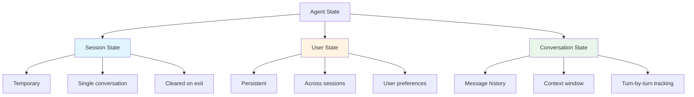

### 🔄 State Management Flow

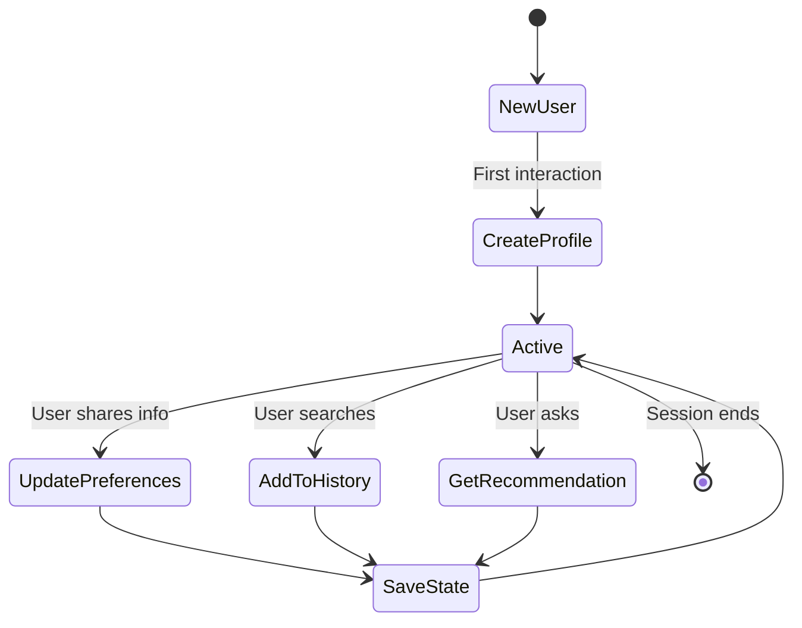

### 🎓 Key Concepts

**Session**: Single conversation with context retention
**User Profile**: Persistent information about the user
**Conversation History**: Record of past messages and interactions
**Preferences**: User's travel style, budget, dietary restrictions
**State Serialization**: Saving and loading state data

### 🗺️ TravelMate Evolution: Stage 5

**TravelMate Memory** - Remembers everything:
- User profile (name, home city, preferences)
- Travel style (budget, luxury, adventure)
- Dietary restrictions (vegetarian, vegan, allergies)
- Search history (past destinations, dates)
- Conversation context (what was discussed)

---

## 6. Persistent Storage - Long-Term Memory

### 🎯 Core Concept

Persistent storage saves agent data to databases, files, or cloud storage so information survives application restarts. This enables scalable, multi-user systems with reliable data retention.

### 🏨 Travel Agent Analogy

**In-Memory Only**: Notepad thrown away at end of shift
- Data lost when application restarts
- Can't share across devices

**Persistent Storage**: Central computer system
- Data survives restarts
- Accessible from any location
- Shared across all staff
- Backed up and secure

### 📊 Storage Architecture

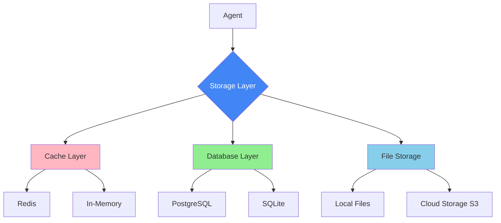

### 🔄 Cache-Aside Pattern

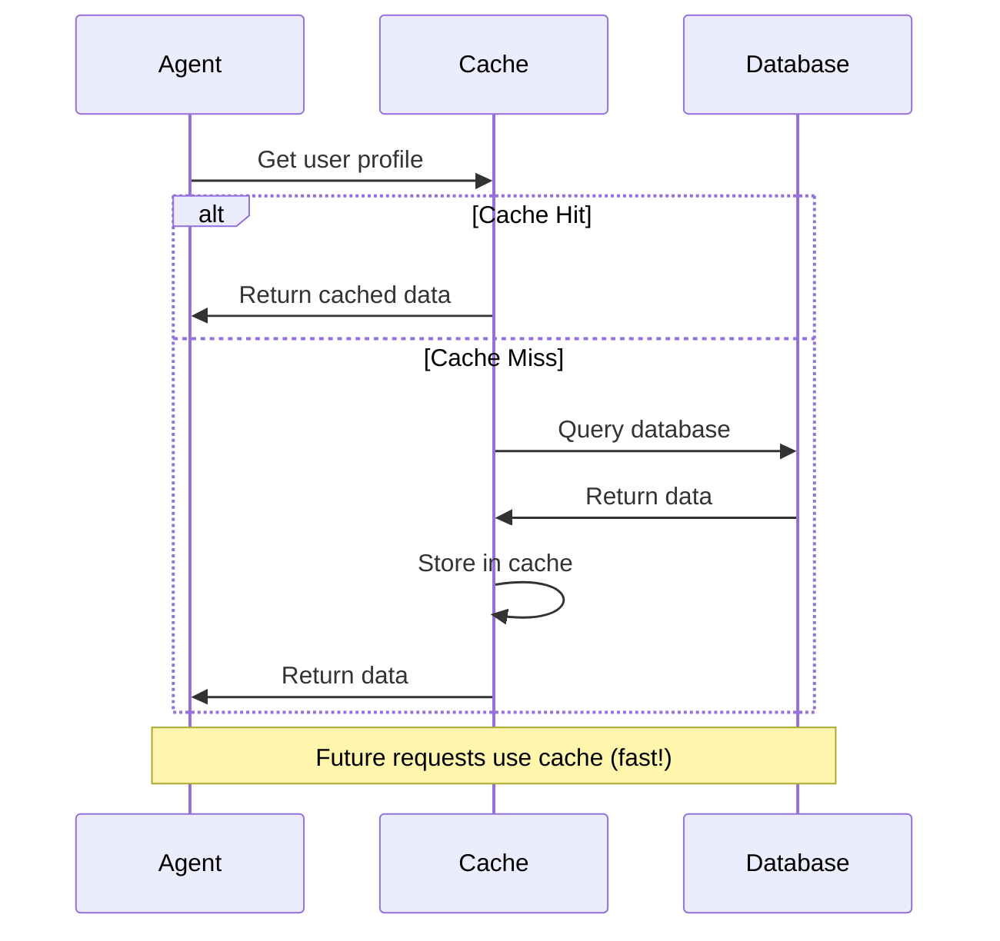

### 🎓 Key Concepts

**Database**: Structured storage (PostgreSQL, SQLite) for queryable data
**Cache**: Fast temporary storage (Redis) for frequently accessed data
**Cloud Storage**: Object storage (S3) for documents and files
**Backup Strategy**: Regular snapshots to prevent data loss
**Migration**: Updating database schema as system evolves

### 🗺️ TravelMate Evolution: Stage 6

**TravelMate Persistent** - Enterprise-grade storage:
- User profiles → PostgreSQL database
- Session cache → Redis for fast access
- Search history → Time-series database
- Documents (itineraries, receipts) → S3 cloud storage
- Analytics → Data warehouse for insights

---

## 7. Multi-Agent - Specialized Coordination

### 🎯 Core Concept

Multi-agent systems use specialized agents working together, each expert in specific domains. A manager agent coordinates their efforts to solve complex tasks requiring diverse expertise.

### 🏨 Travel Agent Analogy

**Single Agent**: One person handles everything
- Slow, limited expertise
- Jack of all trades, master of none

**Multi-Agent Team**: Specialized department
- Flight Expert: Knows airlines, routes, prices
- Hotel Specialist: Knows accommodations, amenities
- Activity Planner: Knows attractions, tours
- Manager: Coordinates the team

### 📊 Multi-Agent Architecture

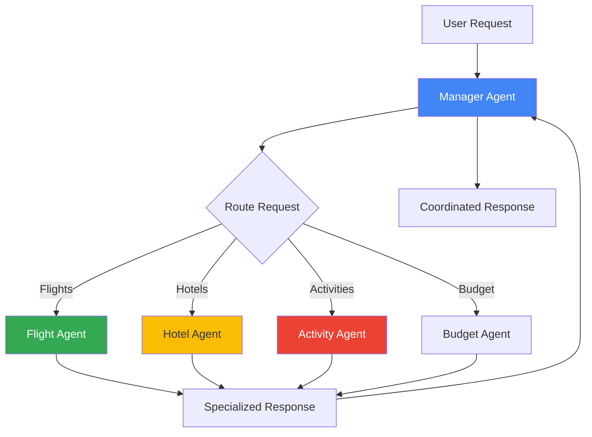

### 🔄 Agent Communication

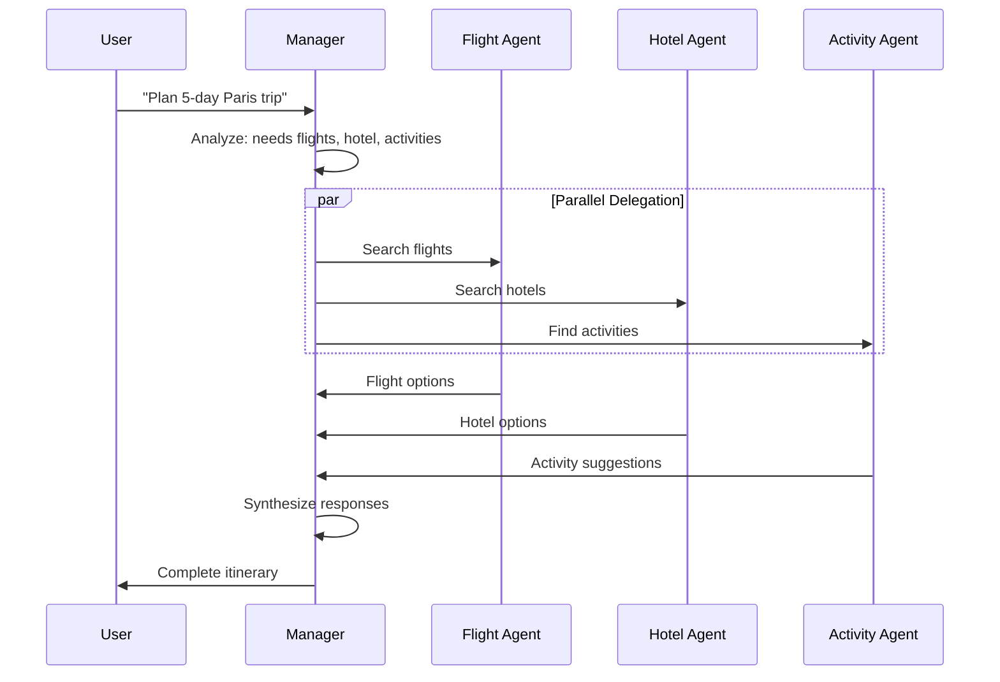

### 🎓 Key Concepts

**Specialization**: Each agent focuses on specific domain expertise
**Manager Pattern**: Central coordinator delegates to workers
**Agent Registry**: Directory of available specialized agents
**Message Protocol**: Standard format for agent-to-agent communication
**Result Aggregation**: Combining outputs from multiple agents

### 🗺️ TravelMate Evolution: Stage 7

**TravelMate Team** - Specialized agents:
- **Manager Agent**: Routes requests, coordinates responses
- **Flight Agent**: Expert in flights, airlines, routes
- **Hotel Agent**: Specialist in accommodations
- **Activity Agent**: Knows attractions, tours, restaurants
- **Budget Agent**: Optimizes costs across all bookings

---

## 8. Stateful Multi-Agent - Shared Context

### 🎯 Core Concept

Stateful multi-agent systems share context across all agents, enabling seamless handoffs and collaborative planning. All agents access the same trip information, building on each other's work.

### 🏨 Travel Agent Analogy

**Stateless Multi-Agent**: Doctors without shared records
- Each doctor starts fresh
- Patient repeats medical history to everyone

**Stateful Multi-Agent**: Hospital with electronic health records
- All doctors see the same patient file
- Cardiologist sees neurologist's notes
- Everyone works with complete context

### 📊 Shared State Architecture

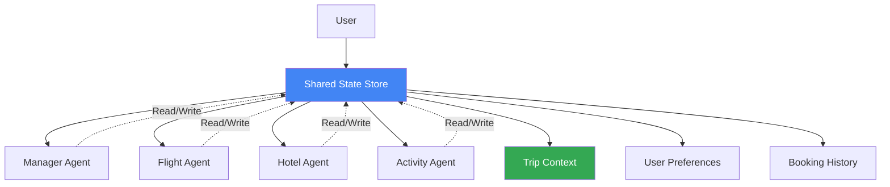

### 🔄 Context-Aware Handoff

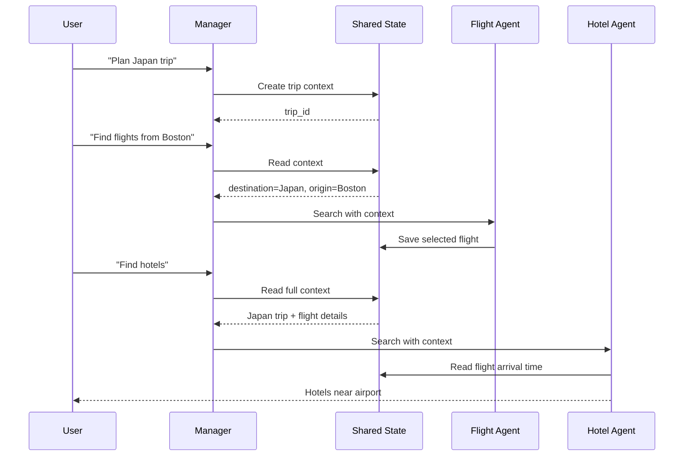

### 🎓 Key Concepts

**Shared State Store**: Central repository for trip context
**Context Propagation**: Passing information between agents
**Agent Handoff**: Seamless transition with full context
**State Synchronization**: Keeping all agents updated
**Conflict Resolution**: Handling simultaneous updates

### 🗺️ TravelMate Evolution: Stage 8

**TravelMate Stateful Team** - Collaborative intelligence:
- Shared trip context across all agents
- Flight agent saves booking → Hotel agent sees arrival time
- Hotel agent saves location → Activity agent suggests nearby attractions
- Budget agent tracks spending across all bookings
- Seamless handoffs with complete context

---

## 9. Callbacks - Real-Time Monitoring

### 🎯 Core Concept

Callbacks are event hooks that trigger when specific actions occur, enabling real-time monitoring, logging, performance tracking, and error handling without modifying core agent logic.

### 🏨 Travel Agent Analogy

**Without Callbacks**: No security cameras
- Don't know what's happening
- Can't review past events
- No performance metrics

**With Callbacks**: Security cameras + monitoring system
- Real-time visibility into operations
- Record all events for review
- Alert on important occurrences
- Track performance metrics

### 📊 Callback Architecture

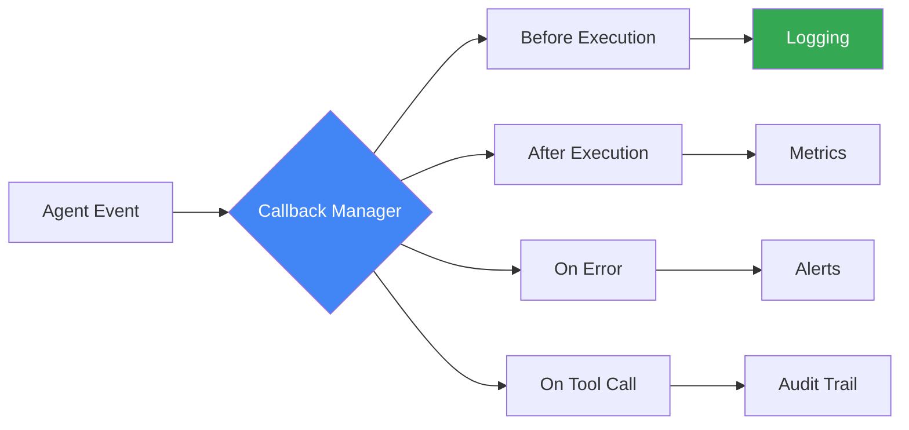

### 🔄 Event Flow with Callbacks

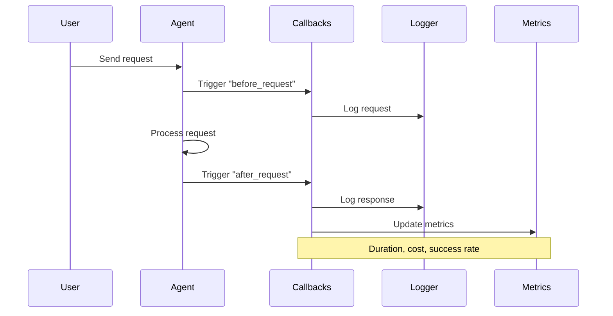

### 🎓 Key Concepts

**Event Types**: before_request, after_request, on_error, on_tool_call
**Callback Registration**: Subscribing functions to specific events
**Performance Tracking**: Measuring response times and throughput
**Cost Monitoring**: Tracking API usage and expenses
**Audit Trail**: Complete record of all operations for compliance

### 🗺️ TravelMate Evolution: Stage 9

**TravelMate Monitored** - Full observability:
- Request logging for all user interactions
- Performance metrics (response times, success rates)
- Cost tracking across all API calls
- Error alerts and notifications
- Audit trail for compliance and debugging

---

## 10. Sequential Agent - Pipeline Workflows

### 🎯 Core Concept

Sequential agents process tasks through multiple stages in order, where each stage completes before the next begins. Like an assembly line, data flows through a series of transformations.

### 🏨 Travel Agent Analogy

**Without Pipeline**: Chaotic process
- Do everything at once
- No clear order
- Hard to track progress

**With Pipeline**: Assembly line
- Stage 1: Research destination
- Stage 2: Create itinerary
- Stage 3: Book reservations
- Stage 4: Send confirmations
- Clear progress, quality checks at each stage

### 📊 Pipeline Architecture

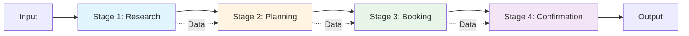

### 🔄 Stage Execution Flow

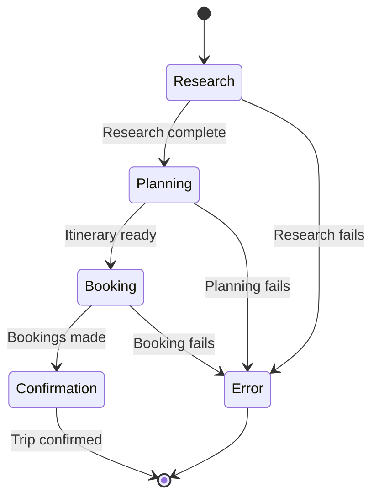

### 🎓 Key Concepts

**Pipeline Stages**: Discrete steps in the workflow
**Stage Dependencies**: Each stage requires previous stage's output
**Data Flow**: Information passes from stage to stage
**Progress Tracking**: Monitor which stage is currently executing
**Resumable Workflows**: Ability to pause and resume at any stage

### 🗺️ TravelMate Evolution: Stage 10

**TravelMate Pipeline** - Structured workflow:
- **Research Stage**: Gather destination information
- **Planning Stage**: Create detailed itinerary
- **Booking Stage**: Reserve flights, hotels, activities
- **Confirmation Stage**: Send confirmations and documents
- Clear progress indicators at each stage

---

## 11. Parallel Agent - Concurrent Operations

### 🎯 Core Concept

Parallel agents execute multiple tasks simultaneously rather than sequentially, dramatically improving performance by leveraging concurrency. Multiple agents work at the same time on independent tasks.

### 🏨 Travel Agent Analogy

**Sequential**: Single checkout lane
- One customer at a time
- Everyone waits in line
- Slow overall throughput

**Parallel**: Multiple checkout lanes
- Many customers served simultaneously
- Much faster overall
- Independent operations

### 📊 Parallel Execution Architecture

```mermaid
graph TB
    A[User Request] --> B[Dispatcher]
    
    B --> C[Agent 1: Flights]
    B --> D[Agent 2: Hotels]
    B --> E[Agent 3: Activities]
    B --> F[Agent 4: Weather]
    
    C --> G[Aggregator]
    D --> G
    E --> G
    F --> G
    
    G --> H[Combined Results]
    
    style B fill:#4285f4,color:#fff
    style G fill:#34a853,color:#fff
```

### 🔄 Concurrent Execution Flow

```mermaid
sequenceDiagram
    participant U as User
    participant D as Dispatcher
    participant F as Flight Agent
    participant H as Hotel Agent
    participant A as Activity Agent
    participant R as Result Aggregator
    
    U->>D: "Plan Paris trip"
    
    par Parallel Execution
        D->>F: Search flights
        D->>H: Search hotels
        D->>A: Find activities
    end
    
    F->>R: Flight results
    H->>R: Hotel results
    A->>R: Activity results
    
    R->>R: Combine & rank
    R->>U: Complete results
    
    Note over F,A: All execute simultaneously
```

### 🎓 Key Concepts

**Concurrency**: Multiple operations happening at the same time
**Async/Await**: Programming pattern for non-blocking operations
**Task Parallelism**: Distributing independent tasks across agents
**Result Aggregation**: Combining outputs from parallel operations
**Error Handling**: Managing failures in concurrent operations

### 🗺️ TravelMate Evolution: Stage 11

**TravelMate Parallel** - Lightning fast:
- Search multiple airlines simultaneously
- Query multiple hotel booking sites at once
- Check multiple activity providers in parallel
- Aggregate and rank all results
- 5x faster than sequential processing

---

## 12. Loop Agent - Iterative Refinement

### 🎯 Core Concept

Loop agents iteratively improve their outputs through feedback loops. They generate, evaluate, refine, and repeat until reaching a quality threshold, creating self-improving systems.

### 🏨 Travel Agent Analogy

**Without Loops**: First draft is final
- No review or improvement
- Accept whatever comes out first
- Variable quality

**With Loops**: Editing process
- Write first draft
- Review and identify issues
- Revise and improve
- Repeat until excellent
- Consistently high quality

### 📊 Loop Architecture

```mermaid
graph TB
    A[Initial Input] --> B[Generate]
    B --> C[Evaluate Quality]
    C --> D{Good Enough?}
    D -->|No| E[Identify Issues]
    E --> F[Refine]
    F --> B
    D -->|Yes| G[Final Output]
    
    style B fill:#e1f5ff
    style C fill:#fff4e1
    style E fill:#ffe1e1
    style F fill:#e8f5e9
```

### 🔄 Iterative Refinement Flow

```mermaid
sequenceDiagram
    participant U as User
    participant G as Generator
    participant E as Evaluator
    participant R as Refiner
    
    U->>G: "Create Paris itinerary"
    
    loop Until Quality Met
        G->>E: Generated itinerary
        E->>E: Evaluate quality
        
        alt Quality Good
            E->>U: Final itinerary
        else Needs Improvement
            E->>R: Issues found
            R->>G: Refinement suggestions
        end
    end
```

### 🎓 Key Concepts

**Generation**: Creating initial output
**Evaluation**: Assessing quality against criteria
**Refinement**: Improving based on evaluation feedback
**Convergence Criteria**: Conditions that determine "good enough"
**Max Iterations**: Limit to prevent infinite loops
**Quality Metrics**: Measurable standards for evaluation

### 🗺️ TravelMate Evolution: Stage 12

**TravelMate Refined** - Self-improving excellence:
- Generate initial itinerary
- Evaluate completeness, budget, feasibility
- Identify gaps or issues
- Refine and improve
- Repeat until quality threshold met
- Deliver polished, high-quality plans

---

## 🎯 Complete TravelMate Journey Summary

### Evolution Timeline

```mermaid
graph LR
    A[Basic] --> B[Pro]
    B --> C[Flex]
    C --> D[Structured]
    D --> E[Memory]
    E --> F[Persistent]
    F --> G[Team]
    G --> H[Stateful Team]
    H --> I[Monitored]
    I --> J[Pipeline]
    J --> K[Parallel]
    K --> L[Refined]
    
    style A fill:#e1f5ff
    style D fill:#fff4e1
    style G fill:#e8f5e9
    style J fill:#f3e5f5
    style L fill:#ffe1e1
```

### Capability Matrix

| Stage | Capability | Key Feature |
|-------|-----------|-------------|
| 1. Basic | Conversation | Natural language understanding |
| 2. Pro | Actions | Real-time data via tools |
| 3. Flex | Intelligence | Multi-model optimization |
| 4. Structured | Reliability | Validated data formats |
| 5. Memory | Personalization | Remembers preferences |
| 6. Persistent | Scalability | Enterprise storage |
| 7. Team | Specialization | Expert agents |
| 8. Stateful Team | Collaboration | Shared context |
| 9. Monitored | Observability | Real-time insights |
| 10. Pipeline | Organization | Structured workflows |
| 11. Parallel | Performance | Concurrent operations |
| 12. Refined | Excellence | Iterative improvement |

---

## 🎓 Key Takeaways

### Foundational Principles

1. **Start Simple**: Begin with basic agents, add complexity gradually
2. **Tools Enable Action**: Agents need tools to interact with the real world
3. **State Enables Memory**: Stateful agents provide personalized experiences
4. **Specialization Scales**: Multi-agent systems handle complex domains
5. **Monitoring Ensures Quality**: Observability is crucial for production systems

### Architecture Patterns

1. **Single Agent**: Simple tasks, conversational interfaces
2. **Tool-Enhanced Agent**: Real-time data and actions
3. **Multi-Agent System**: Complex tasks requiring diverse expertise
4. **Pipeline Pattern**: Sequential processing with clear stages
5. **Parallel Pattern**: Concurrent operations for performance
6. **Loop Pattern**: Iterative refinement for quality

### Production Considerations

1. **Scalability**: Use persistent storage and caching
2. **Reliability**: Implement error handling and fallbacks
3. **Performance**: Leverage parallelism and model optimization
4. **Cost**: Track usage and optimize model selection
5. **Quality**: Use loops and evaluation for consistent results
6. **Observability**: Monitor with callbacks and logging

---

## 🚀 Next Steps

### For Learners
1. Start with Lab 1 (Basic Agent)
2. Progress through each concept sequentially
3. Build your own TravelMate variant
4. Experiment with different use cases

### For Developers
1. Choose patterns that fit your use case
2. Start with MVP (Basic + Tools)
3. Add complexity as needed
4. Monitor and optimize continuously

### For Architects
1. Design for scalability from the start
2. Plan multi-agent coordination carefully
3. Implement observability early
4. Consider cost optimization strategies

---

**End of Comprehensive Concepts Guide**

This guide covered all 12 Google ADK concepts through the TravelMate journey, from a simple chatbot to a sophisticated, production-ready multi-agent system. Each concept builds on the previous, creating a complete understanding of modern AI agent development.
