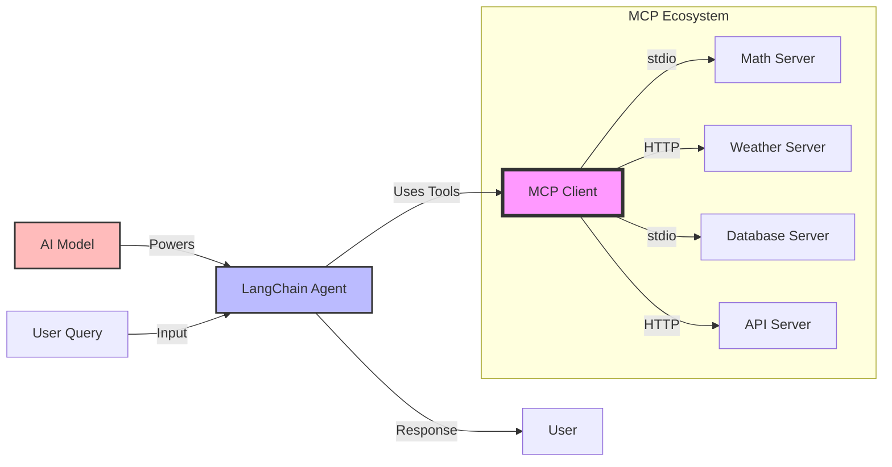
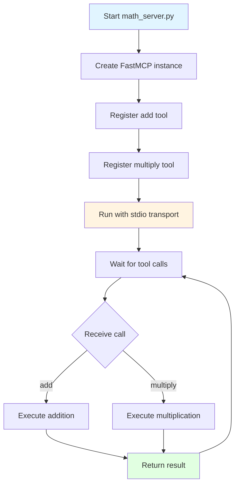
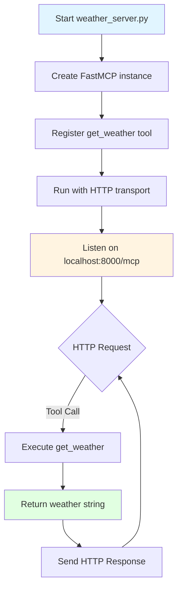
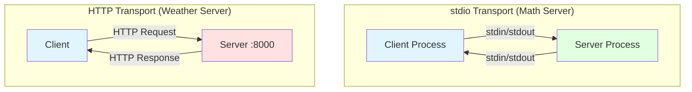
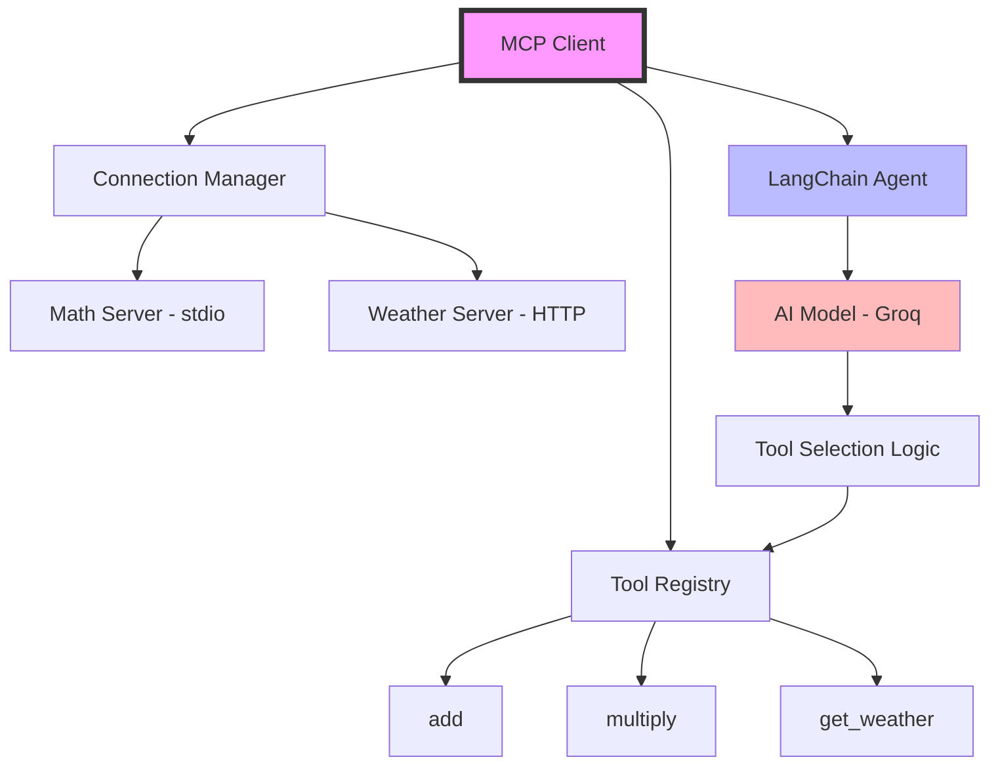
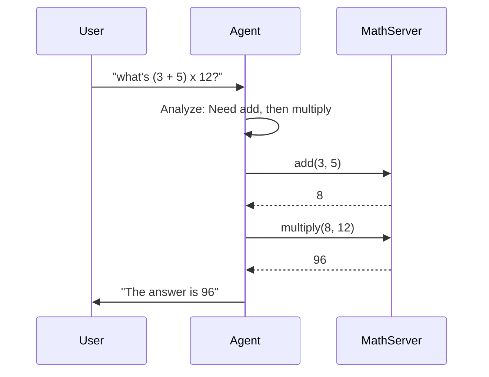
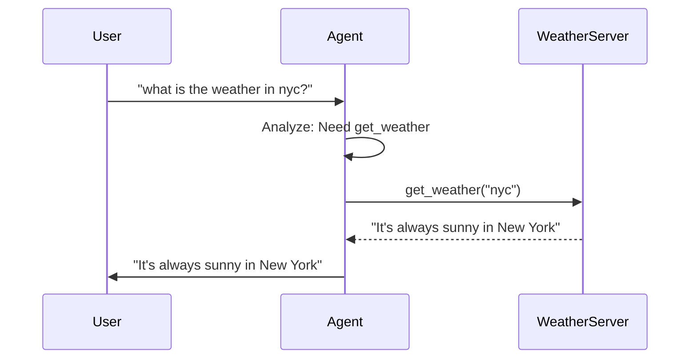
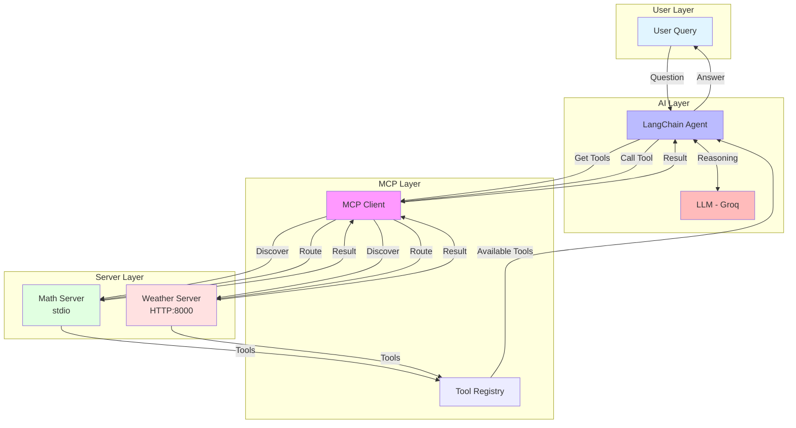

# Model Context Protocol (MCP) - Complete Beginner's Guide

## Table of Contents
1. [What is MCP?](#what-is-mcp)
2. [Core Concepts](#core-concepts)
3. [Real-World Analogies](#real-world-analogies)
4. [Architecture Overview](#architecture-overview)
5. [Lab 1: Math Server](#lab-1-math-server)
6. [Lab 2: Weather Server](#lab-2-weather-server)
7. [Lab 3: MCP Client Integration](#lab-3-mcp-client-integration)
8. [Common Patterns & Best Practices](#common-patterns--best-practices)
9. [Troubleshooting](#troubleshooting)

---

## What is MCP?

**Model Context Protocol (MCP)** is a standardized way for AI models to communicate with external tools and services. Think of it as a universal adapter that lets AI assistants use different tools without needing to know the specific details of how each tool works.

### Why MCP Matters

Before MCP, every AI application had to:
- Write custom code for each tool integration
- Handle different communication protocols
- Manage tool discovery manually
- Deal with inconsistent data formats

With MCP:
- Tools expose themselves in a standard format
- AI models automatically discover available tools
- Communication happens through a unified protocol
- Adding new tools is plug-and-play

### Key Benefits

1. **Standardization**: One protocol for all tools
2. **Discoverability**: AI models can find tools automatically
3. **Flexibility**: Easy to add/remove tools
4. **Scalability**: Connect multiple servers seamlessly
5. **Simplicity**: Less code, more functionality

---

## Core Concepts

### 1. MCP Server

An **MCP Server** is a program that exposes tools (functions) that AI models can use.

**Key Characteristics:**
- Runs as a standalone process
- Exposes one or more tools
- Handles tool execution
- Returns results in a structured format

**Example:**
```python
from fastmcp import FastMCP

mcp = FastMCP("Math")  # Create a server named "Math"

@mcp.tool()  # Decorator to expose a function as a tool
def add(a: int, b: int) -> int:
    """Add two numbers"""
    return a + b
```

### 2. MCP Client

An **MCP Client** connects to one or more MCP servers and orchestrates tool calls.

**Key Characteristics:**
- Discovers available tools from servers
- Routes tool calls to appropriate servers
- Manages multiple server connections
- Integrates with AI models (LLMs)

**Example:**
```python
client = MultiServerMCPClient({
    "math": {"transport": "stdio", "command": "python", "args": ["math_server.py"]},
    "weather": {"transport": "streamable_http", "url": "http://localhost:8000/mcp"}
})
tools = await client.get_tools()  # Discover all tools
```

### 3. Tools

**Tools** are functions that AI models can call to perform specific tasks.

**Key Characteristics:**
- Have clear names and descriptions
- Define input parameters with types
- Return structured output
- Include documentation (docstrings)

**Example:**
```python
@mcp.tool()
def multiply(a: int, b: int) -> int:
    """Multiply two numbers together"""
    return a * b
```

### 4. Transport Mechanisms

**Transport** defines how the client and server communicate.


**Two Main Types:**

| Transport | Use Case | Communication Method |
|-----------|----------|---------------------|
| **stdio** | Local Python processes | Standard input/output streams |
| **streamable_http** | Web-based servers | HTTP requests/responses |

**stdio Example:**
```python
# Server side
mcp.run(transport="stdio")

# Client side
"math": {
    "transport": "stdio",
    "command": "python",
    "args": ["math_server.py"]
}
```

**streamable_http Example:**
```python
# Server side
mcp.run(transport="streamable-http")

# Client side
"weather": {
    "transport": "streamable_http",
    "url": "http://localhost:8000/mcp"
}
```

---

## Real-World Analogies

### Analogy 1: Restaurant Kitchen

Imagine an AI assistant as a **customer** in a restaurant:

- **MCP Servers** = Different kitchen stations (grill, salad bar, dessert station)
- **Tools** = Menu items each station can prepare
- **MCP Client** = Waiter who knows all menu items and routes orders
- **Transport** = How orders are communicated (verbal for nearby, phone for remote)

**Flow:**
1. Customer (AI) asks waiter (client): "I want a burger and salad"
2. Waiter checks menu (discovers tools)
3. Waiter routes: burger → grill station, salad → salad bar
4. Stations prepare items (execute tools)
5. Waiter delivers complete order (returns results)

### Analogy 2: Smart Home System


Think of MCP as a **smart home hub**:

- **MCP Servers** = Individual smart devices (lights, thermostat, security camera)
- **Tools** = Actions each device can perform (turn on/off, adjust temperature, record video)
- **MCP Client** = Central hub (like Alexa or Google Home)
- **AI Model** = Voice assistant that understands your commands

**Flow:**
1. You say: "Turn on the lights and set temperature to 72°F"
2. Hub (client) knows all connected devices (discovers tools)
3. Hub sends: lights → turn_on(), thermostat → set_temperature(72)
4. Devices execute commands
5. Hub confirms: "Done!"

### Analogy 3: Library System

- **MCP Servers** = Different library departments (fiction, reference, archives)
- **Tools** = Services each department offers (search books, check out, reserve)
- **MCP Client** = Librarian who knows all departments
- **AI Model** = Student asking for help

**Flow:**
1. Student: "I need a book on Python programming and want to reserve a study room"
2. Librarian (client) knows all services (discovers tools)
3. Librarian routes: reference dept → search_books("Python"), facilities → reserve_room()
4. Departments process requests
5. Librarian provides: book location + room number

---

## Architecture Overview

### High-Level Architecture

```mermaid
graph TB
    User[👤 User] -->|Question| LLM[🤖 AI Model/LLM]
    LLM -->|Needs Tool| Client[📡 MCP Client]
    Client -->|Discovers Tools| Server1[🔧 Math Server]
    Client -->|Discovers Tools| Server2[🌤️ Weather Server]
    Client -->|Discovers Tools| ServerN[⚙️ Other Servers]
    
    Server1 -->|add, multiply| Client
    Server2 -->|get_weather| Client
    ServerN -->|custom_tools| Client
    
    Client -->|Available Tools| LLM
    LLM -->|Calls Tool| Client
    Client -->|Routes Call| Server1
    Server1 -->|Returns Result| Client
    Client -->|Result| LLM
    LLM -->|Answer| User
    
    style User fill:#e1f5ff
    style LLM fill:#fff4e1
    style Client fill:#f0e1ff
    style Server1 fill:#e1ffe1
    style Server2 fill:#e1ffe1
    style ServerN fill:#e1ffe1
```




### Communication Flow

```mermaid
sequenceDiagram
    participant User
    participant LLM as AI Model
    participant Client as MCP Client
    participant MathServer as Math Server
    participant WeatherServer as Weather Server
    
    User->>LLM: "What's (3+5) x 12 and weather in NYC?"
    LLM->>Client: Request available tools
    Client->>MathServer: Discover tools
    MathServer-->>Client: [add, multiply]
    Client->>WeatherServer: Discover tools
    WeatherServer-->>Client: [get_weather]
    Client-->>LLM: All tools: [add, multiply, get_weather]
    
    LLM->>Client: Call add(3, 5)
    Client->>MathServer: Execute add(3, 5)
    MathServer-->>Client: Result: 8
    Client-->>LLM: 8
    
    LLM->>Client: Call multiply(8, 12)
    Client->>MathServer: Execute multiply(8, 12)
    MathServer-->>Client: Result: 96
    Client-->>LLM: 96
    
    LLM->>Client: Call get_weather("NYC")
    Client->>WeatherServer: Execute get_weather("NYC")
    WeatherServer-->>Client: "Sunny, 72°F"
    Client-->>LLM: "Sunny, 72°F"
    
    LLM->>User: "The answer is 96, and it's sunny in NYC!"
```



### Component Interaction



---

## Lab 1: Math Server

### Objective
Create an MCP server that exposes mathematical operations (addition and multiplication) as tools.

### Concepts Covered
- Creating an MCP server
- Defining tools with decorators
- Type hints and documentation
- stdio transport mechanism

### Step-by-Step Guide

#### Step 1: Understanding the Code Structure

```python
from fastmcp import FastMCP

# Create an MCP server instance with a name
mcp = FastMCP("Math")
```

**What's happening:**
- `FastMCP("Math")` creates a new MCP server
- The name "Math" identifies this server
- This server will expose mathematical tools

#### Step 2: Defining the First Tool - Addition

```python
@mcp.tool()
def add(a: int, b: int) -> int:
    """Add two numbers"""
    return a + b
```

**Breaking it down:**
- `@mcp.tool()` - Decorator that registers the function as an MCP tool
- `def add(a: int, b: int)` - Function name and parameters with type hints
- `-> int` - Return type annotation (required for MCP)
- `"""Add two numbers"""` - Docstring describing what the tool does
- `return a + b` - The actual implementation

**Why type hints matter:**
- MCP uses them to generate tool schemas
- AI models need to know what types to pass
- Helps with validation and error prevention

#### Step 3: Defining the Second Tool - Multiplication

```python
@mcp.tool()
def multiply(a: int, b: int) -> int:
    """Multiply two numbers"""
    return a * b
```

**Same pattern:**
- Decorator registers the tool
- Type hints define input/output
- Docstring explains functionality
- Simple implementation


#### Step 4: Running the Server

```python
if __name__ == "__main__":    
    mcp.run(transport="stdio")
```

**What's happening:**
- `if __name__ == "__main__"` - Only runs when script is executed directly
- `mcp.run(transport="stdio")` - Starts the server using stdio transport
- stdio means communication happens through standard input/output

### Complete Code

```python
import sys
from fastmcp import FastMCP

mcp = FastMCP("Math")

@mcp.tool()
def add(a: int, b: int) -> int:
    """Add two numbers"""
    return a + b

@mcp.tool()
def multiply(a: int, b: int) -> int:
    """Multiply two numbers"""
    return a * b

if __name__ == "__main__":    
    mcp.run(transport="stdio")
```

### How It Works - Visual Flow



### Testing the Server

You can't test this server directly yet - it needs a client to communicate with it. We'll do that in Lab 3.

### Key Takeaways

1. **FastMCP** makes creating servers simple
2. **@mcp.tool()** decorator exposes functions as tools
3. **Type hints** are mandatory for MCP tools
4. **Docstrings** help AI models understand tool purpose
5. **stdio transport** is perfect for local Python processes


### Practice Exercises

1. **Add a subtraction tool:**
   ```python
   @mcp.tool()
   def subtract(a: int, b: int) -> int:
       """Subtract b from a"""
       return a - b
   ```

2. **Add a division tool with error handling:**
   ```python
   @mcp.tool()
   def divide(a: float, b: float) -> float:
       """Divide a by b"""
       if b == 0:
           raise ValueError("Cannot divide by zero")
       return a / b
   ```

3. **Add a power tool:**
   ```python
   @mcp.tool()
   def power(base: int, exponent: int) -> int:
       """Raise base to the power of exponent"""
       return base ** exponent
   ```

---

## Lab 2: Weather Server

### Objective
Create an MCP server that exposes weather information through an HTTP endpoint.

### Concepts Covered
- HTTP-based MCP servers
- Async functions
- streamable_http transport
- Different transport mechanisms

### Step-by-Step Guide

#### Step 1: Understanding HTTP Transport

Unlike the Math server (stdio), the Weather server uses HTTP:

**stdio vs HTTP:**

| Feature | stdio | streamable_http |
|---------|-------|-----------------|
| Communication | Standard I/O streams | HTTP requests |
| Use Case | Local processes | Web services |
| Accessibility | Same machine only | Network accessible |
| Scalability | Single client | Multiple clients |

#### Step 2: Creating the Weather Server

```python
from fastmcp import FastMCP

mcp = FastMCP("Weather")
```

**Same as Math server:**
- Create FastMCP instance
- Give it a descriptive name


#### Step 3: Defining an Async Tool

```python
@mcp.tool()
async def get_weather(location: str) -> str:
    """Get weather for location."""
    return "It's always sunny in New York"
```

**Key differences from Math server:**
- `async def` - Asynchronous function (can handle concurrent requests)
- `location: str` - Takes a string parameter instead of integers
- Returns a string message
- Simplified implementation (returns static data)

**Why async?**
- HTTP servers handle multiple requests simultaneously
- Async allows non-blocking operations
- Better performance for I/O operations
- Not required, but recommended for HTTP servers

#### Step 4: Running with HTTP Transport

```python
if __name__ == "__main__":
    mcp.run(transport="streamable-http")
```

**What's different:**
- `transport="streamable-http"` instead of "stdio"
- Server will listen on `http://localhost:8000/mcp` by default
- Accessible from any HTTP client

### Complete Code

```python
from fastmcp import FastMCP

mcp = FastMCP("Weather")

@mcp.tool()
async def get_weather(location: str) -> str:
    """Get weather for location."""
    return "It's always sunny in New York"

if __name__ == "__main__":
    mcp.run(transport="streamable-http")
```

### How It Works - Visual Flow




### Running the Server

```bash
# Terminal 1 - Start the weather server
python weather_server.py
```

**Expected output:**
```
INFO:     Started server process
INFO:     Waiting for application startup.
INFO:     Application startup complete.
INFO:     Uvicorn running on http://0.0.0.0:8000
```

The server is now running and waiting for requests!

### Transport Comparison Diagram



### Key Takeaways

1. **HTTP transport** enables network-accessible servers
2. **async functions** are recommended for HTTP servers
3. **streamable-http** runs on port 8000 by default
4. **Same decorator pattern** works for both transports
5. **Different use cases** - stdio for local, HTTP for remote

### Practice Exercises

1. **Add temperature parameter:**
   ```python
   @mcp.tool()
   async def get_weather(location: str, unit: str = "celsius") -> str:
       """Get weather for location in specified unit"""
       return f"It's 25°{unit[0].upper()} in {location}"
   ```

2. **Add forecast tool:**
   ```python
   @mcp.tool()
   async def get_forecast(location: str, days: int = 3) -> str:
       """Get weather forecast for next N days"""
       return f"{days}-day forecast for {location}: Sunny all week!"
   ```

3. **Return structured data:**
   ```python
   @mcp.tool()
   async def get_detailed_weather(location: str) -> dict:
       """Get detailed weather information"""
       return {
           "location": location,
           "temperature": 72,
           "condition": "Sunny",
           "humidity": 45,
           "wind_speed": 10
       }
   ```

---

## Lab 3: MCP Client Integration

### Objective
Create a client that connects to both Math and Weather servers, discovers their tools, and uses an AI model to automatically call them.

### Concepts Covered
- Multi-server client setup
- Tool discovery
- LangChain integration
- AI-powered tool selection
- Async programming

### Step-by-Step Guide

#### Step 1: Understanding the Client Architecture



#### Step 2: Setting Up Environment Variables

```python
from dotenv import load_dotenv
load_dotenv()  # Load environment variables from .env file
```

**Why?**
- Keeps API keys secure
- Separates configuration from code
- Easy to change without modifying code

**Create a .env file:**
```bash
GROQ_API_KEY=your_groq_api_key_here
```

#### Step 3: Configuring Multi-Server Client

```python
import os
from langchain_mcp_adapters.client import MultiServerMCPClient

# Get absolute path to math server
math_server_path = os.path.join(os.path.dirname(__file__), "math_server.py")

client = MultiServerMCPClient({
    "math": {
        "transport": "stdio",
        "command": "python",
        "args": [math_server_path],
    },
    "weather": {
        "transport": "streamable_http",
        "url": "http://localhost:8000/mcp",
    },
})
```


**Breaking it down:**

**Math Server Configuration:**
```python
"math": {
    "transport": "stdio",      # Communication method
    "command": "python",        # Command to run
    "args": [math_server_path], # Script to execute
}
```
- Client will spawn a Python process running math_server.py
- Communication happens through stdin/stdout
- Process runs as long as client is active

**Weather Server Configuration:**
```python
"weather": {
    "transport": "streamable_http",  # Communication method
    "url": "http://localhost:8000/mcp",  # Server endpoint
}
```
- Client connects to already-running HTTP server
- Communication happens through HTTP requests
- Server must be started separately

#### Step 4: Discovering Tools

```python
tools = await client.get_tools()
```

**What happens:**
1. Client connects to both servers
2. Requests tool list from each server
3. Combines all tools into a single list
4. Returns tools in LangChain-compatible format

**Result:**
```python
[
    Tool(name="add", description="Add two numbers", ...),
    Tool(name="multiply", description="Multiply two numbers", ...),
    Tool(name="get_weather", description="Get weather for location", ...)
]
```

#### Step 5: Creating the AI Agent

```python
from langchain.agents import create_agent
from langchain_groq import ChatGroq

llm = ChatGroq(model="qwen/qwen3-32b")
agent = create_agent(llm, tools)
```

**Components:**
- `ChatGroq` - AI model provider (using Groq's API)
- `model="qwen/qwen3-32b"` - Specific model to use
- `create_agent(llm, tools)` - Creates agent with AI model + tools

**What the agent does:**
1. Receives user question
2. Analyzes what tools are needed
3. Calls appropriate tools in correct order
4. Combines results into final answer


#### Step 6: Using the Agent

```python
# Math question
math_response = await agent.ainvoke({
    "messages": [{"role": "user", "content": "what's (3 + 5) x 12?"}]
})
print("Math response:", math_response['messages'][-1])

# Weather question
weather_response = await agent.ainvoke({
    "messages": [{"role": "user", "content": "what is the weather in nyc?"}]
})
print("Weather response:", weather_response['messages'][-1])
```

**How it works:**

**Math Question Flow:**


**Weather Question Flow:**


### Complete Code

```python
import asyncio
import os
from langchain_mcp_adapters.client import MultiServerMCPClient
from langchain.agents import create_agent
from langchain_groq import ChatGroq
from dotenv import load_dotenv

load_dotenv()

async def main():
    print("Starting MCP Client...")
    
    # Get path to math server
    math_server_path = os.path.join(os.path.dirname(__file__), "math_server.py")
    
    # Create multi-server client
    client = MultiServerMCPClient({
        "math": {
            "transport": "stdio",
            "command": "python",
            "args": [math_server_path],
        },
        "weather": {
            "transport": "streamable_http",
            "url": "http://localhost:8000/mcp",
        },
    })
    
    # Discover tools
    print("Discovering tools...")
    tools = await client.get_tools()
    print(f"Found {len(tools)} tools:", [t.name for t in tools])
    
    # Create agent
    print("Creating AI agent...")
    llm = ChatGroq(model="qwen/qwen3-32b")
    agent = create_agent(llm, tools)
    
    # Test math
    print("\n--- Math Test ---")
    math_response = await agent.ainvoke({
        "messages": [{"role": "user", "content": "what's (3 + 5) x 12?"}]
    })
    print("Response:", math_response['messages'][-1].content)
    
    # Test weather
    print("\n--- Weather Test ---")
    weather_response = await agent.ainvoke({
        "messages": [{"role": "user", "content": "what is the weather in nyc?"}]
    })
    print("Response:", weather_response['messages'][-1].content)

if __name__ == "__main__":
    asyncio.run(main())
```


### Running the Complete System

**Terminal 1 - Weather Server:**
```bash
cd day-3/day4/mcp
python weather_server.py
```

**Terminal 2 - Client:**
```bash
cd day-3/day4/mcp
python mcp_client.py
```

**Expected Output:**
```
Starting MCP Client...
Discovering tools...
Found 3 tools: ['add', 'multiply', 'get_weather']
Creating AI agent...

--- Math Test ---
Response: The answer is 96

--- Weather Test ---
Response: It's always sunny in New York
```

### Complete System Flow



### Key Takeaways

1. **MultiServerMCPClient** manages multiple servers seamlessly
2. **Tool discovery** happens automatically
3. **AI agent** selects and calls tools intelligently
4. **Different transports** work together transparently
5. **Async programming** enables concurrent operations


### Practice Exercises

1. **Add a third server:**
   Create a `calculator_server.py` with advanced math operations:
   ```python
   @mcp.tool()
   def square_root(n: float) -> float:
       """Calculate square root"""
       return n ** 0.5
   
   @mcp.tool()
   def factorial(n: int) -> int:
       """Calculate factorial"""
       import math
       return math.factorial(n)
   ```

2. **Test complex queries:**
   ```python
   response = await agent.ainvoke({
       "messages": [{"role": "user", "content": 
           "Calculate (5 + 3) x 2, then tell me the weather in NYC"}]
   })
   ```

3. **Add error handling:**
   ```python
   try:
       tools = await asyncio.wait_for(client.get_tools(), timeout=10)
   except asyncio.TimeoutError:
       print("Error: Tool discovery timed out")
   except Exception as e:
       print(f"Error: {e}")
   ```

---

## Common Patterns & Best Practices

### Pattern 1: Simple Tool Definition

**Use Case:** Basic operations with clear inputs/outputs

```python
@mcp.tool()
def convert_temperature(celsius: float) -> float:
    """Convert Celsius to Fahrenheit"""
    return (celsius * 9/5) + 32
```

**Best Practices:**
- Clear, descriptive function names
- Comprehensive docstrings
- Type hints for all parameters
- Single responsibility

### Pattern 2: Tool with Optional Parameters

**Use Case:** Flexible tools with default values

```python
@mcp.tool()
def search_database(query: str, limit: int = 10, offset: int = 0) -> list:
    """Search database with pagination"""
    # Implementation
    return results[offset:offset+limit]
```

**Best Practices:**
- Sensible defaults
- Document default behavior
- Keep optional parameters at the end


### Pattern 3: Tool Returning Structured Data

**Use Case:** Complex data that needs structure

```python
@mcp.tool()
def get_user_profile(user_id: int) -> dict:
    """Get detailed user profile"""
    return {
        "id": user_id,
        "name": "John Doe",
        "email": "john@example.com",
        "created_at": "2024-01-01",
        "preferences": {
            "theme": "dark",
            "notifications": True
        }
    }
```

**Best Practices:**
- Use dictionaries for structured data
- Consistent key naming
- Include all relevant information
- Document the structure in docstring

### Pattern 4: Async Tool with External API

**Use Case:** Tools that make network requests

```python
@mcp.tool()
async def fetch_stock_price(symbol: str) -> dict:
    """Fetch current stock price"""
    import aiohttp
    
    async with aiohttp.ClientSession() as session:
        async with session.get(f"https://api.example.com/stock/{symbol}") as resp:
            data = await resp.json()
            return {
                "symbol": symbol,
                "price": data["price"],
                "change": data["change"]
            }
```

**Best Practices:**
- Use async for I/O operations
- Handle network errors gracefully
- Add timeout mechanisms
- Cache results when appropriate

### Pattern 5: Tool with Validation

**Use Case:** Tools that need input validation

```python
@mcp.tool()
def divide_numbers(a: float, b: float) -> float:
    """Divide a by b with validation"""
    if b == 0:
        raise ValueError("Cannot divide by zero")
    if not isinstance(a, (int, float)) or not isinstance(b, (int, float)):
        raise TypeError("Both arguments must be numbers")
    return a / b
```

**Best Practices:**
- Validate inputs early
- Raise descriptive errors
- Use appropriate exception types
- Document validation rules


### Pattern 6: Multi-Server Organization

**Use Case:** Organizing tools by domain

```python
# File: database_server.py
mcp = FastMCP("Database")

@mcp.tool()
def query_users(filter: str) -> list:
    """Query users from database"""
    pass

@mcp.tool()
def insert_user(name: str, email: str) -> dict:
    """Insert new user"""
    pass

# File: analytics_server.py
mcp = FastMCP("Analytics")

@mcp.tool()
def get_metrics(date_range: str) -> dict:
    """Get analytics metrics"""
    pass

@mcp.tool()
def generate_report(report_type: str) -> str:
    """Generate analytics report"""
    pass
```

**Best Practices:**
- Group related tools in same server
- Use descriptive server names
- Keep servers focused on single domain
- Document server purpose

### Design Principles

#### 1. Single Responsibility
Each tool should do one thing well:
```python
# Good
@mcp.tool()
def calculate_tax(amount: float, rate: float) -> float:
    """Calculate tax amount"""
    return amount * rate

# Bad - doing too much
@mcp.tool()
def process_order(order_data: dict) -> dict:
    """Calculate tax, apply discount, update inventory, send email"""
    # Too many responsibilities
```

#### 2. Clear Naming
Use descriptive, action-oriented names:
```python
# Good
@mcp.tool()
def convert_currency(amount: float, from_currency: str, to_currency: str) -> float:
    """Convert amount from one currency to another"""

# Bad - unclear
@mcp.tool()
def process(data: dict) -> dict:
    """Process data"""
```

#### 3. Comprehensive Documentation
Write clear docstrings:
```python
@mcp.tool()
def search_products(
    query: str,
    category: str = "all",
    min_price: float = 0.0,
    max_price: float = 999999.0
) -> list:
    """
    Search products in catalog.
    
    Args:
        query: Search keywords
        category: Product category filter (default: "all")
        min_price: Minimum price filter (default: 0.0)
        max_price: Maximum price filter (default: 999999.0)
    
    Returns:
        List of matching products with id, name, price, category
    """
    pass
```


#### 4. Error Handling
Handle errors gracefully:
```python
@mcp.tool()
async def fetch_data(url: str) -> dict:
    """Fetch data from URL"""
    try:
        async with aiohttp.ClientSession() as session:
            async with session.get(url, timeout=5) as resp:
                if resp.status != 200:
                    raise Exception(f"HTTP {resp.status}: {await resp.text()}")
                return await resp.json()
    except asyncio.TimeoutError:
        raise Exception("Request timed out after 5 seconds")
    except aiohttp.ClientError as e:
        raise Exception(f"Network error: {str(e)}")
```

#### 5. Type Safety
Always use type hints:
```python
# Good - clear types
@mcp.tool()
def format_date(date_str: str, format: str = "%Y-%m-%d") -> str:
    """Format date string"""
    from datetime import datetime
    dt = datetime.strptime(date_str, "%Y-%m-%d")
    return dt.strftime(format)

# Bad - no type hints
@mcp.tool()
def format_date(date_str, format="%Y-%m-%d"):
    """Format date string"""
    # MCP won't know what types to expect
```

### Security Best Practices

#### 1. Input Validation
```python
@mcp.tool()
def execute_query(sql: str) -> list:
    """Execute SQL query"""
    # Validate input
    forbidden_keywords = ["DROP", "DELETE", "UPDATE", "INSERT"]
    if any(keyword in sql.upper() for keyword in forbidden_keywords):
        raise ValueError("Only SELECT queries are allowed")
    
    # Execute safely
    return execute_safe_query(sql)
```

#### 2. Rate Limiting
```python
from functools import wraps
import time

def rate_limit(calls_per_minute: int):
    def decorator(func):
        calls = []
        
        @wraps(func)
        async def wrapper(*args, **kwargs):
            now = time.time()
            calls[:] = [c for c in calls if now - c < 60]
            
            if len(calls) >= calls_per_minute:
                raise Exception("Rate limit exceeded")
            
            calls.append(now)
            return await func(*args, **kwargs)
        return wrapper
    return decorator

@mcp.tool()
@rate_limit(calls_per_minute=10)
async def expensive_operation(data: str) -> str:
    """Expensive operation with rate limiting"""
    pass
```

#### 3. Authentication
```python
@mcp.tool()
def access_protected_resource(api_key: str, resource_id: str) -> dict:
    """Access protected resource"""
    if not validate_api_key(api_key):
        raise PermissionError("Invalid API key")
    
    if not has_permission(api_key, resource_id):
        raise PermissionError("Insufficient permissions")
    
    return get_resource(resource_id)
```

---

## Troubleshooting

### Common Issues and Solutions

#### Issue 1: "Tool discovery timed out"

**Symptoms:**
```
ERROR: client.get_tools() timed out. Is math_server or weather endpoint available?
```

**Causes:**
- Weather server not running
- Math server path incorrect
- Network connectivity issues

**Solutions:**
```bash
# 1. Check if weather server is running
curl http://localhost:8000/mcp

# 2. Start weather server if not running
python weather_server.py

# 3. Verify math server path
python -c "import os; print(os.path.abspath('math_server.py'))"

# 4. Test math server directly
python math_server.py
```

#### Issue 2: "GROQ_API_KEY not found"

**Symptoms:**
```
Error: GROQ_API_KEY environment variable not set
```

**Solutions:**
```bash
# 1. Create .env file
echo "GROQ_API_KEY=your_key_here" > .env

# 2. Or export directly
export GROQ_API_KEY=your_key_here

# 3. Verify it's set
python -c "import os; print(os.getenv('GROQ_API_KEY'))"
```

#### Issue 3: "Port 8000 already in use"

**Symptoms:**
```
ERROR: [Errno 48] Address already in use
```

**Solutions:**
```bash
# 1. Find process using port 8000
lsof -i :8000

# 2. Kill the process
kill -9 <PID>

# 3. Or use a different port
# Modify weather_server.py:
mcp.run(transport="streamable-http", port=8001)

# Update client:
"weather": {
    "transport": "streamable_http",
    "url": "http://localhost:8001/mcp",
}
```

#### Issue 4: "Module not found"

**Symptoms:**
```
ModuleNotFoundError: No module named 'fastmcp'
```

**Solutions:**
```bash
# 1. Install requirements
pip install -r requirements.txt

# 2. Or install individually
pip install fastmcp langchain-mcp-adapters langchain-groq python-dotenv

# 3. Verify installation
python -c "import fastmcp; print(fastmcp.__version__)"
```


#### Issue 5: "Agent not calling tools"

**Symptoms:**
- Agent responds without using tools
- Tools are discovered but not called

**Causes:**
- Unclear tool descriptions
- LLM doesn't understand when to use tools
- Tool parameters not well-defined

**Solutions:**
```python
# 1. Improve tool descriptions
@mcp.tool()
def add(a: int, b: int) -> int:
    """
    Add two numbers together.
    
    Use this tool when you need to perform addition.
    Example: To calculate 5 + 3, call add(5, 3)
    """
    return a + b

# 2. Test with explicit instructions
response = await agent.ainvoke({
    "messages": [{"role": "user", "content": 
        "Use the add tool to calculate 5 + 3"}]
})

# 3. Check tool registration
print("Available tools:", [t.name for t in tools])
```

#### Issue 6: "Async/Await Errors"

**Symptoms:**
```
RuntimeError: This event loop is already running
```

**Solutions:**
```python
# 1. Use asyncio.run() for top-level
if __name__ == "__main__":
    asyncio.run(main())

# 2. Don't nest asyncio.run()
# Bad:
async def main():
    asyncio.run(other_async_func())  # Wrong!

# Good:
async def main():
    await other_async_func()  # Correct

# 3. In Jupyter notebooks, use await directly
# No need for asyncio.run()
await main()
```

### Debugging Tips

#### 1. Enable Verbose Logging

```python
import logging

logging.basicConfig(level=logging.DEBUG)
logger = logging.getLogger(__name__)

async def main():
    logger.debug("Starting client...")
    client = MultiServerMCPClient({...})
    logger.debug("Client created")
    
    logger.debug("Getting tools...")
    tools = await client.get_tools()
    logger.debug(f"Got {len(tools)} tools: {[t.name for t in tools]}")
```

#### 2. Test Servers Independently

```python
# Test math server
import subprocess
proc = subprocess.Popen(
    ["python", "math_server.py"],
    stdin=subprocess.PIPE,
    stdout=subprocess.PIPE
)
# Send test request
# Check response

# Test weather server
import requests
response = requests.get("http://localhost:8000/mcp")
print(response.status_code)
```


#### 3. Inspect Tool Schemas

```python
async def main():
    tools = await client.get_tools()
    
    for tool in tools:
        print(f"\nTool: {tool.name}")
        print(f"Description: {tool.description}")
        print(f"Parameters: {tool.args}")
```

#### 4. Monitor Tool Calls

```python
from langchain.callbacks import StdOutCallbackHandler

agent = create_agent(llm, tools, callbacks=[StdOutCallbackHandler()])

# Now you'll see all tool calls in console
response = await agent.ainvoke({
    "messages": [{"role": "user", "content": "what's 5 + 3?"}]
})
```

### Performance Optimization

#### 1. Connection Pooling

```python
# Reuse client across multiple requests
client = MultiServerMCPClient({...})

async def process_multiple_queries(queries: list):
    tools = await client.get_tools()  # Get once
    agent = create_agent(llm, tools)
    
    results = []
    for query in queries:
        result = await agent.ainvoke({
            "messages": [{"role": "user", "content": query}]
        })
        results.append(result)
    
    return results
```

#### 2. Caching Tool Results

```python
from functools import lru_cache

@mcp.tool()
@lru_cache(maxsize=100)
def expensive_calculation(n: int) -> int:
    """Expensive calculation with caching"""
    # Complex computation
    return result
```

#### 3. Parallel Tool Calls

```python
async def parallel_queries():
    # Execute multiple queries concurrently
    results = await asyncio.gather(
        agent.ainvoke({"messages": [{"role": "user", "content": "query 1"}]}),
        agent.ainvoke({"messages": [{"role": "user", "content": "query 2"}]}),
        agent.ainvoke({"messages": [{"role": "user", "content": "query 3"}]})
    )
    return results
```

---

## Advanced Concepts

### 1. Custom Transport Implementation

You can create custom transport mechanisms:

```python
from fastmcp.transports import Transport

class CustomTransport(Transport):
    async def send(self, message: dict):
        # Custom send logic
        pass
    
    async def receive(self) -> dict:
        # Custom receive logic
        pass

mcp.run(transport=CustomTransport())
```


### 2. Tool Middleware

Add middleware for logging, authentication, etc.:

```python
from functools import wraps

def log_tool_calls(func):
    @wraps(func)
    async def wrapper(*args, **kwargs):
        print(f"Calling {func.__name__} with {args}, {kwargs}")
        result = await func(*args, **kwargs)
        print(f"{func.__name__} returned {result}")
        return result
    return wrapper

@mcp.tool()
@log_tool_calls
async def my_tool(param: str) -> str:
    """Tool with logging"""
    return f"Processed: {param}"
```

### 3. Dynamic Tool Registration

Register tools at runtime:

```python
mcp = FastMCP("Dynamic")

def create_tool(operation: str):
    @mcp.tool()
    def dynamic_tool(a: int, b: int) -> int:
        if operation == "add":
            return a + b
        elif operation == "subtract":
            return a - b
    return dynamic_tool

# Register tools dynamically
for op in ["add", "subtract", "multiply"]:
    create_tool(op)
```

### 4. Tool Composition

Combine multiple tools:

```python
@mcp.tool()
async def complex_calculation(a: int, b: int, c: int) -> int:
    """Perform (a + b) * c"""
    # Call other tools internally
    sum_result = await add(a, b)
    final_result = await multiply(sum_result, c)
    return final_result
```

### 5. Streaming Responses

For long-running operations:

```python
@mcp.tool()
async def stream_data(query: str):
    """Stream data in chunks"""
    for i in range(10):
        yield f"Chunk {i}: Processing {query}"
        await asyncio.sleep(0.1)
```

---

## Real-World Use Cases

### Use Case 1: Customer Support Bot

```python
# support_server.py
mcp = FastMCP("CustomerSupport")

@mcp.tool()
async def search_knowledge_base(query: str) -> list:
    """Search support articles"""
    # Search implementation
    return articles

@mcp.tool()
async def create_ticket(issue: str, priority: str) -> dict:
    """Create support ticket"""
    # Ticket creation
    return ticket_info

@mcp.tool()
async def get_order_status(order_id: str) -> dict:
    """Get order status"""
    # Order lookup
    return order_details
```


### Use Case 2: Data Analysis Assistant

```python
# analytics_server.py
mcp = FastMCP("Analytics")

@mcp.tool()
async def query_database(sql: str) -> list:
    """Execute SQL query"""
    # Database query
    return results

@mcp.tool()
async def generate_chart(data: list, chart_type: str) -> str:
    """Generate visualization"""
    # Chart generation
    return chart_url

@mcp.tool()
async def calculate_statistics(data: list) -> dict:
    """Calculate statistical metrics"""
    # Statistics calculation
    return stats
```

### Use Case 3: DevOps Automation

```python
# devops_server.py
mcp = FastMCP("DevOps")

@mcp.tool()
async def deploy_application(env: str, version: str) -> dict:
    """Deploy application to environment"""
    # Deployment logic
    return deployment_status

@mcp.tool()
async def check_service_health(service: str) -> dict:
    """Check service health"""
    # Health check
    return health_status

@mcp.tool()
async def scale_service(service: str, replicas: int) -> dict:
    """Scale service replicas"""
    # Scaling logic
    return scaling_result
```

### Use Case 4: E-commerce Assistant

```python
# ecommerce_server.py
mcp = FastMCP("Ecommerce")

@mcp.tool()
async def search_products(query: str, filters: dict) -> list:
    """Search products"""
    return products

@mcp.tool()
async def add_to_cart(product_id: str, quantity: int) -> dict:
    """Add product to cart"""
    return cart_status

@mcp.tool()
async def process_checkout(cart_id: str, payment_info: dict) -> dict:
    """Process checkout"""
    return order_confirmation
```

---

## Next Steps

### 1. Extend the Labs

- Add more mathematical operations (square root, logarithm, trigonometry)
- Integrate real weather API (OpenWeatherMap, WeatherAPI)
- Create a database server with CRUD operations
- Build a file management server

### 2. Explore Advanced Features

- Implement authentication and authorization
- Add rate limiting and quotas
- Create tool chains and workflows
- Build multi-step reasoning agents

### 3. Production Considerations

- Error handling and retry logic
- Monitoring and observability
- Load balancing and scaling
- Security hardening


### 4. Integration with Other Frameworks

**LangGraph Integration:**
```python
from langgraph.prebuilt import create_react_agent

agent = create_react_agent(llm, tools)
```

**CrewAI Integration:**
```python
from crewai import Agent, Task, Crew

agent = Agent(
    role="Assistant",
    goal="Help users",
    tools=tools
)
```

**AutoGen Integration:**
```python
from autogen import AssistantAgent

assistant = AssistantAgent(
    name="assistant",
    llm_config={"tools": tools}
)
```

---

## Resources

### Official Documentation
- [FastMCP Documentation](https://github.com/jlowin/fastmcp)
- [LangChain MCP Adapters](https://github.com/langchain-ai/langchain-mcp-adapters)
- [Model Context Protocol Spec](https://modelcontextprotocol.io/)

### Community Resources
- MCP Discord Community
- GitHub Discussions
- Stack Overflow (tag: model-context-protocol)

### Related Technologies
- **LangChain**: Framework for LLM applications
- **LangGraph**: Build stateful multi-agent applications
- **Groq**: Fast LLM inference
- **OpenAI Function Calling**: Similar concept, different implementation

---

## Glossary

**Agent**: An AI system that can use tools to accomplish tasks

**Async/Await**: Python syntax for asynchronous programming

**Client**: Program that connects to MCP servers and uses their tools

**Decorator**: Python syntax (@) for modifying function behavior

**Docstring**: Documentation string describing what a function does

**LLM**: Large Language Model (AI model for text generation)

**MCP**: Model Context Protocol - standard for AI tool integration

**Server**: Program that exposes tools for AI models to use

**stdio**: Standard input/output - communication method for local processes

**streamable_http**: HTTP-based communication method for web services

**Tool**: Function that AI models can call to perform specific tasks

**Transport**: Communication mechanism between client and server

**Type Hints**: Python annotations specifying parameter and return types

---

## Summary

You've learned:

1. **What MCP is**: A standardized protocol for AI tool integration
2. **Core concepts**: Servers, clients, tools, and transports
3. **How to build**: MCP servers with different transport mechanisms
4. **How to integrate**: Multiple servers with AI models
5. **Best practices**: Design patterns, security, and optimization
6. **Troubleshooting**: Common issues and solutions

MCP enables you to build powerful AI applications that can interact with external tools and services in a standardized, scalable way. Start with these labs, then expand to build your own custom tools and servers!

---

**Happy Building! 🚀**
