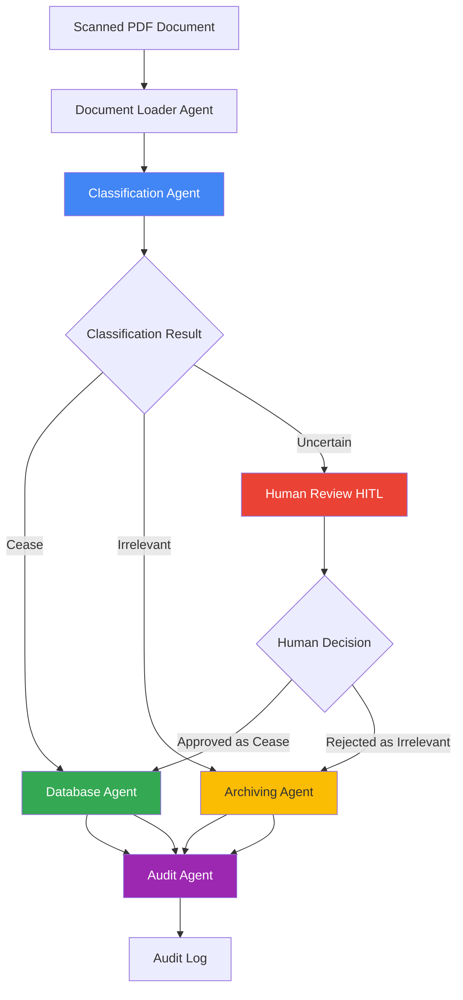
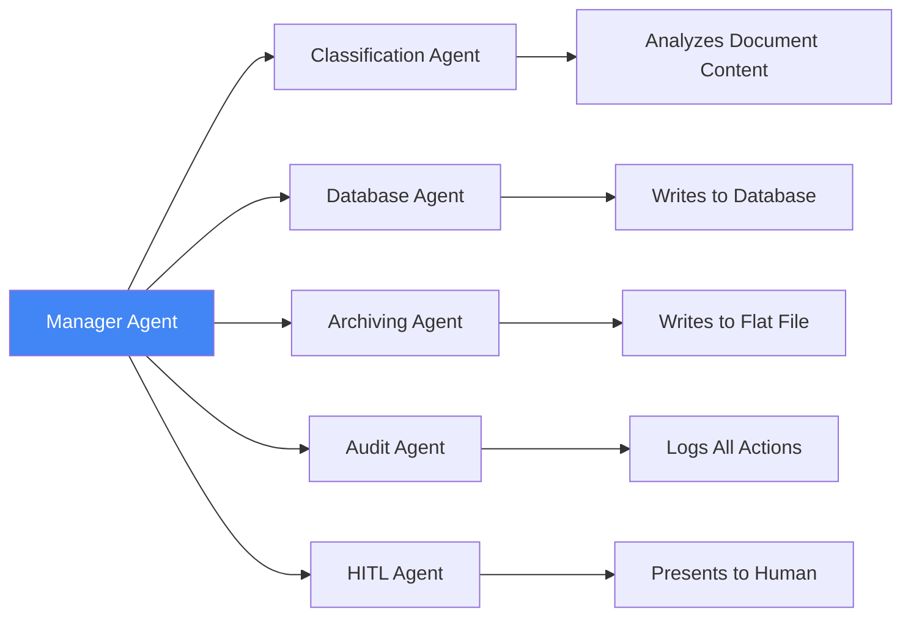

# Capstone Project: Cease & Desist Document Processing System

## 🎯 Project Overview

### Business Problem

Enterprises receive **Cease & Desist** requests from customers who want to stop all direct communication. Currently, human agents must manually read scanned PDF documents to determine if each request is legitimate, which is:
- ⏱️ Time-consuming and slow
- 💰 Expensive (requires human review)
- ❌ Error-prone (human fatigue, inconsistency)
- 📈 Not scalable (volume increases over time)

### Your Mission

Build an **intelligent multi-agent system** that automates the classification and processing of Cease & Desist documents, reducing manual effort while maintaining accuracy and compliance.

---

## 📋 Solution Requirements

### Core Functionality

Your system must:

1. **Classify Documents** into 3 categories:
   - ✅ **"Cease"** - Valid cease & desist request
   - ⚠️ **"Uncertain"** - Requires manual review
   - ❌ **"Irrelevant"** - Not a cease request

2. **Process Based on Classification:**
   - **Cease Requests** → Call database agent to store:
     - Date of document received
     - Document name
     - Extracted details
   
   - **Irrelevant Documents** → Call archiving agent to write to flat file:
     - Date of document received
     - Document name
   
   - **Uncertain Cases** → Present to human agent for review (HITL)

3. **Audit Everything:**
   - Log all requests with explanations
   - Track classification decisions
   - Maintain compliance trail

4. **Optional Enhancement:**
   - Support multiple languages

### Expected Coverage

Your implementation must demonstrate:
- ✅ **Multiple Agents** - Specialized agents for different tasks
- ✅ **Human-in-the-Loop (HITL)** - Manual review workflow
- ✅ **Database Interaction** - Store and retrieve data
- ✅ **Auditing** - Complete audit trail

---

## 🏗️ System Architecture

### High-Level Flow

### Agent Responsibilities

---

## 📚 Available Implementation Guides

We provide **two comprehensive guides** for different frameworks. Choose based on which labs you've completed:

### 1. LangChain/LangGraph Framework Guide
**File:** [`guides/Capstone_Guide_LangChain_LangGraph.md`](guides/Capstone_Guide_LangChain_LangGraph.md)

**Best for:**
- Students who completed Day 1 and Day 3 labs
- Those familiar with LangChain ecosystem
- Projects requiring model flexibility
- Complex workflow requirements

**Key Features:**
- Leverages LangChain tools and agents
- Uses LangGraph for state management
- Integrates Day 1 and Day 3 concepts
- Model-agnostic approach

**Prerequisites:**
- ✅ Completed Day 1 Labs (L1-L9)
- ✅ Completed Day 3 Labs (3.1-3.5)
- ✅ Understanding of LangChain basics
- ✅ Familiarity with LangGraph persistence

---

### 2. Google ADK Framework Guide
**File:** [`guides/Capstone_Guide_Google_ADK.md`](guides/Capstone_Guide_Google_ADK.md)

**Best for:**
- Students who completed Day 4 labs
- Those using Google Cloud/Gemini
- Projects with image-heavy documents
- Rapid prototyping needs

**Key Features:**
- Native Gemini integration
- Multimodal document analysis
- Built-in multi-agent patterns
- Simplified state management

**Prerequisites:**
- ✅ Completed Day 4 Labs (1-12)
- ✅ Google Cloud account
- ✅ LLM API access
- ✅ Understanding of ADK patterns

---

## 🎓 How to Choose the Framework

https://blog.dataopslabs.com/ai-agent-framework-selection-guide
