# Capstone Project Guide: Google ADK Framework

## 🎯 Project Overview

Build an intelligent **Document Processing Agent** that can analyze, classify, and extract information from various business documents (Letters of Authorization, Business Documents, and Notices) using Google's Agent Development Kit (ADK).

---

## 📚 Table of Contents

1. [Core Concepts](#core-concepts)
2. [Real-World Analogies](#real-world-analogies)
3. [Architecture Overview](#architecture-overview)
4. [System Design](#system-design)
5. [Implementation Approach](#implementation-approach)
6. [Key Components](#key-components)
7. [Best Practices](#best-practices)
8. [Troubleshooting](#troubleshooting)

---

## Core Concepts

### What is Document Processing with ADK?

**Document Processing** using Google ADK leverages Gemini's multimodal capabilities to understand documents through both text and visual analysis, making it particularly powerful for complex document layouts.

### Key ADK Concepts You'll Use

#### 1. **Basic Agent** (Day 4, Lab 1)
Foundation of your system:
- Understands natural language
- Processes document queries
- Maintains conversation context
- Powered by Gemini models

#### 2. **Tool Agent** (Day 4, Lab 2)
Extends capabilities with tools:
- PDF loading and parsing
- OCR for scanned documents
- Database operations
- External API calls

#### 3. **Structured Outputs** (Day 4, Lab 4)
Ensures consistent data:
- Pydantic models for validation
- Type-safe extraction
- Automatic validation
- Schema enforcement

#### 4. **Sessions and State** (Day 4, Lab 5)
Manages conversation flow:
- Session management
- State persistence
- Context retention
- User tracking

#### 5. **Persistent Storage** (Day 4, Lab 6)
Long-term data management:
- Database integration
- Document storage
- Query capabilities
- Backup and recovery

#### 6. **Multi-Agent** (Day 4, Lab 7)
Specialized processing:
- Classification agent
- Extraction agent
- Validation agent
- Coordinator agent

#### 7. **Callbacks** (Day 4, Lab 9)
Monitoring and logging:
- Real-time progress
- Performance metrics
- Error tracking
- Audit trails

---

## Real-World Analogies

### The Document Processing Department

Imagine a modern corporate document processing center:

**Traditional Approach:**
- Multiple specialists handle different document types
- Manual routing and classification
- Paper-based workflows
- Slow and error-prone

**ADK-Powered Approach:**
- Intelligent routing system (Multi-Agent)
- Automated classification (Tool Agent)
- Real-time processing (Callbacks)
- Digital workflows (Persistent Storage)

### The Agent Team

Think of your ADK system as a specialized team:

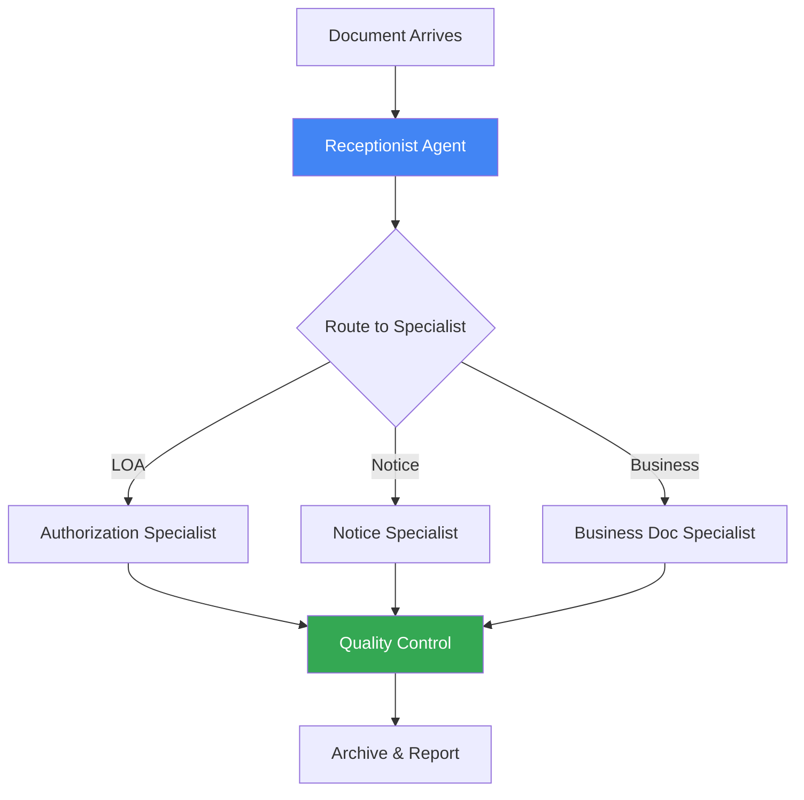

---

## Architecture Overview

### High-Level System Design

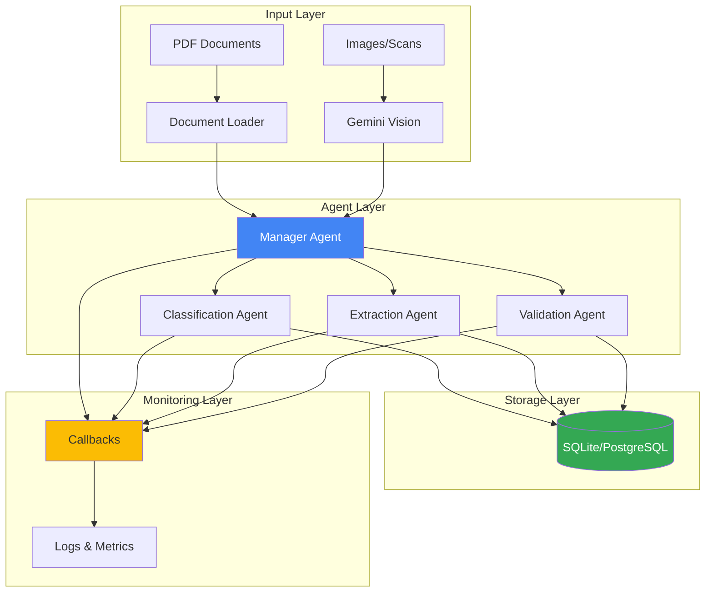

### Agent Workflow with ADK

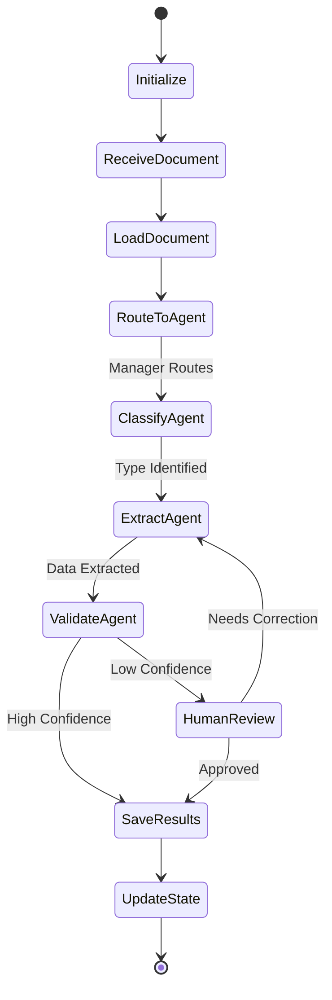

---

## System Design

### Component Architecture

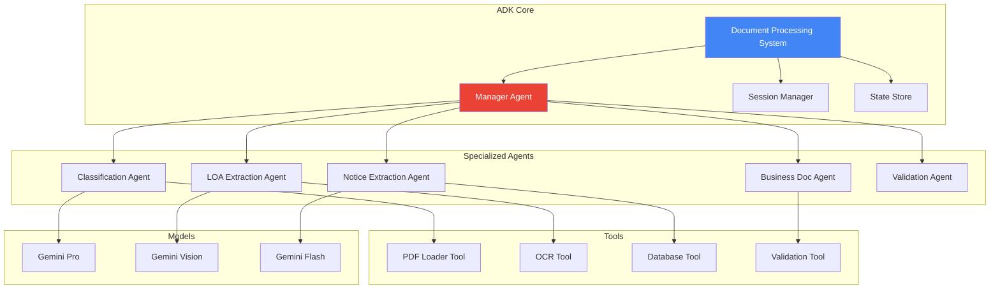

### Data Flow with Multi-Agent Pattern

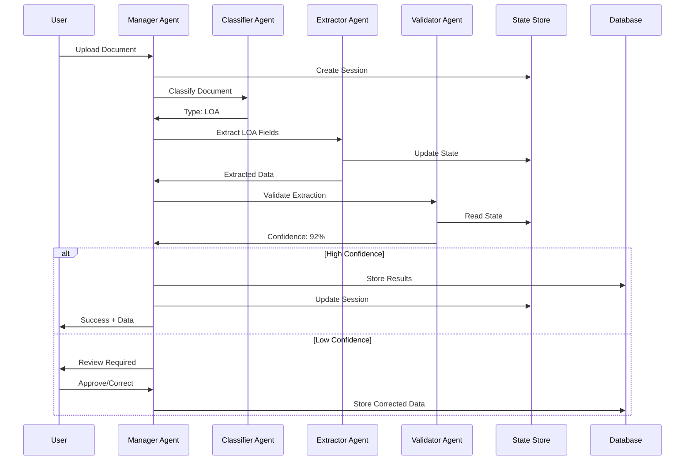

---

## Implementation Approach

### Phase 1: Foundation (Labs 1-4)

**Goal:** Build basic document processing capabilities

**Components:**

1. **Basic Agent** (Lab 1)
   - Set up Gemini connection
   - Create greeting agent
   - Test basic interactions

2. **Tool Agent** (Lab 2)
   - Add PDF loading tool
   - Implement text extraction
   - Create classification tool

3. **LiteLLM Integration** (Lab 3)
   - Configure model routing
   - Set up fallbacks
   - Optimize costs

4. **Structured Outputs** (Lab 4)
   - Define Pydantic schemas
   - Implement validation
   - Ensure type safety

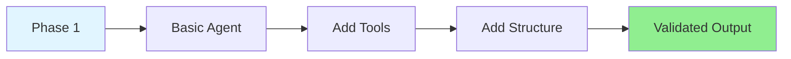

### Phase 2: State Management (Labs 5-6)

**Goal:** Add memory and persistence

**Components:**

1. **Sessions and State** (Lab 5)
   - Implement session management
   - Track document processing state
   - Maintain user context

2. **Persistent Storage** (Lab 6)
   - Set up database
   - Store processed documents
   - Implement queries

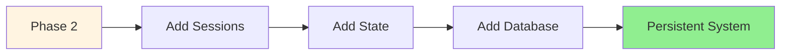

### Phase 3: Multi-Agent System (Labs 7-8)

**Goal:** Build specialized agent team

**Components:**

1. **Multi-Agent** (Lab 7)
   - Create manager agent
   - Build specialist agents
   - Implement routing logic

2. **Stateful Multi-Agent** (Lab 8)
   - Share state across agents
   - Coordinate workflows
   - Handle handoffs

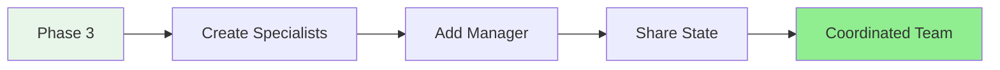

### Phase 4: Advanced Features (Labs 9-12)

**Goal:** Add monitoring and optimization

**Components:**

1. **Callbacks** (Lab 9)
   - Implement logging
   - Track performance
   - Monitor errors

2. **Sequential Processing** (Lab 10)
   - Pipeline workflows
   - Stage-by-stage processing
   - Quality gates

3. **Parallel Processing** (Lab 11)
   - Concurrent document processing
   - Batch operations
   - Performance optimization

4. **Loop Agent** (Lab 12)
   - Iterative refinement
   - Quality improvement
   - Self-correction

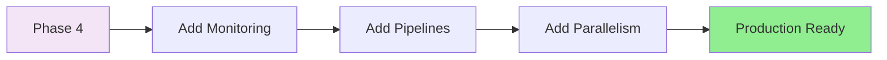

---

## Key Components

### 1. Manager Agent

**Purpose:** Orchestrate the document processing workflow

**Analogy:** Like a project manager coordinating a team

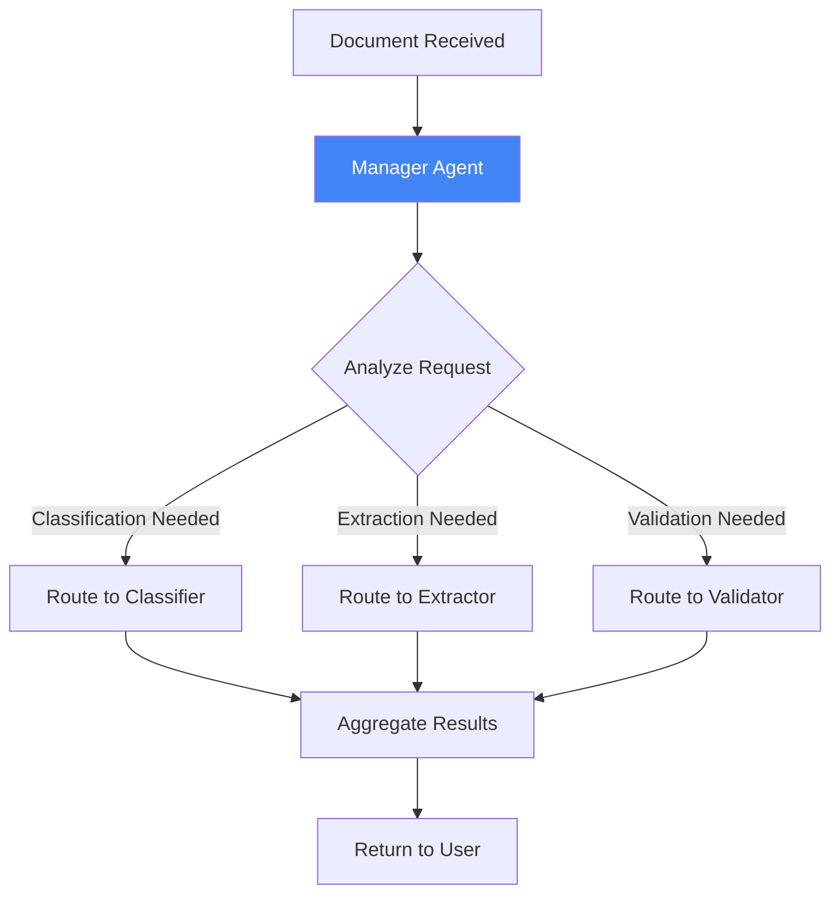

**Responsibilities:**
- Receive and analyze documents
- Route to appropriate specialist
- Coordinate agent communication
- Aggregate and return results
- Handle errors and retries

### 2. Classification Agent

**Purpose:** Identify document type

**Analogy:** Like a mail sorter at the post office

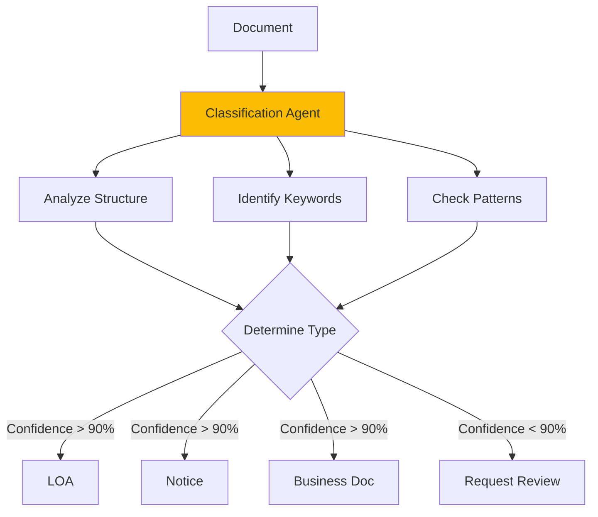

**Classification Features:**
- Document structure analysis
- Keyword detection
- Pattern matching
- Confidence scoring
- Multi-modal analysis (text + layout)

### 3. Extraction Agents

**Purpose:** Extract structured information by document type

**Analogy:** Like specialized data entry clerks

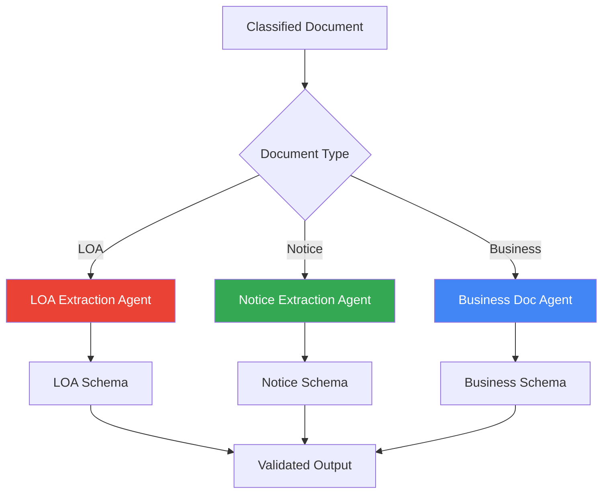

**Extraction Schemas:**

**LOA Agent Extracts:**
- Authorizing party name
- Authorized party name
- Authorization scope
- Effective date
- Expiration date
- Signature status

**Notice Agent Extracts:**
- Notice type
- Recipient information
- Subject/title
- Important dates
- Action required
- Deadline

**Business Doc Agent Extracts:**
- Document type
- Parties involved
- Key terms and conditions
- Financial amounts
- Important dates
- Reference numbers

### 4. Validation Agent

**Purpose:** Verify extraction quality and completeness

**Analogy:** Like a quality control inspector

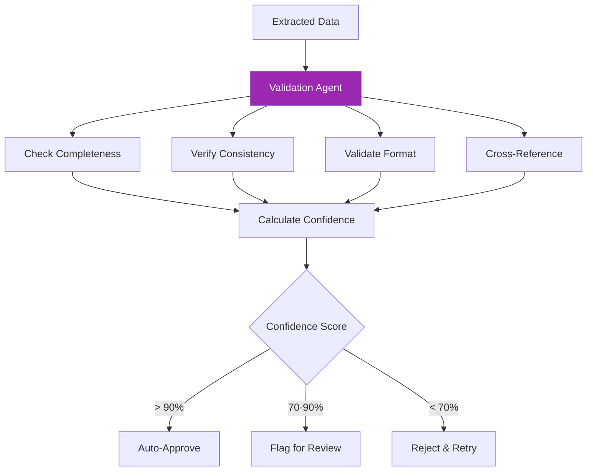

**Validation Checks:**
- Required fields present
- Data types correct
- Dates logical and consistent
- Cross-field validation
- Business rule compliance
- Confidence scoring

### 5. Tools

**PDF Loader Tool:**
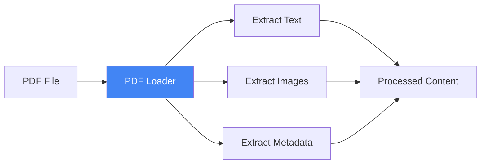

**OCR Tool:**
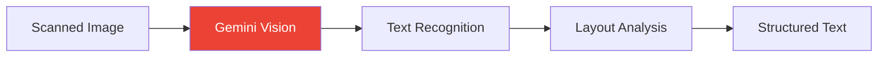

**Database Tool:**
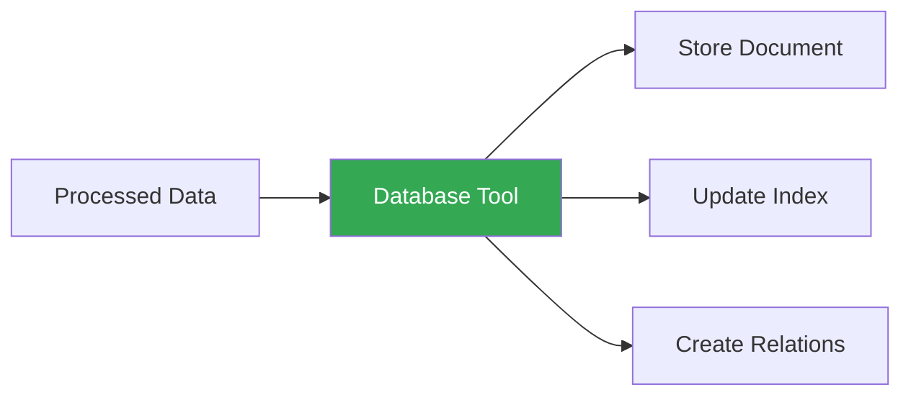

---

## Best Practices

### 1. Agent Design Principles

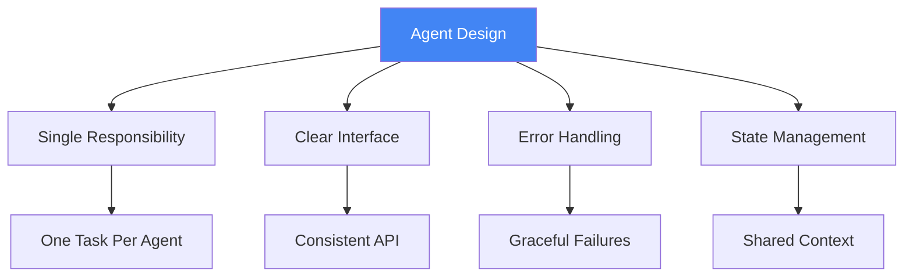

**Key Principles:**
- Each agent has one clear purpose
- Agents communicate through well-defined interfaces
- Errors are handled gracefully with fallbacks
- State is shared efficiently across agents

### 2. Model Selection Strategy

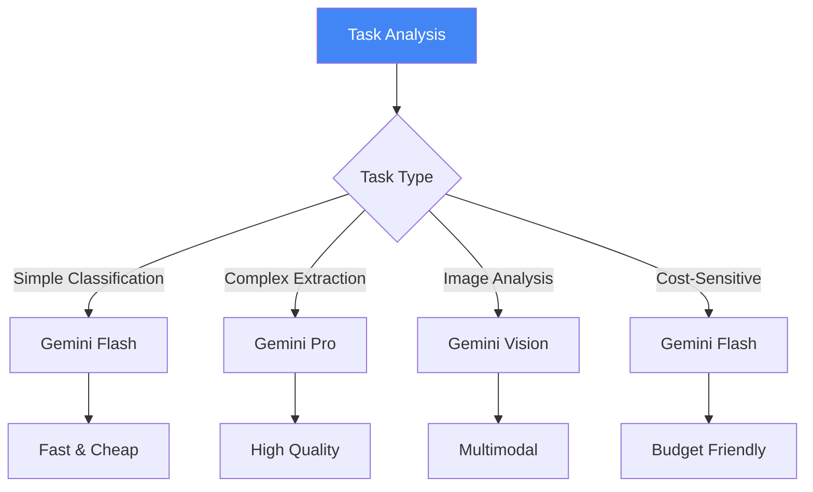

**Model Selection Guide:**
- **Gemini Flash**: Simple tasks, high volume, cost-sensitive
- **Gemini Pro**: Complex reasoning, high accuracy needed
- **Gemini Vision**: Image analysis, layout understanding

### 3. State Management

**What to Store in State:**
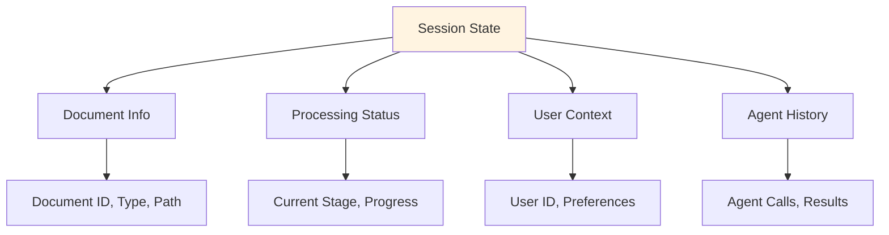

### 4. Error Handling Strategy

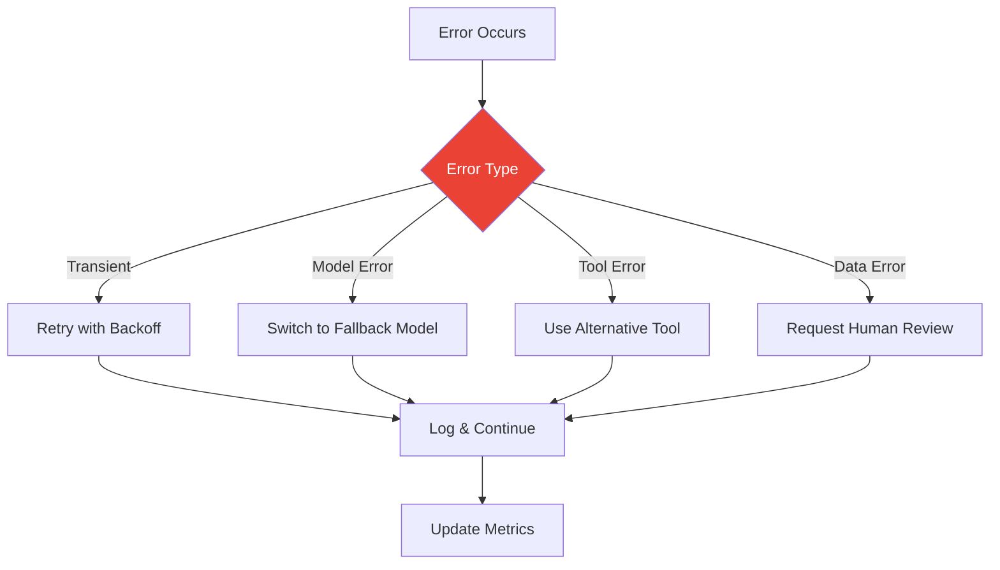

### 5. Callback Implementation

**Monitoring Points:**
```mermaid
graph LR
    A[Before Agent] --> B[Agent Execution]
    B --> C[After Agent]
    
    A --> D[Log Input]
    B --> E[Track Duration]
    C --> F[Log Output]
    
    D --> G[Metrics Dashboard]
    E --> G
    F --> G
    
    style G fill:#fbbc04
```

**What to Track:**
- Request/response times
- Model usage and costs
- Success/failure rates
- Confidence scores
- Error types and frequencies

---

## Troubleshooting

### Common Issues and Solutions

#### Issue 1: Poor Classification Accuracy

**Symptoms:**
- Documents frequently misclassified
- Low confidence scores
- Inconsistent results

**ADK-Specific Solutions:**

1. **Leverage Gemini Vision:**
   - Use multimodal analysis
   - Analyze document layout
   - Consider visual patterns

2. **Improve Agent Prompts:**
   - Add specific examples
   - Define clear criteria
   - Use structured prompts

3. **Implement Confidence Thresholds:**
   - Set minimum confidence levels
   - Route low-confidence to human review
   - Track and learn from corrections

```mermaid
graph LR
    A[Poor Classification] --> B[Add Vision Analysis]
    B --> C[Improve Prompts]
    C --> D[Set Thresholds]
    D --> E[Better Accuracy]
    
    style A fill:#ffe1e1
    style E fill:#90EE90
```

#### Issue 2: Slow Multi-Agent Processing

**Symptoms:**
- Long processing times
- Sequential bottlenecks
- Poor user experience

**ADK-Specific Solutions:**

1. **Use Parallel Agent Pattern** (Lab 11):
   - Process independent tasks concurrently
   - Aggregate results efficiently
   - Reduce total processing time

2. **Optimize Model Selection:**
   - Use Gemini Flash for simple tasks
   - Reserve Gemini Pro for complex tasks
   - Implement intelligent routing

3. **Implement Caching:**
   - Cache classification results
   - Store common extractions
   - Reuse validated data

```mermaid
graph TB
    A[Slow Processing] --> B[Add Parallelism]
    A --> C[Optimize Models]
    A --> D[Add Caching]
    
    B --> E[Faster System]
    C --> E
    D --> E
    
    style A fill:#fff4e1
    style E fill:#90EE90
```

#### Issue 3: State Synchronization Issues

**Symptoms:**
- Agents have inconsistent data
- Lost updates
- Race conditions

**ADK-Specific Solutions:**

1. **Use Stateful Multi-Agent Pattern** (Lab 8):
   - Centralized state store
   - Atomic updates
   - Consistent reads

2. **Implement State Locking:**
   - Prevent concurrent modifications
   - Use transactions
   - Handle conflicts gracefully

3. **Add State Validation:**
   - Verify state consistency
   - Detect anomalies
   - Auto-correct when possible

#### Issue 4: High API Costs

**Symptoms:**
- Expensive API bills
- Inefficient model usage
- Unnecessary calls

**ADK-Specific Solutions:**

1. **Use LiteLLM** (Lab 3):
   - Route to cheaper models when possible
   - Implement cost tracking
   - Set budget limits

2. **Optimize Agent Calls:**
   - Batch similar requests
   - Cache frequent queries
   - Reduce redundant calls

3. **Implement Sequential Processing** (Lab 10):
   - Process only when needed
   - Skip unnecessary stages
   - Early exit on errors

```mermaid
graph TB
    A[High Costs] --> B[Smart Routing]
    A --> C[Caching]
    A --> D[Batch Processing]
    
    B --> E[Lower Costs]
    C --> E
    D --> E
    
    style A fill:#ffe1e1
    style E fill:#90EE90
```

---

## Comparison: ADK vs LangChain

### When to Choose ADK

**Advantages:**
- Native Gemini integration
- Excellent multimodal support
- Simpler multi-agent patterns
- Built-in state management
- Google Cloud ecosystem

**Best For:**
- Gemini-first projects
- Image-heavy documents
- Google Cloud deployments
- Rapid prototyping

### When to Choose LangChain

**Advantages:**
- Model-agnostic
- Larger ecosystem
- More community tools
- Extensive documentation
- Mature patterns

**Best For:**
- Multi-model requirements
- Complex workflows
- Existing LangChain projects
- Need for specific integrations

---

## Next Steps

### After Completing This Guide

1. **Complete All Day 4 Labs**
   - Work through labs 1-12 sequentially
   - Understand each pattern deeply
   - Experiment with variations

2. **Study the Comprehensive Guide**
   - Review `day-3/day4/guides/COMPREHENSIVE_CONCEPTS_GUIDE.md`
   - Understand the TravelMate evolution
   - Apply patterns to document processing

3. **Design Your System**
   - Sketch multi-agent architecture
   - Define agent responsibilities
   - Plan state management
   - Design tool interfaces

4. **Build Incrementally**
   - Start with basic agent
   - Add tools progressively
   - Implement multi-agent coordination
   - Add advanced features

5. **Test and Optimize**
   - Measure performance
   - Track costs
   - Optimize model selection
   - Refine agent prompts

---

## Additional Resources

### Google ADK Documentation
- [Getting Started](https://google.github.io/adk-docs/get-started/quickstart)
- [Agent Patterns](https://google.github.io/adk-docs/concepts/agents)
- [Tools](https://google.github.io/adk-docs/concepts/tools)

### Gemini Documentation
- [Gemini Models](https://ai.google.dev/models/gemini)
- [Vision Capabilities](https://ai.google.dev/tutorials/vision_quickstart)
- [Best Practices](https://ai.google.dev/docs/best_practices)

### Sample Documents
- Review the `Sample Docs` folder
- Analyze document patterns
- Test with different document types
- Identify edge cases

### Community
- [AI Developer Accelerator](https://www.skool.com/ai-developer-accelerator/about)
- Weekly coaching calls
- Code examples and support

---

**Remember:** ADK's strength is in its simplicity and Gemini integration. Leverage multimodal capabilities and multi-agent patterns to build a powerful document processing system! 🚀

