# Capstone Project Guide: LangChain/LangGraph Framework

## 🎯 Project Overview

Build an intelligent **Document Processing Agent** that can analyze, classify, and extract information from various business documents (Letters of Authorization, Business Documents, and Notices) using the LangChain/LangGraph framework.

---

## 📚 Table of Contents

1. [Core Concepts](#core-concepts)
2. [Real-World Analogies](#real-world-analogies)
3. [Architecture Overview](#architecture-overview)
4. [System Design](#system-design)
5. [Implementation Approach](#implementation-approach)
6. [Key Components](#key-components)
7. [Best Practices](#best-practices)
8. [Troubleshooting](#troubleshooting)

---

## Core Concepts

### What is Document Processing?

**Document Processing** is the automated extraction, classification, and analysis of information from documents. Think of it as teaching an AI to read and understand documents like a human would.

### Key Concepts You'll Use

#### 1. **Agents** (from Lab 1)
An autonomous system that can:
- Read and understand documents
- Decide what actions to take
- Use tools to extract information
- Provide structured responses

#### 2. **Tools** (from Lab 4)
Functions that enable the agent to:
- Load PDF documents
- Extract text from images (OCR)
- Parse structured data
- Classify document types

#### 3. **Memory** (from Lab 6)
Enables the agent to:
- Remember previously processed documents
- Track document relationships
- Maintain conversation context

#### 4. **Structured Output** (from Lab 7)
Ensures consistent data extraction:
- Document metadata (type, date, parties)
- Key information fields
- Validation and quality checks

#### 5. **Streaming** (from Lab 3)
Provides real-time feedback:
- Progress updates during processing
- Incremental results
- Better user experience

#### 6. **Human-in-the-Loop** (from Lab 9)
Adds oversight for:
- Reviewing extracted data
- Approving classifications
- Correcting errors

---

## Real-World Analogies

### The Document Processing Office

Imagine a busy law office that receives hundreds of documents daily:

**Without AI Agent:**
- Junior associate manually reads each document
- Takes notes on key information
- Files documents by type
- Slow, error-prone, expensive

**With AI Agent:**
- Agent scans incoming documents
- Automatically classifies by type
- Extracts key information
- Routes to appropriate department
- Fast, consistent, scalable

### The Agent as a Smart Assistant

Think of your agent as an experienced administrative assistant:

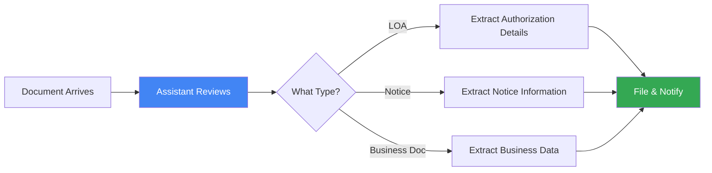

---

## Architecture Overview

### High-Level System Design

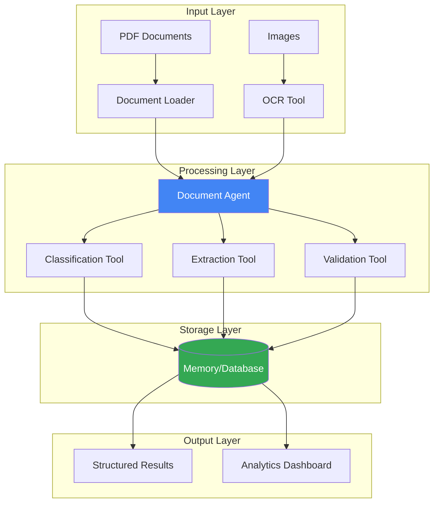

### Agent Workflow

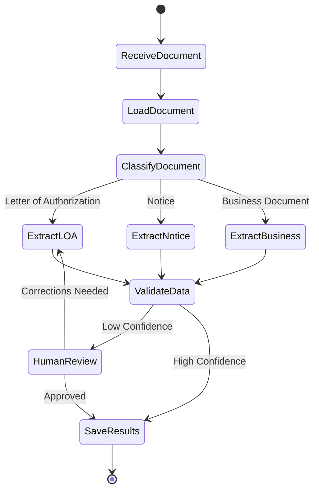

---

## System Design

### Component Architecture

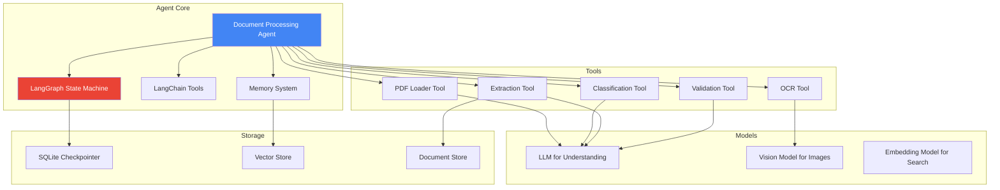

### Data Flow

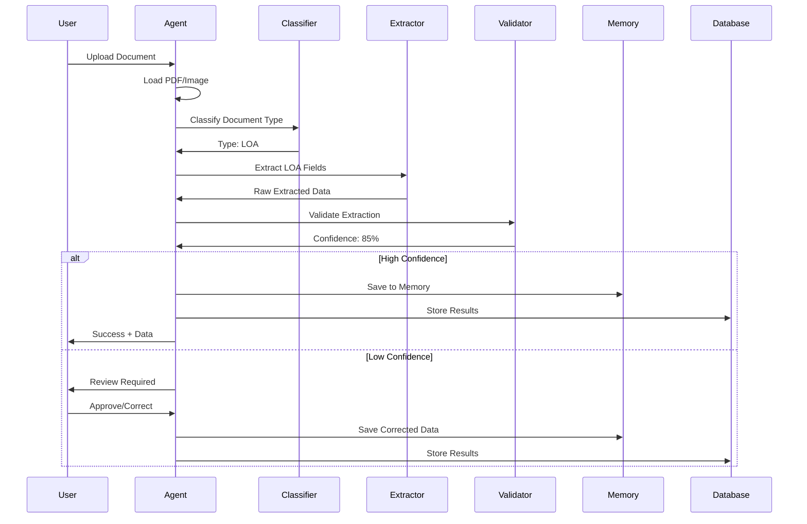

---

## Implementation Approach

### Phase 1: Foundation (Labs 1-4)

**Goal:** Build a basic document processing agent

**Components:**
1. **Agent Setup** (Lab 1)
   - Create the main agent
   - Define system prompt for document processing
   - Set up LLM connection

2. **Message Handling** (Lab 2)
   - Structure conversation flow
   - Handle document inputs
   - Format responses

3. **Streaming** (Lab 3)
   - Real-time processing updates
   - Progress indicators
   - Incremental results

4. **Tools** (Lab 4)
   - PDF loading tool
   - Text extraction tool
   - Classification tool

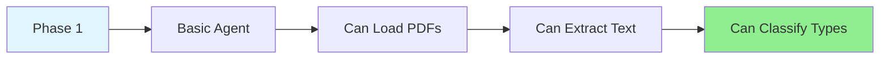

### Phase 2: Intelligence (Labs 6-7)

**Goal:** Add memory and structured outputs

**Components:**
1. **Memory** (Lab 6)
   - Remember processed documents
   - Track document relationships
   - Maintain user context

2. **Structured Output** (Lab 7)
   - Define document schemas
   - Validate extracted data
   - Ensure consistency

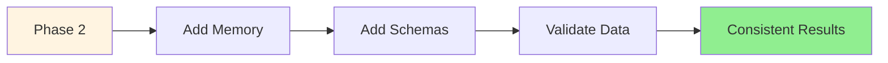

### Phase 3: Advanced Features (Labs 8-9, Day 3)

**Goal:** Add advanced capabilities

**Components:**
1. **Dynamic Prompts** (Lab 8)
   - Adapt behavior by document type
   - Role-based processing
   - Context-aware extraction

2. **Human-in-the-Loop** (Lab 9)
   - Review low-confidence extractions
   - Approve classifications
   - Correct errors

3. **LangGraph Persistence** (Day 3, Lab 3.1)
   - Long-term document storage
   - Conversation continuity
   - State management

4. **HITL Patterns** (Day 3, Labs 3.2-3.3)
   - Interrupt for review
   - Approval workflows
   - Error correction loops

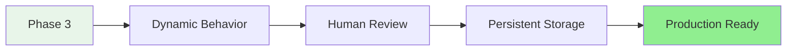

---

## Key Components

### 1. Document Loader Tool

**Purpose:** Load and preprocess documents

**Analogy:** Like a scanner that digitizes paper documents

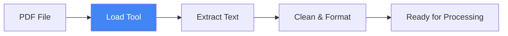

**Key Features:**
- Support multiple formats (PDF, images)
- Handle OCR for scanned documents
- Extract metadata (pages, dates)
- Error handling for corrupted files

### 2. Classification Tool

**Purpose:** Identify document type

**Analogy:** Like a mail sorter that routes letters to departments

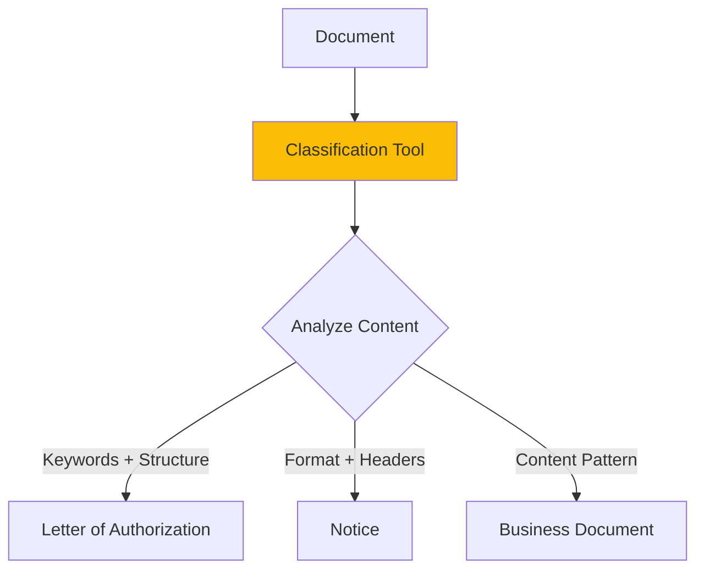

**Classification Logic:**
- Analyze document structure
- Identify key phrases
- Check formatting patterns
- Confidence scoring

### 3. Extraction Tool

**Purpose:** Extract structured information

**Analogy:** Like a form-filler who reads documents and fills out forms

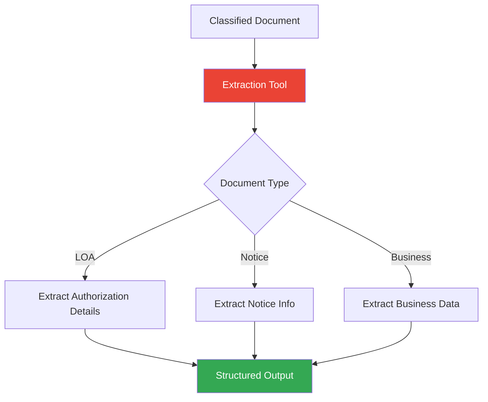

**Extraction Fields by Type:**

**Letter of Authorization:**
- Authorizing party
- Authorized party
- Authorization scope
- Effective dates
- Signatures

**Notice:**
- Notice type
- Recipient
- Subject
- Important dates
- Action required

**Business Document:**
- Document type
- Parties involved
- Key terms
- Dates
- Amounts

### 4. Validation Tool

**Purpose:** Verify extraction quality

**Analogy:** Like a quality control inspector checking work

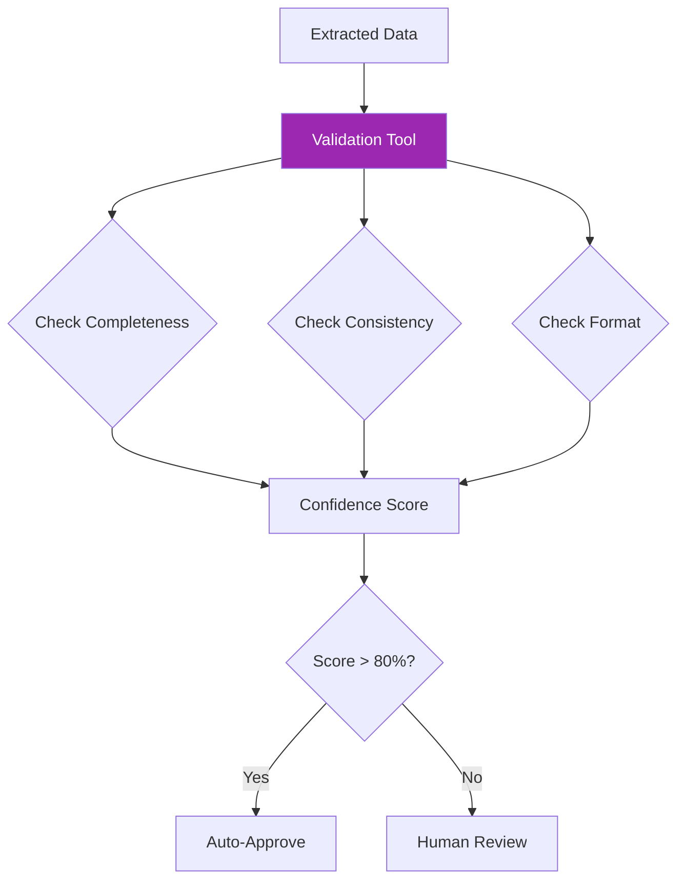

**Validation Checks:**
- Required fields present
- Data format correct
- Dates logical
- Cross-field consistency
- Confidence scoring

---

## Best Practices

### 1. System Prompt Design

**Good System Prompt:**
```
You are a document processing specialist with expertise in:
- Letters of Authorization (LOA)
- Business notices
- Corporate documents

Your responsibilities:
1. Accurately classify document types
2. Extract all relevant information
3. Validate data quality
4. Flag uncertainties for human review

Rules:
- Be thorough and precise
- When uncertain, request human review
- Maintain consistent data formats
- Preserve original document context
```

### 2. Tool Design Principles

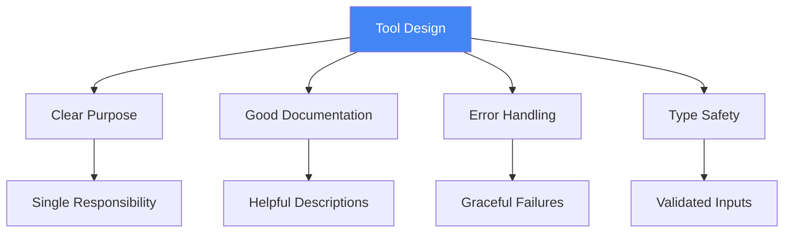

### 3. Memory Strategy

**What to Remember:**
- Processed document IDs
- Document relationships
- User preferences
- Common corrections

**What Not to Remember:**
- Sensitive personal data (unless required)
- Temporary processing states
- Error messages

### 4. Structured Output Schemas

**Schema Design Pattern:**
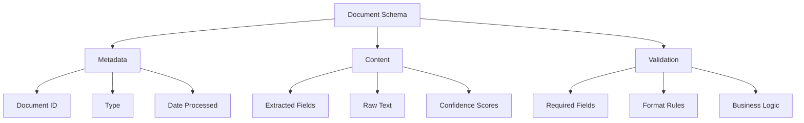

### 5. Error Handling

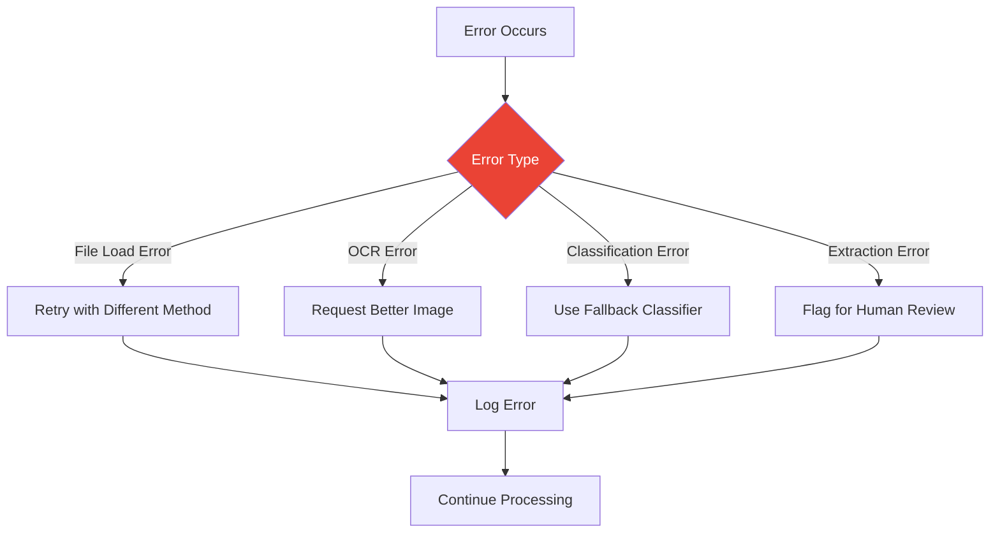

---

## Troubleshooting

### Common Issues and Solutions

#### Issue 1: Poor Classification Accuracy

**Symptoms:**
- Documents misclassified
- Low confidence scores
- Inconsistent results

**Solutions:**
1. Improve system prompt with examples
2. Add more classification features
3. Use few-shot learning
4. Implement confidence thresholds

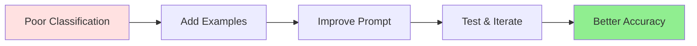

#### Issue 2: Incomplete Extraction

**Symptoms:**
- Missing fields
- Partial data
- Inconsistent extraction

**Solutions:**
1. Define clear extraction schemas
2. Add field-specific prompts
3. Implement validation checks
4. Use structured output enforcement

#### Issue 3: Slow Processing

**Symptoms:**
- Long wait times
- Timeouts
- Poor user experience

**Solutions:**
1. Implement streaming for feedback
2. Process documents in batches
3. Cache common results
4. Optimize LLM calls

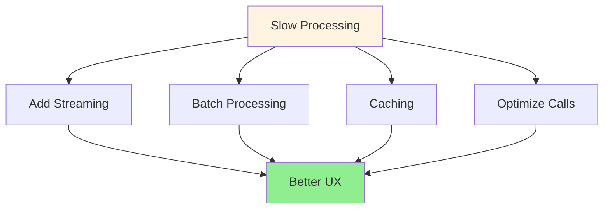

#### Issue 4: Memory Issues

**Symptoms:**
- Agent forgets context
- Duplicate processing
- Lost state

**Solutions:**
1. Verify checkpointer setup
2. Use consistent thread IDs
3. Implement proper state management
4. Add persistence layer


---

## Additional Resources

### LangChain Documentation
- [Agents](https://python.langchain.com/docs/modules/agents/)
- [Tools](https://python.langchain.com/docs/modules/agents/tools/)
- [Memory](https://python.langchain.com/docs/modules/memory/)

### LangGraph Documentation
- [Getting Started](https://langchain-ai.github.io/langgraph/)
- [Persistence](https://langchain-ai.github.io/langgraph/concepts/persistence/)
- [Human-in-the-Loop](https://langchain-ai.github.io/langgraph/concepts/human_in_the_loop/)

### Sample Documents
- Review the `Sample Docs` folder
- Analyze document patterns
- Identify common fields
- Note edge cases

---

**Remember:** This is a learning project. Focus on understanding concepts deeply rather than rushing to completion. Each lab builds essential skills for the capstone! 🚀

